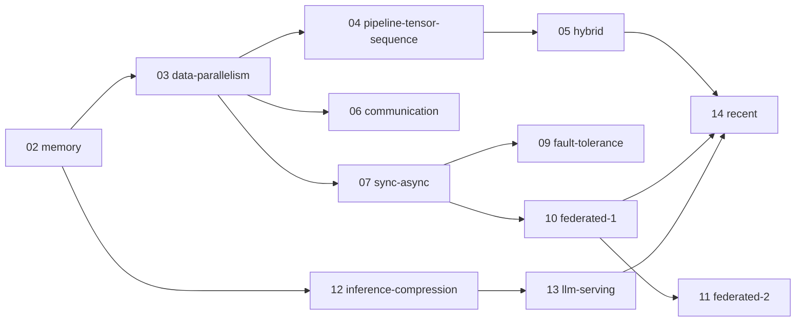

# Roadmap — 분산학습및추론 (Distributed Learning and Inference, CAS4401)

이 파일은 모든 주차 챕터 생성의 앵커다. 챕터를 만들거나 고칠 때 이 파일과 레포 루트 `CLAUDE.md` 를 먼저 읽는다.

> 주차 배치는 2025-2 계획서 기준 (`syllabus.md` 참고). 2026-2 계획서가 나오면 이 파일의 주차 매핑만 갱신한다. 챕터 디렉토리는 토픽 단위 슬러그라서 주차 번호가 밀려도 내용은 재사용 가능하다.

## 1. 깊이 벤치마크

이 과목의 챕터는 아래 4개 강의 수준으로 쓴다. "distributed training 에는 data/model parallelism 이 있다" 식의 나열은 실격이고, 각 기법의 메모리·통신량 수식, 스케줄 다이어그램, 실패 모드까지 내려간다.

| 벤치마크 | 링크 | 왜 이 과목에 맞는가 |
|---|---|---|
| CMU 10-414/714 Deep Learning Systems | [dlsyscourse.org](https://dlsyscourse.org) | autodiff·GPU 커널부터 학습 시스템을 밑바닥부터 구현시키는 강의 — W2 (memory), W3-5 (parallelism) 의 "직접 계산해보는" 깊이 기준 |
| Stanford CS336 Language Modeling from Scratch | [cs336.stanford.edu/spring2025](https://cs336.stanford.edu/spring2025) | LLM 학습 전 과정을 코드로 구현하며 parallelism·시스템 최적화를 assignment 로 다룸 — worked example 과 lab 의 기준 |
| MIT 6.5940 TinyML and Efficient Deep Learning Computing | [efficientml.ai](https://efficientml.ai) · [hanlab.mit.edu/courses/2024-fall-65940](https://hanlab.mit.edu/courses/2024-fall-65940) | pruning·quantization·distillation·LLM inference 최적화를 정량적으로 다룸 — W12-13 (inference optimization) 의 깊이 기준 |
| Berkeley AI-Sys (CS294) | [ucbrise.github.io/cs294-ai-sys-sp22](https://ucbrise.github.io/cs294-ai-sys-sp22/) | 원 논문 세미나 중심의 ML systems 강의 — 논문을 1차 소스로 읽고 트레이드오프를 비판적으로 따지는 서술 태도의 기준 |

## 2. 정본 소스 (과목 전체)

**강의 자료 (벤치마크 4개 외 실무 정본)**
- HuggingFace **Ultra-Scale Playbook** — GPU 클러스터 LLM 학습의 parallelism·메모리 계산 실전 가이드. [huggingface.co/spaces/nanotron/ultrascale-playbook](https://huggingface.co/spaces/nanotron/ultrascale-playbook)
- PyTorch Distributed 공식 문서 — [docs.pytorch.org/tutorials/beginner/dist_overview.html](https://docs.pytorch.org/tutorials/beginner/dist_overview.html)

**코드베이스 (챕터의 "실제 코드 검증" 대상)**
- PyTorch — `torch/distributed/`, `torch/nn/parallel/distributed.py` (DDP), `torch/distributed/fsdp/`. [github.com/pytorch/pytorch](https://github.com/pytorch/pytorch)
- Megatron-LM — tensor/pipeline/sequence parallelism 레퍼런스 구현. [github.com/NVIDIA/Megatron-LM](https://github.com/NVIDIA/Megatron-LM)
- DeepSpeed — ZeRO, 1-bit optimizers, MoE. [github.com/deepspeedai/DeepSpeed](https://github.com/deepspeedai/DeepSpeed)
- vLLM — PagedAttention, continuous batching. [github.com/vllm-project/vllm](https://github.com/vllm-project/vllm)
- Flower — federated learning 실습 프레임워크 (W10-11 lab 용). [github.com/adap/flower](https://github.com/adap/flower)

**서베이 (교재 대용)**
- Kairouz et al. 2019, *Advances and Open Problems in Federated Learning* — W10-11 의 사실상 교과서. [arXiv:1912.04977](https://arxiv.org/abs/1912.04977)

개별 논문은 아래 주차별 매핑에 명시한다. 챕터 References 에는 반드시 이 매핑의 소스(또는 그 이상)를 인용한다.

## 3. 주차별 매핑

한눈에 보는 표. 각 주차의 서브토픽·정본 소스 상세는 표 아래 블록에 있다. W8 (Midterm)·W15 (Study Week)·W16 (Final) 은 `weeks/` 챕터를 만들지 않는다.

| 주차 | 슬러그 | 토픽 | 핵심 질문 |
|---|---|---|---|
| 1 | `01-course-overview` | Course Overview & Introduction | 왜 학습·추론을 분산해야 하는가 |
| 2 | `02-memory-issues` | Recap of AI/ML & Memory Issues | 학습 메모리는 어디에 쓰이고 어떻게 줄이는가 |
| 3 | `03-data-parallelism` | Data Parallelism | gradient 를 어떻게 나눠 계산하고 합치는가 |
| 4 | `04-pipeline-tensor-sequence-parallelism` | Pipeline/Tensor/Sequence Parallelism | 모델 자체를 어떻게 쪼개는가 |
| 5 | `05-hybrid-parallelism` | Hybrid Parallelism | 병렬화 축들을 어떻게 조합·배치하는가 |
| 6 | `06-communication-efficiency` | Communication Efficiency | 통신량을 압축해도 수렴이 유지되는가 |
| 7 | `07-sync-async-updates` | Synchronous & Asynchronous Updates | 동기화를 얼마나 늦출 수 있는가 |
| 9 | `09-fault-tolerance` | Robustness & Fault Tolerance | 노드가 죽거나 거짓말할 때 학습을 지키는 법 |
| 10 | `10-federated-learning-basics` | Multi-User Training I | 데이터를 못 옮길 때 어떻게 같이 학습하는가 |
| 11 | `11-federated-privacy-personalization` | Multi-User Training II | FL 에서 프라이버시·개인화를 어떻게 보장하는가 |
| 12 | `12-inference-compression` | Inference Optimization I | 모델을 얼마나 압축해도 성능이 유지되는가 |
| 13 | `13-llm-serving` | Inference Optimization II | LLM serving 의 병목은 어디이고 어떻게 푸는가 |
| 14 | `14-recent-topics` | Applications to Recent Topics | 최신 시스템은 앞의 기법을 어떻게 재조합했는가 |

### W1 — Course Overview & Introduction

서브토픽 (시험 가능 항목):
- 왜 분산인가: model/data scaling trends vs 단일 device 의 memory·compute 한계
- compute-optimal scaling (Chinchilla): 파라미터-토큰 균형이 학습 비용에 주는 함의
- memory wall: 연산 FLOPS 성장 대비 메모리 대역폭·용량 성장의 격차
- 과목 지도: training parallelism → communication → sync → FT → FL → inference 의 연결 구조

정본 소스:
- Kaplan et al. 2020, *Scaling Laws for Neural Language Models*, [arXiv:2001.08361](https://arxiv.org/abs/2001.08361) · Hoffmann et al. 2022 (Chinchilla), [arXiv:2203.15556](https://arxiv.org/abs/2203.15556) · Gholami et al. 2024, *AI and Memory Wall*, [arXiv:2403.14123](https://arxiv.org/abs/2403.14123)

### W2 — Recap of AI/ML & Memory Issues in Deep Learning

서브토픽 (시험 가능 항목):
- training memory breakdown: weights / gradients / optimizer states / activations — Adam + fp16 mixed precision 에서 파라미터당 16 bytes (2+2+4+4+4) 유도 (ZeRO §3) · activation memory 의 batch·seq·hidden 의존 공식
- mixed precision: fp16/bf16 표현 범위 차이, loss scaling 이 필요한 이유, fp32 master weights (`torch.amp.autocast`, `GradScaler`)
- gradient checkpointing: O(√n) memory–compute 트레이드오프, recomputation 추가 비용 (~33% FLOPs), `torch.utils.checkpoint`

정본 소스:
- Micikevicius et al. 2018, *Mixed Precision Training*, [arXiv:1710.03740](https://arxiv.org/abs/1710.03740) · Chen et al. 2016, *Training Deep Nets with Sublinear Memory Cost*, [arXiv:1604.06174](https://arxiv.org/abs/1604.06174)
- Rajbhandari et al. 2020 (ZeRO) §3 memory analysis, [arXiv:1910.02054](https://arxiv.org/abs/1910.02054) · Kingma & Ba 2015 (Adam — optimizer state 의 근원), [arXiv:1412.6980](https://arxiv.org/abs/1412.6980)

### W3 — Data Parallelism

서브토픽 (시험 가능 항목):
- DP 기본: per-replica gradient → allreduce → 동일 update, 수학적 등가성 조건 · ring-allreduce: reduce-scatter + all-gather 2단계, 통신량 2(N−1)/N·M 유도, bandwidth-optimal 논증
- PyTorch DDP 내부: gradient bucketing, backward 와 communication overlap, `no_sync`, 첫 iteration 의 bucket 순서 결정
- large-batch training: linear scaling rule + warmup, generalization gap 논쟁
- ZeRO stage 1/2/3 가 각각 shard 하는 것과 통신량 변화 (stage 3 에서 1.5×) · FSDP 의 unit 단위 all-gather/reduce-scatter, ZeRO-3 와의 구현 차이 (prefetch, FlatParameter)

정본 소스:
- Li et al. 2020, *PyTorch Distributed* (VLDB), [arXiv:2006.15704](https://arxiv.org/abs/2006.15704) · Goyal et al. 2017, *Accurate, Large Minibatch SGD*, [arXiv:1706.02677](https://arxiv.org/abs/1706.02677)
- Gibiansky 2017, Baidu ring-allreduce, [github.com/baidu-research/baidu-allreduce](https://github.com/baidu-research/baidu-allreduce) · Sergeev & Del Balso 2018, *Horovod*, [arXiv:1802.05799](https://arxiv.org/abs/1802.05799)
- Rajbhandari et al. 2020, *ZeRO*, [arXiv:1910.02054](https://arxiv.org/abs/1910.02054) · Zhao et al. 2023, *PyTorch FSDP*, [arXiv:2304.11277](https://arxiv.org/abs/2304.11277) · 코드: `torch/nn/parallel/distributed.py`, `torch/distributed/fsdp/`

### W4 — Pipeline / Tensor / Sequence Parallelism

서브토픽 (시험 가능 항목):
- GPipe: micro-batching, bubble fraction (p−1)/(m+p−1) 유도, re-materialization 결합
- PipeDream: 1F1B schedule, weight stashing 과 weight version 일관성 문제, GPipe 와의 트레이드오프
- Megatron tensor parallelism: MLP 의 column→row parallel 분해 (f/g 연산자), attention head 분할, layer 당 forward/backward allreduce 횟수 (각 2회)
- sequence parallelism: LayerNorm/dropout 구간 activation 을 seq 축으로 분할, TP 와 통신량 동일함 논증 (allreduce = reduce-scatter + all-gather) · Ring Attention: blockwise attention + ring 통신으로 context 길이를 device 수에 선형 확장

정본 소스:
- Huang et al. 2019, *GPipe*, [arXiv:1811.06965](https://arxiv.org/abs/1811.06965) · Harlap/Narayanan et al. 2018–19, *PipeDream* (SOSP'19), [arXiv:1806.03377](https://arxiv.org/abs/1806.03377)
- Shoeybi et al. 2019, *Megatron-LM*, [arXiv:1909.08053](https://arxiv.org/abs/1909.08053) · Korthikanti et al. 2022, *Reducing Activation Recomputation in Large Transformer Models*, [arXiv:2205.05198](https://arxiv.org/abs/2205.05198)
- Liu et al. 2023, *Ring Attention*, [arXiv:2310.01889](https://arxiv.org/abs/2310.01889) · 코드: `Megatron-LM/megatron/core/tensor_parallel/`

### W5 — Hybrid Parallelism

서브토픽 (시험 가능 항목):
- 3D parallelism 배치 원칙: TP 는 node 내 (NVLink), PP 는 node 간, DP 는 최외곽 — 각 축의 통신량·빈도 근거
- interleaved pipeline schedule: virtual pipeline stage 로 bubble 감소, 통신 증가 트레이드오프
- MT-NLG 530B 실제 구성 사례 (8-way TP × 35-way PP × DP) · DeepSpeed ZeRO + Megatron 결합
- ZeRO-Offload / ZeRO-Infinity: CPU·NVMe offload 의 대역폭 한계와 적용 조건 · 자동 병렬화: Alpa 의 inter-operator vs intra-operator 계층 분해

정본 소스:
- Narayanan et al. 2021, *Efficient Large-Scale Language Model Training on GPU Clusters Using Megatron-LM*, [arXiv:2104.04473](https://arxiv.org/abs/2104.04473)
- Smith et al. 2022 (MT-NLG 530B), [arXiv:2201.11990](https://arxiv.org/abs/2201.11990) · Zheng et al. 2022, *Alpa*, [arXiv:2201.12023](https://arxiv.org/abs/2201.12023)
- Ren et al. 2021, *ZeRO-Offload*, [arXiv:2101.06840](https://arxiv.org/abs/2101.06840) · Rajbhandari et al. 2021, *ZeRO-Infinity*, [arXiv:2104.07857](https://arxiv.org/abs/2104.07857)

### W6 — Communication Efficiency in Distributed Training

서브토픽 (시험 가능 항목):
- gradient sparsification: Deep Gradient Compression 의 momentum correction·local gradient clipping·warmup, 99.9% sparsity
- gradient quantization: QSGD 의 stochastic rounding 과 분산-통신량 트레이드오프, 1-bit SGD · error feedback (residual accumulation): 압축 오차를 다음 step 에 이월해 수렴 보정 — biased compressor 도 수렴하는 이유
- 1-bit Adam: Adam 의 비선형 variance 항 때문에 EF 가 바로 안 되는 이유, warmup 후 variance freeze 2-stage
- low-rank compression: PowerSGD 의 rank-r 근사 + power iteration, allreduce 호환성 (linear compressor)
- large-batch optimizers: LARS/LAMB 의 layer-wise trust ratio — 통신 횟수 자체를 줄이는 관점

정본 소스:
- Lin et al. 2018, *Deep Gradient Compression*, [arXiv:1712.01887](https://arxiv.org/abs/1712.01887) · Alistarh et al. 2017, *QSGD*, [arXiv:1610.02132](https://arxiv.org/abs/1610.02132)
- Seide et al. 2014, *1-bit SGD* (Interspeech), [microsoft.com/en-us/research](https://www.microsoft.com/en-us/research/publication/1-bit-stochastic-gradient-descent-and-application-to-data-parallel-distributed-training-of-speech-dnns/) · Karimireddy et al. 2019, *Error Feedback Fixes SignSGD*, [arXiv:1901.09847](https://arxiv.org/abs/1901.09847)
- Tang et al. 2021, *1-bit Adam*, [arXiv:2102.02888](https://arxiv.org/abs/2102.02888) · Vogels et al. 2019, *PowerSGD*, [arXiv:1905.13727](https://arxiv.org/abs/1905.13727) · You et al. 2017, *LARS*, [arXiv:1708.03888](https://arxiv.org/abs/1708.03888) · You et al. 2020, *LAMB*, [arXiv:1904.00962](https://arxiv.org/abs/1904.00962)

### W7 — Synchronous and Asynchronous Updates

서브토픽 (시험 가능 항목):
- parameter server 아키텍처: server/worker 분리, range-based push/pull, flexible consistency model, server 측 replication
- BSP vs ASP vs SSP: staleness bound s 의 정의, SSP 의 수렴 보장 논리
- Hogwild!: lock-free 갱신이 sparse 문제에서 수렴하는 조건 · stale gradient 문제와 sync SGD + backup workers 반론 — async 가 항상 빠르지 않은 이유
- allreduce vs PS 구조 비교: 통신 패턴·fault tolerance·확장성, 왜 dense LLM 학습은 allreduce 로 수렴했는가

정본 소스:
- Li et al. 2014, *Scaling Distributed Machine Learning with the Parameter Server* (OSDI), [usenix.org pdf](https://www.usenix.org/system/files/conference/osdi14/osdi14-paper-li_mu.pdf) · Recht et al. 2011, *Hogwild!*, [arXiv:1106.5730](https://arxiv.org/abs/1106.5730) · Ho et al. 2013 (SSP, NIPS), [cmu pdf](https://www.cs.cmu.edu/~seunghak/SSPTable_NIPS2013.pdf)
- Dean et al. 2012 (DistBelief, NIPS), [NeurIPS proceedings](https://papers.nips.cc/paper_files/paper/2012/hash/6aca97005c68f1206823815f66102863-Abstract.html) · Chen et al. 2016, *Revisiting Distributed Synchronous SGD*, [arXiv:1604.00981](https://arxiv.org/abs/1604.00981)

### W9 — Robustness and Fault Tolerance in Distributed Training

서브토픽 (시험 가능 항목):
- 대규모 학습의 failure 산수: node MTBF → job 유효 MTBF, Llama 3 의 54일간 466 interruptions 사례
- checkpointing 전략: 주기-손실 트레이드오프, CheckFreq 의 pipelined/async checkpoint
- elastic training: TorchElastic 의 rendezvous, restart semantics, membership 변화 처리
- Byzantine failure model: averaging 의 breakdown point 0 → Krum 의 선택 기준(가까운 n−f−2 이웃 거리 합)과 n ≥ 2f+3 조건, coordinate-wise trimmed mean/median 의 통계적 보장

정본 소스:
- Llama Team 2024, *The Llama 3 Herd of Models* §3.3 (failure 통계), [arXiv:2407.21783](https://arxiv.org/abs/2407.21783)
- Mohan et al. 2021, *CheckFreq* (FAST), [usenix.org](https://www.usenix.org/conference/fast21/presentation/mohan) · TorchElastic 문서, [docs.pytorch.org](https://docs.pytorch.org/docs/stable/distributed.elastic.html)
- Blanchard et al. 2017 (Krum, NIPS), [arXiv:1703.02757](https://arxiv.org/abs/1703.02757) · Yin et al. 2018 (trimmed mean), [arXiv:1803.01498](https://arxiv.org/abs/1803.01498)

### W10 — Multi-User Training I (Federated Learning 기초)

서브토픽 (시험 가능 항목):
- FL 문제 설정: cross-device vs cross-silo, 데이터가 안 움직이는 제약, partial participation
- FedAvg: local epochs E 와 통신-수렴 트레이드오프, E=1 이면 large-batch SGD 와 같아지는 관계
- non-IID 의 client drift: weight divergence 분석, FedAvg 의 non-IID 수렴률과 learning rate decay 필요성
- FedProx: proximal term µ 이 local update 를 global model 에 묶는 메커니즘 · SCAFFOLD: control variates 로 drift 를 보정하는 SVRG 류 논리

정본 소스:
- McMahan et al. 2017 (FedAvg), [arXiv:1602.05629](https://arxiv.org/abs/1602.05629) · Zhao et al. 2018, *Federated Learning with Non-IID Data*, [arXiv:1806.00582](https://arxiv.org/abs/1806.00582) · Kairouz et al. 2019 (서베이), [arXiv:1912.04977](https://arxiv.org/abs/1912.04977)
- Li et al. 2020 (FedProx), [arXiv:1812.06127](https://arxiv.org/abs/1812.06127) · Karimireddy et al. 2020 (SCAFFOLD), [arXiv:1910.06378](https://arxiv.org/abs/1910.06378)
- Li et al. 2020, *On the Convergence of FedAvg on Non-IID Data*, [arXiv:1907.02189](https://arxiv.org/abs/1907.02189)

### W11 — Multi-User Training II (Privacy · Personalization)

서브토픽 (시험 가능 항목):
- gradient 로부터 학습 데이터 복원 (Deep Leakage) — gradient 공유도 안전하지 않은 이유
- DP-SGD: per-example gradient clipping + Gaussian noise, moments accountant 의 (ε, δ) budget 추적, naive composition 대비 개선
- Secure Aggregation: pairwise mask 상쇄 구조, Shamir secret sharing 으로 dropout 복구, double-masking 이 필요한 이유
- personalization: Per-FedAvg (MAML 관점 — 빨리 적응하는 초기점 학습), Ditto (global-local 이중 목적, fairness-robustness 트레이드오프)

정본 소스:
- Zhu et al. 2019, *Deep Leakage from Gradients*, [arXiv:1906.08935](https://arxiv.org/abs/1906.08935) · Abadi et al. 2016, *Deep Learning with Differential Privacy* (DP-SGD), [arXiv:1607.00133](https://arxiv.org/abs/1607.00133)
- Bonawitz et al. 2017, *Practical Secure Aggregation for Privacy-Preserving Machine Learning* (CCS), [eprint.iacr.org/2017/281](https://eprint.iacr.org/2017/281) · Fallah et al. 2020 (Per-FedAvg), [arXiv:2002.07948](https://arxiv.org/abs/2002.07948) · Li et al. 2021 (Ditto), [arXiv:2012.04221](https://arxiv.org/abs/2012.04221)

### W12 — Inference Optimization I (모델 압축)

서브토픽 (시험 가능 항목):
- quantization 기초: symmetric/asymmetric, per-tensor vs per-channel/group, W8A8 vs weight-only W4A16 — 어느 쪽이 언제 이득인가 · activation outlier 문제와 LLM.int8() 의 mixed-precision decomposition
- GPTQ: layer-wise 2차(Hessian) 기반 최적 rounding (OBS 계보) · AWQ: activation 분포로 salient weight 식별, scale 이동으로 보호 · SmoothQuant: activation→weight 로 난이도를 이전하는 smoothing factor s
- pruning: magnitude vs 2nd-order (SparseGPT), structured vs unstructured, 2:4 semi-structured sparsity
- distillation: soft target·temperature 의 정보량 논리, DistilBERT 사례

정본 소스:
- Dettmers et al. 2022, *LLM.int8()*, [arXiv:2208.07339](https://arxiv.org/abs/2208.07339) · Frantar et al. 2022, *GPTQ*, [arXiv:2210.17323](https://arxiv.org/abs/2210.17323)
- Lin et al. 2023, *AWQ*, [arXiv:2306.00978](https://arxiv.org/abs/2306.00978) · Xiao et al. 2022, *SmoothQuant*, [arXiv:2211.10438](https://arxiv.org/abs/2211.10438)
- Han et al. 2015 (pruning), [arXiv:1506.02626](https://arxiv.org/abs/1506.02626) · Frantar & Alistarh 2023, *SparseGPT*, [arXiv:2301.00774](https://arxiv.org/abs/2301.00774) · Hinton et al. 2015 (distillation), [arXiv:1503.02531](https://arxiv.org/abs/1503.02531) · Sanh et al. 2019, *DistilBERT*, [arXiv:1910.01108](https://arxiv.org/abs/1910.01108)

### W13 — Inference Optimization II (LLM Serving)

서브토픽 (시험 가능 항목):
- prefill vs decode 의 arithmetic intensity 차이 — decode 가 memory-bound 인 이유 (roofline 분석) · KV cache 크기 공식 (2·layers·kv_heads·head_dim·seq·batch·bytes), GQA/MQA 의 절감
- FlashAttention: tiling + online softmax 으로 O(N²) HBM IO 제거, IO-complexity 분석
- PagedAttention: KV cache 의 내부/외부 단편화 문제, block 단위 가상 메모리, copy-on-write 공유
- continuous batching (Orca): iteration-level scheduling, selective batching — request-level batching 의 head-of-line blocking 해소
- speculative decoding: draft-verify 의 rejection sampling 이 target 분포를 보존하는 증명, 기대 수락 길이와 speedup 식

정본 소스:
- Dao et al. 2022, *FlashAttention*, [arXiv:2205.14135](https://arxiv.org/abs/2205.14135) · Dao 2023, *FlashAttention-2*, [arXiv:2307.08691](https://arxiv.org/abs/2307.08691)
- Kwon et al. 2023 (vLLM/PagedAttention, SOSP), [arXiv:2309.06180](https://arxiv.org/abs/2309.06180) · Yu et al. 2022, *Orca* (OSDI), [usenix.org](https://www.usenix.org/conference/osdi22/presentation/yu)
- Leviathan et al. 2023 (speculative decoding), [arXiv:2211.17192](https://arxiv.org/abs/2211.17192) · Chen et al. 2023 (speculative sampling), [arXiv:2302.01318](https://arxiv.org/abs/2302.01318) · 코드: [vLLM](https://github.com/vllm-project/vllm)

### W14 — Applications to Recent Topics

서브토픽 (시험 가능 항목):
- DiLoCo: inner AdamW + outer Nesterov 의 local SGD 구조, ~500× 통신 절감 — FedAvg 와의 관계 (W10 연결)
- Streaming DiLoCo 의 parameter subset 순차 동기화로 peak bandwidth 절감 · OpenDiLoCo 의 글로벌 분산(대륙 간) 학습 실증
- MoE 시스템: expert parallelism 과 all-to-all 통신, 라우팅 불균형·capacity factor, MoE inference 의 메모리-대역폭 특성 (Mixtral: active 13B vs total 47B)
- disaggregated serving: prefill/decode 분리 배치 (DistServe), Mooncake 의 KVCache-centric 설계 — TTFT/TPOT goodput 관점

정본 소스:
- Douillard et al. 2023, *DiLoCo*, [arXiv:2311.08105](https://arxiv.org/abs/2311.08105) · Douillard et al. 2025, *Streaming DiLoCo*, [arXiv:2501.18512](https://arxiv.org/abs/2501.18512) · Jaghouar et al. 2024, *OpenDiLoCo*, [arXiv:2407.07852](https://arxiv.org/abs/2407.07852)
- Fedus et al. 2021, *Switch Transformers*, [arXiv:2101.03961](https://arxiv.org/abs/2101.03961) · Jiang et al. 2024, *Mixtral of Experts*, [arXiv:2401.04088](https://arxiv.org/abs/2401.04088) · Rajbhandari et al. 2022, *DeepSpeed-MoE*, [arXiv:2201.05596](https://arxiv.org/abs/2201.05596)
- Zhong et al. 2024, *DistServe*, [arXiv:2401.09670](https://arxiv.org/abs/2401.09670) · Qin et al. 2024, *Mooncake*, [arXiv:2407.00079](https://arxiv.org/abs/2407.00079)

## 4. 예습 우선순위 (챕터 생성 순서)

의존 관계 기준. 앞 챕터의 수식·용어를 뒤 챕터가 전제한다.

1. **02 (memory)** — 최우선. memory breakdown 공식·mixed precision 은 이후 전 주차의 공용 어휘다.
2. **03 (data parallelism)** — ring-allreduce 통신량과 ZeRO 는 W4-7, W14 전부의 전제.
3. **04 → 05** — 순서 고정. 3D parallelism 은 TP/PP 를 알아야 성립. **06, 07** 은 03 만 있으면 독립 — 병렬 진행 가능. **09** 는 07 의 sync/async 어휘를 전제하므로 그 뒤.
4. **12 → 13** — training 주차들과 거의 독립. 02 (memory)·transformer 구조만 전제하므로 일정상 먼저 당겨도 됨. 13 은 12 의 quantization 을 참조.
5. **10 → 11** — 07 의 PS/local update 관점을 전제. 11 은 10 의 FedAvg 를 전제.
6. **14** — 마지막. DiLoCo 는 10 (FedAvg), MoE/serving 은 05·13 을 전제.
7. **01 (overview)** — 전 주차 링크를 걸어야 하므로 가장 마지막에 얇게 작성.

권장 생성 순서: `02 → 03 → 04 → 05 → 06 → 07 → 09 → 12 → 13 → 10 → 11 → 14 → 01`.
