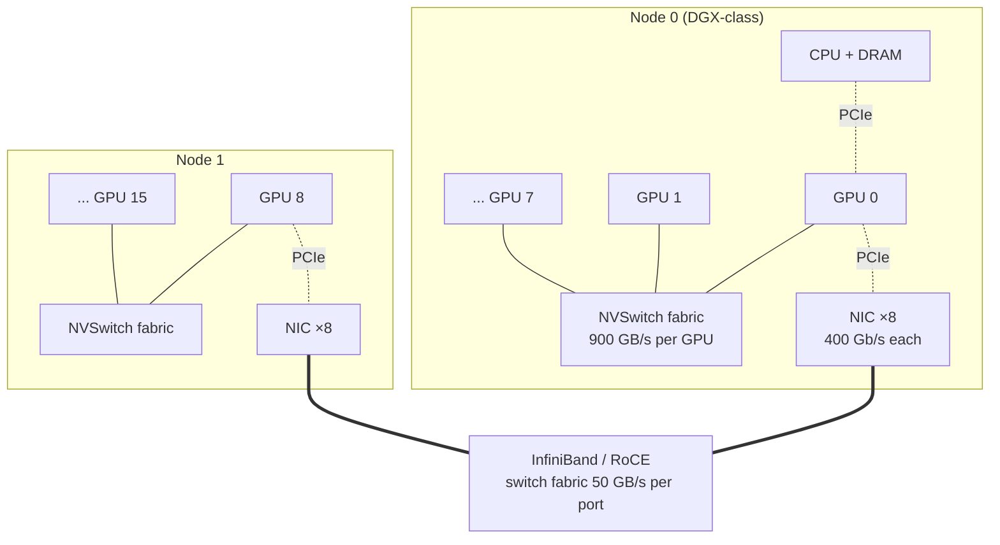
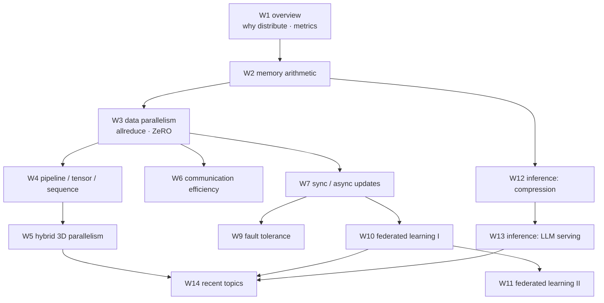

# Week 01 — Course Overview & Introduction: Why Distribute?

> 왜 학습·추론을 분산해야 하는가. 모델·데이터·compute 의 지수적 성장 vs 단일 device 의 memory·bandwidth 성장 격차 (memory wall) → scaling laws 가 그 성장을 정당화하는 논리 → 하드웨어 계층 (HBM, NVLink, InfiniBand) 의 수치 감각 → 병렬화의 한계 이론 (Amdahl, comm-to-comp ratio) → 성능 지표 (throughput, MFU) → 이 모든 것이 이후 13개 주차가 놓이는 하나의 문제 지도가 된다.

## Learning goals

이 챕터를 마치면 다음을 할 수 있어야 한다 (전부 시험 가능한 형태):

1. Transformer 모델 크기 (410×/2yrs)·학습 compute (750×/2yrs) 의 성장률과 하드웨어 peak FLOPS (3.0×/2yrs)·DRAM bandwidth (1.6×/2yrs)·interconnect bandwidth (1.4×/2yrs) 의 성장률 격차로 **memory wall** 을 설명하고, 분산이 선택이 아니라 필연인 이유를 정량적으로 논증할 수 있다.
2. Dense transformer 의 학습 비용 근사 $C \approx 6ND$ 를 유도하고, 주어진 모델 (GPT-3, Llama 3) 에 대해 총 FLOPs·소요 시간·필요 GPU 수를 계산할 수 있다.
3. **Kaplan scaling laws** 의 power-law 형태와 **Chinchilla** 의 compute-optimal 결론 ($N$ 과 $D$ 를 같은 비율로, ≈ 20 tokens/param) 을 비교하고, 주어진 compute 예산에 대해 optimal $(N, D)$ 를 계산할 수 있다.
4. GPU **memory hierarchy** (registers → SMEM → L2 → HBM) 와 **interconnect hierarchy** (NVLink → PCIe → InfiniBand/Ethernet) 의 대역폭을 자릿수 수준에서 나열하고, 이 계층이 병렬화 전략 배치 (W5) 를 결정하는 이유를 설명할 수 있다.
5. **Amdahl's law** 와 **Gustafson's law** 를 유도하고, strong vs weak scaling 을 구분하며, data parallelism 의 **communication-to-computation ratio** 가 모델 크기와 무관하고 per-device 작업량에 반비례함을 유도할 수 있다.
6. **Throughput, MFU, HFU, scaling efficiency** 를 정의·계산하고, 실측치 (Llama 3 의 38–43% MFU) 에서 역으로 학습 시간을 추정할 수 있다.
7. 이 과목의 각 주차가 푸는 문제를 한 문장으로 말하고, 주차 간 의존 관계를 지도 위에 놓을 수 있다.

## Why this matters

백엔드 시스템을 스케일할 때 우리는 stateless 서버를 복제하고 로드밸런서를 앞에 둔다 — 인스턴스들은 서로 거의 대화하지 않는다. 분산 학습은 정반대의 문제다: **모든 worker 가 매 스텝 (~수백 ms 마다) 수십억 개의 float 에 대해 완전히 합의해야 한다**. 즉 이것은 "embarrassingly parallel" 이 아니라, 통신이 본질에 박혀 있는 tightly-coupled 분산 시스템이다. 이 과목 전체는 결국 두 질문의 변주다:

- **학습**: 하나의 optimization 문제를 수천 개 device 로 쪼갤 때, *수학적 등가성* (또는 통제된 근사) 을 유지하면서 *통신·메모리·장애* 비용을 어떻게 감당하는가? (W2–W11)
- **추론**: 학습된 모델을 서빙할 때, *latency·throughput·메모리* 의 전혀 다른 병목을 어떻게 푸는가? (W12–W13)

이번 주는 이 두 질문이 **왜 생겨났는지** (스케일 성장 vs 하드웨어 한계), 그리고 이후 주차들이 **어떤 좌표 위에 놓이는지** (병렬화 축, 통신 계층, 성능 지표) 를 깐다. 여기서 만든 수치 감각 — "HBM 은 3 TB/s, 네트워크는 50 GB/s", "MFU 40% 면 잘한 것" — 은 이후 모든 주차의 트레이드오프 판단에 그대로 쓰인다.

## 0. Notation

이 챕터는 scaling laws 문헌의 관례를 따른다. **W2 이후 시스템 주차와 기호가 충돌하니 주의**:

| 기호 | 이 챕터 (scaling laws 관례) | W2 이후 (systems 관례) |
|---|---|---|
| $N$ | 모델 파라미터 수 | 메시지 크기 (bytes) — 파라미터 수는 $\Psi$ (ZeRO 표기) |
| $D$ | 학습 토큰 수 | — |
| $C$ | 총 학습 compute (FLOPs) | — |
| $p$ | device (worker) 수 | 동일 |
| $B$, $b$ | global / per-device batch size | 동일 ([W3](../03-data-parallelism/) §1) |
| $\beta$ | byte 당 전송 시간 (= 1/bandwidth) | 동일 (W3 의 $\alpha$–$\beta$ cost model) |

단, 이 챕터 안에서도 §2.2 (Chinchilla) 의 $\alpha = 0.34$, $\beta = 0.28$ 은 loss fit 의 exponent 로, 위 표의 통신 비용 $\beta$ (및 W3 의 latency $\alpha$) 와 무관한 별개 기호다.

---

## 1. The scale problem — 성장 곡선과 단일 device 의 한계

### 1.1 두 개의 지수, 하나의 격차

실측 데이터 (Gholami et al. 2024):

- **수요 측** (transformer 등장 이후, ~2017–): SOTA transformer 의 파라미터 수는 **2년마다 410배**, 학습에 필요한 compute 는 **2년마다 750배** 성장했다.
- **공급 측** (지난 20년): 하드웨어 peak FLOPS 는 **2년마다 3.0배**, DRAM(HBM) bandwidth 는 **1.6배**, interconnect bandwidth 는 **1.4배**, 단일 GPU 메모리 용량은 **2배** 성장에 그쳤다.

두 곡선 모두 지수적이지만 지수가 두 자릿수 차이난다. 이 격차가 만드는 결론이 이 과목의 존재 이유다:

1. **모델이 한 device 에 안 들어간다** (capacity wall) → 모델을 쪼개야 한다 (W4 pipeline/tensor parallelism, ZeRO).
2. **들어가도 한 device 로는 너무 느리다** (compute wall) → 데이터를 쪼개야 한다 (W3 data parallelism).
3. **쪼개면 통신이 병목이 된다** — interconnect 가 가장 느리게 성장하는 자원이므로 (1.4×/2yrs), 시간이 갈수록 분산 학습의 병목은 계산에서 **통신**으로 이동한다 (W6 communication efficiency, W5 배치 원칙).
4. 그리고 FLOPS (3.0×) 가 bandwidth (1.6×) 보다 빨리 성장하므로, 단일 device 안에서도 병목은 연산에서 **메모리 이동**으로 이동한다 → §3 memory wall, W13 의 inference 병목.

### 1.2 Transformer 학습 비용 산수: $C \approx 6ND$

파라미터 $N$ 개짜리 dense transformer 로 토큰 $D$ 개를 한 번 학습하는 비용의 표준 근사 (Kaplan et al. 2020, 표기 $C \approx 6NBS$ — $BS$ 가 곧 총 토큰 수):

$$C \approx 6ND \ \text{FLOPs}$$

유도 (파라미터당·토큰당 FLOPs 로 센다):

- **Forward**: 각 weight 는 토큰당 한 번의 multiply-accumulate (2 FLOPs) 에 참여 → $2N$ FLOPs/token.
- **Backward**: 각 layer 에서 두 개의 gradient 를 계산한다 — activation 에 대한 gradient (다음 layer 로 전파용) 와 weight 에 대한 gradient. 둘 다 forward 와 같은 크기의 행렬곱이므로 $2 \times 2N = 4N$ FLOPs/token. Backward 가 forward 의 **2배**라는 사실은 이후 profiling (lab) 과 pipeline 스케줄 (W4) 에서 반복 등장한다.
- 합계: $6N$ FLOPs/token × $D$ tokens. (attention 의 $O(s^2)$ 항은 hidden dim 대비 sequence 가 길지 않으면 소항 — 정밀 계산은 W13 에서.)

단위 감각: 1 PF-day $= 10^{15} \times 86{,}400 = 8.64 \times 10^{19}$ FLOPs (Kaplan 의 단위).

### 1.3 Worked Example 1 — GPT-3 를 GPU 한 장으로 학습한다면

GPT-3: $N = 175$B, $D = 300$B tokens (Brown et al. 2020).

**Compute wall.** 총 비용:

$$C \approx 6 \times (1.75 \times 10^{11}) \times (3 \times 10^{11}) = 3.15 \times 10^{23} \ \text{FLOPs}$$

(논문 보고치 $3.14 \times 10^{23}$ 과 일치 — 근사가 실전에서 통한다는 증거.) A100 한 장의 BF16 peak 는 312 TFLOPS 이고, 현실적인 utilization 40% (§6) 를 가정하면 실효 $1.25 \times 10^{14}$ FLOP/s:

$$T = \frac{3.15 \times 10^{23}}{1.25 \times 10^{14}} \approx 2.5 \times 10^{9} \ \text{s} \approx 80 \ \text{years}$$

1,024 장이면 (같은 utilization 유지 가정) **약 28.5일** — 그래서 GPT-3 급부터는 수천 GPU 가 기본 단위다.

**Capacity wall.** 시간 문제 이전에 적재부터 불가능하다:

- fp16 weights 만: $175 \times 10^9 \times 2$ bytes $= 350$ GB — A100 80 GB 의 4.4배. **forward 한 번도 못 돌린다.**
- 학습 상태 전체 (fp16 weights + gradients + Adam optimizer states, 파라미터당 16 bytes — 유도는 [W2](../02-memory-issues/)): $175 \times 16 = 2.8$ TB. 저장만을 위해 **A100-80GB 35장**이 필요하다. activations 는 별도.

compute wall 은 "GPU 를 더 사면" 풀리지만, capacity wall 은 **모델·상태를 쪼개는 알고리즘** (ZeRO, tensor/pipeline parallelism) 없이는 GPU 를 아무리 사도 안 풀린다. 이 구분이 W3 (데이터를 쪼갠다) 와 W4 (모델을 쪼갠다) 의 분기점이다.

---

## 2. Scaling laws — 왜 계속 키우는가

성장이 하드웨어를 이렇게까지 초과하는데 왜 멈추지 않는가? **키우면 좋아진다는 것이 넓은 범위에서 정량적으로 예측 가능**하기 때문이다.

### 2.1 Kaplan et al. 2020: power laws

Cross-entropy loss 는 model size $N$, dataset size $D$, training compute $C$ 각각에 대해 (다른 둘이 병목이 아닐 때) **power law** 를 따른다 — 일부 축은 7 자릿수 이상의 범위에서 (compute 기준; $D$ 는 ~3 자릿수 범위):

$$L(N) = \left(\frac{N_c}{N}\right)^{\alpha_N}, \quad L(D) = \left(\frac{D_c}{D}\right)^{\alpha_D}, \quad L(C_{\min}) = \left(\frac{C_c}{C_{\min}}\right)^{\alpha_C}$$

$$\alpha_N \approx 0.076, \qquad \alpha_D \approx 0.095, \qquad \alpha_C \approx 0.050$$

읽는 법: loss 를 상수 배 줄이려면 자원을 **지수적으로** 부어야 한다 (예: $L$ 을 절반으로 → $C$ 를 $2^{1/0.050} \approx 10^6$ 배). 이것이 §1.1 의 750×/2yrs 성장의 수요 곡선이다. Kaplan 의 배분 결론: 고정된 $C$ 에서 $N \propto C^{0.73}$, 학습 스텝 $S \propto C^{0.03}$ — **"budget 이 늘면 거의 전부 모델 크기에 써라. 큰 모델을 적은 데이터로, 수렴 전에 멈춰라."** GPT-3 (175B 를 300B tokens, ≈ 1.7 tokens/param) 는 이 처방의 산물이다.

### 2.2 Hoffmann et al. 2022 (Chinchilla): compute-optimal 재조정

DeepMind 가 400개 이상의 모델을 학습해 loss 를 다시 fitting 했다:

$$L(N, D) = E + \frac{A}{N^{\alpha}} + \frac{B}{D^{\beta}}, \qquad E = 1.69,\ A = 406.4,\ B = 410.7,\ \alpha = 0.34,\ \beta = 0.28$$

$E$ 는 자연어의 irreducible entropy, 두 항은 각각 **모델 용량 부족**과 **데이터 부족**의 페널티다. 제약 $C = 6ND$ 아래에서 $L$ 을 최소화하면:

$$N_{opt} \propto C^{a}, \quad D_{opt} \propto C^{b}, \qquad a \approx b \approx 0.5$$

**모델과 데이터를 같은 비율로 키워라** — 모델을 2배 키우면 토큰도 2배. 경험 법칙으로 $D_{opt}/N_{opt} \approx 20$ tokens/param. Kaplan 의 $C^{0.73}$ 과 정면 충돌하는 결론이고 (원인: Kaplan 은 학습 스케줄·소규모 fitting 등 방법론 차이 — Hoffmann §3), 검증은 실물로 했다: 같은 compute 예산으로 Gopher (280B, 300B tokens) 대신 **Chinchilla (70B, 1.4T tokens)** 를 학습하니 모든 벤치마크에서 우월했다 (MMLU 67.5%, Gopher 대비 +7%p). 당시의 대형 모델들 (GPT-3, MT-NLG 530B) 은 전부 **심각한 undertrained** 상태였다는 뜻이다.

### 2.3 Worked Example 2 — $C = 5.76 \times 10^{23}$ FLOPs 배분하기

Gopher/Chinchilla 의 실제 예산. $D = 20N$ 과 $C = 6ND$ 를 연립하면:

$$C = 6N \cdot 20N = 120N^2 \implies N_{opt} = \sqrt{\frac{C}{120}} = \sqrt{\frac{5.76 \times 10^{23}}{120}} \approx 6.9 \times 10^{10} \approx 70\text{B}$$

$$D_{opt} = 20 N_{opt} \approx 1.4 \times 10^{12} = 1.4\text{T tokens}$$

— Chinchilla 의 실제 구성 (70B, 1.4T) 이 그대로 나온다. 같은 예산으로 Kaplan 처방을 따르면 $N$ 이 수백 B, $D$ 는 수백 B tokens 로 기울었을 것이고, 그것이 Gopher (280B / 300B, 1.1 tokens/param) 였다.

**분산 시스템 함의**: Chinchilla 는 "더 큰 모델" 경쟁을 "더 많은 토큰" 경쟁으로 바꿨다. tokens/param 은 ~1 → 20 으로 뛰었고, 같은 예산에서 토큰 수 — 따라서 고정 global batch 기준 optimizer step 수 — 는 Gopher 대비 **~5배** (300B → 1.4T) 늘었다 → **allreduce 횟수가 그만큼 늘고** (allreduce: 모든 device 의 gradient 를 element-wise 로 합산해 전원이 같은 결과를 갖게 하는 collective 통신 — 정의·유도는 W3) → 통신 효율 (W6) 과 장애 노출 시간 (W9) 이 그만큼 중요해진다. Scaling law 는 순수 ML 결과지만, 그 처방이 시스템 워크로드의 모양을 결정한다.

### 2.4 Post-Chinchilla: inference 비용까지 넣으면

Chinchilla-optimal 은 **학습 비용만** 최소화한다. 모델은 학습 후 수억 번 서빙되므로, 총비용 관점에서는 **작은 모델을 optimal 보다 훨씬 오래 학습**하는 것이 이득일 수 있다 — 추론 비용은 $N$ 에 비례하므로. LLaMA (Touvron et al. 2023) 가 이 관점을 명시적으로 채택했고 (7B 를 1T tokens), Llama 3 는 8B 모델을 **15T+ tokens** (≈ 1,900 tokens/param — Chinchilla 처방의 ~95배) 으로 학습했다. "over-training" 은 낭비가 아니라 **train-once, serve-forever 경제학**의 산물이며, 이것이 W12–13 (inference optimization) 이 독립된 주제로 존재하는 이유이기도 하다: 추론 비용을 낮추는 모든 기법 (quantization, serving 최적화) 은 이 트레이드오프의 기울기를 바꾼다.

---

## 3. The memory wall

### 3.1 FLOPS 는 빨라지는데 데이터가 못 따라온다

§1.1 의 공급 측 수치를 다시 보자: peak FLOPS 3.0×/2yrs vs DRAM bandwidth 1.6×/2yrs vs interconnect 1.4×/2yrs. 연산기가 데이터를 소비하는 속도가 데이터를 공급하는 속도보다 빨리 성장하면, 시간이 지날수록 **연산기는 데이터를 기다리며 논다**. 이것이 memory wall (Gholami et al. 2024) 이다. 용량 축도 마찬가지다: GPU 메모리 용량은 2×/2yrs 인데 모델은 410×/2yrs — 단일 device 용량으로는 구조적으로 추격이 불가능하다.

### 3.2 Arithmetic intensity 와 roofline

병목이 연산인지 메모리인지 판정하는 표준 도구. 어떤 커널이 $W$ FLOPs 를 수행하며 $Q$ bytes 를 메모리와 주고받을 때:

$$I = \frac{W}{Q} \ \text{[FLOPs/byte]} \qquad \text{(arithmetic intensity)}$$

하드웨어는 peak compute $\pi$ [FLOP/s] 와 memory bandwidth $b_{mem}$ [B/s] 를 가지므로, 달성 가능한 성능은 (Williams et al. 2009 의 roofline model):

$$P_{attain} = \min(\pi,\ I \times b_{mem})$$

경계는 **machine balance** $I^* = \pi / b_{mem}$:

- $I < I^*$: **memory-bound** — FLOPS 를 아무리 올려도 소용없고, 데이터 이동을 줄여야 한다.
- $I > I^*$: **compute-bound** — bandwidth 여유, FLOPS 가 병목.

수치 감각 (BF16 dense 기준): A100 은 $I^* = 312\text{e}12 / 2.0\text{e}12 \approx 156$ FLOPs/byte, H100 은 $989\text{e}12 / 3.35\text{e}12 \approx 295$ FLOPs/byte. **세대가 지날수록 $I^*$ 가 올라간다** = memory-bound 영역이 넓어진다 (memory wall 의 roofline 버전). 미리보기: 큰 행렬곱은 $I$ 가 수백 이상이라 compute-bound 지만, LLM 의 **decode 단계는 $I \approx 1$–$2$ 수준으로 극단적 memory-bound** 다 — W13 의 KV cache·FlashAttention·batching 이 전부 이 한 줄에서 출발한다.

---

## 4. Hardware 기초 — 클러스터 해부

분산 학습의 비용 모델은 결국 "어떤 링크로 몇 byte 를 보내는가" 다. 계층별 수치를 자릿수로 외워두면 이후 모든 주차의 계산이 빨라진다.

### 4.1 GPU memory hierarchy

A100 (SXM, 80 GB) 기준, FlashAttention 논문과 NVIDIA 자료의 수치:

| 계층 | 용량 | Bandwidth | 비고 |
|---|---|---|---|
| Registers | 256 KB/SM × 108 SMs | — | 커널 내 스칼라·조각 |
| L1 / Shared memory (SRAM) | 192 KB/SM (합산 ~20 MB) | **~19 TB/s** (aggregate) | 프로그래머 제어 가능 (tiling) |
| L2 cache | 40 MB | HBM 의 수 배 | 전 SM 공유 |
| **HBM2e** | **80 GB** | **~2.0 TB/s** | "GPU memory" 라고 부르는 것 |
| Host DRAM (over PCIe) | TB급 | 32 GB/s (PCIe Gen4 ×16, 단방향) | offload 의 통로 (W5 ZeRO-Offload) |

H100 (SXM) 은 HBM3 80 GB / **3.35 TB/s**, L2 50 MB, 132 SMs × 256 KB (L1+shared 합산 — A100 의 192 KB/SM 과 같은 기준; shared memory 로는 최대 228 KB), BF16 dense **989 TFLOPS**. 핵심 관찰 두 가지:

1. **SRAM 은 HBM 보다 ~10배 빠르지만 4,000배 작다.** 연산을 SRAM tile 안에 가둬 HBM 왕복을 줄이는 것이 GPU 커널 최적화의 본질이고 (W13 의 FlashAttention 이 정확히 이 게임), W2 의 activation 메모리 논의도 "HBM 에 무엇을 남길 것인가" 의 문제다.
2. **80 GB 는 § 1.3 의 2.8 TB 앞에서 무력하다.** 계층의 어디에도 대형 모델의 학습 상태가 들어갈 곳이 없다 — 그래서 여러 GPU 의 HBM 을 "하나의 메모리 풀" 처럼 쓰는 기법 (ZeRO/FSDP, W3) 이 나온다.

### 4.2 Interconnect hierarchy

GPU 밖으로 나가는 순간의 대역폭 (달리 표기 없으면 방향당 실효 기준):

| 링크 | Bandwidth | 스코프 | 용도 |
|---|---|---|---|
| NVLink 3 (A100) | 600 GB/s (양방향 합산; 방향당 300) | node 내 GPU↔GPU | tensor parallelism 트래픽 (W4) |
| NVLink 4 (H100) | 900 GB/s (양방향 합산; 방향당 450) | node 내 GPU↔GPU | 〃 |
| PCIe Gen4 ×16 | 32 GB/s (방향당) | GPU↔CPU/NIC | NVLink 없는 구성의 GPU 간 통신, host offload |
| PCIe Gen5 ×16 | 64 GB/s (방향당) | 〃 (H100 세대) | 〃 |
| InfiniBand HDR | 200 Gb/s = 25 GB/s /port | node 간 | 클러스터 fabric |
| InfiniBand NDR | 400 Gb/s = 50 GB/s /port | node 간 | 〃 (DGX H100: GPU 당 NIC 1개꼴, 8× ConnectX-7) |
| Ethernet (RoCE) 400 GbE | 50 GB/s /port | node 간 | IB 대안 — Llama 3 의 24K GPU 클러스터 중 하나가 RoCE 기반 |

전체 서열을 한 줄로 (자릿수 감각 — 시험 단골):

$$\underbrace{19{,}000}_{\text{SRAM}} \ \gg \ \underbrace{2{,}000\text{–}3{,}350}_{\text{HBM}} \ \gg \ \underbrace{300\text{–}450}_{\text{NVLink (방향당)}} \ \gg \ \underbrace{25\text{–}50}_{\text{network}} \ \approx \ \underbrace{32\text{–}64}_{\text{PCIe}} \quad \text{[GB/s]}$$

**SRAM 에서 network 까지 약 3 자릿수 차이.** 여기에 latency 축이 겹친다: collective 한 번의 기동에는 μs 수준의 고정 비용이 붙어, 작은 메시지는 bandwidth 가 아니라 latency 에 갇힌다 (W3 §3.3 의 $\alpha$–$\beta$ model 로 정식화).

### 4.3 클러스터 토폴로지와 locality 원칙

계층이 만드는 원칙: **통신량이 많고 빈번한 병렬화 축일수록 빠른 링크에 배치한다.** 이것이 W5 의 3D parallelism 배치 규칙 — tensor parallelism (layer 마다 통신) 은 NVLink 안에, pipeline parallelism (경계에서 activation 만) 은 node 간에, data parallelism (step 당 1회 gradient) 은 최외곽에 — 의 근거 전부다. 규칙 자체는 W5 에서 유도하고, 여기서는 **"계층이 있다 → 배치가 문제가 된다"** 는 구조만 기억하면 된다.

---

## 5. 병렬화의 한계 이론

device 를 $p$ 배 늘리면 $p$ 배 빨라지는가? 세 가지 도구로 "아니오" 를 정량화한다.

### 5.1 Amdahl's law — strong scaling 의 상한

전체 작업 중 병렬화 가능한 비율을 $f$, 불가능한 (serial) 비율을 $1-f$ 라 하자. $p$ 개 device 의 speedup:

$$S(p) = \frac{1}{(1-f) + \dfrac{f}{p}} \ \xrightarrow{p \to \infty}\ \frac{1}{1-f}$$

**Worked Example 3.** 한 학습 스텝에서 병렬화되지 않는 부분 (커널 launch, 동기화 지점, 겹치지 못한 통신, data loading 꼬리) 이 5% 라면 ($f = 0.95$):

$$S(64) = \frac{1}{0.05 + 0.95/64} \approx 15.4, \qquad S(1024) \approx 19.6, \qquad S(\infty) = 20$$

GPU 를 64장에서 1,024장으로 **16배** 늘려도 speedup 은 15.4 → 19.6, **1.27배**밖에 안 는다. 단 5% 의 serial 비율이 상한 20× 를 박는다 — 분산 학습에서 "겹치지 못한 통신" 이 사실상의 serial 항으로 작동하므로, W3 의 computation–communication overlap 이 성능의 절반인 이유가 여기 있다.

### 5.2 Gustafson's law — weak scaling 의 반론

Amdahl 은 **문제 크기 고정** (strong scaling) 을 가정한다. 현실의 ML 은 device 가 늘면 문제를 키운다 (batch 를 키운다). 고정된 시간 예산에서 $p$ 개 device 가 처리한 작업을 1개 device 시간으로 환산하면:

$$S_{scaled}(p) = (1-f) + f \cdot p$$

— serial 비율이 상수라도 speedup 이 $p$ 에 선형으로 는다. 정의를 다시 정리하면 (W3 §1.3 과 동일):

- **Strong scaling**: 전체 문제 (global batch $B$) 고정, $p$ 증가 → per-device 몫 $b = B/p$ 감소. Amdahl regime — $b$ 가 작아질수록 per-device 효율이 떨어지고 통신 비중이 커진다.
- **Weak scaling**: per-device 몫 $b$ 고정, $p$ 증가 → $B = pb$ 증가. Gustafson regime — 시스템 효율은 유지되지만 **optimization 문제가 변한다**: batch 를 키우는 것이 공짜가 아니다 (critical batch size, W3 §5). 즉 weak scaling 의 진짜 한계는 시스템이 아니라 **통계**에 있다.

### 5.3 Communication-to-computation ratio — 분산 학습의 조임쇠

data parallelism (W3) 의 스텝당 비용을 미리 계산해 보자. 파라미터 $N$ 개 dense 모델, per-device 로 토큰 $b_{tok}$ 개 처리, 실효 연산 성능 $F$ [FLOP/s], gradient 는 fp32 (4 bytes), ring-allreduce 통신량 ≈ $2 \times 4N$ bytes (유도는 W3 §3), 링크 bandwidth $1/\beta$:

$$T_{comp} = \frac{6 N b_{tok}}{F}, \qquad T_{comm} = 8 N \beta$$

$$R \equiv \frac{T_{comm}}{T_{comp}} = \frac{8 N \beta F}{6 N b_{tok}} = \frac{4}{3} \cdot \frac{F \beta}{b_{tok}}$$

**모델 크기 $N$ 이 소거된다** — 통신량과 계산량이 둘 다 $N$ 에 비례하므로. 남는 것은 두 인자뿐:

1. $F\beta$ = 하드웨어 균형 (연산이 통신보다 얼마나 빠른가) — FLOPS 가 bandwidth 보다 빨리 성장하므로 (§1.1) **세대마다 악화**된다.
2. $b_{tok}$ = per-device 작업량 — strong scaling 으로 $p$ 를 늘리면 $b_{tok}$ 이 줄어 **$R$ 이 커진다**. 통신 비중 증가가 strong scaling 을 죽이는 메커니즘이 이 식 안에 있다.

**Worked Example 4.** H100 실효 $F = 400$ TFLOP/s (peak 989 의 ~40%, §6), node 간 GPU 당 50 GB/s (NDR), per-device 8,192 tokens/step:

$$R = \frac{4}{3} \cdot \frac{4 \times 10^{14} / 5 \times 10^{10}}{8192} = \frac{4}{3} \cdot \frac{8000}{8192} \approx 1.3$$

**통신이 계산보다 오래 걸린다** (overlap 없이는 스텝 시간의 절반 이상이 통신). 처방 각각이 한 주차씩이다: gradient 를 bf16/압축으로 줄이거나 (W6), 통신을 계산 뒤에 숨기거나 (W3 overlap), $b_{tok}$ 을 키우거나 (gradient accumulation, W3 — 단 critical batch size 한계), 아예 동기화 빈도를 낮춘다 (W7 async, W14 DiLoCo).

---

## 6. 성능 지표 — 무엇을 재는가

### 6.1 Throughput 과 step time

- **Throughput**: 초당 처리 샘플/토큰 수. $X = B / T_{step}$ (global batch / 스텝 시간). 같은 모델·같은 하드웨어끼리의 비교에는 충분하지만, 모델이나 GPU 가 다르면 비교 불가.
- **Step time 분해**: $T_{step} = T_{data} + T_{fwd} + T_{bwd} + T_{opt} + T_{comm}^{(unoverlapped)}$. 최적화는 항상 분해에서 시작한다 — 이번 주 lab 이 `torch.profiler` 로 이 분해를 실측하고, backward ≈ 2× forward (§1.2) 를 확인한다.

### 6.2 MFU — 하드웨어를 얼마나 쓰고 있는가

**Model FLOPs Utilization** (Chowdhery et al. 2022, PaLM):

$$\text{MFU} = \frac{X_{tokens/s} \times C_{token}}{p \times \pi_{peak}}, \qquad C_{token} \approx 6N$$

분자는 "모델이 이론적으로 필요로 하는 FLOPs 를 소화한 속도", 분모는 클러스터의 peak FLOPS. 핵심 규약: 분자는 **모델에 필수적인 연산만** 센다 — activation recomputation (W2) 같은 구현 편의상의 추가 연산은 분자에 넣지 않는다. 추가 연산까지 세는 지표는 **HFU** (Hardware FLOPs Utilization; Korthikanti et al. 2022) 이고, 항상 HFU ≥ MFU 다. Recomputation 을 켜면 HFU 는 올라도 MFU 는 내려갈 수 있다 — "바쁜 것" 과 "유용하게 바쁜 것" 의 차이. MFU 가 표준 비교 지표인 이유: 모델·하드웨어·구현 트릭을 전부 정규화하기 때문.

수치 감각: **100% 는 불가능하다** (attention 의 비-GEMM 연산 — GEMM: general matrix–matrix multiplication, transformer FLOPs 대부분을 차지하는 dense 행렬곱 —, 통신, 커널 launch, memory-bound 구간). 대규모 실측치 — PaLM 540B: **46.2%**, Llama 3 405B: **38–43%** (16,384 H100, BF16 380–430 TFLOP/s/GPU). 대략 **40%±** 가 "잘 튜닝된 대규모 학습" 의 기준선이다.

**Worked Example 5 — MFU 로 학습 시간 역산.** Llama 3 405B: $C = 6 \times (4.05 \times 10^{11}) \times (1.56 \times 10^{13}) \approx 3.8 \times 10^{25}$ FLOPs (보고치와 일치). 16,384 H100 × 989 TFLOPS × MFU 40%:

$$T = \frac{3.8 \times 10^{25}}{16384 \times 9.89 \times 10^{14} \times 0.4} \approx 5.9 \times 10^{6} \ \text{s} \approx 68 \ \text{days}$$

실제 보고된 학습 기간과 자릿수가 일치한다. $C \approx 6ND$ 와 MFU 만 알면 어떤 공개 모델이든 뒷면 계산이 된다. 참고로 이 68일 동안 클러스터는 무결하지 않다 — Llama 3 팀은 54일 구간에서 **466회의 job interruption** 을 보고했다 (W9 fault tolerance 의 출발점).

### 6.3 Scaling efficiency

$p$ 배의 자원이 몇 배의 성능이 됐는가:

$$E_{strong}(p) = \frac{T(1)}{p \cdot T(p)}, \qquad E_{weak}(p) = \frac{X(p)}{p \cdot X(1)}$$

($T$ = 고정 문제의 완료 시간, $X$ = throughput. 이상적이면 1.) 논문의 "linear scaling" 그래프는 대부분 $E_{weak}$ 다 — weak scaling 이 시스템 관점에서 훨씬 쉬운 문제이므로 (§5.2), 어떤 efficiency 인지 항상 확인해야 한다. 그리고 $E_{weak} \approx 1$ 이라도 batch 가 커진 대가 (수렴에 필요한 스텝 수) 는 그래프 밖에 있다.

---

## 7. 과목 지도 — 하나의 문제 지도

### 7.1 분류 체계: 무엇을 쪼개고, 무엇을 감수하는가

모든 분산 학습 기법은 "**무엇을 쪼개는가**" 로 분류되고, 쪼개는 순간 "**어떤 통신이 생기는가**" 가 따라온다:

| 축 | 쪼개는 것 | 각 device 가 갖는 것 | 발생하는 통신 | 주차 |
|---|---|---|---|---|
| **Data parallelism** | 학습 데이터 (batch) | 모델 전체 복제 | step 당 gradient allreduce | W3 |
| **Pipeline parallelism** | 모델을 layer 묶음으로 | 연속된 layer 블록 | stage 경계의 activation 전달 | W4 |
| **Tensor parallelism** | layer 내부의 행렬 | 행렬의 행/열 조각 | layer 마다 allreduce (고빈도) | W4 |
| **Sequence parallelism** | sequence 축 | 토큰 구간 | activation 재분배 | W4 |
| **Hybrid (3D)** | 위 축들의 조합 | — | 축별 통신을 링크 계층에 매핑 (§4.3) | W5 |

이 표의 오른쪽 열 (통신) 이 생기는 순간, 직교하는 질문들이 뒤따른다 — 이것이 나머지 주차다:

- 그 통신을 **줄일 수 있는가?** — 압축해도 수렴하는가 (W6: sparsification, quantization, error feedback)
- 그 통신을 **늦출 수 있는가?** — 전원이 매 스텝 합의해야 하는가 (W7: BSP/ASP/SSP, parameter server)
- 참여자가 **죽거나 거짓말하면?** — (W9: checkpointing, elastic training, Byzantine robustness)
- 데이터가 **아예 못 움직이면?** — 통신 제약의 극한 (W10–11: federated learning — W7 의 local update 관점의 연장선)
- 학습이 끝난 뒤는? — 추론은 병목이 다르다 (**decode 는 memory-bound**, §3.2): 모델을 줄이거나 (W12: quantization, pruning, distillation) 서빙 시스템을 바꾼다 (W13: FlashAttention, PagedAttention, continuous batching)
- 최신 시스템은 위 부품들의 재조합이다 (W14: DiLoCo = FedAvg × datacenter, MoE = expert 축의 병렬화, disaggregated serving)

그리고 이 전부의 공용 어휘가 **W2 (memory arithmetic)** 다 — "파라미터당 16 bytes", "activation 은 batch·seq 에 비례" 를 모르면 어떤 트레이드오프도 계산할 수 없다.

### 7.2 주차 의존 지도

읽는 순서 제안 (roadmap §4 와 동일): W2 → W3 이 척추. W6·W7 은 W3 만 있으면 독립. W12–13 은 training 주차와 거의 독립이라 먼저 읽어도 된다. 이 챕터 (W1) 의 역할은 각 주차에서 "지금 어느 좌표에 있는지" 를 잃지 않게 하는 것이다.

---

## Common misconceptions

1. **"GPU 를 $p$ 배 늘리면 $p$ 배 빨라진다"** — 세 겹으로 틀렸다. (i) serial/통신 비율이 Amdahl 상한을 박고 (§5.1: 5% 만으로 상한 20×), (ii) strong scaling 은 per-device 작업량을 줄여 comm-to-comp ratio $R \propto 1/b_{tok}$ 을 키우며 (§5.3), (iii) weak scaling 으로 도망가면 batch 증가의 통계적 대가가 청구된다 (W3 §5). "몇 배 빨라지는가" 는 항상 어느 scaling 인지·무엇이 병목인지부터 물어야 한다.
2. **"MFU = GPU utilization (`nvidia-smi` 의 %)"** — 전혀 다르다. `nvidia-smi` 의 utilization 은 "해당 구간에 커널이 하나라도 돌고 있었는가" 로, memory-bound 커널이 대역폭을 기다리는 시간도 100% 로 찍힌다. MFU 는 peak FLOPS 대비 **유용한 연산의 처리율**이다 (§6.2) — utilization 100% 에 MFU 15% 인 시스템이 흔하다.
3. **"MFU 와 HFU 는 같은 것"** — recomputation 이 있으면 갈라진다. HFU 는 하드웨어가 실제 수행한 FLOPs (재계산 포함), MFU 는 모델에 필수인 FLOPs 만 센다. Recomputation 을 켜면 HFU ↑, MFU ↓ 가 동시에 가능하다 (§6.2).
4. **"메모리가 부족한 것은 파라미터가 커서다"** — 파라미터는 시작일 뿐이다. 학습 시 model states 는 파라미터의 8배 (fp16 Adam 기준 16 bytes/param, W2 에서 유도), activations 는 batch·sequence 에 비례해 그 이상일 수 있다. "70B 모델 = 140 GB" 로 끝내는 계산은 학습 메모리를 한 자릿수 이상 과소평가한다 (§1.3).
5. **"Kaplan 과 Chinchilla 중 하나는 폐기됐다"** — 둘 다 power-law 스케일링 자체에는 합의한다. 갈린 것은 **compute 배분** ($N \propto C^{0.73}$ vs $C^{0.5}$) 이고, Chinchilla 가 실물 검증 (70B > 280B) 으로 이겼지만, §2.4 의 inference-aware 관점은 다시 Chinchilla-optimal 에서도 벗어난다 (Llama 3 8B: ~1,900 tokens/param). "optimal" 은 목적함수 (학습 비용만 vs 총 소유 비용) 에 따라 움직인다.
6. **"Interconnect 스펙 수치 = 실제로 얻는 속도"** — 스펙표의 함정이 셋 있다. (i) NVLink 의 600/900 GB/s 는 **양방향 합산**이고 한 방향은 절반, (ii) 작은 메시지는 bandwidth 이전에 latency ($\alpha$ 항) 에 갇히며 (W3 §3.3), (iii) collective 알고리즘의 실효 대역폭은 토폴로지·메시지 크기에 따라 스펙의 수십% 까지 떨어진다. 계산할 때는 항상 "방향당, 실효" 를 명시해야 한다.
7. **"추론은 학습의 쉬운 부분집합이다 (forward 만 하니까)"** — 병목의 종류가 다르다. 학습은 큰 batch 의 GEMM 으로 compute-bound 에 가깝게 만들 수 있지만, 추론의 decode 는 토큰을 하나씩 생성하며 매번 전체 weights 를 읽는 **memory-bound** 워크로드다 ($I \approx 1$–$2$, §3.2). 그래서 추론 최적화 (W12–13) 는 FLOPs 감소가 아니라 **byte 이동 감소** (quantization, KV cache 관리) 가 본질이다.
8. **"Scaling law 는 ML 이론이지 시스템과 무관하다"** — 반대로, 시스템 워크로드의 모양을 결정하는 것이 scaling law 다. Chinchilla 는 같은 예산의 토큰 수 (= 고정 batch 기준 allreduce 횟수) 를 ~5배 늘렸고 (§2.3, 300B → 1.4T), over-training 은 학습 클러스터의 점유 기간을 늘려 fault tolerance (W9) 의 중요도를 올렸으며, inference-aware scaling 은 W12–13 의 존재 이유다.

## Glossary

- **memory wall** — the widening gap between compute throughput growth (3.0×/2yrs peak FLOPS) and data-movement growth (1.6×/2yrs DRAM, 1.4×/2yrs interconnect bandwidth), making data movement the dominant bottleneck.
- **scaling law** — an empirical power-law relation between model loss and model size, dataset size, or training compute, holding over many orders of magnitude.
- **compute-optimal training** — allocating a fixed compute budget $C \approx 6ND$ between parameters $N$ and tokens $D$ to minimize final loss; Chinchilla prescribes $N, D$ scaled equally (≈ 20 tokens/param).
- **$C \approx 6ND$** — approximate training cost of a dense transformer: 2 FLOPs/param/token forward plus 4 backward, times $D$ tokens.
- **HBM (high-bandwidth memory)** — stacked DRAM on the GPU package ("GPU memory"); ~2.0 TB/s on A100, ~3.35 TB/s on H100.
- **NVLink / NVSwitch** — NVIDIA's intra-node GPU-to-GPU interconnect (900 GB/s aggregate bidirectional per H100), an order of magnitude faster than the inter-node network.
- **InfiniBand / RoCE** — inter-node cluster fabrics; NDR InfiniBand and 400 GbE provide 400 Gb/s = 50 GB/s per port.
- **allreduce** — a collective communication operation that combines (element-wise sums or averages) a tensor across all participating devices and leaves every device holding the identical result; the primitive behind data-parallel gradient synchronization (W3).
- **GEMM (general matrix–matrix multiplication)** — the dense matrix-multiply primitive that accounts for most transformer FLOPs; large GEMMs are compute-bound, while non-GEMM ops (softmax, normalization) are memory-bound.
- **arithmetic intensity** — FLOPs performed per byte moved to/from memory ($I = W/Q$); compared against machine balance $\pi/b_{mem}$ to classify a kernel as compute- or memory-bound.
- **roofline model** — attainable performance $\min(\pi, I \cdot b_{mem})$: a bandwidth-sloped roof capped by peak compute.
- **Amdahl's law** — strong-scaling speedup bound $S(p) = 1/((1{-}f) + f/p) \le 1/(1{-}f)$ for parallel fraction $f$.
- **Gustafson's law** — scaled (weak-scaling) speedup $S(p) = (1{-}f) + fp$ when problem size grows with $p$.
- **strong / weak scaling** — fixed total problem with more workers (per-worker share shrinks) vs fixed per-worker problem (total grows with $p$).
- **communication-to-computation ratio** — $T_{comm}/T_{comp}$ per step; for data parallelism it is independent of model size and inversely proportional to per-device workload.
- **throughput** — samples or tokens processed per second, $X = B/T_{step}$.
- **MFU (model FLOPs utilization)** — achieved model-required FLOPs per second divided by cluster peak FLOPs; ~40% is a strong large-scale result (PaLM 46.2%, Llama 3 38–43%).
- **HFU (hardware FLOPs utilization)** — like MFU but counting all executed FLOPs including activation recomputation; HFU ≥ MFU.
- **scaling efficiency** — achieved speedup (or throughput gain) divided by ideal $p\times$; distinguish strong ($T(1)/(p\,T(p))$) from weak ($X(p)/(p\,X(1))$).
- **data / pipeline / tensor / sequence parallelism** — partitioning, respectively, the batch, layer blocks, intra-layer matrices, or the sequence axis across devices.

## References

1. Kaplan et al., *Scaling Laws for Neural Language Models*, 2020. [arXiv:2001.08361](https://arxiv.org/abs/2001.08361) — §1.2 ($C \approx 6NBS$, PF-day), §2.1 (exponents $\alpha_N{=}0.076$, $\alpha_D{=}0.095$, $\alpha_C{=}0.050$; $N \propto C^{0.73}$).
2. Hoffmann et al., *Training Compute-Optimal Large Language Models* (Chinchilla), 2022. [arXiv:2203.15556](https://arxiv.org/abs/2203.15556) — §2.2–2.3 (parametric loss $E{=}1.69, A{=}406.4, B{=}410.7, \alpha{=}0.34, \beta{=}0.28$; equal scaling; Chinchilla 70B/1.4T vs Gopher).
3. Gholami et al., *AI and Memory Wall*, IEEE Micro 2024. [arXiv:2403.14123](https://arxiv.org/abs/2403.14123) — §1.1, §3 (410×·750×/2yrs vs 3.0×·1.6×·1.4×/2yrs, GPU memory 2×/2yrs).
4. Brown et al., *Language Models are Few-Shot Learners* (GPT-3), 2020. [arXiv:2005.14165](https://arxiv.org/abs/2005.14165) — §1.3 (175B, 300B tokens, $3.14{\times}10^{23}$ FLOPs).
5. Touvron et al., *LLaMA: Open and Efficient Foundation Language Models*, 2023. [arXiv:2302.13971](https://arxiv.org/abs/2302.13971) — §2.4 (inference-aware over-training 관점).
6. Llama Team, *The Llama 3 Herd of Models*, 2024. [arXiv:2407.21783](https://arxiv.org/abs/2407.21783) — §2.4 (15T+ tokens), §6.2 (16,384 H100, BF16 380–430 TFLOPs/GPU = 38–43% MFU, 54일간 466 interruptions — W9 예고).
7. Chowdhery et al., *PaLM: Scaling Language Modeling with Pathways*, 2022. [arXiv:2204.02311](https://arxiv.org/abs/2204.02311) — §6.2 (MFU 정의, PaLM 46.2%).
8. Korthikanti et al., *Reducing Activation Recomputation in Large Transformer Models*, 2022. [arXiv:2205.05198](https://arxiv.org/abs/2205.05198) — §6.2 (MFU vs HFU 구분).
9. Williams, Waterman & Patterson, *Roofline: An Insightful Visual Performance Model for Multicore Architectures*, CACM 2009. — §3.2 (roofline, arithmetic intensity).
10. Amdahl, *Validity of the Single Processor Approach to Achieving Large Scale Computing Capabilities*, AFIPS 1967 · Gustafson, *Reevaluating Amdahl's Law*, CACM 1988. — §5.1–5.2.
11. NVIDIA A100 / H100 datasheets 및 아키텍처 백서. [A100](https://www.nvidia.com/en-us/data-center/a100/) · [H100](https://resources.nvidia.com/en-us-hopper-architecture/nvidia-h100-tensor-c) — §4 의 스펙 수치 (80 GB / 2.0·3.35 TB/s, 312/989 TFLOPS BF16 dense, NVLink 600/900 GB/s, L2 40/50 MB).
12. Dao et al., *FlashAttention: Fast and Memory-Efficient Exact Attention with IO-Awareness*, 2022. [arXiv:2205.14135](https://arxiv.org/abs/2205.14135) — §4.1 (A100 SRAM ~19 TB/s vs HBM 수치; 본격 논의는 W13).
13. HuggingFace, *Ultra-Scale Playbook*, 2025. [huggingface.co/spaces/nanotron/ultrascale-playbook](https://huggingface.co/spaces/nanotron/ultrascale-playbook) — §4, §7 (하드웨어·병렬화 지도의 실무 크로스체크).
