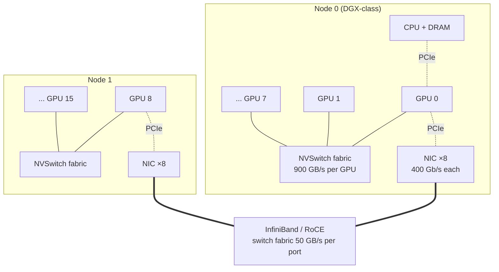
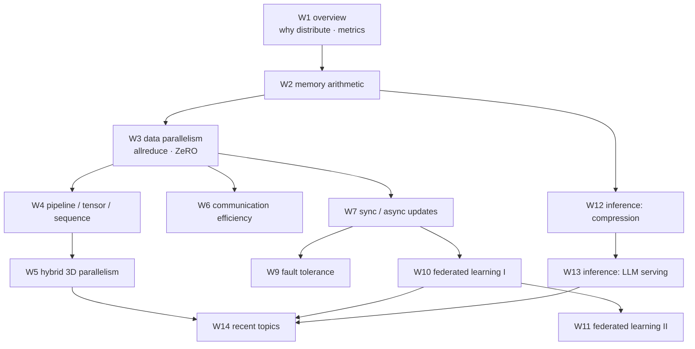

# Week 01 — Course Overview & Introduction: Why Distribute?

> 이 챕터는 하나의 질문에서 출발한다: 왜 학습과 추론을 여러 device 에 분산해야 하는가. 답을 만들기 위해 먼저 모델·데이터·compute 의 지수적 성장과, 그것을 따라가지 못하는 단일 device 의 memory·bandwidth 성장 사이의 격차 — 이른바 memory wall — 를 수치로 확인한다. 다음으로, 그 성장이 왜 멈추지 않는지를 scaling laws 의 논리로 설명한다. 그리고 분산이 실제로 벌어지는 무대인 하드웨어 계층 — HBM, NVLink, InfiniBand — 의 수치 감각을 만들고, 병렬화가 어디까지 통하는지를 알려주는 한계 이론 — Amdahl's law 와 communication-to-computation ratio — 를 유도하며, 잘하고 있는지를 재는 성능 지표 — throughput 과 MFU — 를 정의한다. 마지막에 이 모든 것을 모아, 이후 13개 주차가 놓이는 하나의 문제 지도를 그린다.

## Learning goals

이 챕터를 마치면 다음을 할 수 있어야 한다. 각 항목은 전부 시험 가능한 형태로 썼다.

1. Transformer 모델 크기가 2년마다 410배, 학습 compute 가 2년마다 750배 성장하는 동안 하드웨어 peak FLOPS 는 2년마다 3.0배, DRAM bandwidth 는 1.6배, interconnect bandwidth 는 1.4배 성장에 그쳤다는 사실로부터 **memory wall** 을 설명하고, 분산이 선택이 아니라 필연인 이유를 정량적으로 논증할 수 있다.
2. Dense transformer 의 학습 비용 근사 $C \approx 6ND$ 를 단계별로 유도하고, GPT-3 나 Llama 3 같은 실제 모델에 대해 총 FLOPs, 소요 시간, 필요한 GPU 수를 손으로 계산할 수 있다.
3. **Kaplan scaling laws** 의 power-law 형태와 **Chinchilla** 의 compute-optimal 결론 — $N$ 과 $D$ 를 같은 비율로 키워라, 경험 법칙으로 약 20 tokens/param — 을 비교하고, 주어진 compute 예산에 대해 optimal $(N, D)$ 를 계산할 수 있다.
4. GPU **memory hierarchy** — registers, SMEM, L2, HBM — 와 **interconnect hierarchy** — NVLink, PCIe, InfiniBand/Ethernet — 의 대역폭을 자릿수 수준에서 나열하고, 이 계층 구조가 병렬화 전략의 배치 (W5) 를 결정하는 이유를 설명할 수 있다.
5. **Amdahl's law** 와 **Gustafson's law** 를 유도하고, strong scaling 과 weak scaling 을 구분하며, data parallelism 의 **communication-to-computation ratio** 가 모델 크기와 무관하고 per-device 작업량에 반비례한다는 사실을 유도할 수 있다.
6. **Throughput, MFU, HFU, scaling efficiency** 를 정의하고 계산하며, Llama 3 의 38–43% MFU 같은 실측치에서 역으로 학습 시간을 추정할 수 있다.
7. 이 과목의 각 주차가 푸는 문제를 한 문장으로 말하고, 주차 간 의존 관계를 지도 위에 놓을 수 있다.

## Why this matters

백엔드 시스템을 스케일해 본 경험이 있다면, "분산" 이라는 단어에서 떠오르는 그림이 있을 것이다. stateless 서버를 여러 대 복제하고 앞에 로드밸런서를 두는 그림 말이다. 그 세계에서 인스턴스들은 서로 거의 대화하지 않는다. 요청 하나가 어느 서버로 가든 결과는 같고, 서버끼리 합의할 것도 없다.

분산 학습은 정반대의 문제다. **모든 worker 가 매 스텝 — 대략 수백 ms 마다 — 수십억 개의 float 값에 대해 완전히 합의해야 한다.** worker 들이 각자 계산한 gradient 를 모두 모아 정확히 같은 값으로 맞추지 않으면, 다음 스텝부터 각자 다른 모델을 갖게 되어 학습 자체가 무너진다. 즉 분산 학습은 "embarrassingly parallel" 한 문제가 아니라, 통신이 문제의 본질에 박혀 있는 tightly-coupled 분산 시스템이다.

이 과목 전체는 결국 두 질문의 변주다.

- **학습**: 하나의 optimization 문제를 수천 개 device 로 쪼갤 때, *수학적 등가성* — 또는 통제된 근사 — 를 유지하면서 *통신·메모리·장애* 비용을 어떻게 감당하는가? 이것이 W2 부터 W11 까지의 질문이다.
- **추론**: 학습된 모델을 서빙할 때, *latency·throughput·메모리* 라는 전혀 다른 병목을 어떻게 푸는가? 이것이 W12 와 W13 의 질문이다.

이번 주의 역할은 이 두 질문이 **왜 생겨났는지**를 스케일 성장과 하드웨어 한계의 충돌로 보여주고, 이후 주차들이 **어떤 좌표 위에 놓이는지** — 병렬화의 축, 통신 계층, 성능 지표 — 를 미리 까는 것이다. 여기서 만드는 수치 감각, 예컨대 "HBM 은 3 TB/s 인데 네트워크는 50 GB/s 다" 라든가 "MFU 40% 면 잘한 것이다" 같은 감각은, 이후 모든 주차에서 트레이드오프를 판단할 때 그대로 쓰인다.

## 0. Notation

본론에 들어가기 전에 기호를 정리해 두자. 굳이 이런 표가 필요한 이유가 있다. 이 챕터는 scaling laws 문헌의 표기 관례를 따르는데, W2 이후의 시스템 주차들은 다른 관례를 쓰기 때문에 **같은 기호가 다른 뜻으로 재등장한다**. 지금 한 번 충돌 지점을 봐 두면 나중에 헷갈리지 않는다.

| 기호 | 이 챕터 (scaling laws 관례) | W2 이후 (systems 관례) |
|---|---|---|
| $N$ | 모델 파라미터 수 | 메시지 크기 (bytes) — 파라미터 수는 $\Psi$ (ZeRO 표기) |
| $D$ | 학습 토큰 수 | — |
| $C$ | 총 학습 compute (FLOPs) | — |
| $p$ | device (worker) 수 | 동일 |
| $B$, $b$ | global / per-device batch size | 동일 ([W3](../03-data-parallelism/) §1) |
| $\beta$ | byte 당 전송 시간 (= 1/bandwidth) | 동일 (W3 의 $\alpha$–$\beta$ cost model) |

한 가지 주의할 충돌이 이 챕터 안에도 있다. §2.2 에서 Chinchilla 의 loss fit 을 다룰 때 $\alpha = 0.34$, $\beta = 0.28$ 이라는 기호가 나오는데, 이것은 loss 곡선의 exponent 일 뿐이다. 위 표의 통신 비용 $\beta$, 그리고 W3 에서 만날 latency 항 $\alpha$ 와는 이름만 같은 별개의 기호다.

---

## 1. The scale problem — 성장 곡선과 단일 device 의 한계

### 1.1 두 개의 지수, 하나의 격차

먼저 "얼마나 커졌는가" 를 실측 데이터로 확인하자. Gholami et al. 2024 가 정리한 수치는 수요와 공급 두 축으로 나뉜다.

**수요 측**을 보자. Transformer 가 등장한 2017년 무렵부터, SOTA transformer 의 파라미터 수는 **2년마다 410배** 성장했고, 학습에 필요한 compute 는 **2년마다 750배** 성장했다. 이것은 우리가 흔히 아는 지수 성장 중에서도 극단적으로 가파른 축에 속한다.

**공급 측**은 어떤가. 지난 20년간 하드웨어 peak FLOPS 는 **2년마다 3.0배** 성장했다. 나쁘지 않아 보이지만, 문제는 나머지 자원들이다. DRAM — GPU 에서는 HBM — 의 bandwidth 는 **2년마다 1.6배**, device 를 잇는 interconnect 의 bandwidth 는 **1.4배**, 그리고 단일 GPU 의 메모리 용량은 **2배** 성장에 그쳤다.

여기서 멈추고 두 곡선을 겹쳐 보자. 양쪽 모두 지수적이다. 그러나 지수의 크기가 두 자릿수 차이난다 — 750배 대 3배. 지수끼리의 격차는 시간이 지날수록 기하급수적으로 벌어지므로, 이 격차는 일시적 불편이 아니라 구조적 붕괴다. 이 붕괴가 만드는 네 가지 결론이 곧 이 과목의 존재 이유다.

1. **모델이 한 device 에 들어가지 않는다.** 이것을 capacity wall 이라 부르자. 들어가지 않으면 모델 자체를 쪼개는 수밖에 없고, 그 방법이 W4 의 pipeline/tensor parallelism 과 ZeRO 다.
2. **모델이 들어가더라도 한 device 로는 너무 느리다.** 이것이 compute wall 이다. 시간을 줄이려면 데이터를 쪼개 여러 device 가 나눠 처리해야 하고, 그 방법이 W3 의 data parallelism 이다.
3. **쪼개는 순간 통신이 병목이 된다.** 위 수치에서 가장 느리게 성장하는 자원이 interconnect (2년마다 1.4배) 였다는 점을 기억하자. 가장 느리게 성장하는 자원이 결국 병목이 되므로, 시간이 갈수록 분산 학습의 병목은 계산에서 **통신**으로 이동한다. 통신을 줄이는 기법이 W6 의 주제이고, 통신을 어디에 배치할지가 W5 의 주제다.
4. **단일 device 안에서도 같은 일이 벌어진다.** FLOPS 는 2년마다 3.0배 성장하는데 그 연산기에 데이터를 공급하는 bandwidth 는 1.6배밖에 성장하지 않으므로, device 내부의 병목도 연산에서 **메모리 이동**으로 이동한다. 이것이 §3 에서 정식화할 memory wall 이고, W13 에서 다룰 inference 병목의 뿌리다.

### 1.2 Transformer 학습 비용 산수: $C \approx 6ND$

격차를 논증하려면 "이 모델을 학습하는 데 FLOPs 가 얼마나 드는가" 를 계산할 수 있어야 한다. 다행히 dense transformer 에는 놀랍도록 단순한 표준 근사가 있다. 파라미터 $N$ 개짜리 모델로 토큰 $D$ 개를 한 번 학습하는 비용은:

$$C \approx 6ND \ \text{FLOPs}$$

이 식은 Kaplan et al. 2020 에서 나왔다. 원 논문의 표기는 $C \approx 6NBS$ 인데, batch size $B$ 와 step 수 $S$ 의 곱 $BS$ 가 곧 총 토큰 수이므로 같은 식이다.

이 $6ND$ 가 어디서 오는지 유도해 보자. 전략은 "파라미터 하나가 토큰 하나를 처리할 때 몇 FLOPs 를 쓰는가" 를 세는 것이다.

**Forward 부터 보자.** dense layer 의 연산은 행렬곱이고, 행렬곱에서 각 weight 는 토큰당 정확히 한 번의 multiply-accumulate 에 참여한다 — 입력 activation 하나와 곱해지고, 그 결과가 accumulator 에 더해진다. 곱셈 하나와 덧셈 하나이므로 weight 당 2 FLOPs 다. 이 그림을 머릿속에 그려 두면, 모델 전체의 forward 비용이 토큰당 $2N$ FLOPs 라는 것이 자명해진다. weight 가 $N$ 개이고 각각 2 FLOPs 씩 쓰기 때문이다.

**다음은 backward 다.** backward 에서 각 layer 는 두 개의 서로 다른 gradient 를 계산해야 한다. 하나는 그 layer 의 입력 activation 에 대한 gradient 인데, 이것이 있어야 backward 진행 방향의 다음 layer 로 gradient 를 전파할 수 있다. 다른 하나는 weight 에 대한 gradient 인데, 이것이 있어야 optimizer 가 weight 를 갱신할 수 있다. 핵심 관찰은 이 두 계산이 각각 forward 와 **같은 크기의 행렬곱**이라는 사실이다. 따라서 backward 는 forward 크기의 행렬곱을 두 번 수행하고, 비용은 $2 \times 2N = 4N$ FLOPs/token 이 된다.

여기서 얻은 부산물 하나를 따로 적어 두자: **backward 는 forward 의 2배다.** 이 비율은 이번 주 lab 에서 `torch.profiler` 로 직접 실측하고, W4 의 pipeline 스케줄 설계에서도 반복해서 등장한다.

이제 합치면 토큰당 $2N + 4N = 6N$ FLOPs 이고, 토큰이 $D$ 개이므로 총 비용이 $6ND$ 다. 한 가지 빠뜨린 것이 있지 않은가 — attention 은? attention 에는 sequence 길이 $s$ 에 대해 $O(s^2)$ 로 커지는 항이 있다. 하지만 sequence 가 hidden dimension 대비 아주 길지 않은 한 이 항은 소항이라 근사에서 무시해도 좋다. 이 항까지 넣은 정밀 계산은 W13 에서 한다.

마지막으로 단위 감각 하나. scaling laws 문헌은 compute 를 **PF-day** 로 재곤 한다. 1 PF-day 란 $10^{15}$ FLOP/s 짜리 기계를 하루 종일 돌린 양, 즉 $10^{15} \times 86{,}400 = 8.64 \times 10^{19}$ FLOPs 다. Kaplan 논문이 쓰는 단위다.

### 1.3 Worked Example 1 — GPT-3 를 GPU 한 장으로 학습한다면

방금 만든 도구로 실험을 하나 해 보자. GPT-3 는 $N = 175$B 파라미터를 $D = 300$B tokens 로 학습한 모델이다 (Brown et al. 2020). 만약 이것을 GPU **한 장**으로 학습하려 하면 무슨 일이 벌어질까?

**먼저 compute wall 을 계산해 보자.** 총 비용은:

$$C \approx 6 \times (1.75 \times 10^{11}) \times (3 \times 10^{11}) = 3.15 \times 10^{23} \ \text{FLOPs}$$

논문이 보고한 값은 $3.14 \times 10^{23}$ FLOPs 다. 우리의 근사가 실전 수치와 0.3% 이내로 일치한다 — $6ND$ 가 뒷면 계산 도구로 충분히 믿을 만하다는 증거다.

이제 시간으로 바꿔 보자. A100 한 장의 BF16 peak 성능은 312 TFLOPS 다. 다만 peak 를 그대로 쓰면 안 된다 — 실제로는 peak 의 일부만 뽑아낼 수 있는데, §6 에서 보겠지만 현실적인 utilization 은 40% 수준이다. 그러면 실효 성능은 $1.25 \times 10^{14}$ FLOP/s 이고:

$$T = \frac{3.15 \times 10^{23}}{1.25 \times 10^{14}} \approx 2.5 \times 10^{9} \ \text{s} \approx 80 \ \text{years}$$

80년. 한 장으로는 불가능하다는 뜻이다. GPU 를 1,024 장으로 늘리고 같은 utilization 이 유지된다고 가정하면 **약 28.5일**로 내려온다. GPT-3 급 모델부터 수천 GPU 가 기본 단위가 된 이유가 이 산수 하나에 들어 있다.

**그런데 시간 문제 이전에 더 근본적인 문제가 있다 — capacity wall 이다.** 계산을 시작하기도 전에, 모델을 메모리에 올릴 수가 없다.

- fp16 weights 만 세어 보자. 파라미터당 2 bytes 이므로 $175 \times 10^9 \times 2$ bytes $= 350$ GB 다. A100 의 메모리는 80 GB 이므로 weights 만으로 이미 4.4배를 초과한다. **forward 한 번도 돌릴 수 없다.**
- 학습에는 weights 만 필요한 것이 아니다. fp16 weights 에 gradients 와 Adam 의 optimizer states 까지 더하면 파라미터당 16 bytes 가 필요하다. 이 회계의 유도는 [W2](../02-memory-issues/) 에서 하고, 여기서는 결과만 쓰자: $175 \times 16 = 2.8$ TB. 학습 상태를 저장하는 것만으로 **A100-80GB 가 35장** 필요하다. 그리고 activations 는 여기에 별도로 얹힌다.

이 두 wall 의 성격 차이를 음미할 가치가 있다. compute wall 은 "GPU 를 더 사면" 풀리는 문제다 — 돈의 문제다. 반면 capacity wall 은 GPU 를 아무리 사도 **모델과 상태를 쪼개는 알고리즘** — ZeRO, tensor/pipeline parallelism — 없이는 풀리지 않는다. 낱장 GPU 들의 80 GB 메모리는 알고리즘 없이는 합쳐지지 않기 때문이다. 이 구분이 그대로 과목의 분기점이 된다: 데이터를 쪼개는 것이 W3, 모델을 쪼개는 것이 W4 다.

---

## 2. Scaling laws — 왜 계속 키우는가

§1 에서 우리는 모델 성장이 하드웨어 성장을 압도적으로 초과한다는 것을 봤다. 그렇다면 자연스러운 질문이 나온다. 이렇게까지 비싼데 왜 멈추지 않는가? 답은 의외로 단순하다. **키우면 좋아진다는 것이 넓은 범위에서 정량적으로 예측 가능**하기 때문이다. 이 예측 가능성을 준 것이 scaling laws 다.

### 2.1 Kaplan et al. 2020: power laws

Kaplan et al. 2020 이 발견한 것은 이렇다. Cross-entropy loss 는 model size $N$, dataset size $D$, training compute $C$ 각각에 대해 — 다른 두 자원이 병목이 아닐 때 — **power law** 를 따른다. 이 법칙이 성립하는 범위가 놀랍도록 넓다는 것이 발견의 핵심이다: compute 축으로는 7 자릿수 이상의 범위에서 성립하고, $D$ 축으로는 약 3 자릿수 범위에서 성립한다.

$$L(N) = \left(\frac{N_c}{N}\right)^{\alpha_N}, \quad L(D) = \left(\frac{D_c}{D}\right)^{\alpha_D}, \quad L(C_{\min}) = \left(\frac{C_c}{C_{\min}}\right)^{\alpha_C}$$

$$\alpha_N \approx 0.076, \qquad \alpha_D \approx 0.095, \qquad \alpha_C \approx 0.050$$

이 식이 말하는 것을 일상 언어로 풀어 보자. exponent 가 저렇게 작다는 것은, loss 를 상수 배 줄이려면 자원을 **지수적으로** 부어야 한다는 뜻이다. 구체적으로 계산해 보면: loss 를 절반으로 줄이고 싶으면 compute 를 $2^{1/0.050} \approx 10^6$ 배 늘려야 한다. 백만 배다. 터무니없어 보이지만, 거꾸로 읽으면 "얼마를 부으면 얼마나 좋아지는지 미리 안다" 는 뜻이기도 하다. 예측 가능한 수익이 있는 곳에 투자가 몰리는 것은 자연스럽고, 이것이 §1.1 에서 본 2년마다 750배라는 수요 곡선의 정체다.

Kaplan 논문은 한 걸음 더 나가 배분 문제에 답했다. compute 예산 $C$ 가 고정되어 있을 때 그 돈을 모델 크기와 학습량에 어떻게 나눠야 하는가? Kaplan 의 fitting 결과는 $N \propto C^{0.73}$, 학습 스텝 수는 $S \propto C^{0.03}$ 이었다. 말로 옮기면: **"예산이 늘면 거의 전부를 모델 크기에 써라. 큰 모델을 적은 데이터로 학습하고, 수렴하기 전에 멈춰라."** 실제로 GPT-3 는 175B 파라미터를 300B tokens 로만 학습했다 — 파라미터당 약 1.7 tokens 다. GPT-3 는 이 처방의 산물이다.

### 2.2 Hoffmann et al. 2022 (Chinchilla): compute-optimal 재조정

그런데 2년 뒤, DeepMind 가 이 처방을 뒤집었다. Hoffmann et al. 2022 는 400개 이상의 모델을 실제로 학습해서 loss 를 다시 fitting 했고, 다음 형태를 얻었다:

$$L(N, D) = E + \frac{A}{N^{\alpha}} + \frac{B}{D^{\beta}}, \qquad E = 1.69,\ A = 406.4,\ B = 410.7,\ \alpha = 0.34,\ \beta = 0.28$$

이 식의 세 항은 각각 의미가 있다. $E$ 는 자연어 자체의 irreducible entropy — 어떤 모델로도 줄일 수 없는 언어의 본질적 불확실성이다. $A/N^{\alpha}$ 항은 **모델 용량이 부족해서** 내는 페널티이고, $B/D^{\beta}$ 항은 **데이터가 부족해서** 내는 페널티다. loss 를 줄이려면 두 페널티를 함께 줄여야 한다는 구조가 식 안에 들어 있다.

이제 §1.2 의 비용 모델을 제약으로 걸자. 예산 $C = 6ND$ 가 고정일 때 위 $L$ 을 최소화하면:

$$N_{opt} \propto C^{a}, \quad D_{opt} \propto C^{b}, \qquad a \approx b \approx 0.5$$

결론을 말로 옮기면: **모델과 데이터를 같은 비율로 키워라.** 모델을 2배 키우면 토큰도 2배 늘려라. 경험 법칙으로는 $D_{opt}/N_{opt} \approx 20$ tokens/param 이다. 파라미터당 20 tokens — Kaplan 의 1.7 tokens 와 비교하면 한 자릿수 이상 차이다.

이것은 Kaplan 의 $N \propto C^{0.73}$ 과 정면으로 충돌하는 결론이다. 왜 갈렸을까? Hoffmann §3 은 원인을 방법론 차이로 분석한다 — Kaplan 의 학습 스케줄 처리·소규모 fitting 등 방법론상 선택이 추정을 편향시켰다는 것이다. 그리고 Chinchilla 의 검증 방법이 인상적이다. 이론으로만 주장한 것이 아니라 실물로 보였다: Gopher 가 쓴 것과 같은 compute 예산으로, 280B 파라미터에 300B tokens 인 Gopher 대신 **70B 파라미터에 1.4T tokens 인 Chinchilla** 를 학습했더니 모든 벤치마크에서 우월했다. MMLU 는 67.5% 로 Gopher 대비 7%p 높았다. 같은 돈으로 4배 작은 모델이 이긴 것이다.

이 결과가 함의하는 바를 한 문장으로 쓰면: 당시의 대형 모델들 — GPT-3, MT-NLG 530B — 은 전부 **심각한 undertrained** 상태였다. 모델은 컸지만 그 크기를 정당화할 만큼 데이터를 먹지 못했다.

### 2.3 Worked Example 2 — $C = 5.76 \times 10^{23}$ FLOPs 배분하기

Chinchilla 처방을 직접 손으로 굴려 보자. 예산은 Gopher 와 Chinchilla 가 실제로 쓴 $C = 5.76 \times 10^{23}$ FLOPs 다.

처방은 $D = 20N$ 이고 제약은 $C = 6ND$ 다. 두 식을 연립하면 $D$ 가 소거된다:

$$C = 6N \cdot 20N = 120N^2 \implies N_{opt} = \sqrt{\frac{C}{120}} = \sqrt{\frac{5.76 \times 10^{23}}{120}} \approx 6.9 \times 10^{10} \approx 70\text{B}$$

$$D_{opt} = 20 N_{opt} \approx 1.4 \times 10^{12} = 1.4\text{T tokens}$$

70B 파라미터에 1.4T tokens — Chinchilla 의 실제 구성이 두 줄 계산에서 그대로 나온다. 비교를 위해, 같은 예산으로 Kaplan 처방 $N \propto C^{0.73}$ 을 따랐다면 $N$ 은 수백 B 로, $D$ 는 수백 B tokens 로 기울었을 것이다. 그리고 그것이 바로 Gopher 였다 — 280B 파라미터, 300B tokens, 파라미터당 1.1 tokens.

여기서 이 과목다운 질문을 하나 던지자. **이 순수 ML 결과가 분산 시스템에는 무슨 의미인가?** Chinchilla 는 "더 큰 모델" 경쟁을 "더 많은 토큰" 경쟁으로 바꿨다. tokens/param 은 약 1 에서 20 으로 뛰었고, 같은 예산에서 처리해야 할 토큰 수는 Gopher 대비 약 5배 — 300B 에서 1.4T 로 — 늘었다. 토큰 수가 늘면, global batch 크기가 고정일 때 optimizer step 수가 같은 비율로 늘어난다. 그리고 data parallelism 에서는 매 step 마다 allreduce 를 한 번씩 해야 하므로, **allreduce 횟수가 5배 늘어난다**. 여기서 allreduce 란 모든 device 의 gradient 를 element-wise 로 합산해서 전원이 같은 결과를 갖게 만드는 collective 통신 연산이다 — 정의와 유도는 W3 에서 제대로 한다. allreduce 가 늘어나는 만큼 통신 효율 (W6) 이 중요해지고, 학습이 길어지는 만큼 장애에 노출되는 시간 (W9) 도 늘어난다. 요컨대 scaling law 는 순수 ML 결과지만, 그 처방이 시스템 워크로드의 모양을 결정한다.

### 2.4 Post-Chinchilla: inference 비용까지 넣으면

Chinchilla-optimal 에는 조용한 전제가 하나 숨어 있다. 그것이 최소화하는 것은 **학습 비용뿐**이라는 점이다. 그런데 모델의 삶은 학습에서 끝나지 않는다 — 학습된 모델은 이후 수억 번 서빙된다. 그리고 추론 비용은 매 호출마다 모델 전체를 돌려야 하므로 $N$ 에 비례한다.

그렇다면 총비용 관점에서는 다른 답이 나올 수 있다. **작은 모델을 Chinchilla-optimal 보다 훨씬 오래 학습**하면, 학습 비용은 optimal 보다 더 들지만 서빙되는 모든 호출에서 비용을 아낀다. 호출이 충분히 많으면 이쪽이 이득이다.

이 관점을 명시적으로 채택한 것이 LLaMA (Touvron et al. 2023) 다 — 7B 모델을 1T tokens 로 학습했다. Llama 3 는 더 극단으로 갔다: 8B 모델을 **15T+ tokens** 로 학습했는데, 파라미터당 약 1,900 tokens 로 Chinchilla 처방의 약 95배다. 이런 "over-training" 은 낭비가 아니라 **train-once, serve-forever 경제학**의 산물이다.

이 관점은 이 과목의 뒷부분과도 연결된다. 추론 비용을 낮추는 모든 기법 — quantization, serving 최적화 — 은 이 트레이드오프의 기울기를 바꾼다. 추론이 싸지면 optimal 지점이 이동한다. W12–13 이 inference optimization 을 독립된 주제로 다루는 이유가 여기에도 있다.

---

## 3. The memory wall

### 3.1 FLOPS 는 빨라지는데 데이터가 못 따라온다

§1.1 의 공급 측 수치를 다시 꺼내 보자. peak FLOPS 는 2년마다 3.0배, DRAM bandwidth 는 1.6배, interconnect 는 1.4배. 이번에는 이 세 숫자를 서로 비교하는 것이 목적이다.

연산기의 속도는 "데이터를 소비하는 속도" 이고, bandwidth 는 "데이터를 공급하는 속도" 다. 소비 속도가 공급 속도보다 빨리 성장하면 무슨 일이 벌어지는가? 시간이 지날수록 **연산기는 데이터가 도착하기를 기다리며 논다**. 아무리 빠른 연산기도 피연산자가 없으면 일을 못 하기 때문이다. 이것이 memory wall 이다 (Gholami et al. 2024).

용량 축에서도 같은 구조가 반복된다. GPU 메모리 용량은 2년마다 2배 성장하는데 모델은 410배 성장한다. 단일 device 의 용량으로 모델을 추격하는 것은 구조적으로 불가능하다.

### 3.2 Arithmetic intensity 와 roofline

"병목이 연산인가 메모리인가" 는 이 과목에서 수없이 던질 질문이므로, 판정하는 표준 도구를 지금 갖춰 두자.

어떤 커널이 총 $W$ FLOPs 의 연산을 수행하면서 메모리와 총 $Q$ bytes 를 주고받는다고 하자. 이 둘의 비율을 **arithmetic intensity** 라 부른다:

$$I = \frac{W}{Q} \ \text{[FLOPs/byte]}$$

직관적으로 $I$ 는 "메모리에서 가져온 byte 하나로 몇 번의 연산을 하는가" — 즉 데이터 재사용의 정도다. $I$ 가 크면 한 번 가져온 데이터를 오래 우려먹는 커널이고, $I$ 가 작으면 계속 새 데이터를 가져와야 하는 커널이다.

하드웨어 쪽에는 두 개의 상한이 있다. peak compute $\pi$ [FLOP/s] 와 memory bandwidth $b_{mem}$ [B/s] 다. 커널이 달성할 수 있는 성능은 이 둘 중 먼저 걸리는 쪽에 막힌다 (Williams et al. 2009 의 roofline model):

$$P_{attain} = \min(\pi,\ I \times b_{mem})$$

이 식을 읽어 보자. $I \times b_{mem}$ 은 "bandwidth 가 공급할 수 있는 데이터로 할 수 있는 최대 연산 속도" 다. 이것이 $\pi$ 보다 작으면 연산기는 놀고 메모리가 병목이다. 두 영역의 경계가 되는 intensity 를 **machine balance** 라 부른다: $I^* = \pi / b_{mem}$.

- $I < I^*$ 이면 **memory-bound** 다. 이 영역에서는 FLOPS 를 아무리 올려도 소용없다. 성능을 올리는 유일한 길은 데이터 이동을 줄이는 것이다.
- $I > I^*$ 이면 **compute-bound** 다. bandwidth 에는 여유가 있고, FLOPS 가 병목이다.

실제 수치를 넣어 감각을 만들자. BF16 dense 기준으로 A100 은 $I^* = 312\text{e}12 / 2.0\text{e}12 \approx 156$ FLOPs/byte 이고, H100 은 $989\text{e}12 / 3.35\text{e}12 \approx 295$ FLOPs/byte 다. 두 수를 비교하면 중요한 추세가 보인다: **세대가 지날수록 $I^*$ 가 올라간다.** $I^*$ 가 올라간다는 것은 memory-bound 로 분류되는 커널의 영역이 넓어진다는 뜻이다 — §3.1 의 memory wall 을 roofline 언어로 다시 말한 것이다.

미리보기 하나로 이 절을 닫자. 큰 행렬곱은 $I$ 가 수백 이상이라 compute-bound 다. 반면 LLM 이 토큰을 하나씩 생성하는 **decode 단계는 $I \approx 1$–$2$ 수준으로, 극단적인 memory-bound** 다. W13 에서 다룰 KV cache, FlashAttention, batching 은 전부 이 한 줄의 사실에서 출발하는 기법들이다.

---

## 4. Hardware 기초 — 클러스터 해부

§3 까지는 "왜 쪼개야 하는가" 였다. 이제 쪼갠 조각들이 실제로 놓일 무대를 보자. 분산 학습의 비용 모델은 결국 "어떤 링크로 몇 byte 를 보내는가" 로 귀결되므로, 계층별 bandwidth 수치를 자릿수 수준으로 외워 두면 이후 모든 주차의 계산이 빨라진다.

### 4.1 GPU memory hierarchy

먼저 GPU 한 장의 내부다. A100 (SXM, 80 GB) 기준으로, FlashAttention 논문과 NVIDIA 자료의 수치를 정리하면:

| 계층 | 용량 | Bandwidth | 비고 |
|---|---|---|---|
| Registers | 256 KB/SM × 108 SMs | — | 커널 내 스칼라·조각 |
| L1 / Shared memory (SRAM) | 192 KB/SM (합산 ~20 MB) | **~19 TB/s** (aggregate) | 프로그래머 제어 가능 (tiling) |
| L2 cache | 40 MB | HBM 의 수 배 | 전 SM 공유 |
| **HBM2e** | **80 GB** | **~2.0 TB/s** | "GPU memory" 라고 부르는 것 |
| Host DRAM (over PCIe) | TB급 | 32 GB/s (PCIe Gen4 ×16, 단방향) | offload 의 통로 (W5 ZeRO-Offload) |

우리가 흔히 "GPU 메모리" 라 부르는 것은 이 표의 HBM 이다. 그 위로는 작지만 빠른 계층이, 아래로는 크지만 느린 host DRAM 이 있다.

H100 (SXM) 세대의 수치도 적어 두자. HBM3 80 GB 에 bandwidth **3.35 TB/s**, L2 는 50 MB, SM 은 132개에 SM 당 256 KB — 이것은 L1 과 shared memory 를 합산한 값으로, A100 의 192 KB/SM 과 같은 기준이며, 그중 shared memory 로는 최대 228 KB 를 쓸 수 있다. BF16 dense 성능은 **989 TFLOPS** 다.

이 표에서 핵심 관찰이 두 가지 나온다.

1. **SRAM 은 HBM 보다 약 10배 빠르지만 약 4,000배 작다.** ~19 TB/s 대 ~2 TB/s, 그리고 ~20 MB 대 80 GB 를 비교해 보라. 이 극단적 비대칭 때문에, GPU 커널 최적화의 본질은 연산을 SRAM tile 안에 가둬서 HBM 왕복을 줄이는 것이 된다. W13 의 FlashAttention 이 정확히 이 게임이고, W2 의 activation 메모리 논의도 결국 "HBM 에 무엇을 남길 것인가" 의 문제다.
2. **80 GB 는 §1.3 에서 계산한 2.8 TB 앞에서 무력하다.** 계층의 어디를 봐도 대형 모델의 학습 상태가 들어갈 곳이 없다. 그래서 여러 GPU 의 HBM 을 "하나의 메모리 풀" 처럼 묶어 쓰는 기법 — ZeRO/FSDP, W3 — 이 나온다.

### 4.2 Interconnect hierarchy

이제 GPU 밖으로 나가 보자. 데이터가 GPU 를 떠나는 순간 만나는 링크들의 bandwidth 는 다음과 같다. 달리 표기하지 않으면 방향당 실효 기준이다.

| 링크 | Bandwidth | 스코프 | 용도 |
|---|---|---|---|
| NVLink 3 (A100) | 600 GB/s (양방향 합산; 방향당 300) | node 내 GPU↔GPU | tensor parallelism 트래픽 (W4) |
| NVLink 4 (H100) | 900 GB/s (양방향 합산; 방향당 450) | node 내 GPU↔GPU | 〃 |
| PCIe Gen4 ×16 | 32 GB/s (방향당) | GPU↔CPU/NIC | NVLink 없는 구성의 GPU 간 통신, host offload |
| PCIe Gen5 ×16 | 64 GB/s (방향당) | 〃 (H100 세대) | 〃 |
| InfiniBand HDR | 200 Gb/s = 25 GB/s /port | node 간 | 클러스터 fabric |
| InfiniBand NDR | 400 Gb/s = 50 GB/s /port | node 간 | 〃 (DGX H100: GPU 당 NIC 1개꼴, 8× ConnectX-7) |
| Ethernet (RoCE) 400 GbE | 50 GB/s /port | node 간 | IB 대안 — Llama 3 의 24K GPU 클러스터 중 하나가 RoCE 기반 |

표에서 스펙을 읽을 때 주의할 점: NVLink 의 600 GB/s, 900 GB/s 는 양방향을 합산한 수치라서 한 방향으로는 그 절반이다. 계산에 쓸 때는 방향당 값을 써야 한다.

이제 §4.1 의 GPU 내부 계층과 이 표를 하나의 서열로 이어 붙이자. 시험에도 단골로 나오는 자릿수 감각이다:

$$\underbrace{19{,}000}_{\text{SRAM}} \ \gg \ \underbrace{2{,}000\text{–}3{,}350}_{\text{HBM}} \ \gg \ \underbrace{300\text{–}450}_{\text{NVLink (방향당)}} \ \gg \ \underbrace{25\text{–}50}_{\text{network}} \ \approx \ \underbrace{32\text{–}64}_{\text{PCIe}} \quad \text{[GB/s]}$$

**SRAM 에서 network 까지 약 3 자릿수의 격차**가 있다. 데이터가 계층을 한 단계 내려갈 때마다 자릿수가 하나씩 깎인다고 기억해 두자.

그리고 bandwidth 축 위에 latency 축이 하나 더 겹친다는 것도 알아 두자. collective 통신 한 번을 시작하는 데는 μs 수준의 고정 비용이 붙는다. 메시지가 크면 이 고정 비용은 무시되지만, 메시지가 작으면 전송 시간보다 기동 비용이 커져서 bandwidth 가 아니라 latency 에 갇힌다. 이 구조는 W3 §3.3 의 $\alpha$–$\beta$ model 로 정식화한다.

### 4.3 클러스터 토폴로지와 locality 원칙

앞의 두 계층 — GPU 내부와 GPU 사이 — 을 실제 클러스터의 물리적 배치로 그리면 이렇다:

node 안의 GPU 들은 NVSwitch 로 빠르게 연결되어 있고, node 사이는 그보다 한 자릿수 느린 network fabric 으로 연결된다. 이 계층 구조가 하나의 설계 원칙을 강제한다: **통신량이 많고 빈번한 병렬화 축일수록 빠른 링크에 배치해야 한다.**

이 원칙이 W5 에서 배울 3D parallelism 배치 규칙의 근거 전부다. tensor parallelism 은 layer 마다 통신하므로 NVLink 안에 두고, pipeline parallelism 은 stage 경계에서 activation 만 넘기므로 node 간에 두며, data parallelism 은 step 당 gradient 한 번이므로 최외곽에 둔다. 규칙 자체의 유도는 W5 에서 하고, 지금은 구조만 기억하면 된다: **계층이 있기 때문에, 배치가 문제가 된다.**

---

## 5. 병렬화의 한계 이론

지금까지 우리는 "쪼개야 한다" 는 결론과 그것이 벌어질 무대를 봤다. 이제 냉정한 질문을 던질 차례다. device 를 $p$ 배 늘리면 $p$ 배 빨라지는가? 답은 "아니오" 인데, 중요한 것은 **얼마나** 아니오인지를 정량화하는 것이다. 도구 세 개를 차례로 만든다.

### 5.1 Amdahl's law — strong scaling 의 상한

전체 작업 중 병렬화 가능한 비율을 $f$, 병렬화가 불가능한 serial 비율을 $1-f$ 라 하자. 전체 작업 시간을 1 로 정규화하면, $p$ 개 device 를 쓸 때 병렬 부분은 $f/p$ 로 줄지만 serial 부분 $1-f$ 는 그대로 남는다. 따라서 speedup 은:

$$S(p) = \frac{1}{(1-f) + \dfrac{f}{p}} \ \xrightarrow{p \to \infty}\ \frac{1}{1-f}$$

극한을 눈여겨보자. $p$ 를 무한대로 보내도 speedup 은 $1/(1-f)$ 를 넘지 못한다. 병렬화가 아무리 완벽해도 serial 부분이 전체 시간의 바닥으로 남기 때문이다.

**Worked Example 3.** 이 상한이 얼마나 가혹한지 숫자로 확인해 보자. 한 학습 스텝에서 병렬화되지 않는 부분이 5% 라고 하자 — kernel launch, 동기화 지점, 계산 뒤에 숨기지 못한 통신, data loading 의 꼬리 같은 것들이 여기 들어간다. 그러면 $f = 0.95$ 이고:

$$S(64) = \frac{1}{0.05 + 0.95/64} \approx 15.4, \qquad S(1024) \approx 19.6, \qquad S(\infty) = 20$$

이 숫자들이 말하는 것을 음미하자. GPU 를 64장에서 1,024장으로 **16배** 늘렸는데, speedup 은 15.4 에서 19.6 으로 **1.27배**밖에 늘지 않았다. 단 5% 의 serial 비율이 전체 상한을 20배로 박아 버린 것이다. 분산 학습에서는 "겹치지 못한 통신" 이 사실상의 serial 항으로 작동하므로, 통신을 계산 뒤에 숨기는 computation–communication overlap (W3) 이 성능의 절반인 이유가 바로 이 식에 있다.

### 5.2 Gustafson's law — weak scaling 의 반론

Amdahl 의 그림이 너무 비관적이라고 느꼈다면, 그 직관에도 근거가 있다. Amdahl 은 **문제 크기가 고정**되어 있다고 가정한다 — 이것을 strong scaling 이라 부른다. 그런데 현실의 ML 은 그렇게 하지 않는다. device 가 늘면 문제를 같이 키운다 — 구체적으로는 batch 를 키운다.

문제를 키우는 관점에서 다시 계산해 보자. 고정된 시간 예산 안에서 $p$ 개 device 가 처리한 작업량을, 그 작업을 1개 device 로 했다면 걸렸을 시간으로 환산하면:

$$S_{scaled}(p) = (1-f) + f \cdot p$$

이번에는 serial 비율 $f$ 가 상수라도 speedup 이 $p$ 에 **선형으로** 는다. 상한이 사라진 것이다. 같은 시스템을 놓고 Amdahl 은 절망을, Gustafson 은 희망을 말하는 것처럼 보이지만, 사실 둘은 다른 질문에 답하고 있을 뿐이다. 두 regime 의 정의를 명확히 정리하자 (W3 §1.3 과 동일한 정의다):

- **Strong scaling**: 전체 문제 — global batch $B$ — 를 고정하고 $p$ 를 늘린다. 그러면 per-device 몫 $b = B/p$ 가 줄어든다. 이것이 Amdahl 의 regime 이다. $b$ 가 작아질수록 각 device 의 효율이 떨어지고, 전체 시간에서 통신이 차지하는 비중이 커진다.
- **Weak scaling**: per-device 몫 $b$ 를 고정하고 $p$ 를 늘린다. 그러면 전체 문제 $B = pb$ 가 커진다. 이것이 Gustafson 의 regime 이다. 시스템 효율은 유지된다. 하지만 공짜가 아니다 — **optimization 문제 자체가 변한다**. batch 를 키우는 것에는 통계적 대가가 있고, 어느 지점부터는 batch 를 키워도 수렴에 필요한 스텝이 줄지 않는다. 이 한계가 critical batch size 이고 W3 §5 에서 다룬다. 요컨대 weak scaling 의 진짜 한계는 시스템이 아니라 **통계**에 있다.

### 5.3 Communication-to-computation ratio — 분산 학습의 조임쇠

Amdahl 과 Gustafson 은 일반론이다. 이제 분산 학습에 특화된 세 번째 도구를 만들자. W3 에서 본격적으로 다룰 data parallelism 의 스텝당 비용을 미리 계산해 보는 것이다.

설정은 이렇다. 파라미터 $N$ 개의 dense 모델이 있고, 각 device 는 스텝마다 토큰 $b_{tok}$ 개를 처리하며, 실효 연산 성능은 $F$ [FLOP/s] 다. gradient 는 fp32 이므로 파라미터당 4 bytes 이고, ring-allreduce 의 통신량은 약 $2 \times 4N$ bytes 다 — 이 $2\times$ 의 유도는 W3 §3 에서 한다. 링크의 bandwidth 는 $1/\beta$ 다.

계산 시간과 통신 시간을 각각 쓰면:

$$T_{comp} = \frac{6 N b_{tok}}{F}, \qquad T_{comm} = 8 N \beta$$

계산 시간은 §1.2 의 토큰당 $6N$ FLOPs 에 토큰 수를 곱해 성능으로 나눈 것이고, 통신 시간은 보낼 byte 수에 byte 당 시간을 곱한 것이다. 이제 둘의 비율을 취하자:

$$R \equiv \frac{T_{comm}}{T_{comp}} = \frac{8 N \beta F}{6 N b_{tok}} = \frac{4}{3} \cdot \frac{F \beta}{b_{tok}}$$

이 식에서 가장 중요한 사건은 **$N$ 이 소거된다**는 것이다. 통신량과 계산량이 둘 다 $N$ 에 비례하기 때문에, 모델을 키워도 이 비율은 변하지 않는다. "모델이 커서 통신이 힘든" 것이 아니라는 뜻이다. 남는 인자는 딱 두 개다:

1. $F\beta$ — 하드웨어의 균형, 즉 연산이 통신보다 얼마나 빠른가. §1.1 에서 봤듯 FLOPS 는 bandwidth 보다 빨리 성장하므로, 이 인자는 **하드웨어 세대마다 악화**된다.
2. $b_{tok}$ — per-device 작업량. strong scaling 으로 $p$ 를 늘리면 $b_{tok}$ 이 줄고, 분모가 줄어드니 **$R$ 이 커진다**. §5.2 에서 "strong scaling 은 통신 비중을 키운다" 고 말로 했던 것의 정확한 메커니즘이 이 식 안에 있다.

**Worked Example 4.** 현실적인 숫자를 넣어 보자. H100 의 실효 성능을 $F = 400$ TFLOP/s 로 잡는다 — peak 989 의 약 40% 인데, 이 40% 가 어디서 오는지는 §6 에서 본다. node 간 링크는 NDR InfiniBand 로 GPU 당 50 GB/s, per-device 작업량은 8,192 tokens/step 이라 하자:

$$R = \frac{4}{3} \cdot \frac{4 \times 10^{14} / 5 \times 10^{10}}{8192} = \frac{4}{3} \cdot \frac{8000}{8192} \approx 1.3$$

$R > 1$ — **통신이 계산보다 오래 걸린다.** overlap 없이 순차로 실행하면 스텝 시간의 절반 이상이 통신이라는 뜻이다. 꽤 충격적인 결과인데, 처방들이 이미 마련되어 있고 각각이 한 주차씩이다. 보내는 gradient 를 bf16 이나 압축으로 줄일 수 있다 (W6). 통신을 계산 뒤에 숨길 수 있다 (W3 의 overlap). $b_{tok}$ 을 gradient accumulation 으로 키울 수 있다 (W3 — 단 critical batch size 라는 한계가 있다). 아니면 아예 매 스텝 동기화하지 않는 길도 있다 (W7 의 async, W14 의 DiLoCo).

---

## 6. 성능 지표 — 무엇을 재는가

§5 까지로 "얼마나 빨라질 수 있는가" 의 이론을 만들었다. 이제 실제 시스템이 "잘하고 있는가" 를 재는 지표를 정의하자. 지표가 여러 개인 이유는, 각 지표가 답할 수 있는 비교의 범위가 다르기 때문이다.

### 6.1 Throughput 과 step time

가장 소박한 지표는 **throughput** — 초당 처리한 샘플 또는 토큰 수다. global batch 크기를 스텝 시간으로 나누면 된다: $X = B / T_{step}$. 같은 모델을 같은 하드웨어에서 돌리는 두 구현을 비교할 때는 이것으로 충분하다. 하지만 모델이 다르거나 GPU 가 다르면 비교가 불가능하다 — 작은 모델은 당연히 토큰을 더 빨리 처리하기 때문이다.

throughput 을 개선하려면 스텝 시간이 어디에 쓰이는지부터 알아야 한다. **step time 은 다음처럼 분해된다**:

$$T_{step} = T_{data} + T_{fwd} + T_{bwd} + T_{opt} + T_{comm}^{(unoverlapped)}$$

차례로 data loading, forward, backward, optimizer step, 그리고 계산 뒤에 숨기지 못하고 남은 통신이다. 최적화는 항상 이 분해에서 시작한다 — 어느 항이 큰지 모르면 무엇을 고칠지도 모른다. 이번 주 lab 이 `torch.profiler` 로 바로 이 분해를 실측하고, §1.2 에서 유도한 backward ≈ 2× forward 를 확인한다.

### 6.2 MFU — 하드웨어를 얼마나 쓰고 있는가

모델과 하드웨어가 달라도 비교할 수 있는 지표가 필요하다. 그 답이 **Model FLOPs Utilization** 이다 (Chowdhery et al. 2022, PaLM):

$$\text{MFU} = \frac{X_{tokens/s} \times C_{token}}{p \times \pi_{peak}}, \qquad C_{token} \approx 6N$$

식을 읽어 보자. 분자는 "모델이 이론적으로 필요로 하는 FLOPs 를 소화한 속도" 다 — 초당 처리한 토큰 수에 토큰당 필수 FLOPs $6N$ 을 곱한 것이다. 분모는 클러스터 전체의 peak FLOPS 다. 따라서 MFU 는 "이론적 최대 성능 대비, 유용한 연산을 얼마나 뽑아냈는가" 의 비율이다.

여기서 규약 하나가 결정적이다. 분자는 **모델에 필수적인 연산만** 센다. 예컨대 activation recomputation (W2) 은 메모리를 아끼기 위해 같은 연산을 다시 하는 구현 기법인데, 이런 추가 연산은 분자에 넣지 않는다. 추가 연산까지 전부 세는 지표는 따로 있다 — **HFU** (Hardware FLOPs Utilization; Korthikanti et al. 2022) 다. 하드웨어가 실제 수행한 FLOPs 를 세므로 항상 HFU ≥ MFU 다. 이 구분이 왜 중요한가? recomputation 을 켜면 하드웨어는 더 바빠지므로 HFU 는 오르지만, 같은 토큰을 처리하는 데 연산을 더 썼으므로 MFU 는 내려갈 수 있다. **"바쁜 것" 과 "유용하게 바쁜 것" 은 다르다** — 이것이 MFU 가 표준 비교 지표인 이유이기도 하다. 모델·하드웨어·구현 트릭을 전부 정규화하기 때문이다.

수치 감각을 만들자. 먼저, **MFU 100% 는 불가능하다.** attention 에는 GEMM 이 아닌 연산들이 있고 — GEMM 이란 general matrix–matrix multiplication, 즉 transformer FLOPs 의 대부분을 차지하는 dense 행렬곱이다 — 통신, kernel launch, memory-bound 구간이 전부 peak 를 깎아 먹는다. 대규모 실측치를 보면: PaLM 540B 는 **46.2%**, Llama 3 405B 는 **38–43%** 를 기록했다 — 후자는 16,384 장의 H100 에서 GPU 당 BF16 380–430 TFLOP/s 를 달성한 수치다. 그러니 대략 **40% 안팎**이 "잘 튜닝된 대규모 학습" 의 기준선이라고 기억해 두면 된다.

**Worked Example 5 — MFU 로 학습 시간 역산.** MFU 의 위력은 공개된 숫자 몇 개만으로 학습 시간을 역산할 수 있다는 데 있다. Llama 3 405B 로 해 보자. 먼저 총 compute 를 계산하면 $C = 6 \times (4.05 \times 10^{11}) \times (1.56 \times 10^{13}) \approx 3.8 \times 10^{25}$ FLOPs 인데, 이것은 보고치와 일치한다. 이제 16,384 장의 H100 이 각각 989 TFLOPS peak 으로, MFU 40% 로 돌아간다고 하면:

$$T = \frac{3.8 \times 10^{25}}{16384 \times 9.89 \times 10^{14} \times 0.4} \approx 5.9 \times 10^{6} \ \text{s} \approx 68 \ \text{days}$$

실제 보고된 학습 기간과 자릿수가 일치한다. $C \approx 6ND$ 와 MFU 40% 라는 두 가지만 알면 어떤 공개 모델이든 이런 뒷면 계산이 된다.

이 68일이라는 숫자에서 한 가지 더 읽어 두자. 그 기간 동안 클러스터는 무결하지 않다. Llama 3 팀은 54일 구간에서 **466회의 job interruption** 을 보고했다 — 하루에 여덟 번 넘게 무언가가 죽었다는 뜻이다. 학습이 길어질수록 장애는 예외가 아니라 일상이 되고, 이것이 W9 fault tolerance 의 출발점이다.

### 6.3 Scaling efficiency

마지막 지표는 §5 의 이론과 직접 연결된다. $p$ 배의 자원을 넣어 몇 배의 성능을 얻었는가:

$$E_{strong}(p) = \frac{T(1)}{p \cdot T(p)}, \qquad E_{weak}(p) = \frac{X(p)}{p \cdot X(1)}$$

여기서 $T$ 는 고정된 문제를 끝내는 시간이고 $X$ 는 throughput 이다. 이상적으로 스케일되면 둘 다 1 이다.

이 지표를 볼 때 반드시 확인할 것이 있다. 논문의 "linear scaling" 그래프는 대부분 $E_{weak}$ 다. §5.2 에서 봤듯 weak scaling 이 시스템 관점에서 훨씬 쉬운 문제이기 때문에, weak 쪽 그래프가 훨씬 예쁘게 나온다. 그러니 scaling 그래프를 보면 항상 어떤 efficiency 인지부터 물어야 한다. 그리고 하나 더 — $E_{weak} \approx 1$ 로 완벽해 보여도, batch 가 커진 것의 통계적 대가, 즉 수렴에 필요한 스텝 수의 변화는 그 그래프 밖에 있다.

---

## 7. 과목 지도 — 하나의 문제 지도

이제 이 챕터에서 만든 부품들 — 왜 쪼개는가 (§1–3), 어디서 쪼개지는가 (§4), 얼마나 통하는가 (§5), 어떻게 재는가 (§6) — 을 모아 과목 전체의 지도를 그리자.

### 7.1 분류 체계: 무엇을 쪼개고, 무엇을 감수하는가

모든 분산 학습 기법은 "**무엇을 쪼개는가**" 라는 한 가지 질문으로 분류할 수 있다. 그리고 무엇을 쪼개기로 결정하는 순간, "**어떤 통신이 생기는가**" 가 자동으로 따라온다. 이 대응을 표로 정리하면:

| 축 | 쪼개는 것 | 각 device 가 갖는 것 | 발생하는 통신 | 주차 |
|---|---|---|---|---|
| **Data parallelism** | 학습 데이터 (batch) | 모델 전체 복제 | step 당 gradient allreduce | W3 |
| **Pipeline parallelism** | 모델을 layer 묶음으로 | 연속된 layer 블록 | stage 경계의 activation 전달 | W4 |
| **Tensor parallelism** | layer 내부의 행렬 | 행렬의 행/열 조각 | layer 마다 allreduce (고빈도) | W4 |
| **Sequence parallelism** | sequence 축 | 토큰 구간 | activation 재분배 | W4 |
| **Hybrid (3D)** | 위 축들의 조합 | — | 축별 통신을 링크 계층에 매핑 (§4.3) | W5 |

이 표의 오른쪽 통신 열이 생기는 순간, 직교하는 후속 질문들이 뒤따른다. 그 질문 하나하나가 나머지 주차들이다.

- 그 통신을 **줄일 수 있는가?** gradient 를 압축해서 보내도 수렴하는가를 묻는 것이 W6 이다 — sparsification, quantization, error feedback.
- 그 통신을 **늦출 수 있는가?** 정말 전원이 매 스텝 합의해야 하는가를 묻는 것이 W7 이다 — BSP/ASP/SSP, parameter server.
- 참여자가 **죽거나 거짓말하면?** 이것이 W9 다 — checkpointing, elastic training, Byzantine robustness.
- 데이터가 **아예 움직일 수 없다면?** 통신 제약의 극한이 W10–11 의 federated learning 이다 — W7 의 local update 관점의 연장선에 있다.
- 학습이 끝난 뒤는? 추론은 병목이 다르다 — §3.2 에서 봤듯 **decode 는 memory-bound** 다. 대응은 두 갈래다: 모델 자체를 줄이거나 (W12 의 quantization, pruning, distillation), 서빙 시스템을 바꾸거나 (W13 의 FlashAttention, PagedAttention, continuous batching).
- 그리고 최신 시스템들은 위 부품들의 재조합이다 (W14). DiLoCo 는 FedAvg 를 datacenter 에 가져온 것이고, MoE 는 expert 라는 새 축의 병렬화이며, disaggregated serving 도 이 조합의 산물이다.

이 전부를 관통하는 공용 어휘가 하나 있다: **W2 의 memory arithmetic** 이다. "파라미터당 16 bytes", "activation 은 batch 와 sequence 에 비례" 를 모르면 위의 어떤 트레이드오프도 계산할 수 없다. 그래서 W2 가 과목 전체의 온램프다.

### 7.2 주차 의존 지도

읽는 순서를 제안하면 (roadmap §4 와 동일하다): W2 → W3 이 척추다. W6 과 W7 은 W3 만 있으면 독립적으로 읽을 수 있다. W12–13 은 training 주차들과 거의 독립이라 먼저 읽어도 된다. 그리고 이 챕터 W1 의 역할은, 각 주차에 들어갔을 때 "지금 지도의 어느 좌표에 있는지" 를 잃지 않게 하는 것이다.

---

## Common misconceptions

1. **"GPU 를 $p$ 배 늘리면 $p$ 배 빨라진다"** — 세 겹으로 틀렸다. 첫째, serial 과 통신 비율이 Amdahl 상한을 박는다 — §5.1 에서 봤듯 serial 5% 만으로 상한이 20배다. 둘째, strong scaling 은 per-device 작업량을 줄이는데, §5.3 의 $R \propto 1/b_{tok}$ 에 따라 comm-to-comp ratio 가 커진다. 셋째, weak scaling 으로 도망가면 batch 증가의 통계적 대가가 청구된다 (W3 §5). 그러므로 "몇 배 빨라지는가" 라는 질문에는 항상 "어느 scaling 인가, 무엇이 병목인가" 부터 물어야 한다.
2. **"MFU = GPU utilization (`nvidia-smi` 의 %)"** — 전혀 다른 것이다. `nvidia-smi` 의 utilization 은 "해당 구간에 커널이 하나라도 돌고 있었는가" 를 재는 지표라서, memory-bound 커널이 대역폭을 기다리며 노는 시간도 100% 로 찍힌다. 반면 MFU 는 peak FLOPS 대비 **유용한 연산의 처리율**이다 (§6.2). utilization 100% 인데 MFU 15% 인 시스템이 흔하다.
3. **"MFU 와 HFU 는 같은 것"** — recomputation 이 있으면 갈라진다. HFU 는 하드웨어가 실제 수행한 FLOPs 를 재계산까지 포함해 세고, MFU 는 모델에 필수인 FLOPs 만 센다. 그래서 recomputation 을 켜면 HFU 는 오르고 MFU 는 내리는 일이 동시에 가능하다 (§6.2).
4. **"메모리가 부족한 것은 파라미터가 커서다"** — 파라미터는 시작일 뿐이다. 학습 시 model states 는 파라미터의 8배다 — fp16 Adam 기준 파라미터당 16 bytes 이고 유도는 W2 에서 한다. 여기에 activations 는 batch 와 sequence 에 비례해 그 이상일 수 있다. "70B 모델 = 140 GB" 로 끝내는 계산은 학습 메모리를 한 자릿수 이상 과소평가한다 (§1.3).
5. **"Kaplan 과 Chinchilla 중 하나는 폐기됐다"** — 둘 다 power-law 스케일링 자체에는 합의한다. 갈라진 것은 **compute 배분**이다 — $N \propto C^{0.73}$ 대 $C^{0.5}$. Chinchilla 가 70B 로 280B 를 이기는 실물 검증으로 승리했지만, 이야기는 거기서 끝나지 않는다. §2.4 의 inference-aware 관점은 다시 Chinchilla-optimal 에서도 벗어난다 — Llama 3 8B 는 파라미터당 약 1,900 tokens 를 먹었다. 결국 "optimal" 은 목적함수가 학습 비용만인지 총 소유 비용인지에 따라 움직인다.
6. **"Interconnect 스펙 수치 = 실제로 얻는 속도"** — 스펙표에는 함정이 셋 있다. 첫째, NVLink 의 600/900 GB/s 는 **양방향 합산**이라 한 방향으로는 절반이다. 둘째, 작은 메시지는 bandwidth 이전에 latency — $\alpha$ 항 — 에 갇힌다 (W3 §3.3). 셋째, collective 알고리즘의 실효 대역폭은 토폴로지와 메시지 크기에 따라 스펙의 수십 % 까지 떨어진다. 그래서 계산할 때는 항상 "방향당, 실효" 를 명시해야 한다.
7. **"추론은 학습의 쉬운 부분집합이다 (forward 만 하니까)"** — 병목의 종류가 다르다. 학습은 큰 batch 의 GEMM 으로 compute-bound 에 가깝게 만들 수 있다. 하지만 추론의 decode 는 토큰을 하나씩 생성하면서 매번 전체 weights 를 읽어야 하는 **memory-bound** 워크로드다 — §3.2 에서 봤듯 $I \approx 1$–$2$ 다. 그래서 추론 최적화 (W12–13) 의 본질은 FLOPs 감소가 아니라 **byte 이동 감소**다 — quantization 과 KV cache 관리가 그 수단이다.
8. **"Scaling law 는 ML 이론이지 시스템과 무관하다"** — 오히려 반대다. 시스템 워크로드의 모양을 결정하는 것이 scaling law 다. Chinchilla 는 같은 예산의 토큰 수를 — 따라서 고정 batch 기준 allreduce 횟수를 — 약 5배 늘렸고 (§2.3, 300B → 1.4T), over-training 은 학습 클러스터의 점유 기간을 늘려 fault tolerance (W9) 의 중요도를 올렸으며, inference-aware scaling 은 W12–13 의 존재 이유다.

## Glossary

- **memory wall** — the widening gap between compute throughput growth (3.0×/2yrs peak FLOPS) and data-movement growth (1.6×/2yrs DRAM, 1.4×/2yrs interconnect bandwidth), making data movement the dominant bottleneck.
- **scaling law** — an empirical power-law relation between model loss and model size, dataset size, or training compute, holding over many orders of magnitude.
- **compute-optimal training** — allocating a fixed compute budget $C \approx 6ND$ between parameters $N$ and tokens $D$ to minimize final loss; Chinchilla prescribes $N, D$ scaled equally (≈ 20 tokens/param).
- **$C \approx 6ND$** — approximate training cost of a dense transformer: 2 FLOPs/param/token forward plus 4 backward, times $D$ tokens.
- **HBM (high-bandwidth memory)** — stacked DRAM on the GPU package ("GPU memory"); ~2.0 TB/s on A100, ~3.35 TB/s on H100.
- **NVLink / NVSwitch** — NVIDIA's intra-node GPU-to-GPU interconnect (900 GB/s aggregate bidirectional per H100), an order of magnitude faster than the inter-node network.
- **InfiniBand / RoCE** — inter-node cluster fabrics; NDR InfiniBand and 400 GbE provide 400 Gb/s = 50 GB/s per port.
- **allreduce** — a collective communication operation that combines (element-wise sums or averages) a tensor across all participating devices and leaves every device holding the identical result; the primitive behind data-parallel gradient synchronization (W3).
- **GEMM (general matrix–matrix multiplication)** — the dense matrix-multiply primitive that accounts for most transformer FLOPs; large GEMMs are compute-bound, while non-GEMM ops (softmax, normalization) are memory-bound.
- **arithmetic intensity** — FLOPs performed per byte moved to/from memory ($I = W/Q$); compared against machine balance $\pi/b_{mem}$ to classify a kernel as compute- or memory-bound.
- **roofline model** — attainable performance $\min(\pi, I \cdot b_{mem})$: a bandwidth-sloped roof capped by peak compute.
- **Amdahl's law** — strong-scaling speedup bound $S(p) = 1/((1{-}f) + f/p) \le 1/(1{-}f)$ for parallel fraction $f$.
- **Gustafson's law** — scaled (weak-scaling) speedup $S(p) = (1{-}f) + fp$ when problem size grows with $p$.
- **strong / weak scaling** — fixed total problem with more workers (per-worker share shrinks) vs fixed per-worker problem (total grows with $p$).
- **communication-to-computation ratio** — $T_{comm}/T_{comp}$ per step; for data parallelism it is independent of model size and inversely proportional to per-device workload.
- **throughput** — samples or tokens processed per second, $X = B/T_{step}$.
- **MFU (model FLOPs utilization)** — achieved model-required FLOPs per second divided by cluster peak FLOPs; ~40% is a strong large-scale result (PaLM 46.2%, Llama 3 38–43%).
- **HFU (hardware FLOPs utilization)** — like MFU but counting all executed FLOPs including activation recomputation; HFU ≥ MFU.
- **scaling efficiency** — achieved speedup (or throughput gain) divided by ideal $p\times$; distinguish strong ($T(1)/(p\,T(p))$) from weak ($X(p)/(p\,X(1))$).
- **data / pipeline / tensor / sequence parallelism** — partitioning, respectively, the batch, layer blocks, intra-layer matrices, or the sequence axis across devices.

## References

1. Kaplan et al., *Scaling Laws for Neural Language Models*, 2020. [arXiv:2001.08361](https://arxiv.org/abs/2001.08361) — §1.2 ($C \approx 6NBS$, PF-day), §2.1 (exponents $\alpha_N{=}0.076$, $\alpha_D{=}0.095$, $\alpha_C{=}0.050$; $N \propto C^{0.73}$).
2. Hoffmann et al., *Training Compute-Optimal Large Language Models* (Chinchilla), 2022. [arXiv:2203.15556](https://arxiv.org/abs/2203.15556) — §2.2–2.3 (parametric loss $E{=}1.69, A{=}406.4, B{=}410.7, \alpha{=}0.34, \beta{=}0.28$; equal scaling; Chinchilla 70B/1.4T vs Gopher).
3. Gholami et al., *AI and Memory Wall*, IEEE Micro 2024. [arXiv:2403.14123](https://arxiv.org/abs/2403.14123) — §1.1, §3 (410×·750×/2yrs vs 3.0×·1.6×·1.4×/2yrs, GPU memory 2×/2yrs).
4. Brown et al., *Language Models are Few-Shot Learners* (GPT-3), 2020. [arXiv:2005.14165](https://arxiv.org/abs/2005.14165) — §1.3 (175B, 300B tokens, $3.14{\times}10^{23}$ FLOPs).
5. Touvron et al., *LLaMA: Open and Efficient Foundation Language Models*, 2023. [arXiv:2302.13971](https://arxiv.org/abs/2302.13971) — §2.4 (inference-aware over-training 관점).
6. Llama Team, *The Llama 3 Herd of Models*, 2024. [arXiv:2407.21783](https://arxiv.org/abs/2407.21783) — §2.4 (15T+ tokens), §6.2 (16,384 H100, BF16 380–430 TFLOPs/GPU = 38–43% MFU, 54일간 466 interruptions — W9 예고).
7. Chowdhery et al., *PaLM: Scaling Language Modeling with Pathways*, 2022. [arXiv:2204.02311](https://arxiv.org/abs/2204.02311) — §6.2 (MFU 정의, PaLM 46.2%).
8. Korthikanti et al., *Reducing Activation Recomputation in Large Transformer Models*, 2022. [arXiv:2205.05198](https://arxiv.org/abs/2205.05198) — §6.2 (MFU vs HFU 구분).
9. Williams, Waterman & Patterson, *Roofline: An Insightful Visual Performance Model for Multicore Architectures*, CACM 2009. — §3.2 (roofline, arithmetic intensity).
10. Amdahl, *Validity of the Single Processor Approach to Achieving Large Scale Computing Capabilities*, AFIPS 1967 · Gustafson, *Reevaluating Amdahl's Law*, CACM 1988. — §5.1–5.2.
11. NVIDIA A100 / H100 datasheets 및 아키텍처 백서. [A100](https://www.nvidia.com/en-us/data-center/a100/) · [H100](https://resources.nvidia.com/en-us-hopper-architecture/nvidia-h100-tensor-c) — §4 의 스펙 수치 (80 GB / 2.0·3.35 TB/s, 312/989 TFLOPS BF16 dense, NVLink 600/900 GB/s, L2 40/50 MB).
12. Dao et al., *FlashAttention: Fast and Memory-Efficient Exact Attention with IO-Awareness*, 2022. [arXiv:2205.14135](https://arxiv.org/abs/2205.14135) — §4.1 (A100 SRAM ~19 TB/s vs HBM 수치; 본격 논의는 W13).
13. HuggingFace, *Ultra-Scale Playbook*, 2025. [huggingface.co/spaces/nanotron/ultrascale-playbook](https://huggingface.co/spaces/nanotron/ultrascale-playbook) — §4, §7 (하드웨어·병렬화 지도의 실무 크로스체크).
