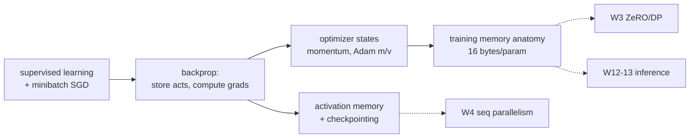
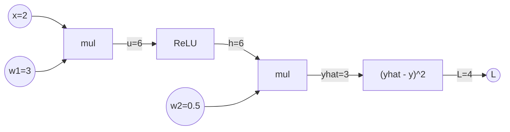

# Week 02 — Recap of AI/ML & Memory Issues in Deep Learning

> 이 과목의 온램프이자 공용 어휘 사전. supervised learning 과 SGD 를 수식으로 깔고, backpropagation 이 **무엇을 저장하고 무엇을 계산하는지**를 computational graph 로 추적한 뒤, 본론인 training memory anatomy — weights / gradients / optimizer states / activations, 그리고 "파라미터당 16 bytes" — 를 유도한다. 이 산수가 W3 (ZeRO) 부터 W13 (LLM serving) 까지 전 주차의 출발점이다.

## Learning goals

이 챕터를 마치면 다음을 할 수 있어야 한다 (전부 시험 가능한 형태):

1. Supervised learning 을 empirical risk minimization 으로 정식화하고, **mini-batch SGD** 의 update rule 을 쓰고, mini-batch gradient 가 full gradient 의 unbiased estimator 이며 분산이 $1/B$ 에 비례함을 보일 수 있다.
2. **Backpropagation** 을 computational graph 위의 reverse-mode automatic differentiation 으로 설명하고, 각 op 이 backward 를 위해 **저장해야 하는 텐서 (saved activations)** 와 backward 에서 **계산되는 것 (vector–Jacobian products)** 을 구분하며, backward FLOPs ≈ 2× forward 임을 유도할 수 있다.
3. SGD / momentum / **Adam** 각각의 per-parameter optimizer state 수 (0 / 1 / 2) 를 말하고 Adam 의 $m_t, v_t$ update 식을 bias correction 까지 쓸 수 있다.
4. Transformer 의 **파라미터 수를 $12Lh^2 + Vh$ 로 세고**, attention 의 $O(s^2)$ 항과 FFN 의 비중을 FLOPs·메모리 양쪽에서 정량화할 수 있다.
5. Training memory 를 **model states (weights + gradients + optimizer states) + residual states (activations 등)** 로 분해하고, fp16 mixed-precision Adam 기준 **파라미터당 $16$ bytes ($2+2+12$)** 를 유도하며, fp32/AMP/pure-bf16 변형의 회계를 비교할 수 있다.
6. fp16 과 bf16 의 표현 범위·정밀도 차이에서 **loss scaling 과 fp32 master weights 가 왜 필요한지**를 설명할 수 있다.
7. Activation memory 의 $sbh(34 + 5as/h)$ 공식을 항별로 해석하고, **gradient checkpointing** 의 $O(\sqrt{n})$ memory–compute 트레이드오프 (재계산 ≈ +1 forward ≈ +33% FLOPs) 를 계산할 수 있다.
8. Inference 시 메모리 구성이 학습과 어떻게 다른지 (gradients·optimizer states·saved activations 소멸, **KV cache** 등장) 를 설명할 수 있다.

## Why this matters

이 과목의 모든 주차는 결국 하나의 질문에서 출발한다: **"왜 한 대의 device 로는 안 되는가."** 그 답의 절반은 연산 (FLOPs) 이지만 나머지 절반은 메모리이고, 메모리 문제를 정확히 진술하려면 학습 한 스텝 동안 device 메모리에 **무엇이, 언제, 몇 바이트** 존재하는지 셀 수 있어야 한다.

- [W3 (Data Parallelism)](../03-data-parallelism/) 의 ZeRO 는 이 챕터의 $16\Psi$ 회계에서 시작한다 — "naive DP 는 $16\Psi$ 를 모든 rank 에 복제한다" 는 문장은 이 챕터 없이는 읽을 수 없다.
- W4 의 sequence parallelism 과 activation recomputation 은 이 챕터의 activation 공식 $sbh(34+5as/h)$ 을 전제로 한다.
- W12–13 의 inference optimization 은 이 챕터의 §7 (inference 메모리) 에서 출발한다.

이름은 recap 이지만 선수 지식을 가정하지 않는다 — supervised learning 의 정의부터 시작해서, 챕터 끝에서는 GPT-2 1.5B 의 학습 메모리를 손으로 분해하는 수준까지 간다.



---

## 1. Supervised learning 과 mini-batch SGD

### 1.1 문제 정식화

**Supervised learning**: 입력–정답 쌍의 데이터셋 $D = \{(x_i, y_i)\}_{i=1}^{|D|}$ 이 주어졌을 때, 파라미터 $w \in \mathbb{R}^\Psi$ 를 가진 모델 $f_w$ 가 $x \mapsto y$ 를 잘 근사하도록 $w$ 를 찾는 문제다. "잘" 의 정의가 **loss function** $\ell(f_w(x), y) \ge 0$ 이고 (예: 분류의 cross-entropy $\ell = -\log p_w(y|x)$, 회귀의 squared error), 학습 목표는 **empirical risk** 의 최소화다:

$$\min_w \; L(w) = \frac{1}{|D|} \sum_{(x,y) \in D} \ell(f_w(x), y)$$

$L$ 은 심층 모델에서 non-convex 하지만, 미분 가능하므로 **gradient descent** 로 내려간다: $w_{t+1} = w_t - \eta \nabla L(w_t)$. 여기서 $\eta > 0$ 이 **learning rate** — 한 스텝에 gradient 반대 방향으로 얼마나 움직일지의 크기다. $\eta$ 가 너무 크면 발산한다: 곡률 $\lambda$ 인 1차원 quadratic $L = \frac{\lambda}{2}w^2$ 에서 $w_{t+1} = (1 - \eta\lambda) w_t$ 이므로 $|1-\eta\lambda| < 1 \Leftrightarrow \eta < 2/\lambda$ 일 때만 수렴 — 가장 가파른 방향의 곡률이 $\eta$ 의 상한을 정한다.

### 1.2 Mini-batch SGD

$|D|$ 가 수십억이면 $\nabla L$ 한 번 계산이 epoch 하나다. 대신 매 스텝 크기 $B$ 의 **mini-batch** $\mathcal{B}_t \subset D$ 를 uniform 샘플링해 추정한다:

$$\hat g_t = \frac{1}{B} \sum_{(x,y) \in \mathcal{B}_t} \nabla \ell(f_{w_t}(x), y), \qquad w_{t+1} = w_t - \eta\, \hat g_t$$

두 가지 통계적 사실이 이후 전 과목을 지배한다:

- **Unbiasedness**: $\mathbb{E}[\hat g_t] = \nabla L(w_t)$ — 샘플이 uniform 이고 loss 가 batch 에 대한 **mean** 이면, 기대값으로는 full gradient 방향이다.
- **Variance**: 샘플이 i.i.d. 면 $\mathrm{Var}[\hat g_t] \propto 1/B$ — batch 를 키우면 gradient 의 noise 가 줄어든다. 이것이 W3 §5 의 linear scaling rule ("batch $k$ 배 → lr $k$ 배") 의 근거가 되고, "batch 를 무한정 키우면 어디서 수확이 끝나는가" (critical batch size) 라는 질문으로 이어진다.

용어: dataset 을 한 번 다 도는 것이 **1 epoch** ($\lceil |D|/B \rceil$ steps), $w$ 갱신 한 번이 **1 step (iteration)**.

### 1.3 한 스텝의 해부 — 메모리 관점의 예고

이 과목에서 학습 한 스텝은 항상 아래 4악장이다. 각 줄이 어떤 메모리를 만들고 없애는지가 §5 의 본론이다:

```python
for x, y in loader:
    logits = model(x)              # [forward]  activations 가 쌓인다 (peak 까지 증가)
    loss = criterion(logits, y)
    loss.backward()                # [backward] gradients 생성, activations 소비·해제
    opt.step()                     # [update]   optimizer states 읽기/쓰기, weights 갱신
    opt.zero_grad()                #            gradients 반환
```

```
memory ▲
       │                     ┌── peak ≈ weights + opt states + activations(전부) ──┐
 acts  │        ▁▂▃▅▆▇█████──┘                █▇▆▅▃▂▁  (backward 가 소비하며 해제)
 grads │                                      ▁▂▃▅▆▇█████████──▶ zero_grad 까지 생존
 weights, optimizer states ────────────────────────────────────▶ (학습 내내 상주)
       └── forward ──────────────│── backward ─────────│─ step ─│──▶ time
```

**상주 (persistent)** 하는 것: weights, optimizer states — 학습이 끝날 때까지 산다. **일시적 (transient)** 인 것: activations (forward 에서 태어나 backward 에서 죽는다), gradients (backward 에서 태어나 step 직후 죽는다). 이 수명 구분이 W3 의 ZeRO ("상주분을 shard 하자") 와 §6 의 checkpointing ("일시분을 재계산과 바꾸자") 을 가른다.

---

## 2. Backpropagation: computational graph 와 chain rule

### 2.1 왜 reverse mode 인가

$\hat g$ 를 계산하려면 스칼라 $L$ 의 $\Psi$ 개 파라미터 전부에 대한 편미분이 필요하다. **Reverse-mode automatic differentiation** (= backpropagation) 은 forward 계산을 primitive op 들의 DAG (**computational graph**) 로 기록해 두고, 출력에서 입력 방향으로 chain rule 을 적용한다. 출력이 스칼라 하나이므로 **backward 한 번**으로 모든 $\partial L/\partial w_i$ 가 나온다 — 입력 방향마다 한 번씩 도는 forward mode ($\Psi$ 회) 와의 결정적 차이고, "loss 하나 / 파라미터 수백만" 인 딥러닝이 reverse mode 를 쓰는 이유다.

각 op $y = f(x)$ 에 대해 backward 가 하는 일은 **vector–Jacobian product (VJP)**: upstream gradient $\delta_y = \partial L/\partial y$ 를 받아 $\delta_x = \delta_y \cdot \frac{\partial f}{\partial x}$ 를 흘려보낸다. Jacobian 을 명시적으로 만들지 않고 op 별 규칙으로 곱한다.

### 2.2 무엇이 저장되는가 (activations), 무엇이 계산되는가 (gradients)

핵심 관찰: **VJP 는 대부분 forward 의 중간값을 필요로 한다.** 그래서 forward 는 계산만 하는 게 아니라 **저장**한다:

| op (forward) | backward 규칙 | 저장해야 하는 것 |
|---|---|---|
| $Y = XW$ (linear) | $\delta_X = \delta_Y W^\top$, $\;\delta_W = X^\top \delta_Y$ | $X$ (**입력 activation**), $W$ (이미 상주) |
| $y = \mathrm{ReLU}(x)$ | $\delta_x = \delta_y \odot \mathbf{1}[x>0]$ | $x$ 의 부호 (mask) |
| $y = \mathrm{softmax}(x)$ | $\delta_x = y \odot (\delta_y - \langle \delta_y, y\rangle)$ | 출력 $y$ |
| $y = \mathrm{LayerNorm}(x)$ | (생략) | $x$, 통계 $\mu, \sigma^{-1}$ |
| $y = x_1 + x_2$ (add) | $\delta_{x_1} = \delta_{x_2} = \delta_y$ | **없음** |

forward 가 저장해 두는 이 중간 텐서들이 **activation memory** 다 — §6 에서 보듯 대형 모델 학습에서 가장 큰 메모리 항목. backward 는 이것들을 소비하면서 (그리고 소비 즉시 해제하면서) **gradient** 를 만들어낸다. PyTorch 에서 이 저장은 각 op 의 `ctx.save_for_backward(...)` 가 수행하고, `torch.autograd.graph.saved_tensors_hooks` 로 가로채 바이트 단위로 셀 수 있다 ([lab 2](lab/lab2_activation_scaling.py) 가 정확히 이것을 한다).

**Worked Example 1 — 손으로 하는 backprop.** $x = 2$, $w_1 = 3$, $w_2 = 0.5$, 타깃 $y = 1$:



Backward (역순, 각 단계에서 **무엇이 필요한지** 주목):

| 단계 | 계산 | 필요한 저장값 |
|---|---|---|
| $\delta_{\hat y} = 2(\hat y - y) = 4$ | loss 의 VJP | $\hat y = 3$ |
| $\delta_{w_2} = \delta_{\hat y} \cdot h = 24$ | mul 의 VJP | $h = 6$ ← **saved activation** |
| $\delta_h = \delta_{\hat y} \cdot w_2 = 2$ | mul 의 VJP | $w_2$ |
| $\delta_u = \delta_h \cdot \mathbf{1}[u>0] = 2$ | ReLU 의 VJP | $u$ 의 mask ← saved |
| $\delta_{w_1} = \delta_u \cdot x = 4$ | mul 의 VJP | $x = 2$ ← saved |

저장 없이 $L=4$ 만 알아서는 어느 gradient 도 만들 수 없다 — "backward 는 loss 값의 함수" 가 아니라 **forward 궤적 전체의 함수**다.

### 2.3 Backward 의 비용: ≈ 2× forward

행렬곱이 지배하는 네트워크에서, forward 의 matmul 하나 ($Y = XW$) 는 backward 에서 matmul **둘** ($\delta_X = \delta_Y W^\top$, $\delta_W = X^\top \delta_Y$) 을 낳는다. 따라서 backward FLOPs ≈ 2 × forward FLOPs — 파라미터 $\Psi$ 개짜리 dense 모델의 학습 비용이 토큰당 $\approx 6\Psi$ FLOPs (forward $2\Psi$ + backward $4\Psi$) 로 요약되는 근거다 (Kaplan et al. 2020 의 $C \approx 6 N D$). 이 1:2 비율은 §6 의 "checkpointing 재계산 = +1 forward = 총 FLOPs 의 +33%" 계산에 다시 쓰인다.

---

## 3. Optimizer states: momentum 과 Adam

### 3.1 SGD with momentum — 파라미터당 state 1개

Vanilla SGD 는 $\hat g_t$ 를 쓰고 버린다 — 유지하는 상태가 없다. **Momentum** 은 gradient 의 지수이동평균 방향으로 움직여 진동을 줄이고 일관된 방향을 가속한다:

$$u_t = \mu\, u_{t-1} + \hat g_t, \qquad w_{t+1} = w_t - \eta\, u_t$$

velocity $u_t$ 는 **파라미터와 같은 shape 의 텐서**로, 스텝을 넘어 살아남는다 — 파라미터당 **state 1개**. PyTorch `torch.optim.SGD(momentum=0.9)` 의 `momentum_buffer` 가 이것이다.

### 3.2 Adam — 파라미터당 state 2개

**Adam** (Kingma & Ba 2015) 은 1차 모멘트 (방향) 와 2차 모멘트 (원소별 크기) 를 모두 추적해 파라미터별로 lr 을 적응시킨다:

$$m_t = \beta_1 m_{t-1} + (1-\beta_1)\hat g_t, \qquad v_t = \beta_2 v_{t-1} + (1-\beta_2)\hat g_t^2$$
$$\hat m_t = \frac{m_t}{1-\beta_1^t}, \quad \hat v_t = \frac{v_t}{1-\beta_2^t} \quad \text{(bias correction: 0 초기화 편향 보정)}$$
$$w_{t+1} = w_t - \eta\, \frac{\hat m_t}{\sqrt{\hat v_t} + \epsilon}$$

기본값 $\beta_1 = 0.9$, $\beta_2 = 0.999$, $\epsilon = 10^{-8}$. $m_t, v_t$ 모두 파라미터와 같은 shape — **파라미터당 state 2개** (PyTorch 의 `exp_avg`, `exp_avg_sq`). Transformer 학습의 사실상 표준은 Adam 계열 (AdamW 도 state 는 동일 2개) 이므로, 이 과목의 메모리 산수는 "state 2개 + master weights" 를 기본으로 한다.

| optimizer | states/param | fp32 에서 state bytes/param |
|---|---|---|
| SGD | 0 | 0 |
| SGD + momentum | 1 | 4 |
| Adam / AdamW | 2 | 8 |

두 가지 함의:

- Optimizer states 는 **상주 메모리**다 — activations 처럼 스텝 안에서 사라지지 않고, weights 와 같은 수명을 가진다. 그래서 W3 의 ZeRO stage 1 이 가장 먼저 노리는 대상이 된다 (혼자서 $12\Psi/16\Psi = 75\%$... 정확한 수치는 §5).
- State 는 **fp32 로 유지하는 것이 표준**이다. $v_t$ 는 $(1-\beta_2) = 0.001$ 단위의 작은 증분이 장기 누적되는 통계라 저정밀도에서 갱신이 소실되기 쉽다 ([lab 1](lab/lab1_memory_accounting.py) 의 "pure bf16" 변형이 이 위험을 무릅쓰고 8 bytes/param 으로 줄이는 모습을 실측한다).

메모리를 위해 state 자체를 줄이는 optimizer 도 있다 — Adafactor 는 $v_t$ 를 row/col 로 factorize 해 sub-linear state 를 쓴다 (Shazeer & Stern 2018). W6 에서 통신 관점의 optimizer 변형 (1-bit Adam 등) 과 다시 만난다.

---

## 4. Transformer, 메모리·연산 추론에 필요한 만큼만

W3+ 의 모든 계산이 transformer 를 대상으로 하므로, 구조를 **셀 수 있을 만큼만** 정확히 잡아둔다. 대상은 decoder-only transformer (GPT 계열): vocab $V$, hidden $h$, layer $L$ 개, attention head $a$ 개 (head dim $d_h = h/a$), batch $b$, sequence length $s$.

### 4.1 한 layer 의 구조

각 layer 는 두 sub-block 의 residual 합이다:

1. **Multi-head self-attention**: $Q = XW_Q,\; K = XW_K,\; V = XW_V$ (각 $W \in \mathbb{R}^{h\times h}$), head 별로
$$\mathrm{Attn}(Q,K,V) = \mathrm{softmax}\!\Big(\frac{QK^\top}{\sqrt{d_h}} + \text{causal mask}\Big) V$$
후 출력 projection $W_O \in \mathbb{R}^{h \times h}$. Score 행렬 $QK^\top$ 이 **$(b, a, s, s)$** — 여기가 모든 $O(s^2)$ 의 근원이다.
2. **FFN (MLP)**: $\mathrm{FFN}(x) = \mathrm{GeLU}(x W_1) W_2$, $W_1 \in \mathbb{R}^{h \times 4h}$, $W_2 \in \mathbb{R}^{4h \times h}$ (표준 확장비 4).

각 sub-block 앞에 LayerNorm, 밖에 residual connection.

### 4.2 파라미터 세기

| 구성요소 | 파라미터 수 |
|---|---|
| attention ($W_Q, W_K, W_V, W_O$) | $4h^2$ / layer |
| FFN ($W_1, W_2$) | $8h^2$ / layer |
| LayerNorm (scale + bias 2개소) | $4h$ / layer (무시 가능) |
| **layer 합계** | $\approx 12h^2$ |
| token embedding (+ untied LM head) | $Vh$ (또는 $2Vh$) |
| learned positional embedding | $s_{\max} h$ |

$$\boxed{\Psi \approx 12 L h^2 + Vh}$$

**Worked Example 2 — GPT-2 시리즈 검증.**
- GPT-2 small ($L=12$, $h=768$, $V=50257$): $12 \cdot 12 \cdot 768^2 = 84.9\text{M}$, embedding $50257 \cdot 768 = 38.6\text{M}$, position $1024 \cdot 768 = 0.8\text{M}$ → **124.3M** — 공칭 "124M" 과 일치.
- GPT-2 XL ($L=48$, $h=1600$): $12 \cdot 48 \cdot 1600^2 = 1.47\text{B}$ + embedding $80\text{M}$ → **1.56B** — 공칭 "1.5B". 이 모델이 §5–6 의 worked example 주인공이다.
- 파라미터의 layer 내 비중: FFN $8h^2$ vs attention $4h^2$ — **layer 파라미터의 2/3 가 FFN** 이다. "transformer = attention" 이라는 인상과 달리, 파라미터·FLOPs 의 다수는 FFN 이 가져간다 (W14 에서 MoE 가 FFN 을 노리는 이유).

lab 의 `tinytransformer.py` 는 이 공식이 `assert` 로 정확히 맞는 (LN 항까지) 미니 구현이다.

### 4.3 FLOPs 세기와 $O(s^2)$ 의 위치

토큰당 FLOPs (곱+합 = 2 FLOPs 규약), layer 당:

| 연산 | FLOPs / token / layer |
|---|---|
| attention projections ($4h^2$ params) | $8h^2$ |
| FFN ($8h^2$ params) | $16h^2$ |
| $QK^\top$ + $\mathrm{Attn}\cdot V$ (score 계산) | $4sh$ |

- 행렬곱 (파라미터 보유) 항의 합은 $24h^2 = 2 \times$ (layer 파라미터 수) — "토큰당 forward $\approx 2\Psi$ FLOPs" (§2.3) 의 출처.
- **Attention score 의 $4sh$ 만 $s$ 에 비례** 한다. 비율은 $\frac{4sh}{24h^2} = \frac{s}{6h}$ — score 계산이 FLOPs 를 지배하려면 $s > 6h$ (GPT-2 XL 이면 $s > 9600$) 가 필요하다. 즉 **보통의 문맥 길이에서 연산의 지배자는 여전히 dense matmul** 이다.
- 반면 §6 에서 보듯 **activation 메모리의 $s^2$ 항은 훨씬 일찍 지배한다** — "attention 의 $O(s^2)$" 을 말할 때는 FLOPs 인지 memory 인지 반드시 구분해야 한다 (misconception #8).

---

## 5. Training memory anatomy: 파라미터당 16 bytes

이제 본론. 학습 중 device 메모리를 ZeRO (Rajbhandari et al. 2020, §3) 의 분류로 나눈다:

- **Model states** — weights, gradients, optimizer states. 파라미터 수 $\Psi$ 만의 함수 (batch 무관).
- **Residual states** — activations, 임시 버퍼, fragmentation. $b, s$ 에 의존 → §6.

### 5.1 fp32 baseline

전부 fp32 (4 bytes), Adam 기준:

$$\underbrace{4\Psi}_{\text{weights}} + \underbrace{4\Psi}_{\text{grads}} + \underbrace{4\Psi + 4\Psi}_{m,\,v} = 16\Psi \text{ bytes}$$

### 5.2 Mixed precision: 왜 절반 정밀도로 계산하는가

fp16 으로 forward/backward 를 돌리면 (i) 최신 GPU 의 저정밀 전용 유닛 (Tensor Core) 이 fp32 대비 수 배의 FLOPS 를 내고, (ii) 텐서가 절반 크기라 memory bandwidth 절약, (iii) activation 메모리 절반 (Micikevicius et al. 2018). 문제는 fp16 의 표현력:

| format | bits (sign/exp/mantissa) | max | min normal | 상대 정밀도 |
|---|---|---|---|---|
| fp32 | 1/8/23 | $3.4\times10^{38}$ | $1.2\times10^{-38}$ | $\sim 10^{-7}$ |
| fp16 | 1/5/10 | $65504$ | $6.1\times10^{-5}$ ($2^{-14}$) | $\sim 10^{-3}$ |
| bf16 | 1/8/7 | $3.4\times10^{38}$ | $1.2\times10^{-38}$ | $\sim 10^{-2}$ |

fp16 학습이 그냥은 안 되는 두 지점, 각각의 처방 (Micikevicius et al. 2018 의 3종 세트):

**(a) Gradient underflow → loss scaling.** Gradient (특히 activation gradient) 는 크기가 작은 쪽에 몰려 있어, fp16 의 표현 하한 (subnormal 포함 $2^{-24} \approx 6\times10^{-8}$) 아래 값이 **0 으로 사라진다**. fp16 의 표현 범위 윗쪽은 텅 비어 있으므로, backward 직전에 loss 에 상수 $S$ 를 곱해 gradient 히스토그램 전체를 $S$ 배 위로 밀어 올리고, update 전에 $S$ 로 되나눈다:

$$\nabla_w (S \cdot L) = S \cdot \nabla_w L \;\xrightarrow{\;/S\;}\; \nabla_w L$$

Micikevicius et al. 의 SSD 실험에서는 $S = 8$ 만으로 fp32 정확도를 회복했다 — 사라지던 것은 $[2^{-27}, 2^{-24})$ 구간의 작은 gradient 들이었다. 실무는 **dynamic loss scaling**: overflow (inf/NaN gradient) 가 나면 그 스텝을 버리고 $S$ 를 반으로, 일정 스텝 (PyTorch `GradScaler` 기본 2000) 무사고면 $S$ 를 2배로 — 표현 가능한 최대 근처를 자동 추적한다.

**(b) Update 소실 → fp32 master weights.** fp16 의 상대 정밀도는 $2^{-11}$ 수준이라, weight 대비 $2^{-11}$ 배보다 작은 update 는 `w + η·g == w` 가 되어 버린다 (덧셈에서 정렬 시 mantissa 밖으로 밀림). Learning rate 곱하면 update 는 흔히 weight 의 $10^{-4}$ 배 이하 — 그래서 **fp32 master copy** 를 유지한다: forward/backward 는 fp16 사본으로, update 는 fp32 master 에 누적하고, 다음 스텝 시작 때 fp16 으로 다시 캐스팅한다.

bf16 은 exponent 가 fp32 와 같아 (a) 의 underflow 문제가 사실상 없다 — **loss scaling 없이 돌아가는 것이 bf16 의 존재 이유**다. 대신 mantissa 7 bits 로 정밀도가 fp16 보다도 낮아서 (b) 의 master weights 는 여전히 필요하다.

### 5.3 회계: $(4+K)\Psi$, $K = 12$

fp16 mixed-precision + Adam (Megatron/ZeRO 표준 layout) 의 파라미터당 바이트 — W3 이 그대로 인용하는 식:

$$\underbrace{2\Psi}_{\text{fp16 weights}} + \underbrace{2\Psi}_{\text{fp16 grads}} + \underbrace{K\Psi}_{\text{optimizer states}} = (4+K)\Psi, \qquad K = 12 = \underbrace{4}_{\text{fp32 master}} + \underbrace{4}_{m} + \underbrace{4}_{v}$$

$$\boxed{(4+K)\Psi = 16\Psi \text{ bytes} = \textbf{16 bytes/param}}$$

master weights 를 optimizer state 로 계상하는 것이 ZeRO 의 관례다 (update 때만 필요하므로). 변형들의 회계 — [lab 1](lab/lab1_memory_accounting.py) 이 전 행을 실제 텐서 바이트로 검증한다:

| 구성 | weights | grads | opt states | 합계 (B/param) |
|---|---|---|---|---|
| fp32 + SGD | 4 | 4 | 0 | 8 |
| fp32 + SGD momentum | 4 | 4 | 4 | 12 |
| fp32 + Adam | 4 | 4 | 4+4 | **16** |
| fp16 + fp32-master Adam (ZeRO 회계) | 2 | 2 | 4+4+4 | **16** |
| PyTorch AMP (`autocast` + `GradScaler`) + Adam | 4 (fp32 유지) | 4 | 4+4 | **16** (+ 일시적 fp16 cast) |
| pure bf16 + Adam (master 없음) | 2 | 2 | 2+2 | 8 (위험) |

**표에서 읽어야 할 것**: fp32 Adam 도, mixed precision Adam 도 **똑같이 16 bytes/param** 이다. Mixed precision 은 model states 를 줄이는 기술이 **아니다** — 절감되는 것은 activations (dtype 절반) 과 시간이고, model states 는 회계 항목이 재배치될 뿐이다 (misconception #1). PyTorch 의 기본 AMP 는 weights 를 fp32 로 두고 op 진입 시 캐스팅하므로 분해가 다르지만 합계는 같다.

**Worked Example 3 — GPT-2 XL (1.5B) 의 model states.**

$$16 \times 1.5\text{B} = 24\ \text{GB}$$

- fp16 weights 만은 $2\Psi = 3$ GB — "모델 크기" 라고 부르는 값. 그런데 학습에는 그 **8배**가 상주로 필요하고, 그중 optimizer states 가 $12\Psi = 18$ GB (75%) 다.
- 16 GB GPU 에는 activation 을 한 바이트도 안 세고도 이미 안 들어간다 — ZeRO 논문이 1.5B 모델로 이 산수를 여는 이유이자, W3 에서 optimizer states 부터 shard 하는 이유.

### 5.4 어느 정밀도로 무엇을 두는가 — 정리

| 텐서 | dtype | 근거 |
|---|---|---|
| forward/backward 연산, activations | fp16/bf16 | throughput·bandwidth·메모리 |
| gradients (통신 포함) | fp16/bf16 | 〃 (W3: allreduce 도 fp16) |
| master weights | fp32 | update 소실 방지 (§5.2b) |
| Adam $m, v$ | fp32 | 작은 증분의 장기 누적 (§3.2) |
| loss/softmax 등 reduction 이 긴 op | fp32 로 승격 | 누적 오차 (autocast 가 자동 처리) |

---

## 6. Activation memory 와 gradient checkpointing

### 6.1 Activation 이 왜 지배하는가

Model states 는 $\Psi$ 만의 함수지만, activations 는 **$b \times s$ 에 비례**한다.

온램프 하나: 표준 transformer 학습 구성은 attention·FFN 출력에 **dropout** 을 끼운다 — 학습 중에만 각 원소를 확률 $p$ 로 0 으로 만들고 나머지를 $1/(1-p)$ 배 하는 regularization 이다 (Goodfellow et al. ch. 7.12). 메모리 관점에서 중요한 점: backward 는 forward 가 껐던 것과 **같은 원소**를 꺼야 하므로, 어느 원소를 껐는지의 난수 **mask** 를 저장해야 한다 — §2.2 의 ReLU mask 와 같은 종류의 saved tensor 로, 원소당 **1 byte** 로 계상된다.

표준 transformer layer 하나가 backward 를 위해 저장하는 바이트의 정밀한 회계 (fp16 activations, dropout 포함; Korthikanti et al. 2022, eq. 2):

$$A_{\text{layer}} = sbh\left(34 + 5\frac{as}{h}\right) \text{ bytes}$$

항별 출처: attention sub-block 이 $11\,sbh + 5\,as^2b$ (Q/K/V 입력·출력들, softmax 출력 $2as^2b$, softmax dropout mask $as^2b$ + 출력 $2as^2b$), FFN 이 $19\,sbh$ (확장비 4 의 입출력과 GeLU 입력), LayerNorm 2개가 $4\,sbh$. 구조적으로 중요한 것:

- **$b$ 에 정확히 선형** — batch 를 두 배 하면 activation 도 두 배 ([lab 2](lab/lab2_activation_scaling.py) sweep 1 실측: per-sample 바이트가 상수).
- **$s$ 에는 superlinear** — $sbh \cdot 34$ 항은 선형이지만 $5as^2b$ 항 ($QK^\top$ 크기) 이 이차. 이차 항이 지배하는 경계는 $5as/h = 34 \Rightarrow s \approx 6.8\, h/a = 6.8\, d_h$. $d_h = 64$ 면 **$s \approx 435$ 부터** — FLOPs 크로스오버 ($s = 6h$, §4.3) 보다 수십 배 일찍 온다.

**Worked Example 4 — GPT-2 XL, $s=1024$, $b=32$.** ($h=1600$, $a=25$, $L=48$)

$$sbh = 1024 \cdot 32 \cdot 1600 = 5.24\times10^7, \qquad 34 + 5 \cdot \tfrac{25 \cdot 1024}{1600} = 34 + 80 = 114$$
$$A_{\text{layer}} = 5.24\times10^7 \times 114 \approx 5.98\ \text{GB}, \qquad A_{\text{total}} = 48 \times 5.98 \approx \mathbf{287\ GB}$$

Model states 24 GB (WE3) 의 **~12배**. 같은 모델을 ZeRO 논문은 "약 60 GB" 로 추정하는데, 그들의 근사는 layer 당 $12 \cdot sbh \times 2$ bytes — $s^2$ 항 (여기선 회계의 70%) 과 일부 중간값을 버린 거친 하한이다. **어느 추정이든 결론은 같다: 이 영역의 지배자는 activations 이고, 회계를 인용할 때는 무엇을 셌는지 (dropout mask? score 행렬? dtype?) 를 반드시 명시해야 한다.**

Batch 를 줄이면 되지 않나? — 된다. 하지만 (i) per-device batch 가 작으면 GPU 효율이 떨어지고, (ii) W3 에서 보듯 global batch 는 통신·수렴과 얽혀 마음대로 못 정한다. 그래서 activation 을 정면으로 줄이는 장치가 필요하다.

### 6.2 Gradient checkpointing: 메모리를 시간으로 산다

**아이디어** (Chen et al. 2016): forward 의 중간값을 전부 저장하는 대신, **선별된 지점 (checkpoint) 만 저장**하고 나머지는 backward 도중 checkpoint 에서부터 **재계산 (recompute)** 한다.

$n$ 개 layer 의 균일한 chain 에서 $k$ 개 segment 로 자르면, 상주 저장 = segment 경계 $k$ 개 + backward 중인 segment 하나의 내부 $n/k$ 개 → $\min_k (k + n/k)$ 는 $k = \sqrt{n}$ 에서 최소, 메모리 $O(\sqrt{n})$:

$$\text{memory}: O(n) \to O(\sqrt{n}), \qquad \text{compute}: +1 \text{ forward}$$

재계산 비용은 forward 한 번 — §2.3 의 1:2 비율로 총 학습 FLOPs (fwd 1 + bwd 2 = 3) 대비 **+33%**. 실측 오버헤드는 전 layer 재계산 기준 30–40% (Korthikanti et al. 2022 의 측정; ZeRO 도 33% 로 계상).

Transformer 실무 (Megatron 계열) 는 $\sqrt{n}$ segment 대신 **layer 마다 checkpoint**: 저장이 layer 입력 $2sbh$ bytes 뿐이라

$$A_{\text{ckpt}} = 2sbh \cdot L + \underbrace{A_{\text{layer}}}_{\text{backward 중 재계산분}}$$

WE4 의 모델: $2 \cdot 1024 \cdot 32 \cdot 1600 \times 48 = 5.0$ GB + 재계산 중 1 layer 6 GB ≈ **11 GB** — 287 GB 에서 26배 감소 (ZeRO 의 거친 회계로는 60 → 8 GB, 같은 결론). 이 절감이 W4 의 pipeline parallelism (GPipe 가 re-materialization 을 기본 결합) 과 긴 문맥 학습을 가능하게 한다.

PyTorch API 는 `torch.utils.checkpoint.checkpoint` / `checkpoint_sequential` — [lab 3](lab/lab3_checkpointing.py) 에서 saved bytes 0.28× / 시간 1.15× / **gradient bit-identical (max diff 0.0)** 을 실측한다. checkpointing 은 근사가 아니다: 같은 커널을 같은 입력에 다시 실행할 뿐, 수치 결과를 바꾸지 않는다.

**더 정교한 축들 (예고)**: 어떤 activation 은 싸게 재계산되고 (LayerNorm) 어떤 것은 비싸다 (matmul) — 전부/전무가 아니라 **골라서** 재계산하는 selective recomputation 이 W4 (Korthikanti 의 본론), $s^2$ 짜리 score 행렬을 아예 저장하지 않는 kernel-level 재계산이 FlashAttention (W13) 이다.

---

## 7. Inference 는 무엇이 다른가

학습 메모리의 세 항목이 inference (forward 만) 에서는 통째로 사라진다:

| 항목 | training | inference |
|---|---|---|
| weights | $2\Psi$ (fp16) | $2\Psi$ (fp16) — 양자화하면 더 ↓ (W12) |
| gradients | $2\Psi$ | **없음** |
| optimizer states (fp32 master + $m$ + $v$) | $12\Psi$ | **없음** |
| activations | 전 layer 분 상주 (backward 대기) | **layer 지나면 즉시 해제** — peak ≈ 한 layer 의 working set |
| KV cache | — | **새로 등장**, $b \cdot s$ 에 비례 |

Backward 가 없으니 저장 의무가 없다 — activation 은 다음 layer 로 넘기는 순간 버려도 된다. 그래서 inference 의 상주 메모리는 "weights + $\alpha$" 로 보이지만, **autoregressive 생성**이 새 항목을 만든다: 토큰을 하나씩 생성할 때 매 스텝 이전 토큰 전체의 $K, V$ 를 다시 계산하지 않으려면 layer 별로 캐싱해야 한다. 이것이 **KV cache**:

$$M_{KV} = 2 \times L \times h_{kv} \times s \times b \times (\text{bytes/elem}) \qquad (h_{kv} = \text{kv head 수} \times d_h;\ \text{MHA 면 } h)$$

크기 감각 (vLLM 논문의 OPT-13B 계산, Kwon et al. 2023): $2 \times 40 \text{ layers} \times 5120 \times 2$ bytes = **토큰당 800 KB** — 2048-토큰 요청 하나가 최대 **1.6 GB**. 요청 몇 개면 KV cache 가 weights (26 GB) 와 맞먹는다. 학습에서 activations 가 그랬듯, inference 에서는 KV cache 가 "$b \cdot s$ 에 비례하며 자라는 지배 항목" 의 역할을 물려받는다 — 이것을 줄이는 구조 (GQA/MQA), 관리하는 시스템 (PagedAttention), 그리고 decode 가 왜 memory-bound 인지는 W12–13 의 본론이다.

---

## Common misconceptions

1. **"Mixed precision 을 쓰면 학습 메모리가 절반이 된다"** — model states 는 fp32 Adam 이나 fp16-master Adam 이나 **똑같이 16 bytes/param** 이다 (§5.3, lab 1 실측). 줄어드는 것은 activations 와 연산 시간. "메모리 절반" 은 inference (weights 만) 에서나 맞는 말이다.
2. **"Adam 은 파라미터의 2배 메모리를 쓴다"** — state **개수**로는 2/param 이지만, 바이트로는 fp32 states $12\Psi$ 가 fp16 weights $2\Psi$ 의 **6배**다. 학습 상주 메모리의 75% 가 optimizer states — W3 의 ZeRO stage 1 이 그것부터 shard 하는 이유 (§5.3).
3. **"학습 메모리는 파라미터 수가 결정한다"** — model states 만 그렇다. Activations 는 $b, s$ 의 함수이고, 보통 설정에서 model states 를 수 배~수십 배 능가한다 (WE4: 24 GB vs 287 GB). "이 모델 학습에 메모리 얼마 필요해요?" 에 batch/seq 없이 답하면 틀린 답이다 (§6.1).
4. **"Loss scaling 은 fp16 overflow 를 막기 위한 것"** — 반대다. 본질은 **underflow**: 작은 gradient 들이 $2^{-24}$ 아래에서 0 이 되는 것을 막으려고 위로 밀어 올리는 것이다 (fp16 의 위쪽 range 는 비어 있다). overflow 는 dynamic scaling 이 $S$ 를 낮추는 신호로 쓰일 뿐이다 (§5.2a).
5. **"bf16 은 fp16 의 상위호환이다"** — 트레이드오프다. bf16 은 range 를 얻고 (loss scaling 불필요) **정밀도를 잃는다** (mantissa 7 vs 10 bits). 그래서 bf16 에서도 fp32 master weights 와 fp32 optimizer states 는 여전히 필요하다 (§5.2b, lab 1 의 pure-bf16 변형이 위험한 이유).
6. **"Forward 가 끝나면 중간 결과는 버려도 된다"** — 학습 중에는 안 된다. backward 의 VJP 들이 forward 중간값 (matmul 입력, softmax 출력, ReLU mask...) 을 요구한다 (§2.2). 이 저장분이 activation memory 이고, 버리려면 checkpointing 처럼 **재계산 계약**을 맺어야 한다.
7. **"Gradient checkpointing 은 근사라서 정확도가 떨어진다"** — 아니다. 같은 연산을 같은 입력에 다시 실행하므로 gradient 는 **bit-identical** 하다 (lab 3 실측 max diff 0.0). 비용은 정확도가 아니라 시간 (+1 forward ≈ +33% FLOPs) 이다 (§6.2).
8. **"Attention 은 $O(s^2)$ 이라 항상 병목이다"** — FLOPs 와 memory 를 구분하라. FLOPs 에서 score 항이 지배하려면 $s > 6h$ (수만 토큰). Activation **memory** 의 $s^2$ 항은 $s \approx 6.8\,d_h$ (수백 토큰) 부터 지배 — 같은 $O(s^2)$ 라도 문턱이 수십 배 다르다 (§4.3, §6.1).
9. **"Inference 메모리도 학습과 비슷하게 계산하면 된다"** — gradients·optimizer states·saved activations 가 전부 사라지고 ($16\Psi \to 2\Psi$), 대신 autoregressive 생성에서 **KV cache** 가 $b \cdot s$ 비례 항목으로 새로 등장한다 (OPT-13B: 토큰당 800 KB). 학습의 memory anatomy 를 그대로 옮기면 두 방향 모두 틀린다 (§7).

## Glossary

- **supervised learning** — learning a parameterized function from input–label pairs by minimizing a loss over a dataset.
- **empirical risk minimization (ERM)** — minimizing the average loss over the training set as a proxy for expected loss.
- **mini-batch SGD** — parameter update $w \leftarrow w - \eta \hat g$ using the gradient of the mean loss over a random batch of size $B$; $\hat g$ is unbiased with variance $\propto 1/B$.
- **learning rate** — step size $\eta$ multiplying the (estimated) gradient in each update; upper-bounded by curvature for stability.
- **computational graph** — the DAG of primitive operations recorded during the forward pass, on which reverse-mode differentiation operates.
- **backpropagation / reverse-mode AD** — computing all parameter gradients of a scalar loss in one backward sweep by chaining vector–Jacobian products from output to inputs.
- **vector–Jacobian product (VJP)** — per-op backward rule mapping the upstream gradient to gradients w.r.t. the op's inputs without materializing the Jacobian.
- **activation (saved tensor)** — a forward intermediate stored because some VJP needs it; the source of activation memory.
- **optimizer state** — per-parameter tensors persisting across steps (momentum buffer; Adam's $m, v$).
- **Adam** — optimizer keeping exponential moving averages of the gradient ($m$) and squared gradient ($v$), with bias correction; two states per parameter.
- **mixed precision training** — computing forward/backward in fp16/bf16 while keeping fp32 master weights (and fp32 optimizer states) for the update.
- **loss scaling** — multiplying the loss by $S$ before backward so small fp16 gradients don't underflow below $2^{-24}$, then dividing gradients by $S$ before the update.
- **master weights** — the fp32 copy of parameters that accumulates updates too small to register in fp16/bf16.
- **model states** — weights + gradients + optimizer states; $16\Psi$ bytes for mixed-precision Adam ($2+2+12$), independent of batch size.
- **residual states** — everything else: activations, temporary buffers, fragmentation (ZeRO's terminology).
- **activation memory** — bytes of saved forward intermediates; per transformer layer $sbh(34 + 5as/h)$ (fp16), linear in batch, superlinear in sequence length.
- **gradient checkpointing (activation recomputation)** — storing only checkpoint activations and recomputing the rest during backward; $O(\sqrt n)$ memory for one extra forward (~33% FLOPs).
- **KV cache** — per-layer keys/values of all previous tokens cached during autoregressive decoding; size $2 \cdot L \cdot h_{kv} \cdot s \cdot b \cdot$ bytes.

## References

1. Rajbhandari et al., *ZeRO: Memory Optimizations Toward Training Trillion Parameter Models*, SC 2020. [arXiv:1910.02054](https://arxiv.org/abs/1910.02054) — §5 전체 (model/residual states 분류, $K=12$, $16\Psi$, 1.5B → 24 GB, activation 60 GB → 8 GB · 33% 재계산).
2. Micikevicius et al., *Mixed Precision Training*, ICLR 2018. [arXiv:1710.03740](https://arxiv.org/abs/1710.03740) — §5.2 (fp32 master weights, loss scaling, fp16 히스토그램·SSD $S=8$, $2^{-24}$ underflow).
3. Kingma & Ba, *Adam: A Method for Stochastic Optimization*, ICLR 2015. [arXiv:1412.6980](https://arxiv.org/abs/1412.6980) — §3.2 (m/v update, bias correction, 기본 하이퍼파라미터).
4. Chen, Xu, Zhang & Guestrin, *Training Deep Nets with Sublinear Memory Cost*, 2016. [arXiv:1604.06174](https://arxiv.org/abs/1604.06174) — §6.2 ($O(\sqrt n)$ checkpointing, +1 forward).
5. Korthikanti et al., *Reducing Activation Recomputation in Large Transformer Models*, 2022. [arXiv:2205.05198](https://arxiv.org/abs/2205.05198) — §6.1 (activation 공식 $sbh(34+5as/h)$ 및 항별 유도, full recomputation 30–40% 오버헤드; selective recomputation 은 W4).
6. Kaplan et al., *Scaling Laws for Neural Language Models*, 2020. [arXiv:2001.08361](https://arxiv.org/abs/2001.08361) — §2.3, §4.3 (토큰당 forward $2\Psi$·학습 $6\Psi$ FLOPs 근사).
7. Goodfellow, Bengio & Courville, *Deep Learning*, MIT Press 2016. [deeplearningbook.org](https://www.deeplearningbook.org) — ch. 5 (ERM), 6.5 (backprop as computational graph), 7.12 (dropout), 8.1–8.5 (SGD, momentum, Adam).
8. Kwon et al., *Efficient Memory Management for Large Language Model Serving with PagedAttention*, SOSP 2023. [arXiv:2309.06180](https://arxiv.org/abs/2309.06180) — §7 (OPT-13B KV cache 800 KB/token · 1.6 GB/request; 본론은 W13).
9. Radford et al., *Language Models are Unsupervised Multitask Learners* (GPT-2), 2019. [pdf](https://cdn.openai.com/better-language-models/language_models_are_unsupervised_multitask_learners.pdf) — §4.2 (GPT-2 small/XL 구성: $L$, $h$). 파라미터 수 주의: 논문 Table 2 는 최소 모델을 117M 으로 표기하나, 이후 [openai/gpt-2](https://github.com/openai/gpt-2) 레포에서 124M 으로 정정 — 본문의 "공칭 124M" 은 정정치를 따른다.
10. Shazeer & Stern, *Adafactor: Adaptive Learning Rates with Sublinear Memory Cost*, ICML 2018. [arXiv:1804.04235](https://arxiv.org/abs/1804.04235) — §3.2 (state 를 줄이는 optimizer 계보 언급).
11. PyTorch 문서·소스 (torch 2.13 설치본으로 검증): [`torch.amp`](https://docs.pytorch.org/docs/stable/amp.html) (`autocast`, `GradScaler` — init_scale $2^{16}$, growth_interval 2000), [`torch.utils.checkpoint`](https://docs.pytorch.org/docs/stable/checkpoint.html), `torch.autograd.graph.saved_tensors_hooks` (lab 2–3 의 계측 지점), `torch/utils/checkpoint.py` (`checkpoint_sequential` 이 마지막 segment 를 checkpoint 하지 않는 것).
