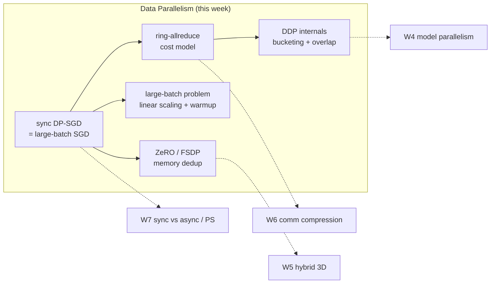
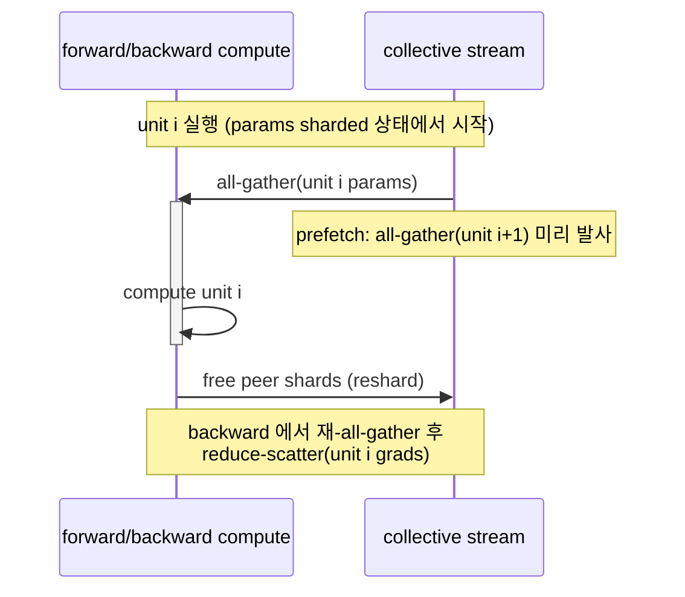

# Week 03 — Data Parallelism

> gradient 를 어떻게 나눠 계산하고 합치는가. Synchronous DP-SGD 의 수학적 등가성 → ring-allreduce 통신 비용 → PyTorch DDP internals → large-batch 문제 → ZeRO/FSDP 로 이어지는 data parallelism 의 전체 계보.

## Learning goals

이 챕터를 마치면 다음을 할 수 있어야 한다 (전부 시험 가능한 형태):

1. Synchronous data-parallel SGD 에서 **per-replica gradient averaging 이 large-batch SGD 와 수학적으로 등가**임을 유도하고, 등가성이 깨지는 조건 (loss normalization, BatchNorm, non-deterministic ops) 을 나열할 수 있다.
2. **Ring-allreduce** 를 reduce-scatter + all-gather 2단계로 단계별 추적하고, per-node 통신량 $2\frac{p-1}{p}N$ 을 유도하며, 이것이 bandwidth-optimal 인 이유를 논증할 수 있다.
3. $\alpha$–$\beta$ cost model 로 allreduce 시간을 계산하고, latency-bound 와 bandwidth-bound regime 의 경계 크기를 구할 수 있다.
4. PyTorch **DDP 의 gradient bucketing, computation–communication overlap, autograd hook, `no_sync`** 동작을 실제 소스 코드 수준에서 설명하고, gradient accumulation 의 통신 절감량을 계산할 수 있다.
5. **Linear scaling rule + warmup** 을 주어진 batch size 에 적용하고, 왜 필요한지·언제 부서지는지 (critical batch size, generalization 논쟁) 를 설명할 수 있다.
6. **ZeRO stage 1/2/3** 각각이 shard 하는 대상과 per-device 메모리 수식 ($K$ 계수 포함), 통신량 변화 (stage 3 에서 1.5×) 를 유도하고, FSDP 의 unit 단위 동작에 매핑할 수 있다.

## Why this matters

[W2](../02-memory-issues/) 에서 봤듯 학습 메모리는 model states (fp16 mixed-precision Adam 기준 파라미터당 16 bytes) + activations 로 구성된다. 모델이 한 device 에 "들어가기만 하면", 남은 문제는 **처리량(throughput)** 이다 — 그리고 throughput 을 올리는 가장 단순한 축이 data parallelism 이다: 모델 전체를 $p$ 개 device 에 복제하고 데이터를 나눈다.

DP 가 이 과목의 척추인 이유:

- **모든 후속 주차의 전제**. W4 의 pipeline/tensor parallelism 은 "모델이 한 device 에 안 들어갈 때" DP 를 보완하는 축이고, W5 의 3D parallelism 에서 DP 는 최외곽 축이다. W6 의 gradient compression 은 DP 의 allreduce 트래픽을 줄이는 문제이고, W7 의 sync/async 논쟁은 DP 의 동기화 방식 선택 문제다. W10 의 FedAvg 도 결국 "통신을 아끼는 DP" 다.
- **통신 비용 모델의 원형**. ring-allreduce 의 $2\frac{p-1}{p}N$ 유도와 $\alpha$–$\beta$ 분해는 이후 모든 병렬화 기법의 통신량을 계산하는 공용 도구다.
- **ZeRO 로의 다리**. naive DP 는 model states 를 $p$ 번 복제한다 — W2 의 메모리 산수를 그대로 낭비하는 구조. ZeRO 는 "DP 의 등가성은 유지하면서 중복만 제거" 하는 메모리 최적화이고, 이 관점이 FSDP·W5 의 hybrid 구성까지 이어진다.



---

## 1. Synchronous data-parallel SGD: 정식화와 등가성

### 1.1 Setup

학습 목표는 empirical risk 최소화다:

$$L(w) = \frac{1}{|D|}\sum_{x \in D} \ell(w; x), \qquad w_{t+1} = w_t - \eta \, \hat g_t, \quad \hat g_t = \frac{1}{B}\sum_{x \in \mathcal{B}_t} \nabla \ell(w_t; x)$$

여기서 $\mathcal{B}_t$ 는 크기 $B$ 의 minibatch. Data parallelism 은 이 한 스텝을 $p$ 개 worker 로 나눈다:

1. 모든 worker $r \in \{0,\dots,p-1\}$ 이 **동일한 파라미터 $w_t$ 의 복제본(replica)** 을 가진다.
2. Global batch $\mathcal{B}_t$ 를 서로소인 local shard $\mathcal{B}_t^{(r)}$ (각 크기 $b = B/p$) 로 나눈다.
3. 각 worker 가 local gradient 를 계산한다: $g_t^{(r)} = \frac{1}{b}\sum_{x \in \mathcal{B}_t^{(r)}} \nabla \ell(w_t; x)$
4. **Allreduce 로 평균**한다: $\bar g_t = \frac{1}{p}\sum_{r} g_t^{(r)}$
5. 모든 worker 가 동일한 update 를 적용한다: $w_{t+1} = w_t - \eta\, U(\bar g_t, \text{opt state})$

### 1.2 Large-batch SGD 와의 등가성

핵심 정리: **step 4 의 평균은 global batch 전체의 gradient 와 정확히 같다.**

$$\bar g_t = \frac{1}{p}\sum_{r=0}^{p-1} \frac{1}{b}\sum_{x \in \mathcal{B}_t^{(r)}} \nabla\ell(w_t;x) = \frac{1}{pb}\sum_{x \in \mathcal{B}_t} \nabla\ell(w_t;x) = \frac{1}{B}\sum_{x \in \mathcal{B}_t} \nabla\ell(w_t;x)$$

즉 $p$-way synchronous DP 한 스텝 = batch $B$ 짜리 단일 device SGD 한 스텝. 그리고 귀납법으로: 초기 파라미터가 동일하고 ($w_0^{(r)} = w_0$), 매 스텝 동일한 $\bar g_t$ 에 동일한 deterministic optimizer 를 적용하면 replica 들은 **영원히 bitwise 로 동기 상태를 유지**한다. 별도의 파라미터 동기화가 필요 없는 이유다 (lab 2 에서 `cross-rank spread = 0.0` 으로 실측).

**등가성 조건** — 시험에서 "언제 깨지는가" 로 자주 나온다:

| 조건 | 깨지는 경우 |
|---|---|
| Loss 가 local batch 에 대한 **mean** | loss 를 sum 으로 정의하면 per-worker gradient 가 local mean 의 $b$ 배가 되어 $\bar g = \frac{1}{p}\sum_{x\in\mathcal{B}}\nabla\ell = b\cdot\frac{1}{B}\sum\nabla\ell$ — effective lr 이 local batch size $b\ (=B/p)$ 배 |
| 샘플 간 독립적인 forward | **BatchNorm** 은 batch 통계를 쓰므로 local batch $b$ 에 대한 통계 ≠ global batch $B$ 에 대한 통계. DP+BN 은 "per-worker BN" 이라는 다른 loss 를 최적화하는 것 (Goyal et al. 은 이를 loss 정의의 일부로 간주; 정확한 등가가 필요하면 `SyncBatchNorm`) |
| 동일 초기화 | DDP 는 construction 시점에 rank 0 의 파라미터를 broadcast 해서 보장 (`_sync_module_states`) |
| Deterministic optimizer | update 가 $(w, \bar g, \text{state})$ 만의 함수여야 함. rank 별로 다른 RNG 를 쓰는 op (dropout) 은 replica 동기성은 깨지 않지만 (grad 는 평균되므로) single-process run 과의 bitwise 일치는 깨짐 |
| 서로소·균등 shard | `DistributedSampler` 가 담당. dataset 크기가 $p$ 로 안 나눠지면 padding(중복 샘플) 으로 미세한 bias — `drop_last` 트레이드오프 |

### 1.3 왜 나누는가: variance 와 scaling 의 두 모드

i.i.d. 샘플 가정에서 $\mathrm{Var}[\hat g] \propto 1/B$. Worker 를 $p$ 배 늘려 $B$ 를 $p$ 배 키우면 gradient noise 가 $1/p$ 로 줄고, 이것이 §5 의 "더 큰 learning rate 를 쓸 수 있다" 는 linear scaling rule 의 통계적 근거가 된다.

용어 구분:

- **Weak scaling**: worker 를 늘리며 per-worker batch $b$ 고정 → global $B = pb$ 증가. 실무 표준 (per-device 연산 효율 유지). 단, optimization 특성이 변한다 → §5.
- **Strong scaling**: global $B$ 고정, worker 증가 → per-worker $b = B/p$ 감소. 수학적으로 동일한 학습이지만 $b$ 가 작아지면 per-device 연산 효율이 떨어지고 통신 비중이 커진다.

---

## 2. Gradient 를 합치는 두 구조: AllReduce vs Parameter Server (개요)

합쳐야 할 것은 정해졌다 ($\bar g$). **어떤 통신 구조로 합치는가**에 두 계보가 있다. 이번 주는 allreduce 를 깊게 다루고, parameter server (PS) 는 W7 에서 consistency model 과 함께 정면으로 다룬다 — 여기서는 대비만.

| | AllReduce (collective) | Parameter Server |
|---|---|---|
| 구조 | 대칭적 peer-to-peer collective. 중앙 노드 없음 | worker ↔ server 비대칭. worker 는 grad 를 **push**, 갱신된 파라미터를 **pull** (Li et al. 2014) |
| Per-node 통신량 | ring 기준 $2\frac{p-1}{p}N \approx 2N$, **$p$ 와 무관** | server ingress 가 $O(pN)$ — server 를 여러 대로 shard 하지 않으면 병목 |
| 동기화 | 본질적으로 synchronous (전원이 참여해야 완료) | 유연: sync / async / bounded-stale 모두 가능 (W7 의 BSP/ASP/SSP) |
| 장애 | 한 rank 라도 죽으면 collective 전체 실패 (→ W9 elastic training) | worker 실패에 자연스럽게 견딤, server 는 replication |
| 주 용도 | dense model 의 데이터센터 학습 (오늘날 LLM 표준) | sparse embedding (추천), async 시대의 유산, federated learning 의 구조적 조상 (W10) |

Dense LLM 학습이 allreduce 로 수렴한 핵심 이유: (i) per-node 통신량이 $p$ 에 무관해 bandwidth 관점에서 확장 가능하고, (ii) synchronous 라서 §1 의 등가성이 그대로 성립해 수렴 분석이 단순하며, (iii) GPU 클러스터의 균질한 고대역 인터커넥트에서 straggler 문제가 상대적으로 작다. async 의 staleness 트레이드오프는 W7 에서 본격적으로.

---

## 3. Ring-AllReduce: 알고리즘과 통신 비용

### 3.1 Collective 어휘

$p$ 개 rank 가 각자 길이 $N$ (bytes 기준) 의 벡터 $a_r$ 를 가질 때:

- **reduce-scatter**: 합 $\sum_r a_r$ 을 계산하되, 결과를 $p$ 개 chunk 로 나눠 rank 마다 한 chunk 씩 소유.
- **all-gather**: 각 rank 가 가진 chunk 를 전원에게 복제해 전체 벡터를 완성.
- **allreduce = reduce-scatter + all-gather**. 이 분해는 항등이며, ZeRO stage 2 (§6) 가 이 분해를 그대로 착취한다.

### 3.2 Ring 알고리즘 유도

Rank 들을 논리적 ring 으로 배열한다: rank $r$ 은 항상 오른쪽 이웃 $(r{+}1) \bmod p$ 에게 보내고 왼쪽 이웃 $(r{-}1) \bmod p$ 에게서 받는다. 각자의 벡터를 $p$ 개 chunk $c_0,\dots,c_{p-1}$ 로 자른다 (chunk 크기 $N/p$).

**Phase 1 — reduce-scatter ($p-1$ steps).** Step $t$ 에서 rank $r$ 은:
- chunk $(r - t) \bmod p$ 를 송신
- chunk $(r - t - 1) \bmod p$ 를 수신하여 **자기 값에 누적** (`+=`)

각 chunk 는 ring 을 한 바퀴 돌며 $p-1$ 번 누적되어, step 이 끝나면 **rank $r$ 이 chunk $(r+1) \bmod p$ 의 완전한 합을 소유**한다.

**Phase 2 — all-gather ($p-1$ steps).** Step $t$ 에서 rank $r$ 은:
- chunk $(r + 1 - t) \bmod p$ 를 송신 (완성본)
- chunk $(r - t) \bmod p$ 를 수신하여 **덮어쓰기** (`copy_`)

완성된 chunk 들이 ring 을 한 바퀴 더 돌아 전원이 전체 합을 가진다.

**Worked Example 1 — $p=4$ 에서 chunk 1 의 여정.** Chunk 1 의 완전합은 최종적으로 rank 0 이 만든다 ($(r{+}1)\bmod 4 = 1 \Rightarrow r=0$):

| RS step | 송신자 → 수신자 | chunk 1 의 내용 (수신 후) |
|---|---|---|
| $t=0$ | rank 1 → rank 2 | $a_1[1] + a_2[1]$ |
| $t=1$ | rank 2 → rank 3 | $a_1[1] + a_2[1] + a_3[1]$ |
| $t=2$ | rank 3 → rank 0 | $a_0[1] + a_1[1] + a_2[1] + a_3[1]$ = 완전합 |
| AG $t=0,1,2$ | rank 0 → 1 → 2 → 3 | 완전합이 ring 을 돌아 전원 소유 |

동시에 다른 3개 chunk 도 각자 한 스텝씩 어긋난 채 같은 여정을 돈다 — **매 스텝 모든 링크가 동시에 사용**되는 것이 ring 의 요점이다. (직접 구현·검증: [lab 1](lab/lab1_ring_allreduce.py). blocking send 를 전원이 동시에 하면 순환 대기로 deadlock — `isend` 후 `recv` 로 회피하는 것까지가 구현의 전부다.)

### 3.3 통신량과 $\alpha$–$\beta$ cost model

Per-node 송신량: 두 phase 각각 $p-1$ 스텝 × chunk 크기 $N/p$ 이므로

$$V_{\text{node}} = 2(p-1)\cdot\frac{N}{p} = 2\frac{p-1}{p}N \;\xrightarrow{p\to\infty}\; 2N$$

**$p$ 에 (거의) 무관** — worker 를 아무리 늘려도 노드당 보내는 양이 $2N$ 으로 상수라는 것이 ring-allreduce 가 DP 를 확장 가능하게 만든 핵심이다 (Baidu 가 2017 년 DL 에 도입한 이유; Gibiansky 2017, Horovod 가 프레임워크화).

시간 모델 — 링크당 latency $\alpha$, byte 당 전송 시간 $\beta$ (= 1/bandwidth), byte 당 reduction 연산 $\gamma$ (Thakur et al. 2005 표기):

$$T_{\text{ring}} = \underbrace{2(p-1)\,\alpha}_{\text{latency term}} + \underbrace{2\frac{p-1}{p}N\beta}_{\text{bandwidth term}} + \underbrace{\frac{p-1}{p}N\gamma}_{\text{reduction}}$$

두 가지 regime:

- **Bandwidth-bound** ($N$ 큼): $T \approx 2N\beta$. ring 이 최적.
- **Latency-bound** ($N$ 작음): $T \approx 2(p-1)\alpha$ — **$p$ 에 선형**. 작은 텐서를 여러 번 보내면 여기에 갇힌다. 경계는 두 항이 같아지는 $N^* = p\alpha/\beta$.

**Worked Example 2 — 수치 대입.** 350M-param 모델의 fp32 gradient: $N = 1.4$ GB. $p = 8$, 링크 bandwidth 25 GB/s ($\beta^{-1}$), $\alpha = 5\,\mu s$:

- bandwidth 항: $2 \cdot \frac{7}{8} \cdot \frac{1.4\,\text{GB}}{25\,\text{GB/s}} = 98$ ms
- latency 항: $2 \cdot 7 \cdot 5\,\mu s = 70\,\mu s$ — 완전히 무시 가능
- 경계 크기: $N^* = p\alpha/\beta = 8 \cdot 5\times 10^{-6} \cdot 25\times 10^9 = 1$ MB. **1 MB 미만 텐서는 latency-bound** — 파라미터를 레이어별로 (수 KB~수 MB) 따로 allreduce 하면 손해라는 뜻이고, 이것이 §4 의 gradient bucketing (기본 25 MiB) 과 Horovod 의 tensor fusion 의 존재 이유다.

### 3.4 Bandwidth optimality 와 한계

**하한 논증**: allreduce 의 출력은 전원의 입력에 의존한다. 어떤 알고리즘이든 각 노드는 자신에게 없는 정보 — 다른 $p-1$ 개 노드 몫의 reduce 결과 $\frac{p-1}{p}N$ — 를 받아야 하고, 대칭적으로 자기 기여분을 내보내야 한다. reduce-scatter 와 all-gather 각각의 per-node 하한이 $\frac{p-1}{p}N$ 이므로 allreduce 의 하한은 $2\frac{p-1}{p}N$ — ring 은 이를 정확히 달성한다 (Patarasuk & Yuan 2009 의 bandwidth-optimality 증명).

한계는 latency 항 $2(p-1)\alpha$ 다. $p$ 가 수백~수천이면 작은 메시지에서 ring 은 최악이 된다. 대안은 tree 기반 ($O(\log p)$ hops — NCCL 2.4 부터 ring 과 double binary tree 를 크기·규모에 따라 선택) 또는 recursive halving-doubling. 시험 포인트: **"ring 은 bandwidth-optimal 이지만 latency-optimal 이 아니다."**

---

## 4. PyTorch DDP internals

`torch.nn.parallel.DistributedDataParallel` (이하 DDP) 는 §1 의 알고리즘을 "backward 에 통신을 숨기는" 엔지니어링으로 구현한다 (Li et al., VLDB 2020). 아래는 torch 2.13 의 `torch/nn/parallel/distributed.py` 실제 소스로 검증한 내용이다.

### 4.1 Construction

- rank 0 의 파라미터·버퍼를 전 rank 에 broadcast (`_sync_module_states`) — §1.2 의 "동일 초기화" 조건 충족. 이후 학습 중 **파라미터는 절대 다시 broadcast 되지 않는다** (동기성이 수학적으로 보장되므로). 버퍼 (BN running stats 등) 는 매 iteration rank 0 에서 broadcast.
- 파라미터들을 **bucket** 으로 묶는다. 기본 상한 `bucket_cap_mb = 25` MiB, 첫 bucket 은 1 MiB (`dist._DEFAULT_FIRST_BUCKET_BYTES`) — 첫 bucket 을 작게 해서 첫 allreduce 를 빨리 발사한다.
- Bucket 배정은 **`model.parameters()` 의 역순** 근사 — backward 는 대략 forward 의 역순으로 gradient 를 완성하므로, 역순으로 묶어야 "먼저 완성되는 gradient 들이 같은 bucket" 이 되어 일찍 발사할 수 있다.

### 4.2 Backward: hook → bucket → async allreduce

```
backward 진행 방향 ──────────────────────────────────▶ 시간
compute:  [grad L_n]...[grad L_k]  [grad L_{k-1}]...[grad L_1]   (마지막 레이어부터)
                    │ bucket 2 full          │ bucket 1 full
comm:               └▶ allreduce(bucket 2) ──┴▶ allreduce(bucket 1) ─▶ wait & copy back
                        (async, backward 와 동시 진행 = overlap)
```

1. DDP 는 각 파라미터에 **autograd hook** 을 등록한다. 해당 파라미터의 gradient accumulation 이 끝나는 순간 hook 이 발화한다.
2. 한 bucket 의 **모든** gradient 가 준비되면 그 bucket 에 대한 **asynchronous allreduce** 를 발사한다 — backward 의 나머지 계산과 통신이 겹친다 (computation–communication overlap). 이것이 DDP 성능의 절반이다.
3. backward 종료 시 모든 pending allreduce 를 기다린 뒤 평균값을 `param.grad` 에 기록한다. 평균은 world size 로 나눠서: 기본 comm hook 은 **allreduce 전에** `tensor.div_(world_size)` 한다 (fp16 overflow 방지 — `ddp_comm_hooks/default_hooks.py` 의 주석 그대로).
4. 모든 rank 가 **같은 순서로 같은 bucket** 을 reduce 해야 한다 (collective 는 순서가 어긋나면 다른 내용끼리 합쳐지거나 hang). 그래서 bucket 발사 준비가 안 된 rank 가 있으면 전체가 기다린다.

**첫 iteration 의 bucket 재구성**: 파라미터 정의 역순은 실제 gradient 완성 순서의 근사일 뿐이다. DDP 는 첫 backward 에서 **실제 ready 순서를 기록**했다가 두 번째 iteration 의 forward 직전에 bucket 을 한 번 재구성한다 (`Reducer._rebuild_buckets()`, 소스 주석: "Buckets are rebuilt only once during a training period"). 이후 순서는 고정된다.

### 4.3 `no_sync` 와 gradient accumulation

```python
with ddp.no_sync():                  # require_backward_grad_sync = False
    for micro in micros[:-1]:
        (loss_fn(ddp(micro)) / K).backward()   # 통신 없음, grad 에 local 누적
(loss_fn(ddp(micros[-1])) / K).backward()      # 이번 backward 만 allreduce
optimizer.step()
```

- `no_sync()` 는 단순히 `require_backward_grad_sync` 플래그를 내리는 context manager — 그 안의 backward 는 hook 이 통신을 건너뛰고 `param.grad` 에 누적만 한다.
- **등가성의 근거는 allreduce 의 선형성**: $\text{AR}(\sum_k g_k) = \sum_k \text{AR}(g_k)$. 따라서 매 micro-batch 마다 allreduce 해도 (naive), 모았다가 한 번 해도 결과는 동일하고, 통신량만 $K$ 배 차이난다 — 즉 `no_sync` 는 통신을 $\frac{K-1}{K}$ 절감한다. [lab 3](lab/lab3_no_sync_accumulation.py) 에서 comm hook 으로 호출 횟수를 세서 실측 (40 vs 10).
- 주의 1: micro-batch loss 는 $1/K$ 로 스케일해야 mean-of-means = mean-over-union. 주의 2: 마지막 micro-batch 는 **forward 도** context 밖에서 — DDP 는 forward 시점에 이번 backward 의 동기화 여부를 기록한다.

### 4.4 실패 모드

- **Unused parameters**: forward 에 참여하지 않은 파라미터는 grad 가 영영 준비되지 않아 그 bucket 이 발사되지 못하고 **전 rank 가 hang**. `find_unused_parameters=True` 는 forward output 에서 autograd graph 를 역추적해 미사용 파라미터를 미리 ready 처리 — 대신 매 iteration 그래프 순회 오버헤드.
- **Rank 간 divergent control flow**: rank 마다 다른 branch 를 타서 collective 호출 횟수·순서가 어긋나면 hang 또는 잘못된 합.
- **불균등 데이터 (마지막 batch)**: 어떤 rank 만 루프를 먼저 끝내면 남은 rank 의 collective 가 영원히 기다린다 — `DistributedSampler` 의 padding 또는 `Join` context 로 해결.

---

## 5. Large-batch training: linear scaling rule 과 warmup

### 5.1 문제

Weak scaling 으로 $p$ 를 늘리면 $B$ 가 커진다. 고정된 epoch 예산에서 batch 가 $k$ 배 커지면 **update 횟수는 $1/k$** 이 된다. 같은 하이퍼파라미터로는 학습이 덜 진행된 상태로 끝난다 — large-batch 는 시스템 문제가 아니라 **optimization 문제**다.

### 5.2 Linear scaling rule (Goyal et al. 2017)

> batch size 를 $k$ 배 하면 learning rate 도 $k$ 배 한다.

비형식 유도: 작은 batch $\mathcal{B}_j$ 로 $k$ 스텝 vs 합쳐진 batch 로 1 스텝을 비교하면

$$w_{t+k} = w_t - \eta \sum_{j<k} \nabla L(w_{t+j}; \mathcal{B}_j), \qquad \hat w_{t+1} = w_t - k\eta \cdot \frac{1}{k}\sum_{j<k} \nabla L(w_t; \mathcal{B}_j)$$

$\nabla L(w_{t+j}) \approx \nabla L(w_t)$ (gradient 가 $k$ 스텝 동안 크게 안 변함) 이면 두 결과가 같다 — lr 을 $k\eta$ 로 잡을 때만. §1.3 의 variance 감소 ($\propto 1/B$) 가 이 큰 lr 을 견딜 수 있게 해 준다.

**가정이 깨지는 곳이 곧 처방이 필요한 곳**: 학습 초반에는 gradient 가 급변해서 근사가 무효 → 큰 lr 로 시작하면 발산. 처방이 **gradual warmup**: lr 을 $\eta$ 에서 시작해 첫 5 epochs 동안 선형으로 $k\eta$ 까지 올린다.

**Worked Example 3 — ResNet-50/ImageNet (Goyal et al. 의 실측 설정).**
- 기준: batch 256, lr 0.1 (30/60/80 epoch 에 ÷10).
- 256 GPUs × per-GPU 32 = **batch 8192** 로 확장: $k = 32$, target lr $= 0.1 \times \frac{8192}{256} = 3.2$. 첫 5 epochs 동안 0.1 → 3.2 선형 warmup, 이후 동일 스케줄.
- 결과: batch 256 과 top-1 accuracy 가 오차범위 내로 일치, 90-epoch 학습이 256 GPUs 에서 **1시간**. 단 **8k 를 넘어서면** (16k, 32k, …) 이 레시피로도 정확도가 무너지기 시작한다.

### 5.3 한계와 generalization 논쟁

- **Critical batch size**: batch 를 키우면 어느 지점까지는 필요한 스텝 수가 거의 $1/k$ 로 줄다가 (perfect scaling), 그 이후 수확 체감을 거쳐 아무리 키워도 스텝이 안 주는 포화 지점에 도달한다 (Shallue et al. 2019 의 대규모 실측). McCandlish et al. 2018 은 이 경계를 **gradient noise scale** (gradient 의 signal-to-noise 비) 로 예측한다 — noise 가 이미 작으면 averaging 을 더 해도 얻을 정보가 없다.
- **Generalization gap 논쟁**: Keskar et al. 2017 은 large-batch 가 sharp minima 로 수렴해 일반화가 나쁘다고 주장했다. Goyal et al. 은 lr scaling + warmup 만 제대로 하면 8k 까지는 **generalization gap 이 없다** 는 것을 보였다 — 즉 관찰된 gap 의 상당 부분은 본질적 현상이 아니라 **잘못 조정된 optimization** 이었다. 다만 critical batch size 를 넘어서는 영역의 한계는 실재한다.
- 더 밀어붙이는 도구 (LARS 의 layer-wise trust ratio 로 batch 32k 등) 는 W6 에서.

---

## 6. ZeRO: DP 의 메모리 중복 제거

### 6.1 문제 — DP 는 메모리를 $p$ 배 낭비한다

[W2](../02-memory-issues/) 의 산수: 파라미터 수 $\Psi$, Adam + fp16 mixed precision 에서 per-device model states 는

$$\underbrace{2\Psi}_{\text{fp16 params}} + \underbrace{2\Psi}_{\text{fp16 grads}} + \underbrace{K\Psi}_{\text{optimizer states}} = (4+K)\Psi \text{ bytes}, \qquad K = 12 \;(\text{fp32 params } 4 + \text{momentum } 4 + \text{variance } 4)$$

naive DP 는 이 $16\Psi$ 를 **모든 rank 에 통째로 복제**한다. 7.5B 모델이면 rank 당 120 GB — 계산(forward/backward)은 나눴으면서 저장은 하나도 안 나눈 셈이다. ZeRO (Zero Redundancy Optimizer; Rajbhandari et al. 2020) 의 관찰: **DP 의 등가성에 필요한 것은 "각 rank 가 매 순간 전체를 들고 있는 것" 이 아니라 "필요한 시점에 필요한 조각을 쓸 수 있는 것"** 이다. 그래서 model states 를 DP degree $N_d$ 로 shard 하고, 필요할 때 통신으로 재구성한다.

**위치 부여 (중요)**: ZeRO 는 여전히 **data parallelism** 이다. 각 rank 는 서로 다른 데이터로 **모델 전체의 연산**을 수행한다 — 나눈 것은 계산이 아니라 **저장**이다. 레이어 연산 자체를 쪼개는 tensor parallelism (W4) 과 축이 다르다.

### 6.2 세 stage 의 메모리 수식

| Stage | shard 대상 | per-device memory | 통신량 (per step) |
|---|---|---|---|
| baseline DP | 없음 | $(4+K)\Psi = 16\Psi$ | $2\Psi$ (allreduce) |
| **Stage 1** ($P_{os}$) | optimizer states | $4\Psi + \frac{K\Psi}{N_d}$ | $2\Psi$ (변화 없음) |
| **Stage 2** ($P_{os+g}$) | + gradients | $2\Psi + \frac{(2+K)\Psi}{N_d}$ | $2\Psi$ (변화 없음) |
| **Stage 3** ($P_{os+g+p}$) | + parameters | $\frac{(4+K)\Psi}{N_d} = \frac{16\Psi}{N_d}$ | $3\Psi$ (**1.5×**) |

각 stage 의 메커니즘:

- **Stage 1**: 각 rank 는 optimizer states 의 $1/N_d$ 만 보유하고, 자기 담당 $1/N_d$ 파라미터 구간만 update 한다. gradient 는 여전히 전체 allreduce 하므로 통신 불변. update 후 갱신된 파라미터 조각을 all-gather — 이 all-gather 는 원래 allreduce 의 후반부 (RS+AG 분해, §3.1) 와 재배치될 수 있어 총량이 안 변한다.
- **Stage 2**: gradient 도 전체를 들고 있을 이유가 없다 — 어차피 rank $r$ 은 자기 구간의 update 에만 gradient 를 쓴다. allreduce 대신 **reduce-scatter** ($\Psi$) 로 각 rank 가 자기 구간의 평균 gradient 만 받고, update 후 파라미터 all-gather ($\Psi$). 합계 $2\Psi$ — allreduce 와 정확히 같다. **stage 2 까지는 통신 공짜**라는 것이 시험 포인트.
- **Stage 3**: 파라미터마저 shard. forward 때 현재 레이어(들)의 파라미터를 **all-gather 로 일시 재구성**하고 계산 후 즉시 해제, backward 때 다시 all-gather, gradient 는 reduce-scatter. 통신 = forward AG $\Psi$ + backward AG $\Psi$ + grad RS $\Psi$ = $3\Psi$, baseline 의 **1.5배**. 메모리가 $N_d$ 에 완전 반비례하는 대가다.

**Worked Example 4 — 7.5B 모델, $N_d = 64$** (ZeRO 논문 Figure 1 설정):

| 구성 | 수식 | per-device |
|---|---|---|
| baseline | $16 \times 7.5$ | 120 GB |
| Stage 1 | $4\times7.5 + \frac{12\times7.5}{64} = 30 + 1.41$ | 31.4 GB |
| Stage 2 | $2\times7.5 + \frac{14\times7.5}{64} = 15 + 1.64$ | 16.6 GB |
| Stage 3 | $\frac{16\times7.5}{64}$ | **1.9 GB** |

120 GB (어느 GPU 에도 안 들어감) → 1.9 GB. 단 이 표는 model states 만이다 — activations 는 별도이고, 그건 W2 의 checkpointing 과 W4 의 sequence parallelism 몫이다.

### 6.3 트레이드오프

- Stage 3 의 1.5× 통신은 **bandwidth 가 충분한 인터커넥트 (NVLink/IB) 전제**. 느린 네트워크에서는 all-gather 가 forward/backward 를 블로킹해 throughput 이 무너진다 — W5 에서 "DP 는 최외곽, 통신 빈도 낮은 축" 원칙과 연결.
- Sharding 은 $N_d$ 가 클수록 이득이지만, per-rank 조각이 너무 작아지면 collective 효율이 떨어진다 (§3.3 latency regime).
- Stage 2 부터는 gradient 전체가 존재하는 순간이 없어, gradient 전체를 보는 기법 (예: 전역 grad norm 기반 일부 로직, 일부 압축 기법) 과의 결합이 까다로워진다.

## 7. FSDP: PyTorch-native ZeRO-3

`torch.distributed.fsdp` (Zhao et al. 2023) 는 ZeRO-3 를 PyTorch 에 이식하며 자체 설계를 택했다.



- **Unit 과 FlatParameter**: 모델을 unit (예: transformer block 단위, wrapping policy 로 지정) 으로 나누고, unit 안의 모든 파라미터를 하나의 **FlatParameter** 로 이어붙인 뒤 $1/w$ 씩 shard 한다. 통신이 "레이어당 여러 작은 텐서" 가 아니라 "unit 당 큰 flat 텐서 한 번" 이 된다 — §3.3 의 latency-bound 회피 + 균등 sharding (패딩 후 등분).
- **생애주기**: forward 에서 unit 진입 시 all-gather 로 파라미터 전체 재구성 → 계산 → 즉시 peer shard 해제 (reshard). backward 에서 다시 all-gather → grad 계산 → **reduce-scatter** 로 각 rank 가 자기 shard 의 평균 gradient 만 보유. optimizer 는 local shard 만 update. peak memory ≈ $\frac{16\Psi}{w}$ + "현재 materialize 된 unit(들)" 크기.
- **Overlap 장치**: backward/forward **prefetch** (다음 unit 의 all-gather 를 현재 계산과 겹침), **rate limiter** (inflight all-gather 수 제한 — overlap 를 공격적으로 하면 메모리 스파이크가 커지는 트레이드오프의 조절 손잡이).
- **Sharding strategy 로 ZeRO stage 매핑**: `FULL_SHARD` ≈ ZeRO-3, `SHARD_GRAD_OP` ≈ ZeRO-2 (forward 후 파라미터를 해제하지 않고 backward 까지 유지), `NO_SHARD` ≈ DDP, `HYBRID_SHARD` = node 안 shard + node 간 replicate (W5 예고).
- **DeepSpeed ZeRO-3 와의 구현 차이**: FSDP 는 unit 단위 FlatParameter 로 큰 collective 를 만들고 native autograd 와 통합; DeepSpeed 는 파라미터 개별 partition + 실행 trace 기반 prefetch. unit 크기는 트레이드오프 손잡이다 — 크면 bandwidth 효율↑·메모리 스파이크↑, 작으면 반대. (참고: torch 2.4+ 의 FSDP2/`fully_shard` 는 FlatParameter 대신 파라미터별 DTensor sharding 으로 재설계됐다.)

---

## Common misconceptions

1. **"DP 로 $p$ 개 worker 가 각자 스텝을 밟으니 $p$ 배 빨리 수렴한다"** — 아니다. $p$-way sync DP 의 한 스텝은 **large-batch 한 스텝**과 등가다 (§1.2). 같은 epoch 수면 update 횟수가 $1/p$ 이고, 이를 lr scaling 으로 보상해야 하며 (§5), critical batch size 를 넘으면 그마저 안 통한다. wall-clock 이득 ≠ 스텝 수 이득.
2. **"Ring-allreduce 는 최적의 allreduce 알고리즘이다"** — bandwidth-optimal 일 뿐이다. latency 항이 $2(p-1)\alpha$ 로 $p$ 에 선형이라, 작은 메시지·큰 $p$ 에서는 tree 기반 ($O(\log p)$) 이 우월하다 (§3.4).
3. **"DDP 는 backward 가 끝난 뒤 gradient 를 allreduce 한다"** — 아니다. bucket 이 준비되는 즉시 backward **도중에** async 로 발사해 계산과 겹친다 (§4.2). "backward 후 통신" 은 §1 의 naive 알고리즘 서술이지 DDP 구현이 아니다. (같은 맥락: DDP 가 매 스텝 파라미터를 broadcast 한다는 것도 오개념 — construction 때 한 번뿐.)
4. **"`no_sync` 는 그 backward 의 gradient 를 버린다"** — 버리지 않는다. `param.grad` 에 local 누적되고, context 를 나온 뒤 첫 sync backward 에서 **누적분 전체가** 평균된다. allreduce 의 선형성 덕에 결과는 naive 누적과 동일하고 통신만 $\frac{K-1}{K}$ 준다 (§4.3, lab 3).
5. **"ZeRO-3/FSDP 는 model parallelism 이다"** — 아니다. 연산은 여전히 "각 rank 가 다른 데이터로 모델 전체를 계산" 하는 DP 다. shard 되는 것은 **저장** (model states) 이고, 계산 직전에 all-gather 로 임시 복원된다. 레이어의 행렬곱 자체를 쪼개는 tensor parallelism (W4) 과 구분할 것 (§6.1).
6. **"ZeRO 는 stage 를 올릴수록 통신이 늘어난다"** — stage 1·2 는 통신량이 baseline allreduce 와 정확히 같다 ($2\Psi$). 늘어나는 것은 stage 3 뿐이고 그것도 1.5× ($3\Psi$) 다 (§6.2). "메모리 절감 = 통신 증가" 라는 직관은 stage 3 에만 부분적으로 맞다.
7. **"Large-batch 는 본질적으로 generalization 이 나쁘다"** — Goyal et al. 은 lr scaling + warmup 만으로 8k 까지 gap 이 사라짐을 보였다. 관찰된 gap 의 상당 부분은 optimization 미조정이었다. 다만 critical batch size 이후의 수확 체감은 실재한다 (§5.3) — "논쟁의 양쪽" 을 모두 말할 수 있어야 한다.
8. **"loss 를 sum 으로 쓰든 mean 으로 쓰든 상수 차이라 상관없다"** — DP 에서는 상관있다. gradient averaging 은 per-rank loss 가 local-batch **mean** 일 때만 global-batch mean 과 등가다. sum 이면 $\bar g = b\cdot\frac{1}{B}\sum\nabla\ell$ 이 되어 effective lr 이 local batch size $b\ (=B/p)$ 배 튄다 (§1.2).

## Glossary

- **data parallelism** — replicating the full model on every worker and partitioning each global batch across workers; gradients are averaged so every replica applies the identical update.
- **allreduce** — a collective that computes an elementwise reduction (e.g., sum) over all ranks' tensors and leaves the result on every rank; decomposable as reduce-scatter followed by all-gather.
- **reduce-scatter** — a collective where each rank ends up with one distinct $1/p$ chunk of the fully reduced tensor.
- **all-gather** — a collective where every rank's chunk is replicated to all ranks, reconstructing the full tensor everywhere.
- **ring-allreduce** — an allreduce over a logical ring taking $2(p{-}1)$ steps of $N/p$-sized messages; per-node traffic $2\frac{p-1}{p}N$, which is bandwidth-optimal.
- **$\alpha$–$\beta$ model** — communication cost model $T = \alpha \cdot (\#\text{messages}) + \beta \cdot (\#\text{bytes})$ separating per-message latency from per-byte bandwidth cost.
- **gradient bucketing** — DDP's grouping of gradients into fixed-size buffers (default 25 MiB) so each allreduce moves a large tensor, amortizing per-message latency.
- **computation–communication overlap** — launching asynchronous collectives on ready buckets while backward is still computing remaining gradients.
- **`no_sync`** — DDP context manager that skips gradient synchronization for its backward passes, letting gradients accumulate locally until the next synced backward.
- **gradient accumulation** — summing gradients over $K$ micro-batches before one optimizer step, emulating a $K\times$ larger batch under a memory budget.
- **linear scaling rule** — when the minibatch size is multiplied by $k$, multiply the learning rate by $k$ (valid while $\nabla L$ changes slowly across steps).
- **warmup** — ramping the learning rate from a small value to its target over the first epochs to protect the early phase where the linear-scaling assumption fails.
- **critical batch size** — the batch size beyond which increasing $B$ stops reducing the number of steps to a target loss; predicted by the gradient noise scale.
- **ZeRO** — Zero Redundancy Optimizer; partitions optimizer states (stage 1), gradients (stage 2), and parameters (stage 3) across data-parallel ranks, keeping DP semantics.
- **FSDP** — PyTorch's Fully Sharded Data Parallel, a ZeRO-3-style implementation sharding per-unit FlatParameters with all-gather/reduce-scatter and prefetching.
- **FlatParameter** — FSDP's concatenation of a unit's parameters into one flat tensor, sharded evenly across ranks and communicated as a single large collective.
- **world size / rank** — the number of processes in a process group / the unique index of one process within it.
- **weak (strong) scaling** — growing workers with fixed per-worker batch, so global batch grows (fixed global batch, so per-worker batch shrinks).

## References

1. Li et al., *PyTorch Distributed: Experiences on Accelerating Data Parallel Training*, VLDB 2020. [arXiv:2006.15704](https://arxiv.org/abs/2006.15704) — §4 전체 (bucketing, overlap, no_sync 설계 근거).
2. PyTorch 소스 (torch 2.13 설치본으로 검증): `torch/nn/parallel/distributed.py` (`_DEFAULT_BUCKET_CAP_MB=25 MiB`, first bucket 1 MiB, reverse-order bucketing, `_rebuild_buckets`, `_sync_module_states`, `no_sync`/`require_backward_grad_sync`), `torch/distributed/algorithms/ddp_comm_hooks/default_hooks.py` (pre-divide allreduce hook).
3. Goyal et al., *Accurate, Large Minibatch SGD: Training ImageNet in 1 Hour*, 2017. [arXiv:1706.02677](https://arxiv.org/abs/1706.02677) — §5 (linear scaling rule, warmup, 8k 한계, BN 논의).
4. Gibiansky, *Bringing HPC Techniques to Deep Learning*, Baidu Research 2017. [github.com/baidu-research/baidu-allreduce](https://github.com/baidu-research/baidu-allreduce) — §3 (DL 에 ring-allreduce 도입).
5. Sergeev & Del Balso, *Horovod: fast and easy distributed deep learning in TensorFlow*, 2018. [arXiv:1802.05799](https://arxiv.org/abs/1802.05799) — §3.3 (tensor fusion).
6. Patarasuk & Yuan, *Bandwidth Optimal All-reduce Algorithms for Clusters of Workstations*, JPDC 2009 — §3.4 (bandwidth optimality 증명).
7. Thakur, Rabenseifner & Gropp, *Optimization of Collective Communication Operations in MPICH*, IJHPCA 2005 — §3.3 ($\alpha$–$\beta$–$\gamma$ cost model 표기).
8. Rajbhandari et al., *ZeRO: Memory Optimizations Toward Training Trillion Parameter Models*, SC 2020. [arXiv:1910.02054](https://arxiv.org/abs/1910.02054) — §6 전체 ($K=12$, stage 별 수식·통신 분석, 7.5B 예시).
9. Zhao et al., *PyTorch FSDP: Experiences on Scaling Fully Sharded Data Parallel*, VLDB 2023. [arXiv:2304.11277](https://arxiv.org/abs/2304.11277) — §7 (FlatParameter, prefetch, rate limiter, sharding strategies).
10. Keskar et al., *On Large-Batch Training for Deep Learning: Generalization Gap and Sharp Minima*, ICLR 2017. [arXiv:1609.04836](https://arxiv.org/abs/1609.04836) — §5.3 논쟁의 한 축.
11. Shallue et al., *Measuring the Effects of Data Parallelism on Neural Network Training*, JMLR 2019. [arXiv:1811.03600](https://arxiv.org/abs/1811.03600) · McCandlish et al., *An Empirical Model of Large-Batch Training*, 2018. [arXiv:1812.06162](https://arxiv.org/abs/1812.06162) — §5.3 (critical batch size, gradient noise scale).
12. Li et al., *Scaling Distributed Machine Learning with the Parameter Server*, OSDI 2014. [pdf](https://www.usenix.org/system/files/conference/osdi14/osdi14-paper-li_mu.pdf) — §2 대비용 (본격 논의는 W7).
13. Jeaugey, *Massively Scale Your Deep Learning Training with NCCL 2.4*, NVIDIA Developer Blog 2019. [link](https://developer.nvidia.com/blog/massively-scale-deep-learning-training-nccl-2-4/) — §3.4 (double binary tree).
