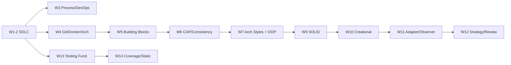

# Software Engineering (CAS3106) — Roadmap

이 파일은 모든 주차 챕터 생성의 앵커다. 챕터를 만들 때 반드시 이 매핑의 정본 소스에 근거해서 쓴다.
시험 95% (중간 45% + 기말 50%) 과목 — 모든 서브토픽은 "시험에 나올 수 있는 구체 항목" 단위로 잡는다.
중간 범위 = W1–7, 기말 범위 = W9–14 (기말이 누적인지는 학기 중 확인).

## 1. Depth Benchmarks

이 과목의 서술 깊이는 아래를 기준으로 한다:

| 벤치마크 | 왜 이 과목에 맞는가 |
|---|---|
| Sommerville, *Software Engineering*, 10e ([companion site](https://software-engineering-book.com/)) | 지정 주교재. SDLC 전 단계·프로세스·아키텍처·테스팅의 공통 뼈대 — 주차마다 챕터 매핑 필수 |
| MIT 6.102 (구 6.031/6.005) *Software Construction* ([sp23](https://web.mit.edu/6.102/www/sp23/)) | specification·testing·abstraction을 "safe from bugs, easy to understand, ready for change" 기준으로 다루는 구현-레벨 깊이의 표준 |
| CMU 17-313 *Foundations of Software Engineering* ([site](https://cmu-313.github.io/)) | process·QA·팀 실무를 대규모 OSS 코드베이스 위에서 다루는 현대적 SE 강의 — 본 과목의 실무 톤 기준 |
| Kleppmann, *Designing Data-Intensive Applications* (DDIA, [site](https://dataintensive.net/)) | W5–6 시스템 설계 주차의 깊이 기준: replication·consistency·partitioning을 메커니즘과 실패 모드 수준으로 |
| GoF, *Design Patterns* (1994, ISBN 0-201-63361-2) + [refactoring.guru](https://refactoring.guru/design-patterns) | W10–12 패턴 주차의 정본 (intent·structure·participants·consequences) + 현대 언어 예제 보강 |
| [Google Engineering Practices](https://google.github.io/eng-practices/review/) | W12 code review의 실무 표준 — small CL, review latency, "code health" 판단 기준 |
| Ammann & Offutt, *Introduction to Software Testing*, 2e ([book site](https://cs.gmu.edu/~offutt/softwaretest/)) | W13–14 테스팅 이론의 정본: RIPR model, coverage criteria의 형식적 정의와 subsumption |

## 2. Canonical Sources (과목 전체)

- **주교재**: Sommerville, *Software Engineering*, 10e, Pearson, 2015. ISBN 0133943038. 교수 코멘트대로 "overall process"용 — 주제별 깊이는 아래 소스로 보강.
- **시스템 설계**: Kleppmann, *DDIA*, O'Reilly, 2017 — ch1 (reliability/scalability), ch2–3 (data models, storage engines), ch5 (replication), ch6 (partitioning), ch9 (consistency & consensus), ch11 (stream processing).
- **패턴**: GoF, *Design Patterns: Elements of Reusable Object-Oriented Software*, Addison-Wesley, 1994 + [refactoring.guru/design-patterns](https://refactoring.guru/design-patterns).
- **원칙**: Martin, "Design Principles and Design Patterns" (2000) — SOLID 원문 ([PDF](https://staff.cs.utu.fi/~jounsmed/doos_06/material/DesignPrinciplesAndPatterns.pdf)).
- **테스팅**: Ammann & Offutt, 2e, Cambridge, 2016 + [ISTQB CTFL Syllabus v4.0.1](https://istqb.org/wp-content/uploads/2024/11/ISTQB_CTFL_Syllabus_v4.0.1.pdf).
- **1차 문헌 (논문)**: Gilbert & Lynch (CAP), Brewer (CAP 회고), Abadi (PACELC), Liskov & Wing (behavioral subtyping), Fielding (REST), Barr et al. (oracle problem), Hayhurst et al. (MC/DC) — 주차별 섹션에 DOI/링크 명기.
- **공식 문서/스펙**: [Pro Git 2e](https://git-scm.com/book/en/v2) · [Docker docs](https://docs.docker.com/get-started/) · man7 [namespaces(7)](https://man7.org/linux/man-pages/man7/namespaces.7.html), [cgroups(7)](https://man7.org/linux/man-pages/man7/cgroups.7.html) · [OMG UML 2.5.1](https://www.omg.org/spec/UML/2.5.1/) · [Kafka docs](https://kafka.apache.org/documentation/) · [Google style guides](https://google.github.io/styleguide/) · [NIST SP 800-145](https://csrc.nist.gov/pubs/sp/800/145/final) · [choosealicense.com](https://choosealicense.com/) · [The Twelve-Factor App](https://12factor.net/) · [DORA](https://dora.dev/).

주교재 보강 노트: Sommerville 10e에는 DevOps·Docker·CAP·디자인 패턴 상세가 **없다** (교수도 "no single book covers everything"). W3–7, W10–12는 아래 명기한 1차 문헌·공식 문서가 사실상의 주교재다.

## 3. Week-by-Topic Mapping

시험 주(W8, W16)·자율학습 주(W15)는 챕터를 만들지 않는다. 슬러그는 각 주차 제목 옆에 표기.

### W1 — Introduction to Software Engineering (`01-introduction-to-software-engineering`)

- SE 정의와 programming과의 차이 (개인 프로그램 vs 팀·수명 긴 제품); software 종류 — generic products vs custom systems, 요구사항 주도권 차이.
- essential attributes of good software: maintainability, dependability & security, efficiency, acceptability.
- software failure의 원인 (complexity 증가, 낮은 기대 비용); SE 비용 구조 — evolution cost > development cost.
- professional ethics: confidentiality, competence, intellectual property rights, computer misuse.
- 소스: Sommerville ch1; CMU 17-313 [course overview](https://cmu-313.github.io/overview/).

### W2 — SDLC 전 단계 훑기 (`02-sdlc-stages`)

- requirements: functional vs non-functional 구분, 측정 가능한 NFR 작성 (예: "p99 response < 200ms"); elicitation 기법과 실패 모드 (tacit knowledge, conflicting stakeholders); validation (traceability, review).
- design: 산출물 분류 — architectural / interface / component / data design.
- implementation: reuse 수준 (system/component/object), configuration management, host-target development.
- **validation vs verification** ("right product" vs "product right"); inspection vs testing 상보성.
- deployment & maintenance: maintenance 3유형 (corrective/adaptive/perfective)과 비용 비중, legacy system 딜레마.
- 소스: Sommerville ch4 (requirements engineering), ch7 (design and implementation), ch8.0–8.1 (V&V), ch9 (software evolution).

### W3 — Process Models, DevOps, Cloud, OSS Licenses (`03-process-models-devops-licenses`)

- process models: plan-driven vs agile 스펙트럼; waterfall (단계 동결의 근거·실패 모드), incremental (조기 피드백 vs architecture erosion), reuse-oriented, spiral (risk-driven).
- agile: manifesto 4 values; XP practices (TDD, pair programming, CI, refactoring, small releases); Scrum — product backlog, sprint, scrum master vs product owner, velocity.
- DevOps: CI/CD 파이프라인 단계; **DORA 4 key metrics** — deployment frequency, lead time for changes, change failure rate, time to restore service (throughput 2 + stability 2).
- cloud: service models (IaaS/PaaS/SaaS) vs deployment models (public/private/hybrid/community) — NIST 정의; 12-factor 중 config·build/release/run·stateless processes.
- OSS licenses: **permissive (MIT, Apache-2.0) vs copyleft (GPLv3 strong, LGPL weak)**; Apache-2.0의 명시적 patent grant; derivative work과 linking 논쟁; license compatibility (Apache-2.0 → GPLv3 방향 호환); 위반 리스크.
- 소스: Sommerville ch2–3; Forsgren, Humble & Kim, *Accelerate*, IT Revolution, 2018 + [dora.dev](https://dora.dev/); [NIST SP 800-145](https://csrc.nist.gov/pubs/sp/800/145/final); [12factor.net](https://12factor.net/); 라이선스 원문 [MIT](https://opensource.org/license/mit) / [Apache-2.0](https://www.apache.org/licenses/LICENSE-2.0) / [GPL-3.0](https://www.gnu.org/licenses/gpl-3.0.html); [choosealicense.com](https://choosealicense.com/).

### W4 — Git/GitHub, Containers & Docker, Architecture Overview (`04-git-docker-architecture-overview`)

- Git internals: object model — blob/tree/commit/annotated tag, SHA-1 content addressing, 히스토리는 DAG; refs·HEAD·detached HEAD; merge (3-way) vs rebase (히스토리 재작성 — 공유 브랜치 rebase 금지 이유); packfile과 delta compression.
- 브랜칭 전략: **git-flow** (develop/release/hotfix — 버전드 릴리스용) vs **GitHub flow** (main + PR — continuous deployment용); 릴리스 모델별 선택 기준; PR 기반 협업.
- containers: container vs VM (guest kernel 유무); Docker image layer와 copy-on-write (OverlayFS lowerdir/upperdir); isolation 원리 — **namespaces** (pid/net/mnt/uts/ipc/user)로 가시성 격리 + **cgroups**로 자원 제한; Dockerfile layer 캐시 무효화 순서; registry.
- 아키텍처 설계 개요: 왜 조기·비가역 결정인가 (architectural decision의 파급), architectural views (4+1).
- 소스: [Pro Git 2e](https://git-scm.com/book/en/v2) ch3, ch10 (Git internals); [Driessen, "A successful Git branching model" (2010)](https://nvie.com/posts/a-successful-git-branching-model/); [GitHub flow docs](https://docs.github.com/en/get-started/using-github/github-flow); [Docker docs](https://docs.docker.com/get-started/); [namespaces(7)](https://man7.org/linux/man-pages/man7/namespaces.7.html), [cgroups(7)](https://man7.org/linux/man-pages/man7/cgroups.7.html); Sommerville ch6.1–6.2.

### W5 — System Design Building Blocks (`05-system-design-building-blocks`)

- performance & scalability: throughput vs latency; **percentile latency (p50/p95/p99)와 tail latency amplification**; SLA/SLO; load parameter; vertical vs horizontal scaling.
- load balancer: **L4 (transport, connection 단위) vs L7 (application, content-aware)**; 알고리즘 — round-robin, weighted, least-connections, consistent hashing; health check; LB 자체 SPOF 대응 (active-passive, anycast).
- cache: cache-aside vs read-through vs write-through vs write-back — 각각의 stale/유실 리스크; eviction (LRU/LFU/TTL); **cache stampede**와 완화 (lock, probabilistic early expiration).
- CDN: edge/origin, pull vs push, invalidation vs versioned URL.
- API gateway: routing, rate limiting (token bucket), authn offload; reverse proxy와의 구분.
- storage 분류: RDBMS vs document vs key-value vs wide-column vs graph — 선택 기준; **B-tree vs LSM-tree** (write/read amplification, compaction).
- message queue: broker 기반 (RabbitMQ류) vs log 기반 (Kafka — offset, consumer group, retention); delivery semantics (at-most/at-least/exactly-once); backpressure; decoupling·burst absorption.
- 소스: DDIA ch1 (percentiles·scalability), ch2–3 (data models, B-tree/LSM), ch11 (message brokers vs logs); [Kafka docs](https://kafka.apache.org/documentation/); [NGINX HTTP load balancing docs](https://docs.nginx.com/nginx/admin-guide/load-balancer/http-load-balancer/); [Cloudflare Learning: What is a CDN?](https://www.cloudflare.com/learning/cdn/what-is-a-cdn/).

### W6 — Consistency, Availability, CAP, Scaling + UML (`06-cap-consistency-uml`)

- replication: single-leader / multi-leader (충돌 해소) / leaderless (quorum) 3형 비교; sync vs async replication과 durability 트레이드오프.
- replication lag 이상 현상과 세션 보장: **read-your-writes, monotonic reads, consistent prefix reads**.
- linearizability 정의 (단일 객체의 실시간 순서 보장 — serializability와의 구분); quorum 조건 w+r>n과 그 한계 (sloppy quorum, 동시 쓰기).
- **CAP — Gilbert & Lynch 정리**: asynchronous network에서 partition 시 atomic consistency와 availability 동시 보장 불가; 증명 개요 — 파티션 양쪽에 write 후 read 시나리오로 모순 유도; 흔한 오독 비판 ("3 중 2 고르기" 아님 — P는 선택지가 아니라 전제).
- **PACELC**: if Partition then A vs C, Else Latency vs C — CAP이 못 담는 정상 상태 트레이드오프; 시스템 분류 예 (DynamoDB PA/EL, HBase PC/EC).
- partitioning(sharding): hash vs range, hot spot(skew), rebalancing 전략.
- UML: class diagram (association/aggregation/composition/generalization, multiplicity); sequence diagram (sync vs async message, lifeline, combined fragment); state machine diagram (state/transition/guard/entry·exit action); 시스템 설계를 UML로 표현하는 worked example.
- 소스: DDIA ch5 (replication), ch6 (partitioning), ch9 (linearizability); Gilbert & Lynch, "Brewer's Conjecture and the Feasibility of Consistent, Available, Partition-Tolerant Web Services", *SIGACT News* 33(2), 2002 — [DOI 10.1145/564585.564601](https://doi.org/10.1145/564585.564601); Brewer, "CAP Twelve Years Later: How the 'Rules' Have Changed", *IEEE Computer* 45(2), 2012 — [DOI 10.1109/MC.2012.37](https://doi.org/10.1109/MC.2012.37); Abadi, "Consistency Tradeoffs in Modern Distributed Database System Design", *IEEE Computer* 45(2), 2012 — [DOI 10.1109/MC.2012.33](https://doi.org/10.1109/MC.2012.33); [OMG UML 2.5.1](https://www.omg.org/spec/UML/2.5.1/); Sommerville ch5.

### W7 — Architecture Styles + Four Pillars of OOP (`07-architecture-styles-oop`)

- layered architecture: 엄격 vs 완화 계층; 변경 국소화 vs sinkhole·성능 비용; client-server.
- monolith vs **microservices**: Fowler & Lewis의 특성 — componentization via services, organized around business capabilities, decentralized data management, smart endpoints and dumb pipes, design for failure; 분산 비용 — partial failure, 분산 트랜잭션 부재 (→ eventual consistency), 운영 복잡도 ("microservice premium").
- event-driven architecture: pub/sub topology, event sourcing 개요 — W5 MQ와 연결.
- **REST**: Fielding의 constraints — client-server, stateless, cache, uniform interface, layered system, code-on-demand(optional); uniform interface 4요소 (resource identification, manipulation through representations, self-descriptive messages, HATEOAS); REST vs RPC 스타일 비교.
- OOP 4 pillars: abstraction (specification vs implementation); encapsulation (invariant 보호, representation exposure 실패 모드); inheritance (**subclassing vs subtyping 구분**, composition over inheritance); polymorphism (subtype vs parametric vs ad-hoc, dynamic dispatch 메커니즘 — vtable).
- 소스: Sommerville ch6.3 (architectural patterns), ch17 (distributed software engineering); Fowler & Lewis, ["Microservices" (2014)](https://martinfowler.com/articles/microservices.html); Fielding, *Architectural Styles and the Design of Network-based Software Architectures*, PhD dissertation, UC Irvine, 2000 — [ch5](https://ics.uci.edu/~fielding/pubs/dissertation/rest_arch_style.htm); MIT 6.102 readings (abstract data types, specifications).

### W9 — SOLID + DRY/KISS/YAGNI (`09-solid-principles`)

- 설계 부패의 증상 (Martin 2000의 프레임): rigidity, fragility, immobility, viscosity.
- **SRP**: "a class should have only one reason to change" — actor 기준 응집.
- **OCP**: open for extension, closed for modification — abstraction 경유 확장 (Meyer 1988 기원).
- **LSP**: Liskov & Wing behavioral subtyping — subtype에서 precondition 약화·postcondition 강화만 허용, invariant 보존, history constraint (immutable vs mutable Point); Rectangle–Square 반례.
- **ISP**: fat interface → client-specific interface 분리; 재컴파일·재배포 파급 차단.
- **DIP**: high-level policy가 abstraction에 의존; dependency injection은 DIP의 구현 기법.
- 각 원칙 위반 코드 → 리팩토링 worked example (Java/Kotlin).
- **DRY** ("every piece of knowledge must have a single, unambiguous, authoritative representation" — 단순 코드 중복 제거와 다름: 우연한 중복의 통합은 오히려 결합), KISS, **YAGNI** (speculative generality의 비용: build/delay/carry/repair); 원칙 간 긴장 — OCP의 선제 abstraction vs YAGNI.
- 소스: Martin, "Design Principles and Design Patterns", 2000 — [PDF](https://staff.cs.utu.fi/~jounsmed/doos_06/material/DesignPrinciplesAndPatterns.pdf); Liskov & Wing, "A Behavioral Notion of Subtyping", *ACM TOPLAS* 16(6), 1994 — [DOI 10.1145/197320.197383](https://doi.org/10.1145/197320.197383); Hunt & Thomas, *The Pragmatic Programmer*, 20th Anniversary ed., 2019 (DRY); Fowler, [bliki: Yagni](https://martinfowler.com/bliki/Yagni.html).

### W10 — Design Patterns Overview + Creational Patterns (`10-creational-patterns`)

- 패턴 기술 형식: intent, motivation, structure, participants, consequences; 3분류 (creational/structural/behavioral)와 scope (class vs object); GoF 2대 원칙 — "program to an interface, not an implementation", "favor object composition over class inheritance".
- **Factory Method**: Creator 서브클래스가 product 결정; parallel class hierarchy; OCP와의 관계.
- **Abstract Factory**: product family의 일관성 보장; Factory Method의 집합으로 구현되는 관계.
- **Builder**: telescoping constructor 문제; step-by-step 조립; immutable object 생성; fluent API.
- **Singleton**: 유일 인스턴스 + 전역 접근의 비판 (hidden coupling, 테스트 어려움); thread-safety — eager init, synchronized, double-checked locking과 `volatile`(JMM) 필요성, initialization-on-demand holder, enum singleton.
- **Prototype**: clone 기반 생성; deep vs shallow copy 함정.
- 실사용례: Spring IoC container(`BeanFactory`)와 singleton scope, JDK `StringBuilder` (builder 변형), `Object.clone()`.
- 소스: GoF ch1 (introduction), ch3 (creational patterns); [refactoring.guru — creational patterns](https://refactoring.guru/design-patterns/creational-patterns).

### W11 — Adapter + Observer (`11-adapter-observer`)

- **Adapter**: Target/Adapter/Adaptee/Client 구조; class adapter (상속 기반 — adaptee override 가능, 단일 adaptee 고정) vs object adapter (composition 기반 — adaptee 계층 전체 수용) 트레이드오프; two-way adapter.
- 유사 패턴 구분 (시험 단골): Adapter (인터페이스 변환) vs Facade (단순화) vs Decorator (기능 추가) vs Bridge (사전 분리 설계).
- Adapter 실사용례: `java.io.InputStreamReader` (byte→char), Spring MVC `HandlerAdapter`.
- **Observer**: Subject/Observer 구조와 attach/notify 프로토콜; **push vs pull model** (결합도 vs 통지 비용); notify 순서 비보장; cascade update와 무한 루프 위험; **lapsed listener** (deregister 누락 → 메모리 누수).
- Observer (직접 참조) vs publish-subscribe (broker 매개) 구분 — W5 MQ와 연결.
- Observer 실사용례: GUI event listener, Spring `ApplicationEvent`/`ApplicationListener`, `java.beans.PropertyChangeListener`.
- 소스: GoF ch4 (Adapter), ch5 (Observer); [refactoring.guru — adapter](https://refactoring.guru/design-patterns/adapter), [observer](https://refactoring.guru/design-patterns/observer).

### W12 — Strategy + Clean Code, Style Guide, Code Review (`12-strategy-clean-code-review`)

- **Strategy**: Context/Strategy/ConcreteStrategy 구조; algorithm family 캡슐화와 런타임 교체; 조건문 분기 → 다형성 치환 리팩토링; State 패턴과의 구분 (전이 주체); 함수형 대체 (람다로 strategy 축약); 실사용례 — `java.util.Comparator`, Spring Security `PasswordEncoder`.
- **Clean Code**: intention-revealing naming; small functions (single level of abstraction, 인자 수 최소화); comments는 표현 실패의 보상일 때가 많다 (정당한 주석: legal/intent/warning); error handling — exception > error code, null 반환·전달 금지.
- **style guide**: 목적은 일관성 (개인 취향 논쟁 제거); Google Java/Python style guide 구조; formatter·linter로 기계화.
- **code review**: Google 기준 — "CL이 시스템의 code health를 확실히 개선하면 완벽하지 않아도 approve"; small CL의 근거 (리뷰 정확도·속도); review latency가 조직 속도에 미치는 영향; `nit:` 관례; 리뷰가 잡아야 할 것의 우선순위 (design > 스타일).
- 소스: GoF ch5 (Strategy); Martin, *Clean Code*, Prentice Hall, 2008 — ch2 (naming), ch3 (functions), ch4 (comments), ch7 (error handling); [Google style guides](https://google.github.io/styleguide/); [Google eng-practices — reviewer guide](https://google.github.io/eng-practices/review/reviewer/), [author guide](https://google.github.io/eng-practices/review/developer/).

### W13 — Testing Fundamentals (`13-testing-fundamentals`)

- **fault(defect) → error(infection) → failure** 인과 사슬과 각각의 정의; testing vs debugging; V&V 재정리 (W2 연결).
- **RIPR model**: fault가 failure로 관측되기 위한 4조건 — Reachability, Infection, Propagation, Revealability; 각 단계가 끊기는 예제 코드.
- test levels: unit (test double — stub/mock/fake 구분); integration (big-bang vs incremental, top-down vs bottom-up, stub vs driver 필요성); system; acceptance (alpha/beta).
- **ISTQB 7 testing principles**: testing shows the presence of defects, not their absence / exhaustive testing is impossible / early testing saves time and money / defects cluster together / tests wear out (pesticide paradox) / testing is context dependent / absence-of-defects fallacy.
- **test oracle problem**: oracle 정의; specified/derived/implicit/human oracle 분류; 왜 input 생성보다 oracle이 테스트 자동화의 병목인가.
- coverage 개념 도입: test requirement, coverage criterion, criteria subsumption; generator vs recognizer 관점.
- 소스: Ammann & Offutt 2e ch1–2 (정의·RIPR·model-driven test design), ch5 (criteria-based test design), ch14 (test oracles); [ISTQB CTFL Syllabus v4.0.1](https://istqb.org/wp-content/uploads/2024/11/ISTQB_CTFL_Syllabus_v4.0.1.pdf) §1.3 (principles), §2.2 (test levels); Barr, Harman, McMinn, Shahbaz, Yoo, "The Oracle Problem in Software Testing: A Survey", *IEEE TSE* 41(5), 2015 — [DOI 10.1109/TSE.2014.2372785](https://doi.org/10.1109/TSE.2014.2372785); Sommerville ch8.

### W14 — Test Design, Coverage, Static Analysis (`14-test-design-coverage-static-analysis`)

- black-box 설계: equivalence partitioning (valid/invalid class); boundary value analysis (off-by-one 표적); decision table (조건 조합 축약).
- white-box: CFG 위에서 **statement(node) / branch(edge) / path coverage** 정의와 subsumption (branch ⊃ statement; path는 루프 때문에 비현실적); 예제 CFG로 최소 테스트 수 계산.
- logic coverage: predicate vs clause coverage; **MC-DC 정의** — 각 clause가 단독으로 predicate 결과를 결정함을 보이는 테스트 쌍, n개 clause에 n+1개 테스트로 달성 가능; 항공 인증 맥락 (DO-178C Level A); 3-clause predicate worked example.
- input space partitioning: characteristic 선정; 조합 기준 ACoC/ECC/PWC.
- mutation testing 개요: mutant, kill, mutation score — 테스트 스위트 품질의 메타 평가; equivalent mutant 문제.
- **coverage의 한계**: 100% branch여도 fault를 놓치는 예 (RIPR의 infection/propagation 실패) — coverage는 필요조건적 지표.
- static analysis: lint/style check; dataflow 분석 (null dereference, use-before-def); false positive vs false negative 트레이드오프; 도구 — SpotBugs, ESLint, Clang Static Analyzer; dynamic testing과의 상보성; CI에 coverage gate·static analysis 통합.
- 소스: Ammann & Offutt 2e ch6 (input space partitioning), ch7 (graph coverage), ch8 (logic coverage), ch9 (syntax-based testing/mutation); Hayhurst, Veerhusen, Chilenski, Rierson, "A Practical Tutorial on Modified Condition/Decision Coverage", NASA/TM-2001-210876, 2001 — [PDF](https://shemesh.larc.nasa.gov/fm/papers/Hayhurst-2001-tm210876-MCDC.pdf); [ISTQB CTFL Syllabus v4.0.1](https://istqb.org/wp-content/uploads/2024/11/ISTQB_CTFL_Syllabus_v4.0.1.pdf) §4 (test techniques).

## 4. Build Priority (예습 생성 순서)

의존 관계:

1. **W1–2 최우선**: 전 과목의 용어 기반 (SDLC 단계, V&V, requirements 분류). 이후 모든 주차가 이 어휘를 전제.
2. **W5 → W6 → W7 순서 고정** (중간고사 핵심 블록): W6의 CAP·consistency는 W5의 replication 동기(scalability) 없이는 공중에 뜨고, W7의 microservices 트레이드오프는 W5–6의 분산 비용 논의를 전제.
3. **W7 → W9 → W10 → W11 → W12 순서 고정** (기말 패턴 블록): OOP pillars → SOLID → 패턴은 "원칙 → 구체화" 관계. 패턴 챕터는 W9의 OCP/DIP를 반복 참조.
4. **W13 → W14 순서 고정** (기말 테스팅 블록): coverage criteria는 W13의 fault/failure·test requirement 정의 위에서만 형식화된다.
5. **병렬 가능**: W3·W4는 W1–2만 전제 — 시스템 설계 블록과 독립 생성 가능. W13–14 테스팅 블록도 패턴 블록과 독립 (단, W13의 test level은 W2의 V&V를 참조).

권장 생성 순서: `01 → 02 → 05 → 06 → 07 → 03 → 04` (중간 대비 우선) → `09 → 10 → 11 → 12 → 13 → 14` (기말 대비).
