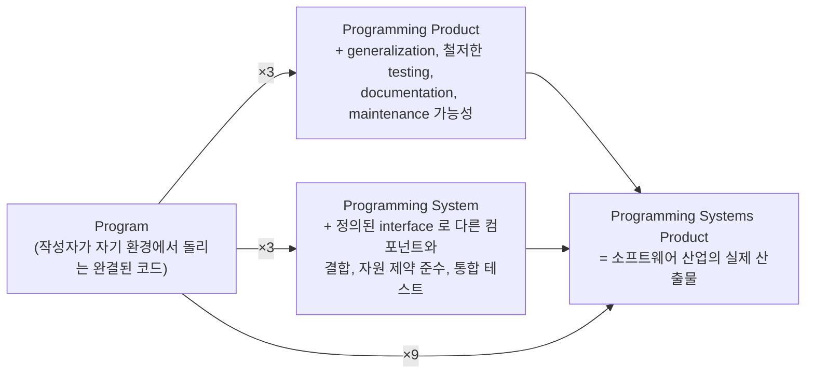
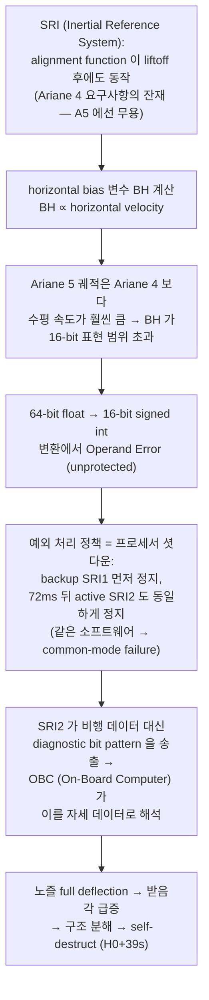
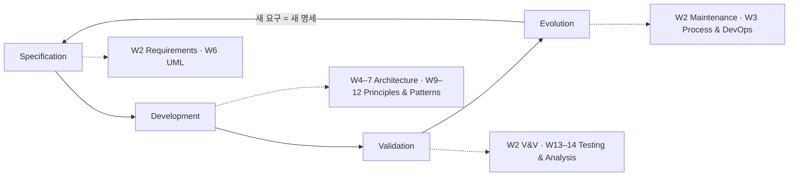

# Week 1 — Introduction to Software Engineering

> What is SE · SE vs Programming · Essential vs Accidental Complexity · Failure Case Studies · Attributes of Good Software · SE Activities · Professional Ethics

## Learning goals

이 챕터를 마치면 다음을 할 수 있어야 한다 (모두 시험 가능한 형태):

- software engineering 을 IEEE 610.12 와 Sommerville 의 정의로 서술하고, "software = program" 이 아닌 이유 (documentation, configuration data 포함) 를 설명할 수 있다.
- Brooks 의 program → programming systems product **3×3 프레임**으로 "프로그래밍 잘함"과 "소프트웨어 엔지니어링"의 간극을 정량적으로 설명하고, 규모·수명·팀·변경 네 축에서 그 간극이 왜 생기는지 논증할 수 있다.
- **essential vs accidental complexity** 를 정의하고, Brooks "No Silver Bullet" 의 핵심 논증 (essence 4속성, 왜 단일 기법으로 10배 개선이 불가능한가) 을 재구성할 수 있다.
- Ariane 5 · Therac-25 · Knight Capital 세 사고 각각의 **proximate cause 와 root cause 를 구분**해 서술하고, 각 사고가 주는 공학적 교훈을 이 과목의 주차와 연결할 수 있다.
- 좋은 소프트웨어의 4 essential attributes (**maintainability, dependability & security, efficiency, acceptability**) 를 정의하고 시나리오를 속성으로 분류할 수 있다.
- generic products vs custom systems 를 **specification 소유권** 기준으로 구분하고, 소프트웨어 유형 (일회성 스크립트 / 제품 / safety-critical) 에 따라 공학적 엄격성이 어떻게 달라져야 하는지 논증할 수 있다.
- SE 의 4 fundamental activities (**specification / development / validation / evolution**) 를 정의하고 이 과목의 주차 지도에 매핑할 수 있다.
- ACM/IEEE Code of Ethics 의 8 원칙과 Sommerville 의 4대 윤리 이슈를 나열하고, 시나리오에 적용할 수 있다.

## Why this matters

이 과목의 나머지 전부 (requirements → architecture → patterns → testing) 는 이 주차가 놓는 하나의 전제 위에 서 있다: **소프트웨어를 만드는 일은 프로그램을 짜는 일과 다르며, 그 차이를 관리하는 체계가 engineering 이다.** 이 전제가 공허한 슬로건이 아니라는 것을 이 챕터는 두 방향에서 보인다 — 이론으로 (Brooks 의 complexity 논증), 그리고 시체로 (로켓 하나, 환자 여러 명, 회사 하나를 죽인 세 건의 사고 부검). 세 사고는 모두 "코드는 대체로 의도대로 동작했는데" 일어났다. 무엇이 잘못됐는지를 정확히 말할 수 있는 어휘 — specification, validation, common-mode failure, deployment process — 를 갖추는 것이 이 주차의 목표고, 그 어휘가 W2–W14 전체의 목차다.

시험 관점 (중간 45% + 기말 50%): 이 주차의 정의·구분 (generic vs custom, 4 attributes, 4 activities, essential vs accidental) 은 전형적인 단답·서술 출제 대상이고, 사고 사례는 "다음 시나리오에서 무엇이 잘못되었는가" 형태의 분석 문제 재료다.

---

## 1. Software engineering 이란 무엇인가

### 1.1 기원: 1968년의 "software crisis"

용어 자체가 도발이었다. 1968년 NATO Science Committee 가 Garmisch 에서 소집한 회의의 이름이 *Software Engineering Conference* 였는데, 당시에는 존재하지 않는 분야였다 — 참가자들이 진단한 현실은 이랬다: 하드웨어 성능은 빠르게 성장하는데 (곧 무어의 법칙으로 정식화될 추세), 그 위에 올라갈 소프트웨어는 **예산 초과, 일정 지연, 낮은 신뢰성, 유지보수 불능** 상태로 인도되고 있었다. 이 만성적 실패 상태를 **software crisis** 라 불렀고, 처방으로 "다른 공학 분야처럼 이론적 기반과 체계적 방법 위에서 소프트웨어를 만들자"는 의제를 세웠다 (Naur & Randell 1969).

핵심 통찰은 실패의 원인 진단에 있다. 소프트웨어 시스템이 실패하는 이유는 크게 둘이다 (Sommerville ch1):

1. **요구의 증가 속도 > 방법의 발전 속도.** 시스템은 더 크고, 더 분산되고, 더 오래 살아야 하는데, 만드는 방법이 그 복잡도 증가를 못 따라간다.
2. **낮아지는 기대 비용.** 도구가 좋아져 "빨리 대충" 만드는 것이 쉬워질수록, 체계적 방법 없이 만든 소프트웨어가 상업적으로 요구되는 품질에 못 미치는 사태가 반복된다.

즉 crisis 는 1968년에 끝난 역사적 사건이 아니라, **복잡도가 방법을 앞지를 때마다 재발하는 구조적 조건**이다. §4 의 세 사고는 각각 1996, 1985–87, 2012년의 재발 사례다.

### 1.2 정의

시험 답안에 그대로 쓸 수 있는 두 정의:

> **IEEE 610.12**: "The application of a **systematic, disciplined, quantifiable** approach to the development, operation, and maintenance of software; that is, the application of engineering to software."

> **Sommerville**: "Software engineering is an engineering discipline that is concerned with **all aspects of software production** from the early stages of system specification to maintaining the system after it has gone into use."

두 정의에서 뽑아야 할 것:

- **"All aspects"**: 코딩만이 아니라 specification, design, validation, evolution 전 단계 + 이를 지탱하는 프로젝트 관리·도구·방법론 개발까지.
- **"Engineering discipline"**: 공학자는 이론과 방법을 **주어진 제약 (비용, 일정, 조직) 안에서 선택적으로 적용**해 문제를 푼다. 완벽한 해가 아니라 제약 하의 최선 — 트레이드오프의 학문이라는 뜻이고, 이 과목의 모든 주차가 "X vs Y 의 트레이드오프" 구조인 이유다.
- **"Systematic, disciplined, quantifiable"**: 개인기가 아니라 반복 가능한 프로세스, 측정 가능한 품질 (→ W2 의 measurable NFR, W5 의 percentile latency 로 구체화).

**Software ≠ program.** Sommerville 의 구분: software 는 프로그램 그 자체뿐 아니라 그것을 **유용하게 만드는 모든 것** — 각종 documentation, 설치·구성을 위한 configuration data, 라이브러리, (웹 시스템이면) 서버 설정까지 포함한다. "동작하는 코드는 있는데 어떻게 배포·설정·수정하는지 아무도 모른다"면 program 은 있어도 software product 는 없는 것이다. Knight Capital (§4.3) 이 정확히 이 상태였다.

---

## 2. Programming 과 무엇이 다른가

### 2.1 Brooks 의 3×3: program 에서 product 까지의 9배

Brooks 는 *The Mythical Man-Month* ch1 에서 "내 컴퓨터에서 내가 돌리는 동작하는 프로그램"과 "팔리는 소프트웨어" 사이의 거리를 두 축으로 분해했다:

- **Product 축 (×3)**: 아무나, 아무 입력으로, 작성자 없이 쓸 수 있게 만드는 비용 — 일반화, 경계 입력 테스트, 문서화.
- **System 축 (×3)**: 다른 컴포넌트와 **정확히 정의된 인터페이스**로 결합되어 전체의 일부로 동작하게 만드는 비용 — 인터페이스 준수, 자원 예산 (메모리·시간) 준수, 조합 폭발하는 통합 테스트.
- 두 축을 다 가면 **약 9배**. Brooks 의 추정치지만, 방향은 확실하다: **프로그래밍은 소프트웨어 비용의 소수 지분**이라는 것. Sommerville 의 비용 구조 데이터가 이를 뒷받침한다 — 대략 개발 60% / 테스팅 40% 이고, custom software 는 **evolution 비용이 development 비용을 넘어서는 것이 보통**이다 (ch1 FAQ, ch9).

**Worked example 1 — 팀은 왜 선형으로 빨라지지 않는가.** 소프트웨어가 개인 작업이 아니게 되는 순간 통신 비용이 등장한다. $n$ 명이 서로 조율해야 하면 통신 경로는

$$\binom{n}{2} = \frac{n(n-1)}{2}$$

3명이면 3개, 10명이면 45개, 15명이면 105개다. 10명 팀이 늦어져서 5명을 더 넣으면: 작업 능력은 1.5배가 되지만 통신 경로는 45 → 105 로 **2.3배**가 되고, 여기에 신규 인원 교육 비용 (기존 인원의 시간 소모) 과 작업 재분할 비용이 얹힌다. 작업이 분할 불가능한 부분 (Amdahl 의 직렬 비율, W5 §1.4 와 동형 논리) 을 포함하면 총 완료 시간은 오히려 늘 수 있다. 이것이 **Brooks's law**: "Adding manpower to a late software project makes it later." 소프트웨어 공학에서 프로세스 (W3) 와 아키텍처의 모듈 분해 (W4–7) 가 중요한 근본 이유 중 하나는, 둘 다 **통신 경로를 줄이는 장치**이기 때문이다 — 잘 나뉜 모듈 경계는 "그 팀과 인터페이스 문서로만 대화해도 되게" 만든다.

### 2.2 네 개의 축으로 정리

| 축 | Programming (개인 프로그램) | Software Engineering (팀·제품) | 이 과목에서 다루는 곳 |
|---|---|---|---|
| **규모 (scale)** | 머리에 다 들어감 | 어느 개인의 이해 용량도 초과 — 복잡도가 크기에 비선형으로 증가 (§3) | 추상화·모듈화 (W7, W9), 아키텍처 (W4–7) |
| **수명 (longevity)** | 목적 달성 후 폐기 | 수년~수십 년 운영; evolution 비용 > development 비용 | maintenance (W2), process (W3), maintainability (§5) |
| **팀 (team)** | 작성자 = 유일한 독자 | 여러 명이 동시 수정, 작성자가 떠난 뒤에도 유지보수 — 통신 비용 $O(n^2)$ | version control (W4), clean code·review (W12) |
| **변경 (change)** | 요구가 고정 | 환경·비즈니스가 바뀌므로 요구가 계속 바뀜 — 성공한 소프트웨어일수록 더 바뀐다 (Lehman 의 continuing change: 변경을 멈춘 유용한 프로그램은 점점 덜 유용해진다) | requirements (W2), OCP·패턴 (W9–12) |

핵심 문장 하나로 압축하면: **programming 은 컴퓨터에게 말하는 기술이고, software engineering 은 규모·시간·사람·변경이 만드는 복잡도를 관리하는 체계다.** 코딩은 그 체계 안의 한 activity (development 의 일부, §7) 다.

---

## 3. Essential vs Accidental Complexity — "No Silver Bullet"

### 3.1 Brooks 의 주장

Brooks (1987) 의 유명한 예측:

> "There is **no single development**, in either technology or management technique, which by itself promises even **one order-of-magnitude improvement within a decade** in productivity, in reliability, in simplicity."

늑대인간을 한 방에 잡는 은탄환은 없다는 것. 근거는 아리스토텔레스의 essence/accident 구분을 빌린 분해다:

- **Essential difficulty**: 소프트웨어가 **무엇인가** 에 내재한 어려움 — 상호 맞물리는 개념 구조 (data sets, 관계, 알고리즘, 함수 호출) 를 정확하게 지정하고 설계하는 일 자체. 표현 도구를 아무리 바꿔도 사라지지 않는다.
- **Accidental difficulty**: 그 개념 구조를 특정 기술로 **표현하는 과정**에서 생기는 어려움 — 어셈블리의 번거로움, 느린 컴파일, 메모리 수동 관리, 빌드 설정, 배포 스크립트.

논증의 뼈대는 산수다: 과거의 큰 생산성 도약 (high-level language, time-sharing, 통합 개발 환경) 은 전부 accidental difficulty 를 제거한 것이었다. 그런데 accidental 비중이 전체 노력의 9/10 미만이라면, **accidental 을 전부 0으로 만들어도 총 개선은 10배에 못 미친다** — 남는 것은 essence 뿐이고, essence 를 공략하는 일에는 지수적 특효약이 없다는 것.

### 3.2 Essence 의 4속성

시험 단골. 각 속성이 "왜 어려움을 만드는지"까지 말할 수 있어야 한다.

1. **Complexity**: "Software entities are more complex for their size than perhaps any other human construct, because **no two parts are alike** (at least above the statement level)." 건물·회로는 반복 요소의 배열이지만, 소프트웨어에서 같은 부분이 둘 있으면 함수 하나로 합쳐버린다 — 남는 것은 전부 서로 다른 부분들의 비선형 상호작용이고, 크기를 키우면 요소 수가 아니라 **서로 다른 요소 간 상호작용이** 늘어나 복잡도가 크기에 훨씬 초선형으로 증가한다. 상태 수가 폭발하므로 열거·테스트로 전수 검증 불가 (→ W13 "exhaustive testing is impossible" 원칙의 뿌리).
2. **Conformity**: 물리학자는 자연의 단순한 법칙을 찾지만, 소프트웨어는 **인간의 제도·기존 시스템·인터페이스라는 자의적 요구에 맞춰야** 한다. 세법, 레거시 파일 포맷, 타 부서의 API — 이 복잡함은 "가장 늦게 온 놈이 맞춘다"는 이유로 소프트웨어에 부과되며, 재설계로 소거할 수 없다.
3. **Changeability**: 소프트웨어는 무한히 가변적이라고 **인식되기 때문에** 끊임없는 변경 압력을 받는다 (건물은 완공 후 구조 변경 요구를 잘 안 받는다). 게다가 성공한 소프트웨어일수록 원래 범위 밖 용도·새 하드웨어·새 규제로 확장 요구가 온다 — 변경은 예외가 아니라 정상 상태다.
4. **Invisibility**: 소프트웨어는 기하학적 표현이 없다. 회로도·설계도처럼 하나의 도면에 담기지 않고, control flow · data flow · 의존성 · 시간 순서 등 **여러 개의 서로 겹치는 그래프**로만 표현된다 — 머릿속 시각화도, 사람 간 소통도 그만큼 어렵다. (UML — W6 — 은 이 그래프들 각각에 표준 표기를 주려는 시도다.)

### 3.3 Essence 를 공략하는 법 (Brooks 의 promising attacks)

은탄환은 없지만 정공법은 있다 — 그리고 그 목록이 사실상 이 과목의 목차다:

- **Buy vs build**: 가장 급진적 해법은 아예 안 만드는 것 — 기성품·컴포넌트·(현대적으로는) 오픈소스와 클라우드 서비스 구매. 단, Ariane 5 (§4.1) 는 재사용이 공짜가 아님을 보여준다.
- **Requirements refinement & rapid prototyping**: "무엇을 만들지 결정하는 것이 가장 어려운 부분" — 클라이언트 자신도 무엇을 원하는지 모르므로, 반복적 추출·프로토타이핑 필요 (→ W2 requirements engineering).
- **Grow, don't build (incremental development)**: 시스템을 한 번에 짓지 말고 동작하는 것을 점증적으로 키워라 (→ W3 incremental/agile process).
- **Great designers**: 좋은 설계는 방법론에서가 아니라 사람에게서 나온다 — 설계 능력 자체를 기르라 (→ W9–12 설계 원칙·패턴).

### 3.4 현대적 재해석

Brooks 이후의 도구 발전 — 프레임워크, 관리형 클라우드, 컨테이너, AI 코드 생성 — 은 전부 accidental complexity 를 계속 깎아내는 흐름으로 읽을 수 있다 (해석). 그 결과 남는 어려움의 비중은 점점 더 essence 쪽으로 쏠린다: 무엇을 만들지 정하기 (specification), 개념 구조를 어떻게 나눌지 (design), 만든 것이 의도와 일치하는지 (validation), 바뀌는 요구를 따라가기 (evolution). **도구가 좋아질수록 SE 의 코딩 외 활동이 병목이 된다** — 이 과목이 코딩을 거의 다루지 않는 이유다.

주의할 반대 방향도 있다: accidental complexity 는 도구가 깎아주기만 하는 게 아니라 **우리가 스스로 만들어 넣기도 한다**. 불필요한 추상화, 과잉 설계, 유행 따라 넣은 인프라 부품 — W9 의 YAGNI/KISS 는 자가 생산된 accidental complexity 에 대한 방어 원칙이다.

---

## 4. 소프트웨어 실패 사례 — 세 건의 부검

각 사고에서 **proximate cause** (직접 방아쇠가 된 기술적 결함) 와 **root cause** (그 결함이 존재하고, 발견되지 않고, 피해로 증폭되게 만든 공학적·조직적 조건) 를 구분하라. 시험 분석 문제의 표준 프레임이고, 사고 조사의 표준 프레임이기도 하다.

### 4.1 Ariane 5 Flight 501 (1996-06-04) — 재사용의 함정

**사건.** ESA 의 신형 발사체 Ariane 5 의 첫 비행. H0 (발사 시퀀스의 기준 시각; 이하 사고 시각은 모두 H0 기준) + 약 37초 — 리프트오프 후 약 30초 — 에 로켓이 궤도를 급격히 이탈, 공력 하중으로 분해가 시작되며 자폭 장치가 작동했다. 탑재된 Cluster 과학위성 4기 전손. 조사 위원회 (위원장 J.-L. Lions) 보고서가 사고 원인을 이례적으로 완전하게 재구성했다 — 이하 전부 Lions report (1996) 기준.

**Proximate cause 의 사슬.**

**Worked example 2 — 숫자로 보는 방아쇠.** 16-bit signed integer 의 표현 범위는 $[-2^{15}, 2^{15}-1] = [-32768, 32767]$ 이다. BH 는 수평 속도에 비례하는 내부 변수인데, Ariane 4 에서는 물리적으로 제한되거나 안전 여유가 충분하다는 reasoning 이 있었고 — 단, Lions 보고서는 **궤적 데이터로 미보호 변수의 거동을 분석한 증거는 없다**고 못 박는다 — 그래서 (CPU 사용률을 80% 이하로 유지하라는 성능 요구 아래) 이 변환은 **의도적으로** range check 없이 남겨졌다: operand error 위험이 있는 변수 7개 중 4개만 보호되고 BH 를 포함한 3개는 미보호였다. 이 결정은 여러 계약 층위의 프로젝트 파트너들이 공동으로 내린 것이었지만, 그 정당화는 소스 코드에도 spec 에도 남지 않아 (보고서: "essentially obscured, though not deliberately, from any external review") 외부 리뷰가 볼 수 없었다. Ariane 5 는 더 무겁고 추력이 커서 초기 수평 속도가 훨씬 크고, H0+36.7초 (리프트오프 후 약 30초) 에 BH 가 32767 을 넘었다. Ada 의 checked conversion 은 이때 **Operand Error 예외를 발생**시키고, SRI 소프트웨어의 예외 정책은 "진단 정보를 기록하고 프로세서를 정지"였다. 참고로 이 변환이 C 처럼 unchecked wraparound 였다면 $32768 \to -32768$ 같은 쓰레기 값이 조용히 흘러갔을 것이다 — 예외든 wraparound 든, **범위 밖 값이 생긴 시점에서 이미 설계가 진 것**이다 (lab 에서 두 방식과 방어 기법들을 직접 비교한다).

**Root causes.**

1. **재사용 ≠ 재검증 면제.** SRI 소프트웨어는 Ariane 4 에서 검증된 것을 그대로 가져왔다. 그러나 "검증됨"은 언제나 **특정 환경 가정 하에서** 검증됨이다 — 그 가정 (궤적, 수평 속도 범위) 이 명시적 requirements 로 문서화되지 않았고, 새 환경 (Ariane 5 궤적) 에 대해 재분석되지 않았다. 심지어 사고를 낸 alignment function 은 liftoff 후에는 Ariane 5 에서 **아무 기능도 없는** 코드였다 — Ariane 4 의 카운트다운 hold 시 재정렬을 빠르게 재개하기 위한 요구사항의 잔재로, flight mode 진입 후 약 50초간 계속 돌게 되어 있었다. 죽은 요구사항의 코드가 로켓을 죽였다.
2. **Redundancy 가 소프트웨어 결함에 무력.** backup SRI1 과 active SRI2 는 **동일한 하드웨어·동일한 소프트웨어**였다. 하드웨어의 무작위 고장 (radiation, 부품 수명) 에는 이중화가 유효하지만, 설계 결함 (design fault) 은 두 채널에서 **같은 입력에 같은 방식으로** 발현한다 — **common-mode failure**. 실제로 backup 이 먼저 죽고 active 가 72ms 뒤에 같은 이유로 죽어, OBC 는 전환할 대상이 없었다.
3. **예외 처리 정책의 부적합.** "예외 발생 = 하드웨어 고장으로 간주하고 셧다운"은 무작위 하드웨어 고장 가정에서만 합리적이다. 소프트웨어 예외에 이 정책을 적용하면 **멀쩡한 프로세서를 스스로 끄는** 결과가 된다. 그것도 임무에 필요 없는 계산 (죽은 alignment function) 의 예외로. Lions 보고서의 권고 방향: 소프트웨어는 올바름이 입증되기 전까지 결함이 있다고 가정하고, 예외 시 최선의 추정값으로 동작을 지속하는 것도 설계 선택지여야 한다.
4. **System-level validation 부재.** SRI 를 실제 Ariane 5 궤적 데이터로 closed-loop 시뮬레이션하는 테스트는 계획에 없었다 — 하면 잡혔을 결함이다 (보고서가 명시). 컴포넌트 각각의 검증을 합쳐도 시스템 검증이 되지 않는다 (→ W13 integration/system testing).

**교훈 한 줄**: 재사용하는 컴포넌트의 **환경 가정을 requirements 로 명시하고 새 환경에서 재검증하라**; 이중화는 design fault 를 막지 못한다. (→ W2 requirements/validation, W13 testing)

### 4.2 Therac-25 (1985–1987) — safety-critical 과 concurrency

**사건.** AECL 의 방사선 치료기 Therac-25 가 1985-06 ~ 1987-01 사이 **6건의 대량 과조사 (massive overdose)** 사고를 냈고, 그중 최소 3명이 방사선 상해로 사망했다. Leveson & Turner (1993) 의 조사가 이 분야 사고 분석의 고전이다 — 이하 전부 그 논문 기준.

**배경.** Therac-25 는 dual-mode 기계다: (a) electron mode — 저전류 전자빔 직접 조사, (b) X-ray mode — 전자빔을 텅스텐 타깃에 충돌시켜 X선 생성. 타깃이 빔을 크게 감쇠시키므로 X-ray mode 의 빔 전류는 electron mode 의 **약 100배**다. 따라서 "고전류 빔 + 타깃 없음" 조합은 치사량 조사가 된다 — 이 조합을 막는 것이 안전의 전부다. 전작 Therac-20 은 이 조합을 **하드웨어 인터록** (기계적 연동 장치·퓨즈) 으로 차단했다. Therac-25 는 비용·편의를 위해 하드웨어 인터록을 제거하고 **안전을 소프트웨어에 전담**시켰다.

**Proximate cause 1 — race condition (Tyler 사고들).** 치료 파라미터 입력 후, 소프트웨어가 bending magnet 을 설정하는 데 **약 8초**가 걸린다. 숙련된 오퍼레이터가 이 8초 안에 화면에서 모드/에너지를 수정하면 (X→E 오타 수정처럼 흔한 조작), 자기장 설정 태스크와 키보드 입력 핸들러가 **공유 변수로 통신하며 완료 플래그를 한 번만 검사**하는 구조 때문에 수정 사항이 반영되지 않았다 — 결과: 화면은 electron mode, 기계는 X-ray 용 고전류 빔, 그러나 타깃은 빠져 있음. 이 버그는 **오퍼레이터가 충분히 빨라야만** 발현한다. 사고 병원의 오퍼레이터가 조작에 능숙해질수록 위험해졌고, AECL 은 재현에 실패하자 "과조사는 불가능하다"고 회신했다.

**Proximate cause 2 — counter overflow (Yakima 사고).** Set-up 검사 루틴이 통과할 때마다 `Class3` 라는 **1-byte 카운터**를 증가시키고, 값이 0이 아니면 콜리메이터 위치 검사를 수행했다. 256번째 pass 마다 카운터가 0으로 롤오버하는데, **정확히 그 순간** 오퍼레이터가 set 버튼을 누르면 위치 검사가 통째로 생략됐다 — 콜리메이터가 잘못된 위치인 채 빔 발사.

**Root causes.** Leveson & Turner 의 핵심 주장: 특정 버그에 집중하는 것은 요점을 놓치는 것이다. **safety 는 소프트웨어의 속성이 아니라 시스템의 속성**이며, 사고는 여러 층의 방어가 동시에 뚫려야 일어난다:

1. **Defense in depth 의 제거.** Therac-20 에도 같은 소프트웨어 버그가 있었다 — 그러나 하드웨어 인터록이 퓨즈를 끊었을 뿐, 환자는 다치지 않았다. Therac-25 는 마지막 방어선을 소프트웨어 하나로 대체했다. "소프트웨어가 이전 기종에서 문제없이 돌았다"는 신뢰 (또 다시 **재사용에 대한 과신**) 가 그 결정을 정당화했다.
2. **Concurrency 결함은 테스트로 못 잡는다는 사실에 대한 무지.** race condition 은 타이밍 의존적이라 재현이 어렵고, 발생 확률이 낮아 통상 테스트를 통과한다. 방어는 테스트가 아니라 **설계 수준** (공유 상태 최소화, 동기화 규율) 과 **시스템 수준** (소프트웨어가 틀려도 물리적으로 안전한 인터록) 에서 이뤄져야 한다.
3. **위험 분석에서 소프트웨어 배제.** AECL 의 안전 분석 (fault tree) 은 하드웨어 고장 확률만 다뤘고 소프트웨어 결함은 사실상 고려 대상이 아니었다.
4. **Human factors 와 운영 문화.** 에러 메시지는 `MALFUNCTION 54` 같은 코드뿐, 의미 문서 없음. 기계가 하루에도 수십 번 사소한 malfunction 을 띄우고 `P` 키 한 번으로 재개할 수 있었기에, 오퍼레이터는 경고에 **습관화**되어 치명 상황에서도 P 를 눌렀다. 잦은 false alarm 은 alarm 시스템을 무력화한다 (§4.3 의 97통 이메일과 같은 패턴).
5. **사고 대응 실패.** 초기 사고 보고에 대해 제조사는 원인 조사 대신 "불가능"을 주장했고, 규제·보고 체계도 늦었다 — 같은 결함으로 사고가 반복될 시간을 벌어줬다.

**교훈 한 줄**: safety-critical 시스템에서 **소프트웨어를 유일한 안전 장치로 삼지 마라**; concurrency 결함은 테스트가 아니라 설계로 막아라; 사고 보고·조사 체계는 공학의 일부다. (→ W13 "testing shows the presence of defects, not their absence")

### 4.3 Knight Capital (2012-08-01) — 배포 프로세스와 dead code

**사건.** 미국 주식시장 최대 market maker 중 하나였던 Knight Capital 이 개장 직후 **약 45분간** 통제 불능의 주문을 쏟아냈다: 154개 종목에서 400만 건 이상의 체결, 3.97억 주 이상 거래, **약 $460M 손실**. 자본금이 증발해 회사는 며칠 만에 긴급 수혈을 받고 이듬해 인수로 소멸했다. SEC 행정 명령 (2013) 이 사실관계를 상세히 기록했다 — 이하 전부 그 문서 기준.

**Proximate cause 의 사슬.** 이 사고는 상태 기계로 이해하는 것이 가장 정확하다 (lab 에서 시뮬레이션한다):

1. **Dead code**: 주문 라우터 SMARS 안에는 **Power Peg** 라는 2003년 이후 사용 중지된 기능의 코드가 삭제되지 않은 채 남아 있었다. 2005년의 리팩토링으로 체결 수량 카운터가 다른 위치로 옮겨지며, Power Peg 의 "누적 체결량이 주문량에 도달하면 멈춘다"는 종료 조건은 **조용히 망가진 상태**였다 — 죽은 코드라서 아무도 몰랐다.
2. **Flag 재사용**: NYSE 의 Retail Liquidity Program (RLP) 대응 신기능을 배포하면서, 주문 메시지의 **기존 플래그 — 과거 Power Peg 활성화에 쓰던 비트 — 를 새 의미 (RLP 주문) 로 재사용**했다.
3. **수동 배포 누락**: 새 코드를 8대 서버에 **기술자가 수동으로** 복사했는데 **1대를 빠뜨렸다**. 확인하는 2차 검토자도, 배포 상태를 검증하는 자동 절차도 없었다.
4. **발현**: 개장 후 RLP 플래그가 켜진 주문이 라우팅되자, 신코드가 깔린 7대는 정상 동작했지만 **8번째 서버는 그 플래그를 옛 의미로 해석** — 망가진 Power Peg 가 깨어나 체결량을 보지 않고 child order 를 무한 발사하기 시작했다. 결함 코드를 탄 parent order 는 212건에 불과했지만, 이 212건이 합쳐서 수백만 건의 주문 (400만+ 체결) 으로 증폭됐다.
5. **잘못된 롤백이 사태를 8배로**: 원인을 모르는 채 대응하던 기술팀은 신코드를 의심해 **정상이던 7대에서 신코드를 제거**했다 — 이제 8대 전부가 RLP 플래그를 Power Peg 로 해석했다. 검증되지 않은 롤백은 복구가 아니라 재배포다.
6. **무시된 경보**: 개장 전 08:01, 시스템은 "Power Peg disabled" 오류를 참조하는 **자동 이메일 97통**을 직원들에게 보냈다. 실시간 경보로 설계된 채널이 아니었고, 아무도 조치하지 않았다.

**Root causes.** SEC 가 Knight 에 물은 혐의는 "버그를 냈다"가 아니라 **리스크 통제 체계의 부재** (Market Access Rule 15c3-5 위반, 벌금 $12M) 였다:

1. **배포는 공학이다.** 수동 복사, 검증 절차 없음, 2차 검토 없음, 리허설된 롤백 계획 없음 — 코드 품질과 무관하게 이 프로세스는 언젠가 사고를 낸다. (→ W3 CI/CD·DevOps: 자동화된 배포 파이프라인, 배포 검증, canary release, 그리고 DORA 의 change failure rate / time to restore 가 정확히 이 리스크의 측정 지표다.)
2. **Dead code 는 장전된 총이다.** "안 쓰니까 무해하다"는 거짓이다 — 도달 경로가 하나라도 남아 있으면 (여기서는 재사용된 플래그) 언제든 실행될 수 있고, 유지보수되지 않았으므로 실행되는 순간 최악의 방식으로 동작한다. 8년 묵은 코드가 45분 만에 회사를 끝냈다.
3. **의미 재사용 (semantic reuse) 의 위험.** 같은 비트에 시점·버전에 따라 다른 의미를 부여하면, **전체 시스템이 동일 버전이라는 가정**이 암묵적 전제가 된다 — 그리고 배포는 정확히 그 가정이 깨지는 순간이다. 새 의미에는 새 필드를 쓰고, 옛 의미는 명시적으로 폐기·거부하게 만들어야 한다.
4. **관측 없는 자동화는 폭주한다.** 위치·손실 한도에 도달하면 시스템을 멈추는 자동 kill switch 가 없었고, 사람의 판단에 맡겨진 45분 동안 손실은 선형으로 쌓였다.

**교훈 한 줄**: 코드가 옳아도 **배포·구성 관리·경보가 틀리면 시스템은 틀린다**; dead code 를 지우고, 플래그의 의미를 재사용하지 말고, 롤백을 배포와 같은 수준으로 검증하라. (→ W3 DevOps, W4 version control & configuration management)

### 4.4 세 사고의 비교표 (시험 대비 요약)

| | **Ariane 5 (1996)** | **Therac-25 (1985–87)** | **Knight Capital (2012)** |
|---|---|---|---|
| Proximate cause | 64-bit float → 16-bit int 변환 overflow 예외 (unprotected) | 입력 태스크 간 race condition; 1-byte counter overflow | 미배포 서버 1대가 재사용된 플래그를 dead code (Power Peg) 로 해석 |
| Root cause | 재사용 컴포넌트를 새 환경에서 재검증 안 함; 환경 가정이 spec 에 없음 | 하드웨어 인터록 제거 후 소프트웨어에 안전 전담; 위험 분석에서 SW 배제 | 수동 배포 + 검증 부재; dead code 방치; flag 의미 재사용; kill switch 부재 |
| 증폭 요인 | 동일 SW 이중화 (common-mode) + 셧다운 예외 정책 | 습관화된 경고, 제조사의 부인, 보고 체계 미비 | 검증 없는 롤백 (7대→8대 오염), 무시된 97통 경보 |
| 실패한 SE activity | specification (환경 가정 누락) + validation (system test 부재) | development (concurrency 설계) + validation + 시스템 안전 설계 | evolution·deployment (구성 관리, 배포 프로세스) |
| 핵심 교훈 | 재사용의 함정; redundancy ≠ design fault 방어 | safety 는 시스템 속성; 테스트는 결함 부재를 증명 못 함 | 배포는 공학; dead code 제거; 자동화된 통제 |
| 연결 주차 | W2 (requirements, V&V), W13 | W13 (testing 한계), W2 (NFR) | W3 (DevOps, DORA), W4 (config mgmt) |

공통 패턴 하나를 뽑아두자: 세 사고 모두 **"검증된 것의 경계 밖에서 재사용"** 이 있었다 (Ariane: 다른 로켓, Therac: 다른 기계, Knight: 다른 의미의 플래그). 검증은 이식되지 않는다 — 가정이 함께 이식되지 않는 한.

---

## 5. 좋은 소프트웨어의 essential attributes

Sommerville ch1 의 4대 속성. 기능 요구 (무엇을 하는가) 와 별개로, 제품으로서 갖춰야 할 **비기능적 품질**이다. 시험에는 정의 + 시나리오 분류로 나온다.

| Attribute | 정의 | 대표 척도 (예) | §4 에서 위반한 사례 |
|---|---|---|---|
| **Maintainability** | 변화하는 요구를 반영해 **진화할 수 있게** 작성되어야 한다 — 변경은 비즈니스 환경 변화에 따른 필연이므로 | 변경 하나의 소요 시간·영향 범위, 모듈 결합도 | Knight: dead code·플래그 재사용은 변경 불가능한 코드베이스의 증상 |
| **Dependability & security** | reliability (고장 없이 동작) + safety (고장이 물리적·경제적 피해로 이어지지 않음) + security (악의적 접근·손상 차단) 의 묶음 | MTBF, 가용성 %, 사고율 | Ariane (reliability), Therac (safety) — 세 사고 전부 |
| **Efficiency** | 메모리·CPU 등 시스템 자원을 낭비하지 않아야 한다 — responsiveness, processing time, memory utilization 포함 | p99 latency, throughput, 자원 사용량 (→ W5 에서 percentile 로 정식화) | (Ariane 의 "CPU 80% 이하" 요구가 보호 코드 생략의 명분이 됨 — efficiency 와 dependability 의 충돌 사례) |
| **Acceptability** | 대상 사용자 유형에게 **이해 가능·사용 가능·기존 시스템과 호환**되어야 한다 | 학습 시간, 태스크 성공률, 호환성 | Therac: `MALFUNCTION 54` 식 메시지는 acceptability 실패가 safety 실패로 전이된 사례 |

세 가지 논점:

1. **속성 간 트레이드오프.** 최적화는 코드를 난해하게 만들어 maintainability 를 해치고 (efficiency ↔ maintainability), dependability 를 높이는 V&V 비용은 지수적으로 증가한다. Ariane 의 사례처럼 성능 예산이 안전 코드를 밀어내기도 한다. 좋은 소프트웨어란 4속성의 최대화가 아니라 **시스템 유형에 맞는 우선순위 배분**이다 (§6).
2. **비용의 비대칭.** dependability 는 "얼마나 자주 실패하는가"만이 아니라 "실패의 비용이 얼마인가"의 함수다. 신뢰성 99% 인 두 시스템 — 블로그 엔진과 방사선 치료기 — 는 전혀 다른 품질이다.
3. **이후 주차와의 연결.** 이 4속성은 W2 에서 non-functional requirements 로 명세되고 (측정 가능하게 쓰는 법), W5–6 에서 efficiency·dependability 가 performance/scalability/availability/consistency 로 정량화되며, W9–12 의 설계 원칙·패턴은 대부분 maintainability 를 사는 기법이다.

---

## 6. 소프트웨어의 다양성 — 유형이 공학을 결정한다

### 6.1 Generic products vs custom systems

Sommerville 의 기본 이분법. **구분 기준은 specification 의 소유권**이다 — 시험 단골.

- **Generic products**: 개발 조직이 시장을 보고 만들어 파는 stand-alone 소프트웨어 (워드프로세서, 그래픽 도구, SaaS 제품). **무엇을 만들지 (spec) 를 개발자가 결정**하고, 변경 여부도 개발자가 결정한다.
- **Customized (bespoke) systems**: 특정 고객이 발주한 소프트웨어 (관제 시스템, 특정 기업의 업무 시스템). **spec 을 고객이 소유·통제**하고, 변경도 고객 요구에 따른다.

경계는 흐려질 수 있다 — ERP 처럼 generic 제품을 사서 조직 프로세스에 맞게 대규모 구성·확장하는 하이브리드가 흔하다 (spec 주도권이 뒤섞이며 요구공학이 더 어려워진다). 그러나 "요구사항을 누가 정의하고 누가 변경을 승인하는가"라는 질문은 항상 유효하고, W2 requirements engineering 의 이해관계자 분석이 바로 이 질문의 체계화다.

### 6.2 엄격성의 스펙트럼: 스크립트, 제품, safety-critical

"좋은 SE" 는 단일한 실천 집합이 아니다. **실패 비용과 수명**이 정당화하는 만큼의 엄격성을 사는 것이다:

| | **일회성 스크립트** | **인터넷 제품 / 사내 시스템** | **Safety-critical 시스템** |
|---|---|---|---|
| 예 | 데이터 마이그레이션 스크립트 | 웹 서비스, 모바일 앱, ERP | 항공 전자, 의료 기기, 원자로 제어 |
| 실패 비용 | 재실행 (분) | 매출·신뢰 손실 (시간~일) | 인명 (비가역) |
| 기대 수명 | 1회 실행 | 수년, 지속 진화 | 수십 년, 인증된 변경만 |
| Validation | 눈으로 출력 확인 | 자동 테스트, code review, staged rollout | 독립 V&V, 인증 (예: 항공 DO-178C — 최고 등급은 W14 의 MC/DC coverage 요구), 형식적 방법 |
| Documentation | 없음~주석 | 코드 중심 + 필수 문서 | spec·설계·검증 전 과정의 추적 가능한 문서 |
| 정당한 프로세스 | 없음이 정답 | agile + CI/CD (W3) | plan-driven 요소 필수 (W3) |

**Worked example 3 — 엄격성 오배치의 양방향 실패.** (a) 사내 일회성 스크립트에 safety-critical 급 문서·승인 절차를 요구하면: 비용만 낭비가 아니라, 절차 회피 유인이 생겨 **모든** 절차의 권위가 무너진다. (b) 반대로 Therac-25 는 safety-critical 시스템을 사실상 제품 수준의 규율 (독립적 코드 리뷰 없음, 소프트웨어 위험 분석 없음) 로 만들었다 — §4.2 의 결과. 방향은 대칭이지만 비용은 아니다: 과잉 엄격성은 돈을 잃고, **과소 엄격성은 사람을 잃는다.** 따라서 판단 순서는 항상 "실패 비용 평가 → 그에 맞는 프로세스 선택"이고, W3 의 process model 선택 (plan-driven vs agile 스펙트럼) 이 이 판단의 본론이다.

Sommerville 은 그래서 "**보편적으로 적용 가능한 SE 방법은 없다**"고 못 박되, 모든 유형에 공통인 근본만 남긴다: (1) 관리되고 이해된 development process, (2) dependability 와 performance 의 중시, (3) specification·requirements 의 이해와 관리, (4) 가능한 곳에서의 효과적 재사용 — 단, §4.1 이 보여준 조건 하에서.

### 6.3 유형 분류와 오늘의 도전

Sommerville 의 application type 분류 (시험용 나열): stand-alone applications, interactive transaction-based applications (웹·클라우드 포함), embedded control systems (수량 기준 최다), batch processing systems, entertainment systems, systems for modeling and simulation, data collection systems, systems of systems. 유형마다 지배적 속성이 다르다 — embedded 는 자원 제약과 timing (efficiency), transaction 시스템은 가용성과 보안 (dependability), 시뮬레이션은 정확성과 성능.

분야 전체를 관통하는 일반 이슈 4가지 (Sommerville ch1): **heterogeneity** (이기종 디바이스·레거시가 섞인 분산 환경에서 동작해야 함), **business and social change** (요구 변경 속도가 빨라짐 — 저비용·고속의 진화 필요), **security and trust** (연결된 소프트웨어는 공격 표면), **scale** (임베디드부터 cloud-scale systems of systems 까지 — W5–6 이 이 축의 상단을 다룬다).

---

## 7. 네 가지 SE 활동과 이 과목의 지도

모든 소프트웨어 프로세스는 — waterfall 이든 agile 이든 (그 차이는 W3) — 다음 4가지 fundamental activities 의 배열이다 (Sommerville ch1):

1. **Software specification**: 고객과 엔지니어가 **무엇을 만들 것인지와 그 운영상의 제약**을 정의한다. Brooks 가 "가장 어려운 부분"이라 부른 활동 — 틀리면 이후 전부가 정확하게 잘못된 것을 만든다 (Ariane 의 누락된 환경 가정이 여기서의 실패다).
2. **Software development**: 명세된 시스템을 **설계하고 프로그래밍**한다. 이 과목이 아키텍처 (W4–7) 와 설계 원칙·패턴 (W9–12) 으로 가장 많은 주를 쓰는 활동.
3. **Software validation**: 만든 것이 **고객이 원하는 것과 일치하는지 확인**한다. "테스트는 마지막에 하는 것"이 아니라 독립된 activity 다 — validation vs verification 의 정밀한 구분은 W2 에서, 그 한계와 기법은 W13–14 에서.
4. **Software evolution**: 변화하는 고객·시장 요구를 반영해 **시스템을 수정**한다. custom 시스템에서 총비용의 과반을 차지하는 활동 (§2.1) — "개발 후 유지보수"가 아니라 소프트웨어 생애의 본체다.

주의: 그림의 순환은 논리적 의존이지 시간 순서가 아니다. 실제 프로세스에서 네 활동은 **interleave** 된다 — agile 은 주 단위로, plan-driven 은 단계 단위로. 어떻게 배열하느냐가 W3 의 process model 이다. W3 의 DevOps 는 evolution 과 development 의 경계를 아예 없애려는 (지속 배포) 흐름으로 읽으면 된다.

---

## 8. Professional ethics

### 8.1 왜 별도의 윤리인가

소프트웨어 엔지니어의 결정은 사용자가 검사할 수 없는 방식으로 사용자에게 영향을 준다 — Therac-25 의 환자는 인터록이 제거된 것을 알 수 없었고, Knight 의 거래 상대는 반대편이 폭주 알고리즘인 것을 알 수 없었다. 이 **정보 비대칭 + 사회적 파급력**이 법적 최소선을 넘는 직업적 책임의 근거다. Sommerville 은 법 이전에 문제가 되는 4가지 영역을 든다:

- **Confidentiality**: 명시적 비밀유지 계약이 없어도 고용주·고객의 기밀을 존중해야 한다.
- **Competence**: 자신의 능력 수준을 허위로 표현하지 말고, **능력 밖의 일을 알면서 수임하지 말아야** 한다. (Therac 의 "소프트웨어 안전 분석 능력 없이 인터록 제거" 결정을 이 항목으로 분석할 수 있다.)
- **Intellectual property rights**: 특허·저작권 등 지재권을 존중하고 고용주·고객의 지적 자산을 보호해야 한다 (→ W3 의 OSS 라이선스가 이 항목의 실무 본론).
- **Computer misuse**: 타인의 컴퓨터를 오용하는 데 기술을 쓰지 않는다 — 장난 수준 (타인 계정 게임 실행) 부터 중범죄 (malware 유포) 까지 스펙트럼 전체.

### 8.2 ACM/IEEE-CS Software Engineering Code of Ethics (v5.2)

ACM 과 IEEE-CS 가 공동 제정한 직업 강령. 서문의 핵심 문장: 소프트웨어 엔지니어는 분석·명세·설계·개발·테스트·유지보수를 유익하고 존중받는 직업으로 만들기 위해 헌신하며, **"공공의 건강·안전·복리에 대한 관심 (commitment to the health, safety and welfare of the public)"** 에 따라 8원칙을 따른다. 8원칙 (시험용 — 주체와 방향까지):

| # | Principle | 한 줄 요지 |
|---|---|---|
| 1 | **PUBLIC** | 공공의 이익과 일치되게 행동한다 — **다른 모든 원칙에 우선하는 최상위 기준** |
| 2 | **CLIENT AND EMPLOYER** | 고객·고용주의 최선의 이익을 위해 행동하되, 공공 이익과 일치하는 범위에서 |
| 3 | **PRODUCT** | 제품과 그 수정이 가능한 최고의 전문적 표준을 충족하도록 한다 |
| 4 | **JUDGMENT** | 전문가로서의 판단의 완결성과 독립성을 유지한다 |
| 5 | **MANAGEMENT** | 관리자·리더는 SW 개발·유지보수 관리에 윤리적 접근을 채택하고 장려한다 |
| 6 | **PROFESSION** | 공공 이익과 일치되게 직업의 완결성과 명성을 높인다 |
| 7 | **COLLEAGUES** | 동료에게 공정하고 협력적이어야 한다 |
| 8 | **SELF** | 평생 학습으로 자기 실무를 개선하고 윤리적 접근을 장려한다 |

구조적으로 중요한 것: 원칙 간 충돌 시의 우선순위가 명시되어 있다는 점이다. 고용주 이익 (2) 과 공공 안전 (1) 이 충돌하면 **공공이 이긴다** — "상사가 시켰다"는 강령상 면책이 아니다. 강령은 또한 알고리즘적 적용을 경계한다: 조항의 기계적 대입이 아니라, 원칙의 정신에 비춘 **전문가적 판단**을 요구한다.

**미니 시나리오 (시험 유형).** 당신의 팀이 의료 장비 펌웨어를 일정에 맞추기 위해 알려진 간헐적 오동작을 미해결로 둔 채 출시하려 한다. 강령 적용: Principle 1 (공공 안전 최우선) 이 Principle 2 (고용주 이익) 를 지배하므로 출시 반대를 명시적으로 제기해야 하고, Principle 3 (제품 표준) 위반을 문서화하며, Principle 6 에 따라 내부 해결 실패 시 적절한 외부 보고 (규제 기관) 까지 검토한다 — Therac-25 에서 이 경로가 작동하지 않았을 때의 결과를 우리는 안다.

---

## Common misconceptions

1. **"Software engineering = 프로그래밍을 좀 더 격식 있게 하는 것."** — 프로그래밍은 4 activities 중 development 의 일부다. Brooks 의 3×3: 같은 기능의 program 을 programming systems product 로 만드는 비용이 ~9배이고, 그 8/9 가 SE 의 나머지 (일반화, 테스트, 문서화, 인터페이스, 통합) 다. custom 시스템에선 evolution 비용이 development 를 넘는다.
2. **"늦어진 프로젝트는 사람을 더 넣으면 빨라진다."** — Brooks's law. 통신 경로가 $n(n-1)/2$ 로 늘고, 신규 인원 교육이 기존 인원의 시간을 먹으며, 분할 불가능한 작업은 나눠지지 않는다. 10→15명은 능력 1.5배, 통신 경로 2.3배다.
3. **"Ariane 5 는 사소한 코딩 실수 (오버플로 체크 깜빡함) 때문에 터졌다."** — 미보호 변환은 "Ariane 4 에서는 물리적으로 제한된다"는 reasoning 에 근거해 프로젝트 파트너들이 **공동으로 합의한 의도적 결정**이었고, 그 환경에서는 결과적으로 옳았다. (단, 그 정당화는 소스에도 spec 에도 문서화되지 않아 외부 리뷰에서 가려졌다 — Root cause 1 의 "환경 가정 미문서화"가 바로 이것이다.) 실패한 것은 코딩이 아니라 재사용 시의 재검증, 환경 가정의 명세화, 예외 정책, 시스템 테스트다. "버그 하나"로 요약하는 순간 교훈 전부를 놓친다.
4. **"백업 시스템이 있으니 소프트웨어가 죽어도 안전하다."** — 이중화가 막는 것은 **독립적인** 무작위 고장이다. 동일 소프트웨어의 두 사본은 같은 입력에 같은 방식으로 죽는다 (common-mode failure) — Ariane 5 의 backup 은 active 보다 72ms **먼저** 죽었다. design fault 에는 다양성 (diverse implementation) 또는 소프트웨어 밖의 방어 (Therac 의 하드웨어 인터록) 가 필요하다.
5. **"Therac-25 는 race condition 버그가 죽인 사고다."** — Leveson & Turner 의 결론은 정반대다: 특정 버그 교정에 집중하는 것이 오히려 위험하다. 같은 버그가 Therac-20 에도 있었지만 하드웨어 인터록 때문에 아무도 다치지 않았다. safety 는 코드가 아니라 **시스템** (인터록, 위험 분석, 운영, 보고 체계) 의 속성이다.
6. **"유지보수는 개발이 끝난 뒤의 부수 업무다."** — custom 시스템에서 evolution 비용은 통상 development 비용을 초과한다. 소프트웨어는 완성되는 것이 아니라 관리되는 것이고, 이 비용 구조 때문에 maintainability 가 4 essential attributes 의 첫 항목이다.
7. **"도구가 계속 좋아지고 있으니 언젠가 SE 의 어려움은 사라진다."** — Brooks 의 논증: 도구가 제거하는 것은 accidental complexity 다. 무엇을 만들지 정하고, 개념 구조를 설계하고, 옳은지 확인하는 essential complexity 는 표현 기술과 무관하게 남는다. accidental 비중이 9/10 미만인 한, 그 전부를 없애도 10배 개선은 불가능하다.
8. **"윤리는 법과 회사 정책만 지키면 충분하다."** — ACM/IEEE 강령은 법적 최소선 위의 직업 규범이고, 공공 이익 (Principle 1) 이 고용주 이익 (Principle 2) 에 명시적으로 우선한다. "시키는 대로 했다"는 강령 위반의 항변이 되지 않는다.

## Glossary

- **Software engineering**: an engineering discipline concerned with all aspects of software production, from specification through maintenance (Sommerville); the systematic, disciplined, quantifiable application of engineering to software (IEEE 610.12).
- **Software crisis**: the chronic condition (named at the 1968 NATO conference) in which software demand and complexity outgrow the methods available to build software on time, on budget, and reliably.
- **Software (vs program)**: programs plus all documentation and configuration data needed to make them usable, deployable, and maintainable.
- **Generic product**: stand-alone software sold to an open market; the developer owns and controls the specification.
- **Custom (bespoke) system**: software commissioned by a specific customer who owns and controls the specification.
- **Essential complexity**: difficulty inherent in the conceptual structure of the problem itself; unremovable by better representation tools (Brooks).
- **Accidental complexity**: difficulty arising from the technology used to represent the solution (languages, builds, tooling); removable in principle.
- **Conformity**: essential property that software must match arbitrary human institutions and existing interfaces rather than natural laws.
- **Invisibility**: essential property that software has no single geometric representation — only multiple overlapping graphs (control, data, dependency).
- **Brooks's law**: "Adding manpower to a late software project makes it later" — driven by $n(n-1)/2$ communication paths, ramp-up cost, and indivisible tasks.
- **Proximate vs root cause**: the immediate technical trigger of a failure vs the engineering/organizational conditions that allowed it to exist, go undetected, and amplify.
- **Common-mode failure**: identical redundant components failing identically on the same input, defeating redundancy against design faults.
- **Defense in depth**: multiple independent layers of protection so that no single (software) fault can cause harm.
- **Dead code**: code with no intended execution path that remains deployed; a latent hazard if any path (e.g., a reused flag) can still reach it.
- **Safety-critical system**: a system whose failure can cause death, injury, or major physical/environmental damage, demanding certified, plan-driven engineering.
- **Maintainability**: the ease with which software can evolve to meet changing requirements.
- **Dependability**: the umbrella attribute covering reliability, safety, and security.
- **Efficiency**: non-wasteful use of resources — responsiveness, processing time, memory utilization.
- **Acceptability**: being understandable, usable, and compatible for the intended class of users.
- **Software specification / development / validation / evolution**: the four fundamental activities present in every software process — defining what to build and its constraints / designing and programming it / checking it is what the customer wants / modifying it as requirements change.
- **ACM/IEEE Code of Ethics**: the joint professional code (v5.2) with eight principles — Public, Client and Employer, Product, Judgment, Management, Profession, Colleagues, Self — with public interest primary.

## References

1. Sommerville, *Software Engineering*, 10th ed., Pearson, 2015 — ch1 (definitions, product types, essential attributes, activities, general issues, ethics), ch9 (evolution costs). https://software-engineering-book.com/
2. Brooks, "No Silver Bullet — Essence and Accidents of Software Engineering", *IEEE Computer* 20(4), 1987. https://doi.org/10.1109/MC.1987.1663532
3. Brooks, *The Mythical Man-Month*, Anniversary ed., Addison-Wesley, 1995 — ch1 "The Tar Pit" (program → programming systems product), ch2 (Brooks's law).
4. Lions et al., *Ariane 5 Flight 501 Failure — Report by the Inquiry Board*, ESA/CNES, Paris, 1996. Mirror: http://sunnyday.mit.edu/nasa-class/Ariane5-report.html
5. Leveson & Turner, "An Investigation of the Therac-25 Accidents", *IEEE Computer* 26(7), 1993. https://doi.org/10.1109/MC.1993.274940 (확장판: Leveson, "Medical Devices: The Therac-25", *Safeware* appendix — http://sunnyday.mit.edu/papers/therac.pdf)
6. U.S. Securities and Exchange Commission, *In the Matter of Knight Capital Americas LLC*, Exchange Act Release No. 34-70694 (Administrative Order), 2013-10-16. https://www.sec.gov/litigation/admin/2013/34-70694.pdf
7. Naur & Randell (eds.), *Software Engineering: Report on a Conference Sponsored by the NATO Science Committee, Garmisch, 1968*, NATO, 1969. http://homepages.cs.ncl.ac.uk/brian.randell/NATO/nato1968.PDF
8. ACM/IEEE-CS Joint Task Force, *Software Engineering Code of Ethics and Professional Practice*, version 5.2. https://www.acm.org/code-of-ethics/software-engineering-code
9. IEEE Std 610.12-1990, *IEEE Standard Glossary of Software Engineering Terminology* (definition of software engineering).
10. Lehman, "Programs, Life Cycles, and Laws of Software Evolution", *Proceedings of the IEEE* 68(9), 1980. https://doi.org/10.1109/PROC.1980.11805
11. CMU 17-313 *Foundations of Software Engineering* — course overview (SE beyond programming 프레임 참조). https://cmu-313.github.io/overview/
