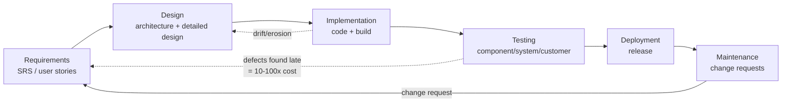
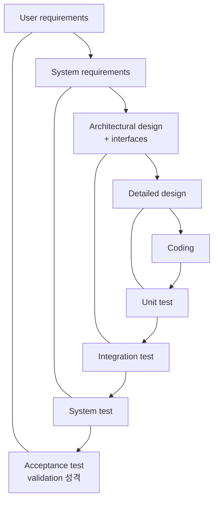
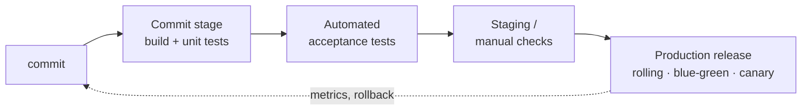

# Week 2 — SDLC Stages: Requirements & Design, Implementation, Testing, Deployment & Maintenance

> SDLC 전 단계를 한 바퀴. 이후 주차들이 각 단계를 심화하므로 (W3 process/DevOps, W4–7 design, W13–14 testing), 이 챕터는 **단계 간 관계**와 각 단계의 **핵심 산출물·실패 모드**에 집중한다. Sommerville 10e ch4 (requirements), ch7 (design & implementation), ch8.1 (V&V), ch9 (evolution) 매핑.

## Learning goals

이 챕터를 마치면 다음을 할 수 있어야 한다 (모두 시험 가능한 형태):

- functional / non-functional requirement 를 정의하고, 주어진 요구사항 문장을 분류하며, 그 경계가 왜 흐린지 예시로 설명할 수 있다.
- 모호한 NFR ("easy to use", "fast") 을 **측정 가능한 (verifiable) NFR** 로 재작성하고, 속성별 metric (Sommerville Fig 4.5) 을 제시할 수 있다.
- requirements elicitation 이 어려운 5가지 이유 (tacit knowledge 포함) 를 설명하고, interview 만으로 부족한 이유와 ethnography 가 잡아내는 요구의 종류를 말할 수 있다.
- user story 와 SRS 를 형식·용도·리스크 관점에서 비교하고, requirements validation 의 5가지 check 를 적용할 수 있다.
- architectural design 과 detailed (component) design 을 구분하고, 왜 architecture 결정이 조기·고비용 변경인지 설명할 수 있다.
- coupling 6종·cohesion 7종을 정의하고, 코드 예시를 보고 분류할 수 있다.
- Parnas (1972) 의 information hiding 논지 — "design decision 을 숨기는 것을 module 분해 기준으로 삼아라" — 를 KWIC 예제로 재구성하고, flowchart 분해와의 변경 비용 차이를 계산할 수 있다.
- 코드가 설계를 배반하는 경로 (architectural drift vs erosion, emergency fix 경로) 와 configuration management 의 4가지 활동을 설명할 수 있다.
- verification 과 validation 을 정의하고 구분하며, inspection 과 testing 의 상보성을 설명할 수 있다.
- V-model 로 개발 단계와 test level 의 대응을 그리고, 그 한계 (늦은 validation) 를 비판할 수 있다.
- rolling / blue-green / canary release 를 blast radius·rollback 속도·schema 호환성 요구 관점에서 비교하고, canary 의 detection latency 를 계산할 수 있다.
- maintenance 4분류 (corrective/adaptive/perfective/preventive) 와 실측 비용 비중을 제시하고, Lehman's laws 중 최소 3개를 시나리오에 적용할 수 있다.
- technical debt 의 원 정의 (Cunningham 1992) 를 인용하고, "debt = 나쁜 코드" 라는 오독과 구분할 수 있다.

## Why this matters

W1 에서 SE 의 존재 이유를 봤다: 소프트웨어는 개인의 프로그램이 아니라 수명이 길고 여러 사람이 만지는 제품이고, 비용의 중심은 개발이 아니라 evolution 이다. 그 명제를 구체화하는 것이 이 챕터다 — 소프트웨어는 **단계들의 사슬** (requirements → design → implementation → testing → deployment → maintenance) 을 통과하며 만들어지고, 각 단계는 고유한 산출물과 고유한 실패 모드를 갖는다.

핵심 관찰 하나가 전체를 관통한다: **결함은 발견이 늦을수록 비싸진다.** Boehm & Basili (2001) 의 정리로는, 대형 시스템에서 requirements/design 단계의 문제를 운영 단계에서 발견해 고치는 비용은 그 자리에서 고치는 것의 흔히 **100배**다 (소규모 시스템에서는 배율이 훨씬 작다). requirements 오류가 가장 비싼 이유는 단순하다 — 그 위에 design, code, test 가 전부 쌓인 뒤이기 때문에, 수정이 전 단계의 재작업을 유발한다 (Sommerville ch9: coding error < design error < requirements error 순으로 수리 비용 증가). 이 "오류의 복리" 가 이후 모든 주차의 존재 이유다: W3 의 process model 은 이 사슬을 어떤 순서로 도는지의 문제고, W13 의 "early testing" 원칙도, W9 의 설계 원칙도 결국 이 비용 곡선을 꺾으려는 시도다.

이 챕터는 각 단계를 "한 바퀴" 돈다. 각 단계의 상세는 담당 주차가 있다:

| 단계 | 이 챕터에서 | 심화 주차 |
|---|---|---|
| Requirements | FR/NFR, elicitation, user story vs SRS, validation | (이 챕터가 본진) |
| Design | architecture vs detailed, coupling/cohesion, information hiding | W4 (arch overview), W5–7 (system design), W9–12 (원칙·패턴) |
| Implementation | drift, reuse, configuration management | W4 (Git), W12 (clean code, review) |
| Testing | V&V, V-model, test stages | W13–14 (testing 이론 전체) |
| Deployment | release 전략, CI/CD 개요 | W3 (DevOps, DORA) |
| Maintenance | 4분류, Lehman's laws, technical debt | W3 (process), W9 (설계 부패) |

화살표가 한 방향이라고 프로세스가 한 방향인 것은 아니다 — 단계 구분은 **논리적** 구분이고, 이를 시간 순서로 어떻게 배치하는가 (waterfall 처럼 한 번에, incremental 처럼 여러 바퀴) 가 W3 의 process model 논의다.

---

## 1. Requirements — 무엇을 만들 것인가

### 1.1 Functional vs non-functional requirements

Sommerville ch4 의 정의:

- **Functional requirement (FR)**: 시스템이 제공해야 할 **service** 의 서술 — 특정 입력에 어떻게 반응하고, 특정 상황에서 어떻게 동작해야 하는가. 명시적으로 "하지 말아야 할 것" 을 포함하기도 한다. 예: "A user shall be able to search the appointments lists for all clinics."
- **Non-functional requirement (NFR)**: 서비스나 기능에 걸리는 **constraint** — timing, 개발 프로세스 제약, 표준 준수 등. 개별 기능이 아니라 **시스템 전체에 걸리는** 경우가 많다.

NFR 은 출처 기준으로 3분류된다 (Sommerville §4.1.2): **product requirements** (시스템 자체의 행동 제약 — performance, reliability, availability, security, usability), **organizational requirements** (개발 조직의 정책·절차에서 옴 — 개발 표준, 인증 방식), **external requirements** (시스템 밖의 요인 — 규제, 법률, 윤리).

경계는 교과서 정의만큼 깨끗하지 않다. "권한 있는 사용자만 접근 가능해야 한다" 는 NFR 처럼 보이지만, 상세화하면 인증 기능이라는 명백한 FR 들을 낳는다 — **요구사항은 서로 독립이 아니며, 하나가 다른 것을 생성·제약한다** (Sommerville §4.1). 시험에서 "이 문장은 FR 인가 NFR 인가" 를 물으면, 분류와 함께 이 경계의 흐림을 언급하는 것이 완전한 답이다.

또 하나의 결정적 차이: FR 은 하나가 미달이어도 시스템이 부분적으로 유용할 수 있지만, 전역 NFR 의 미달 (예: 신뢰성·성능 미달) 은 **시스템 전체를 무용하게** 만들 수 있다.

### 1.2 측정 가능하게 쓰는 법 — goal 이 아니라 requirement

NFR 의 고전적 실패 모드: stakeholder 는 NFR 을 **goal** 로 말한다 — "easy to use", "recover from failure quickly", "fast response". goal 은 좋은 의도의 표현일 뿐 검증이 불가능하고, 납품 후 분쟁의 원천이 된다 ("이게 easy to use 냐" 는 논쟁에 심판이 없다). 해법은 **verifiable requirement** 로의 재작성 — 객관적으로 시험 가능한 수치를 박는 것이다.

Sommerville (Fig 4.5) 의 property–metric 대응:

| Property | Metric |
|---|---|
| Speed | processed transactions/sec, user/event response time, screen refresh time |
| Size | MB / ROM chip 수 |
| Ease of use | training time, help frame 수 |
| Reliability | MTTF (mean time to failure), probability of unavailability, rate of failure occurrence, availability |
| Robustness | time to restart after failure, % of events causing failure, probability of data corruption on failure |
| Portability | % of target-dependent statements, target system 수 |

availability 는 수식으로 계약할 수 있는 대표 예다:

$$A = \frac{MTTF}{MTTF + MTTR}$$

MTTR (mean time to repair) 이 분모에 있다는 것이 실무적 함의다 — 가용성은 "안 죽는 것" 만이 아니라 "죽었을 때 빨리 살아나는 것" 으로도 올린다. 99.9% ("three nines") 는 연간 약 8.76시간의 downtime 허용이다.

**Worked example 1 — 모호한 NFR 재작성.** 공유 킥보드 백엔드의 요구사항 초안: "대여 API 는 빨라야 하고, 시스템은 안정적이어야 하며, 새 운영자가 쉽게 배울 수 있어야 한다." 재작성:

| Goal (검증 불가) | Verifiable NFR | Metric | 검증 방법 |
|---|---|---|---|
| "대여 API 는 빨라야 한다" | 대여 시작 API 의 response time 은 정상 부하 (500 req/s) 에서 **p99 < 200 ms** | user/event response time (percentile) | load test 로 계측 |
| "시스템은 안정적이어야 한다" | 월간 availability **≥ 99.9%** (계획 정지 제외), 장애 시 restart ≤ 5 min | availability, time to restart | 운영 모니터링 실측 |
| "쉽게 배울 수 있어야 한다" | 신규 운영자는 **2시간 교육 후** 관리 콘솔 전 기능 수행 가능, 이후 시간당 조작 오류 ≤ 2회 | training time, error rate | 신규 운영자 대상 usability test |

세 번째 행이 Sommerville 의 Mentcare 예시 (2 hours of training, ≤ 2 errors/hour) 와 같은 패턴이다 — "easy to use" 조차 instrumentation 으로 오류를 세면 시험 가능해진다. 첫 행의 percentile 표기 (평균이 아니라 p99) 가 왜 옳은 선택인지는 W5 §1.2 (tail latency) 에서 정량적으로 다룬다. 주의: Sommerville 이 경고하듯 **정량화에도 비용이 있다** — maintainability 처럼 좋은 metric 이 없는 속성이 있고, 객관적 검증 자체의 비용을 고객이 정당하다 여기지 않을 수 있다. 측정 가능성은 공짜가 아니라 분쟁 비용과의 트레이드오프다.

### 1.3 Elicitation 이 어려운 이유

requirements 는 "수집 (gather)" 하는 것이 아니다 — 어디 놓여 있지 않기 때문이다. Sommerville §4.3 의 5가지 어려움:

1. **Stakeholder 는 자기가 뭘 원하는지 모른다** — 막연한 수준 이상으로 표현하지 못하고, 실현 가능성을 몰라 비현실적 요구를 한다.
2. **Tacit knowledge**: stakeholder 는 자기 업무의 암묵지 위에서, 자기 용어로 말한다. 너무 당연해서 말할 가치가 없다고 여기는 지식 (사서에게 "모든 신간은 목록화 후 배가한다" 는 언급할 필요조차 없는 상식) 은 인터뷰에서 절대 나오지 않는다.
3. **Stakeholder 간 충돌**: 서로 다른 이해관계자가 다른 방식으로 다른 요구를 말한다. 공통점과 충돌을 발견하는 것 자체가 엔지니어의 일이다.
4. **정치적 요인**: 관리자가 조직 내 영향력 확대를 위해 특정 요구를 밀어붙일 수 있다. 공식 조직도와 실제 의사결정 구조는 다르고, 사람들은 낯선 이에게 그 실체를 말하지 않는다.
5. **환경의 동적 변화**: 분석이 진행되는 동안에도 경제·비즈니스 환경이 변해 요구의 중요도가 바뀌고 새 stakeholder 가 나타난다.

interview 의 한계가 여기서 나온다: (2) 때문에 암묵지를 못 잡고, (4) 때문에 조직적 요구를 못 잡는다. "tell me what you want" 는 유용한 정보를 만들지 못한다 — 사람은 정의된 맥락 (prototype, 구체적 제안) 위에서만 말을 잘한다. 보완 기법이 **ethnography** (관찰): 분석가가 작업 환경에 들어가 실제 일하는 방식을 관찰한다. 이것이 잡아내는 두 종류의 요구 (Sommerville §4.3.1.2): (a) 공식 프로세스 정의가 아니라 **실제로 일하는 방식**에서 나오는 요구 (관제사가 규정상 켜야 하는 충돌 경보를 산만하다고 꺼버리는 현실), (b) **협업과 상호 인지**에서 나오는 요구 (옆 섹터의 부하를 보고 자기 전략을 조정하는 관제사 → 시스템은 인접 섹터 가시성을 제공해야 한다). 납품됐지만 **한 번도 쓰이지 않는** 시스템의 상당수가 이 사회·조직적 요인을 놓친 결과다.

### 1.4 User story vs SRS

요구를 문서화하는 양극단의 두 형식:

- **User story** (agile 진영): `As a <role>, I want <capability>, so that <benefit>` (Cohn 2004). 한 장의 카드 분량. 핵심 철학은 **완결된 명세가 아니라 대화의 약속 (placeholder for a conversation)** 이라는 것 — 상세는 구현 직전에 개발자·고객의 대화로 채우고, 뒷면의 acceptance criteria 가 완료 판정을 준다. 좋은 story 의 기준으로 **INVEST** (Independent, Negotiable, Valuable, Estimable, Small, Testable — Wake 2003) 가 통용된다. Negotiable 이 SRS 와의 결정적 차이다: story 는 계약이 아니다.
- **SRS (Software Requirements Specification)**: 시스템이 해야 할 것의 **공식 문서**. 구조 표준은 ISO/IEC/IEEE 29148 (구 IEEE 830). 개별 요구사항 문장의 품질 특성 — unambiguous, complete, singular (한 문장 한 요구), feasible, **verifiable** — 을 요구하고, 각 요구에 고유 ID 를 부여해 **traceability** (요구 ↔ 설계 ↔ 테스트의 추적) 의 기반을 만든다. 문장 형식을 강제해 모호성을 줄이는 실무 기법으로 **EARS** (`When <trigger>, the <system> shall <response>` — Mavin et al. 2009) 가 있다.

선택 기준은 시스템의 성격이다. 외주 계약·규제 대상·안전 중요 시스템 (계약과 인증의 근거 문서가 필요) 은 SRS 없이 갈 수 없다. 반대로 요구가 빠르게 변하는 제품 개발에서 수백 페이지 SRS 는 작성 순간부터 부패하는 문서다 — 요구 변경 비용에 문서 갱신 비용이 얹힌다. 흔한 실무 절충: **user story 로 백로그를 운용하되, NFR 과 인터페이스 계약은 문서로 고정**한다. NFR 은 story 카드에 잘 잡히지 않는 전역 속성이기 때문이다 (story 는 기능 단위 절단이라 "시스템 전체 p99" 의 주인이 없다).

### 1.5 Requirements validation 과 변경 관리

작성된 요구가 "고객이 정말 원하는 시스템" 을 정의하는지 검사하는 단계. Sommerville §4.5 의 5가지 check:

1. **Validity** — 진짜 필요를 반영하는가 (엘리시테이션 후 상황이 변했을 수 있다)
2. **Consistency** — 문서 내 충돌·중복 서술이 없는가
3. **Completeness** — 의도된 모든 기능·제약이 들어 있는가
4. **Realism** — 기술·예산·일정 안에서 구현 가능한가
5. **Verifiability** — 각 요구를 판정할 테스트를 쓸 수 있는가 (§1.2 가 이것을 위한 준비다)

기법 3종: **requirements review** (이해관계자·개발자 합동 정독), **prototyping** (실행 모델로 기대 확인), **test-case generation** (요구마다 테스트를 미리 설계 — 테스트를 못 만들겠으면 그 요구는 구현도 어렵다는 신호). 그리고 validation 을 통과한 요구는 동결되는 것이 아니라 **변경 관리**로 들어간다: 변경 요청 → problem analysis → **change analysis and costing** (traceability 정보로 파급 범위·비용 산정) → change implementation (Sommerville §4.6). traceability 가 없으면 이 비용 산정이 불가능하다 — "이 요구를 바꾸면 어떤 설계·코드·테스트가 영향받는가" 를 답할 수 없기 때문이다. 대형 시스템 요구가 끊임없이 변하는 근본 이유는 그것이 "wicked problem" (완전히 정의할 수 없는 문제 — Rittel & Webber 1973) 이기 때문이다. 이 챕터의 lab 이 정확히 이 사이클 (SRS-lite → 구현 → change request → 파급 측정) 을 돈다.

---

## 2. Design — 어떻게 나눌 것인가

### 2.1 Architectural design vs detailed design

design 은 한 활동이 아니라 층위가 다른 활동들의 묶음이다 (Sommerville §2.2.2, Fig 2.5):

1. **Architectural design** — 시스템의 전체 구조: 주요 component (subsystem/module) 식별, 그들 간 관계, 배치. **requirements 와 design 을 잇는 결정적 고리**다.
2. **Database design** — 데이터 구조와 DB 표현.
3. **Interface design** — component 간 인터페이스 정의. 인터페이스가 **unambiguous** 하게 합의되면 component 들을 병렬로 독립 개발할 수 있다 — 인터페이스는 분업의 계약이다.
4. **Component selection and design** — 재사용 component 탐색, 없으면 상세 설계 (detailed design).

architecture 를 별도 층위로 두는 이유는 **변경 비용의 비대칭** 때문이다: "component refactoring 은 비교적 싸지만, architecture refactoring 은 대부분의 component 를 그에 맞춰 수정해야 하므로 비싸다" (Sommerville ch6). 그래서 agile 프로세스조차 초기 architecture 설계는 up-front 로 하는 것이 일반적으로 받아들여진다 — architecture 의 incremental 개발은 대개 실패한다. 어떤 결정이 architectural 한가의 실용적 판별: **바꾸려면 여러 component 를 동시에 고쳐야 하는 결정** (통신 방식, 데이터 소유권, 기술 스택) 이 architecture 다. 이 조기성·비가역성 논의는 W4 에서, 구체적 아키텍처 스타일은 W7 에서 심화한다.

### 2.2 Modularity: coupling 과 cohesion

좋은 분해의 고전적 품질 축 두 개 (Stevens, Myers & Constantine 1974; Yourdon & Constantine 1979). 목표는 한 문장이다: **module 간 연결은 약하게 (low coupling), module 내부는 단단하게 (high cohesion).** 이유는 변경 비용이다 — 변경은 결합을 타고 전파되므로, 결합이 약할수록 변경이 국소화된다.

**Coupling 6종** (나쁜 것 → 좋은 것):

| 종류 | 정의 | 예 |
|---|---|---|
| **Content** | 한 module 이 다른 module 의 내부 (코드·내부 데이터) 에 직접 손댐 | 다른 클래스의 private 표현을 리플렉션으로 조작 |
| **Common** | 여러 module 이 전역 mutable 데이터를 공유 | 전역 config dict 를 여러 모듈이 읽고 씀 |
| **External** | 외부에서 강제된 형식·프로토콜·장치를 여러 module 이 직접 공유 | 두 모듈이 같은 파일 포맷 상세를 각자 하드코딩 |
| **Control** | 한 module 이 flag 를 넘겨 다른 module 의 **내부 로직 분기를 지시** | `process(data, mode=3)` — 호출자가 피호출자의 알고리즘 선택을 앎 |
| **Stamp** | 필요한 것보다 큰 복합 구조체를 통째로 전달 | 이름만 필요한 함수에 User 전체를 넘김 (불필요한 필드 변경에도 재검토 필요) |
| **Data** | 필요한 원소 데이터만 인자로 전달 | `fare(minutes, rate)` |

**Cohesion 7종** (나쁜 것 → 좋은 것):

| 종류 | module 요소들이 묶인 이유 | 예 |
|---|---|---|
| **Coincidental** | 이유 없음 | `utils.py` 잡탕 |
| **Logical** | 같은 "범주" 의 일 (flag 로 선택) | 모든 종류의 입력을 다 하는 `read_anything(source_type)` |
| **Temporal** | 같은 시점에 실행됨 | `init()` — 로깅·DB·캐시 초기화가 한 덩어리 |
| **Procedural** | 정해진 실행 순서를 따름 | "권한 확인 후 로그 기록" 을 한 함수로 |
| **Communicational** | 같은 데이터를 다룸 | 같은 레코드를 검증하고 출력하는 함수 묶음 |
| **Sequential** | 한 요소의 출력이 다음의 입력 | parse → transform → format 파이프라인 |
| **Functional** | 전부가 **하나의 잘 정의된 작업**에 기여 | `compute_fare()` |

시험 함정 두 가지. (1) logical cohesion 은 이름이 그럴듯해서 좋아 보이지만 하위 2등급이다 — flag 선택은 호출자 측의 **control coupling** 을 유발한다. 즉 낮은 cohesion 과 나쁜 coupling 은 동전의 양면이다. (2) low coupling 은 "의존 없음" 이 아니다 — 의존은 필연이고, 문제는 의존의 **형태** (내부에 대한 의존이냐, 좁은 인터페이스에 대한 의존이냐) 다. 이 직관을 W9 의 SOLID 가 원칙으로 형식화한다.

### 2.3 Information hiding — Parnas (1972)

coupling/cohesion 이 분해의 **품질 평가 축**이라면, Parnas 는 분해의 **기준 (criteria)** 자체를 제시했다. "On the Criteria to Be Used in Decomposing Systems into Modules" (CACM 15(12), 1972) 의 논지:

> 통상적 기준 — flowchart 의 처리 단계 하나하나를 module 로 만드는 것 — 대신, **어렵거나 변할 가능성이 높은 design decision 의 목록에서 시작해, 각 decision 을 다른 module 들로부터 숨기는 것을 module 로 삼아라.** 두 번째 분해의 모든 module 은 "자신이 다른 모두에게 숨기는 design decision 에 대한 지식" 으로 특징지어진다.

module 은 "일의 단계" 가 아니라 **"비밀 (secret) 의 소유 단위"** 라는 것. 인터페이스는 그 비밀이 새지 않도록 설계된 좁은 창이다.

**Worked example 2 — KWIC 두 가지 분해.** Parnas 의 예제: KWIC (Key Word In Context) 색인 — 입력된 각 줄의 circular shift (첫 단어를 끝으로 보내는 회전) 를 전부 만들고 알파벳 순으로 정렬해 출력하는 시스템.

- **Modularization 1 (flowchart 기준)**: Input → Circular Shift → Alphabetizer → Output 의 처리 단계별 module. 이들은 **공유 데이터 구조** (문자 배열 + 인덱스) 의 표현을 전부 알고 있다.
- **Modularization 2 (information hiding 기준)**: Line Storage (줄의 저장 표현을 숨김), Input, Circular Shifter (shift 를 실제 복사본으로 만들지 인덱스로만 표현할지를 숨김), Alphabetizer (전부 미리 정렬할지 요청 시 lazy 하게 정렬할지를 숨김), Output, Master Control. 각 module 은 함수 호출 인터페이스로만 접근된다.

변경 시나리오별 파급 (Parnas 의 분석):

| Design decision 변경 | Mod 1 (flowchart) | Mod 2 (info hiding) |
|---|---|---|
| 줄 저장 방식 변경 (메모리 → 보조기억, 문자 packing) | **거의 모든 module** 수정 | Line Storage 만 |
| circular shift 를 복사 대신 인덱스로 표현 | Circular Shift + Alphabetizer + Output | Circular Shifter 만 |
| 정렬을 일괄 → 검색 시 lazy 로 | Alphabetizer + 그 출력을 아는 module | Alphabetizer 만 |

두 분해는 **실행 시점에는 동일한 프로그램일 수 있다** — 차이는 코드가 아니라 "누가 무엇을 알고 있는가" 의 분포다. Parnas 가 정리한 modularization 2 의 이득 셋: 변경 용이성 (product flexibility), 독립 개발 가능성 (managerial — 인터페이스만 합의하면 병렬 개발), 이해 용이성 (comprehensibility — module 하나를 다른 module 의 내부 지식 없이 이해). 주의할 점까지 원문에 있다: 분해의 우열은 **어떤 변경이 실제로 올 것인가에 대한 예측**에 걸려 있다 — 숨긴 결정이 안 변하고 노출한 결정이 변하면 이득은 사라진다. encapsulation (언어 기능으로 접근을 막는 것) 은 information hiding (무엇을 비밀로 할지의 설계 결정) 을 구현하는 수단이지 동의어가 아니다. 이 챕터 lab 의 low-coupling 설계가 정확히 이 원리 (pricing policy = 비밀) 를 코드로 만든 것이다.

---

## 3. Implementation — 설계는 어떻게 배반당하는가

### 3.1 Design–code drift

설계 문서와 코드는 시간이 지나면 어긋난다. Perry & Wolf (1992) 의 고전적 구분:

- **Architectural erosion**: 설계를 **위반**하는 변경의 누적 — "이번만" layer 를 건너뛴 호출, 금지된 방향의 의존 추가. 각각은 작동하지만, 누적되면 원래 architecture 가 보장하던 성질 (변경 국소성 등) 이 소리 없이 사라진다.
- **Architectural drift**: 위반은 아니지만 architecture 에 **무관심한** 변경의 누적 — 설계 의도가 불명료해지고, 뭐가 원칙이었는지 아무도 모르게 된다. drift 는 erosion 으로 가는 길을 닦는다.

drift 의 대표적 유입 경로가 **emergency fix** 다 (Sommerville §9.1, Fig 9.6): 운영 장애 → 요구·설계 문서를 갱신할 시간 없이 코드만 수정 → "나중에 문서 갱신" 은 다음 긴급 수정에 밀림 → 요구·설계·코드가 영구히 불일치. 급하게 넣은 수정은 구조상 최선이 아니라 "빨리 되는" 해법이라 software ageing 을 가속한다 — 이후 변경이 점점 어려워지는 양성 피드백. 방어는 두 방향이다: (a) 수정 후 refactoring 으로 구조를 복원 (Sommerville 의 처방), (b) 설계 규칙을 문서가 아니라 **기계가 검사** (의존 방향을 검사하는 fitness function, lint 규칙, 모듈 경계 테스트) — 사람의 규율에만 의존한 architecture 는 반드시 침식된다.

### 3.2 Reuse — 현대 구현의 기본값

1960~90년대의 "전부 새로 작성" 은 비용·일정 압박으로 비현실이 됐고, 지금은 reuse 기반 개발이 표준이다. Sommerville §7.3.1 의 4 수준: **abstraction** (아이디어만 재사용 — design/architectural pattern, W10–12), **object** (라이브러리 객체 직접 사용), **component** (framework 에 코드를 끼워 넣음), **system** (COTS 전체를 설정·통합). 재사용은 공짜가 아니다 — 탐색·평가 비용, 구매 비용, 적응·설정 비용, 그리고 **서로 충돌하는 가정을 가진 외부 요소들의 통합 비용**을 지불한다. "reuse 를 먼저 고려하고 그에 맞춰 요구·설계를 조정하라" 가 교과서의 처방이다.

### 3.3 Configuration management 개요

여러 사람이 끊임없이 바뀌는 시스템을 만들 때, "지금 어떤 버전들의 조합이 시스템인가" 를 관리하는 규율 (Sommerville §7.3.2). 4가지 활동:

1. **Version management** — component 버전 추적, 동시 수정 조정 (서로의 작업을 덮어쓰지 않게). 도구: Git (W4 에서 internals 까지).
2. **System building / integration** — 어떤 component 버전들로 시스템을 조립하는지 정의하고 자동 빌드.
3. **Problem tracking** — 버그·이슈 보고와 처리 상태 추적.
4. **Release management** — 고객에게 나가는 릴리스의 기능 계획과 배포 준비.

이것이 §5 의 CI/CD 의 전제다: "빌드가 재현 가능하다" (같은 버전 조합 → 같은 산출물) 는 성질 없이는 자동 배포 파이프라인이 성립하지 않는다. 덧붙여 **host-target development** (Sommerville §7.3.3): 개발 platform (host) 과 실행 platform (target) 은 대개 다르다 — "내 머신에선 되는데" 문제의 근원이고, W4 의 container 가 이 host–target 간극을 이미지로 봉인하는 해법이다.

---

## 4. Testing — 제대로 만들었는가, 맞는 걸 만들었는가

### 4.1 Verification vs validation

Boehm 의 고전적 정식화 (Sommerville ch8):

- **Validation**: *"Are we building the **right product**?"* — 스펙을 넘어, 고객의 실제 기대·필요를 충족하는가.
- **Verification**: *"Are we building the product **right**?"* — 명시된 functional/non-functional requirements 를 충족하는가 (스펙 대비 검사).

validation 이 별도로 필요한 이유는 §1.3 이 이미 증명했다 — **requirements 문서 자체가 고객의 진짜 필요를 반영한다는 보장이 없기 때문**이다. 스펙에 100% 부합해도 (verification 통과) 잘못된 제품 (validation 실패) 일 수 있다. V&V 의 목표는 절대적 무결함 증명이 아니라 시스템이 "fit for purpose" 하다는 **확신 (confidence) 의 수립**이고, 요구되는 확신 수준은 시스템의 중요도·사용자 기대·시장 상황에 따라 다르다.

V&V 의 두 축은 상보적이다:

- **Software inspection / review** (static): 실행 없이 산출물을 검토. 요구 문서·설계·미완성 코드 등 **실행 불가능한 산출물에도 적용 가능**하고, 오류가 서로를 가리는 간섭 없이 한 번에 여러 결함을 찾을 수 있다. 그러나 실행하지 않으므로 **NFR (성능 등) 과 예기치 못한 상호작용에서 오는 결함은 원리적으로 못 찾는다**.
- **Testing** (dynamic): 실제 실행으로 검증. NFR 과 창발적 문제를 잡을 수 있는 유일한 방법이지만, 실행 가능한 것이 존재한 뒤에만 가능하다.

### 4.2 V-model — 단계별 검증의 대응 구조

각 개발 단계의 산출물이 대응하는 test level 의 **기준 (test basis)** 이 된다는 모델:

읽는 법: 왼쪽으로 내려가며 만든 각 산출물에 대해, **그 산출물을 test basis 로 한 테스트를 그 시점에 설계**할 수 있고 (test-case generation — §1.5 의 validation 기법과 동일한 통찰), 오른쪽으로 올라가며 그 테스트를 실행한다. unit test 는 detailed design 을 (code 자체와 함께), integration test 는 architectural design 과 interface 정의를, system test 는 system requirements 를, acceptance test 는 user requirements 를 기준으로 한다 — 즉 아래쪽일수록 verification, 꼭대기의 acceptance 는 validation 성격이다. coding 은 V 의 꼭짓점에 있어 짝이 되는 test level 이 따로 없다 — 모든 level 의 테스트 **대상**이 code 다. Sommerville 의 3단 testing 프로세스 (component → system → customer testing) 가 오른팔에 대응한다.

V-model 의 가치는 "테스트 설계를 코딩 후로 미루지 마라" 는 규율이고, 한계는 구조적이다: **validation (acceptance) 이 사슬의 맨 끝**이라, "잘못된 제품" 이라는 가장 비싼 실패가 가장 늦게 발견된다. incremental process (W3) 가 이 한계에 대한 응답이다 — 사이클을 짧게 여러 번 돌면 acceptance 피드백이 매 iteration 마다 온다. test level 각각의 상세 (test double, integration 전략, RIPR) 는 W13 의 본론이다.

---

## 5. Deployment — 검증된 코드를 사용자에게

### 5.1 CI/CD 파이프라인 개요

- **Continuous Integration (CI)**: 모든 개발자가 하루 한 번 이상 mainline 에 통합하고, 통합마다 자동 빌드·테스트로 검증 (Fowler). 목표는 "integration hell" 의 제거 — 통합 간격이 길수록 충돌·회귀의 파급이 커지므로, 간격을 극단적으로 줄여 각 통합을 사소하게 만든다.
- **Deployment pipeline** (Humble & Farley 2010): commit 이 production 까지 가는 경로를 자동화된 단계들 — commit stage (빌드 + unit test, 분 단위) → automated acceptance test → (필요시 manual/exploratory test) → release — 로 모델링하고, 각 단계가 릴리스 후보에 대한 확신을 점증적으로 높인다. **모든 단계에 같은 binary 가 흘러야 한다** (단계마다 재빌드하면 검증한 것과 배포하는 것이 다른 물건이 된다).
- **Continuous Delivery vs Continuous Deployment**: delivery 는 "모든 커밋이 언제든 릴리스 **가능한** 상태" (마지막 배포 버튼은 사람이 누름), deployment 는 파이프라인 통과 시 **자동으로 production 까지** 감. 상세와 DORA 4 metrics 는 W3.

### 5.2 Release 전략 — blast radius 와 rollback 의 거래

배포의 본질적 문제: 새 버전에는 테스트가 못 잡은 결함이 있을 수 있다 (W13: testing 은 결함의 존재만 보일 수 있다). 그러므로 release 전략의 설계 변수는 **노출 범위 (blast radius) 를 어떻게 제한하고, 실패 시 얼마나 빨리 되돌리는가**다.

| 전략 | 동작 | Rollback | 비용/제약 |
|---|---|---|---|
| **Rolling** | 인스턴스를 몇 대씩 순차 교체 (Kubernetes Deployment 의 기본: `maxUnavailable`/`maxSurge` 로 속도 제어) | 역방향 rolling — 느림 | 추가 인프라 거의 없음. 교체 동안 **구·신버전이 동시에 트래픽을 받으므로** API·schema·메시지 형식의 N-1 호환 필수 |
| **Blue-green** | 동일한 production 환경 2벌 (blue=현행, green=신규). green 에 배포·검증 후 **router 전환 한 방**으로 절체 (Humble & Farley ch10) | 라우터를 되돌리면 즉시 — 가장 빠름 | 인프라 2벌 비용. **DB 는 2벌이 아니다** — schema 변경은 양버전 호환이어야 하며, expand/contract (parallel change) 로 단계 분리 필요 |
| **Canary** | 신버전을 소수 인스턴스에 배포, 트래픽의 소량 (예: 1~5%) 만 라우팅, 실측 metric (error rate, latency) 비교 후 점진 확대 (Humble & Farley; Sato 2014) | canary 트래픽 차단 — 빠름, 피해는 이미 국소 | metric 파이프라인과 자동 판정·rollback 없으면 무의미. rolling 과 동일한 버전 호환 요구. **A/B testing 과 다름** — canary 는 release 리스크 완화, A/B 는 제품 실험 |

**Worked example 3 — canary 의 blast radius 와 detection latency.** 전체 트래픽 $R = 10{,}000$ req/min, 신버전에 요청의 $f = 1\%$ 를 실패시키는 결함이 있고, baseline error rate 대비 유의미한 판정에 canary 를 통과한 표본 $N = 5{,}000$ 건이 필요하다고 하자. canary 비율 $c$ 일 때:

$$t_{detect} = \frac{N}{cR}, \qquad \text{피해 요청 수} = c \cdot R \cdot t_{detect} \cdot f = N \cdot f$$

$c = 5\%$: $t_{detect} = 5000/500 = 10$ min, 피해 $= 5000 \times 0.01 = 50$ 건. $c = 100\%$ (전면 배포): $t_{detect} = 0.5$ min, 피해 $= 50$ 건 — **같다.** 표본 수로 검출되는 결함의 기대 피해는 canary 비율과 무관하게 $N \cdot f$ 로 고정된다는 것이 요점이다. 그럼에도 canary 가 옳은 이유는 **worst case 의 상한**에 있다: 자동 검출이 실패하고 시간 $T$ 동안 방치될 때 피해는 $cRTf$ — canary 는 이를 $c$ 배로 캡한다 (5% canary 는 최악의 경우에도 사용자의 5% 만 노출). 또한 상태를 오염시키는 결함 (잘못된 쓰기) 은 요청 수가 아니라 노출 범위가 피해를 결정한다. 트레이드오프도 식에서 나온다: $c$ 를 줄이면 최악 피해는 줄지만 $t_{detect} \propto 1/c$ 로 검증이 느려진다 — 발생 빈도가 낮은 결함일수록 작은 canary 로는 오래 걸린다.

공통 전제: 이 모든 전략은 §3.3 의 release management 가 자동화되어 있고 (재현 가능한 빌드·버전 식별), 관측 (metric) 이 있어야 성립한다. "배포 전략" 은 라우팅 기술이 아니라 **배포를 되돌릴 수 있는 조직 능력**의 문제다.

---

## 6. Maintenance & Evolution — 비용의 본진

### 6.1 유지보수의 분류와 비용 구조

배포는 끝이 아니라 최장 단계의 시작이다. 유지보수 분류 (Swanson 1976 에서 기원, ISO/IEC 14764 로 표준화):

1. **Corrective** — 결함 수정 (Sommerville 의 fault repair). coding error 는 싸고, design error 는 여러 component 재작성, requirements error 는 시스템 재설계까지 — §Why 의 비용 곡선이 여기서 재등장한다.
2. **Adaptive** — 환경 변화 대응 (Sommerville 의 environmental adaptation): 새 platform, OS, 의존 시스템 변경.
3. **Perfective** — 새 요구·개선 반영 (Sommerville 의 functionality addition).
4. **Preventive** — 미래 결함·변경 비용을 줄이기 위한 선제 개선 (refactoring, 구조 개선). ISO 14764 가 추가한 4번째 범주.

Sommerville 은 corrective/adaptive/perfective 라는 용어가 문헌마다 다르게 쓰여 혼선이 있음을 지적하며 fault repair / environmental adaptation / functionality addition 을 쓴다 — 시험에서는 두 명명 체계의 대응을 알아야 한다. 실측 비중 (Sommerville Fig 9.12, Davidsen & Krogstie 2010 — 1980~2005 의 여러 조사와 비교해 30년간 거의 불변): **fault repair 24%, environmental adaptation 19%, functionality addition/modification 58%**. 즉 **유지보수의 3/4 은 버그 수정이 아니라 진화**다.

같은 기능이라도 유지보수 중 추가가 개발 중 추가보다 비싼 3가지 이유 (Sommerville §9.3): (1) 새 팀이 프로그램과 설계 결정의 배경을 **이해하는 데** 시간을 써야 한다 (program understanding 이 변경 구현의 첫 단계), (2) 개발과 유지보수의 계약 분리 — 개발팀이 유지보수성에 투자할 유인이 없다, (3) 유지보수 업무의 낮은 인기 → 숙련도 문제. 그리고 **legacy system 딜레마**: 오래된 시스템은 교체 리스크 (문서 없음, 암묵 지식, 업무 절차와의 유착) 와 유지 비용 상승 사이에 끼인다 — 버리기엔 비즈니스가 그 위에서 돌고, 유지하기엔 변경 비용이 복리로 는다.

### 6.2 Lehman's laws — 진화의 동역학

Lehman & Belady 는 대형 시스템 (IBM OS/360 등) 의 릴리스 데이터를 관측해 소프트웨어 진화의 경험 법칙을 정식화했다 (Lehman 1980, 5개; 1996 개정판에서 8개). 법칙들은 **E-type** 프로그램 — 현실 세계에 embed 되어 그 세계와 상호작용하는 프로그램 — 에 적용된다 (S-type: 수학적 스펙으로 완전히 정의됨, P-type: 현실 문제의 근사 해 — 이들은 제외). E-type 이 핵심인 이유: **프로그램의 설치 자체가 환경을 바꾸고, 바뀐 환경이 새 요구를 만든다** — 진화는 feedback loop 다.

| # | 법칙 | 내용 |
|---|---|---|
| 1 | **Continuing change** | E-type 시스템은 계속 변하지 않으면 점점 덜 유용해진다 |
| 2 | **Increasing complexity** | 진화하는 프로그램은 구조가 퇴화한다 — 유지·개선 작업을 따로 하지 않는 한 복잡도는 증가한다 |
| 3 | Self-regulation | 진화 과정은 자기조절적이다 (릴리스 규모·간격이 통계적 규칙성을 보임) |
| 4 | Conservation of organizational stability | 시스템 수명 동안 평균 개발 활동량은 투입 자원과 거의 무관하게 일정하다 |
| 5 | Conservation of familiarity | 릴리스당 변경량은 대체로 일정하다 — 한 릴리스에 너무 많이 바꾸면 품질·숙련이 무너져 다음이 느려진다 |
| 6 | Continuing growth | 사용자 만족 유지를 위해 기능은 계속 늘어야 한다 |
| 7 | Declining quality | 환경 변화에 맞춰 적응하지 않는 한 품질은 하락하는 것으로 지각된다 |
| 8 | Feedback system | 진화 과정은 다층 feedback 시스템이며, 이를 다뤄야 개선이 가능하다 |

law 1+2 의 조합이 유지보수 경제학의 핵심 긴장이다: 변하지 않으면 무용해지고 (1), 변하면 구조가 썩는다 (2) — 그래서 **preventive maintenance (refactoring) 는 사치가 아니라 law 2 에 대한 상쇄 작업**이다. law 4·5 는 "사람을 더 넣으면 더 빨리 진화한다" 는 가정을 데이터로 반박한다 (조직·소통 비용이 지배).

### 6.3 Technical debt — 원 정의로

Cunningham (OOPSLA 1992 experience report) 의 원 은유:

> "Shipping first time code is like going into debt. A little debt speeds development so long as it is paid back promptly with a rewrite. … The danger occurs when the debt is not repaid. Every minute spent on not-quite-right code counts as **interest** on that debt."

세 가지를 정확히 읽어야 한다. (1) 원 정의에서 debt 는 **전략적 선택**이다 — 지금의 불완전한 이해로 일단 출시해 학습을 앞당기고, 배운 것을 rewrite 로 **상환**하는 것까지가 은유의 전부다. (2) 비용 모델이 대출과 같다: 원금 (재작성 비용) 이 아니라 **이자** (어긋난 코드 위에서 이후 모든 변경이 조금씩 느려지는 것) 가 조직을 죽인다 — 상환 없이 쌓이면 "이자 갚느라 원금 (새 기능) 을 못 내는" 상태, Lehman law 2 의 다른 표현이다. (3) Cunningham 은 후에 명시적으로 정정했다: **"나쁜 코드를 짜도 된다" 는 뜻이 아니다** — 은유는 이해의 부족을 안고 출시하는 것이지, 알면서 엉망으로 만드는 것이 아니다. Fowler 의 technical debt quadrant 가 이 구분을 정리한다: deliberate/inadvertent × prudent/reckless. Cunningham 의 은유를 이 격자에 놓으면 두 겹이다 — "지금 출시한다" 는 **결정**은 prudent-deliberate 지만, 은유의 본체인 not-quite-rightness 는 출시 전에는 알 수 없었던 이해의 부족에서 오므로 Fowler 자신은 Ward 의 debt 를 **prudent-inadvertent** ("now we know how we should have done it") 에 놓는다 — 최고의 설계 팀에게도 불가피한 종류의 부채라는 것이 요점이다. 반대편은 명확하다: reckless-deliberate ("설계할 시간 없어") 는 debt 가 아니라 그냥 부실이다.

lab 에서 이 이자를 직접 측정한다: 같은 change request 를 low-coupling 설계와 high-coupling 설계에 적용했을 때의 diff 크기 차이가 — 그 설계 부채의 1회분 이자다.

---

## 7. 종합 — 단계가 아니라 산출물과 검증의 사슬

SDLC 를 "순서" 로 외우면 반쪽이다. 남는 프레임은 이것이다:

| 단계 | 핵심 산출물 | 그 산출물의 검증 | 대표 실패 모드 |
|---|---|---|---|
| Requirements | SRS / story + acceptance criteria | review, prototyping, test-case generation | 모호한 NFR, tacit knowledge 누락, 미검증 변경 |
| Design | architecture 모델, 인터페이스 계약 | design review, (W14) fitness 검사 | 잘못된 분해 기준 (flowchart), 높은 coupling |
| Implementation | 버전 관리되는 코드 + 재현 가능한 빌드 | unit test, inspection/code review | drift/erosion, emergency fix 의 미상환 |
| Testing | 각 level 의 테스트와 결과 | (테스트 자체의 품질 — W14 coverage) | validation 을 끝까지 미룸 |
| Deployment | 릴리스 (식별 가능한 버전) | 점진 노출 + 실측 metric | rollback 불능, schema 비호환 |
| Maintenance | change request 와 새 릴리스 | regression test, 비용/파급 분석 | 이해 없는 수정, 부채 미상환 |

각 행이 이후 주차 하나씩의 예고편이다. 그리고 각 단계 사이에는 **feedback** 이 있어야 한다 — 그것이 없는 순수 순차 모델이 왜 실패하는지가 W3 의 첫 질문이다.

---

## Common misconceptions

1. **"NFR 은 기능이 아니니 테스트할 수 없다."** — 정반대. verifiability 는 NFR 작성의 요구 조건이다. "easy to use" 는 테스트 불가지만 "2시간 교육 후 시간당 오류 ≤ 2회" 는 계측 가능하다 (Sommerville §4.2). 테스트를 못 쓰겠다면 그것은 requirement 가 아니라 goal 이다.
2. **"Verification 과 validation 은 같은 말이다."** — verification 은 스펙 대비 ("product right"), validation 은 실제 필요 대비 ("right product"). 스펙 자체가 틀릴 수 있으므로 (elicitation 의 5가지 어려움) 둘은 독립적으로 실패할 수 있다 — verification 만점 + validation 낙제가 "납품됐지만 안 쓰이는 시스템" 이다.
3. **"V-model 은 waterfall 이므로 배울 가치가 없다."** — V-model 의 핵심 주장은 시간 순서가 아니라 **대응 관계** (각 산출물 ↔ 그것을 기준으로 하는 test level) 다. 이 대응은 iterative 프로세스 안에서도 그대로 성립한다 (매 iteration 이 작은 V). 비판할 지점은 acceptance 가 늦다는 것이지 대응 구조 자체가 아니다.
4. **"Maintenance ≈ 버그 수정."** — 실측으로 fault repair 는 24%. 58% 는 새 요구 반영이다 (Sommerville Fig 9.12). 유지보수의 본질은 수리가 아니라 **진화**고, 그래서 비용의 지배 요인은 디버깅 실력이 아니라 변경 용이성 (설계 품질) 이다.
5. **"Technical debt = 나쁜 코드."** — Cunningham 의 은유에서 debt 는 불완전한 **이해**를 안고 의도적으로 출시하고 학습 후 상환하는 전략이다. 상환 계획 없는 부실 코드는 debt 의 오용이다 (Fowler quadrant 의 reckless 사분면). "debt 니까 괜찮아" 는 은유를 면죄부로 쓰는 것.
6. **"Low coupling = 의존을 없애는 것."** — 의존 자체는 필연이다. coupling 등급이 재는 것은 의존의 **유무가 아니라 형태**다: 내부 표현에 대한 의존 (content/common) 이 나쁘고, 좁은 인터페이스와 원소 데이터에 대한 의존 (data) 이 좋다. "완전 독립 모듈" 은 시스템이 아니다.
7. **"Blue-green 이면 rollback 이 공짜다."** — 라우터 절체는 즉시지만 **DB 는 한 벌**이다. 신버전이 schema 를 비가역적으로 바꿨거나 잘못된 데이터를 썼다면 되돌릴 수 없다. blue-green 의 전제는 expand/contract 식 호환 schema 변경이고, 이를 어기면 "즉시 rollback" 은 환상이다.
8. **"Canary 를 작게 잡을수록 항상 안전하다."** — 표본 검출형 결함의 기대 피해는 $N \cdot f$ 로 canary 비율과 무관하고, 비율을 줄이면 $t_{detect} \propto 1/c$ 로 검증만 느려진다. canary 가 사는 것은 평균 피해 감소가 아니라 **worst-case 상한** ($cRTf$) 이다 — 목적을 알아야 파라미터를 정할 수 있다.
9. **"User story 는 SRS 의 요약본이다."** — story 는 명세가 아니라 대화의 placeholder 다 (Negotiable). 반대로 SRS 의 요구는 계약 문장이라 협상 대상이 아니다. 하나를 다른 것의 축약/확장으로 쓰면 양쪽의 실패 모드 (story 를 계약으로 오용, SRS 를 대화 없이 던지기) 를 다 얻는다.

## Glossary

- **Functional requirement**: a statement of a service the system shall provide or how it shall react to particular inputs or situations.
- **Non-functional requirement**: a constraint on the services or functions offered by the system (timing, standards, process), often system-wide.
- **Verifiable requirement**: a requirement written so that a finite set of tests can objectively demonstrate whether the delivered system meets it.
- **Availability**: fraction of time a system is operational; $A = MTTF/(MTTF+MTTR)$.
- **Requirements elicitation**: the activity of discovering requirements by working with stakeholders — not mere collection, because much knowledge is tacit.
- **Tacit knowledge**: knowledge stakeholders use but cannot or do not articulate because it is second nature to them.
- **Ethnography**: an observational elicitation technique in which an analyst studies how work is actually done in its social/organizational setting.
- **User story**: a short card-sized statement (`As a <role>, I want <capability>, so that <benefit>`) acting as a placeholder for a conversation, refined just-in-time.
- **SRS (Software Requirements Specification)**: the official document defining what the system shall do; structure standardized by ISO/IEC/IEEE 29148.
- **Traceability**: the recorded linkage between each requirement and the design elements and tests that realize and verify it.
- **Architectural design**: identifying the overall structure of a system — its principal components, their relationships, and distribution.
- **Coupling**: the degree and kind of dependency between modules; graded content > common > external > control > stamp > data (worst to best).
- **Cohesion**: the degree to which the elements of a module belong to a single purpose; graded coincidental up to functional.
- **Information hiding**: Parnas's decomposition criterion — each module hides one difficult or changeable design decision behind an interface.
- **Architectural erosion**: accumulated changes that violate the intended architecture.
- **Architectural drift**: accumulated changes insensitive to (though not violating) the architecture, obscuring its intent.
- **Configuration management**: managing a changing system via version management, system building, problem tracking, and release management.
- **Verification**: checking that the software conforms to its stated requirements — "are we building the product right?"
- **Validation**: checking that the software meets the customer's real needs and expectations — "are we building the right product?"
- **V-model**: a model pairing each development artifact with the test level that uses it as its test basis (user requirements ↔ acceptance, system requirements ↔ system, architectural design ↔ integration, detailed design ↔ unit; coding sits unpaired at the vertex).
- **Continuous integration**: integrating everyone's work into the mainline at least daily, with every integration verified by an automated build and tests.
- **Deployment pipeline**: the automated staged path (commit → acceptance → release) a change takes to production, with one binary flowing through all stages.
- **Rolling deployment**: replacing instances gradually so old and new versions serve traffic concurrently, requiring N-1 compatibility.
- **Blue-green deployment**: two identical production environments with a router switch between them, giving near-instant cutover and rollback.
- **Canary release**: exposing a new version to a small fraction of traffic and comparing live metrics before gradually widening exposure.
- **Blast radius**: the extent of users/requests/data affected when a deployed defect manifests.
- **Corrective / adaptive / perfective / preventive maintenance**: fixing faults / adapting to environment changes / adding or changing functionality / restructuring to reduce future cost (ISO/IEC 14764).
- **Lehman's laws**: empirical laws of E-type system evolution — e.g., continuing change (systems must evolve or become less useful) and increasing complexity (structure degrades unless work is done to maintain it).
- **E-type system**: a program embedded in the real world, whose installation changes its environment and thus feeds back new requirements.
- **Technical debt**: Cunningham's metaphor — shipping with incomplete understanding to learn faster, incurring "interest" (slower future change) until repaid by rewriting.

## References

1. Sommerville, *Software Engineering*, 10th ed. (Global Edition), Pearson, 2015 — ch2.2 (design/implementation/validation activities), ch4 (requirements engineering; Fig 4.5 NFR metrics), ch6 intro (architectural design), ch7.2–7.3 (patterns, reuse, configuration management, host-target), ch8.1 (verification and validation), ch9 (evolution; Fig 9.12 maintenance effort distribution). https://software-engineering-book.com/
2. Parnas, "On the Criteria to Be Used in Decomposing Systems into Modules", *CACM* 15(12), 1972, pp. 1053–1058. https://doi.org/10.1145/361598.361623
3. Stevens, Myers & Constantine, "Structured Design", *IBM Systems Journal* 13(2), 1974, pp. 115–139. https://doi.org/10.1147/sj.132.0115
4. Yourdon & Constantine, *Structured Design: Fundamentals of a Discipline of Computer Program and Systems Design*, Prentice Hall, 1979 (coupling/cohesion 등급 체계).
5. Perry & Wolf, "Foundations for the Study of Software Architecture", *ACM SIGSOFT Software Engineering Notes* 17(4), 1992, pp. 40–52 (erosion vs drift). https://doi.org/10.1145/141874.141884
6. Boehm & Basili, "Software Defect Reduction Top 10 List", *IEEE Computer* 34(1), 2001, pp. 135–137. https://doi.org/10.1109/2.962984
7. Lehman, "Programs, Life Cycles, and Laws of Software Evolution", *Proceedings of the IEEE* 68(9), 1980, pp. 1060–1076 (SPE 분류, 초기 5 laws). https://doi.org/10.1109/PROC.1980.11805
8. Lehman et al., "Metrics and Laws of Software Evolution — The Nineties View", *METRICS '97* (8 laws 정리). https://doi.org/10.1109/METRIC.1997.637156
9. Cunningham, "The WyCash Portfolio Management System", *OOPSLA '92 Experience Report*, 1992 (technical debt 원문). https://doi.org/10.1145/157709.157715 · http://c2.com/doc/oopsla92.html
10. Fowler, "TechnicalDebtQuadrant", martinfowler.com bliki, 2009. https://martinfowler.com/bliki/TechnicalDebtQuadrant.html
11. Humble & Farley, *Continuous Delivery*, Addison-Wesley, 2010 — ch5 (deployment pipeline), ch10 (blue-green, canary releasing).
12. Fowler, "Continuous Integration", martinfowler.com, 2006 (rev. 2024). https://martinfowler.com/articles/continuousIntegration.html
13. Fowler, "BlueGreenDeployment", martinfowler.com bliki, 2010. https://martinfowler.com/bliki/BlueGreenDeployment.html
14. Sato, "CanaryRelease", martinfowler.com bliki, 2014. https://martinfowler.com/bliki/CanaryRelease.html · "ParallelChange" (expand/contract), 2014. https://martinfowler.com/bliki/ParallelChange.html
15. Kubernetes documentation, "Deployments" (rolling update, `maxUnavailable`/`maxSurge`). https://kubernetes.io/docs/concepts/workloads/controllers/deployment/
16. Cohn, *User Stories Applied*, Addison-Wesley, 2004; Wake, "INVEST in Good Stories, and SMART Tasks", 2003. https://xp123.com/articles/invest-in-good-stories-and-smart-tasks/
17. ISO/IEC/IEEE 29148:2018, *Systems and software engineering — Life cycle processes — Requirements engineering*; Mavin et al., "Easy Approach to Requirements Syntax (EARS)", *RE '09*. https://doi.org/10.1109/RE.2009.9
18. ISO/IEC 14764:2006, *Software Engineering — Software Life Cycle Processes — Maintenance* (4 maintenance categories).
19. Swanson, "The Dimensions of Maintenance", *ICSE '76*, 1976 (corrective/adaptive/perfective 원 분류). https://dl.acm.org/doi/10.5555/800253.807723
20. Rittel & Webber, "Dilemmas in a General Theory of Planning", *Policy Sciences* 4, 1973 (wicked problems). https://doi.org/10.1007/BF01405730
