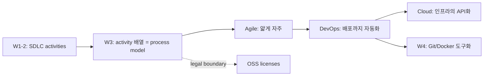
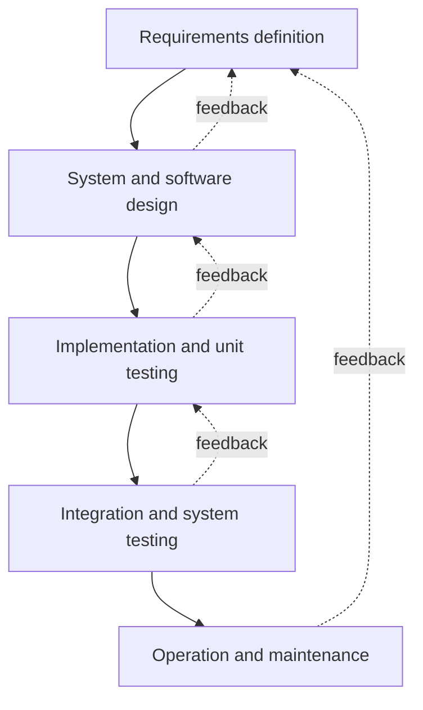
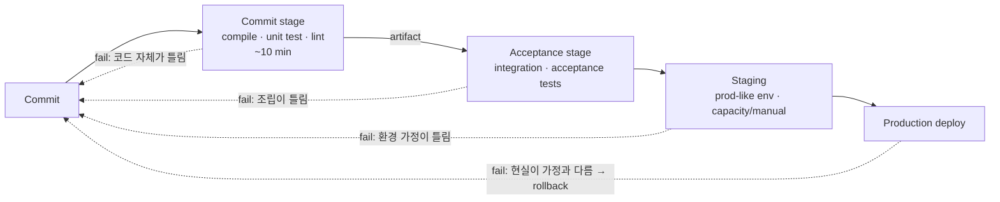
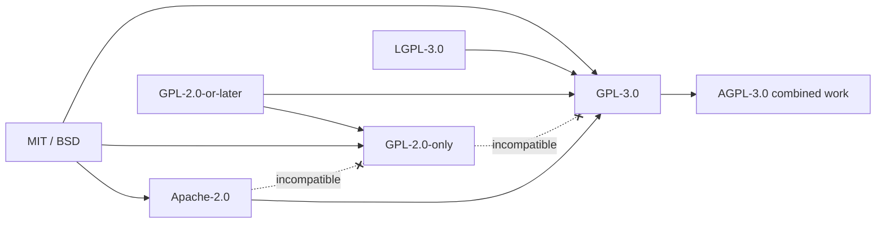

# Week 3 — Process Models, DevOps, Cloud, and Open-Source Licenses

> Waterfall · Incremental · Spiral · Agile (XP, Scrum) · CI/CD · DORA metrics · IaC · IaaS/PaaS/SaaS/FaaS · 12-factor · MIT/Apache/GPL/LGPL/AGPL · SPDX

## Learning goals

이 챕터를 마치면 다음을 할 수 있어야 한다 (모두 시험 가능한 형태):

- software process 를 4개 근본 activity (specification, development, validation, evolution) 의 배열 방식으로 정의하고, plan-driven vs agile 을 "산출물을 언제 동결하는가"의 스펙트럼으로 설명할 수 있다.
- waterfall 의 단계·단계 동결의 근거·실패 모드를 설명하고, **Royce (1970) 원 논문이 순수 waterfall 을 "risky and invites failure" 라고 경고했다**는 사실과 그가 제안한 보완책을 인용할 수 있다.
- incremental development 의 장점 (조기 피드백, 변경 비용 절감) 과 실패 모드 (process 비가시성, architecture erosion) 를 대비할 수 있다.
- spiral model 을 **risk-driven** 프레임으로 설명하고, risk exposure $RE = P(UO) \times L(UO)$ 와 risk reduction leverage 로 prototype 투자 결정을 계산할 수 있다.
- Agile Manifesto 의 4 values 를 원문으로 쓰고 12 principles 의 취지를 요약할 수 있으며, XP practices 와 Scrum 의 accountabilities(3)·events(5)·artifacts(3)+commitments 를 **정확한 용어**로 나열할 수 있다.
- Boehm & Turner 의 5 factors (size, criticality, dynamism, personnel, culture) 로 plan-driven vs agile 선택을 정당화할 수 있다.
- dev 와 ops 의 incentive 충돌 구조에서 DevOps 의 필요성을 유도하고, CI/CD 파이프라인의 각 단계 (commit → acceptance → staging → production) 실패가 각각 무엇을 의미하는지 설명할 수 있다.
- **DORA 4 key metrics** (deployment frequency, lead time for changes, change failure rate, time to restore service) 를 배포 로그에서 직접 계산하고, throughput 과 stability 가 trade-off 가 아니라 co-vary 한다는 *Accelerate* 의 발견을 설명할 수 있다.
- NIST SP 800-145 의 5 essential characteristics · 3 service models · 4 deployment models 를 나열하고, IaaS/PaaS/FaaS/SaaS 의 책임 분담과 serverless 의 트레이드오프 (cold start, state 외부화, lock-in, 비용 교차점) 를 분석할 수 있다.
- copyleft 의 전염 trigger (conveying/distribution) 를 식별하고, MIT/Apache-2.0/LGPL/GPL/AGPL 의무를 배포 시나리오별로 판정하며, 라이선스 호환성의 방향성 (permissive → copyleft one-way) 과 linking 논쟁을 설명할 수 있다.

## Why this matters

W1–2 에서 SDLC 의 근본 activity 들 (requirements → design → implementation → V&V → evolution) 을 봤다. 이 주차의 질문은 그 다음이다: **그 activity 들을 시간 위에 어떻게 배열할 것인가?** 순서대로 한 번씩 (waterfall), 얇게 여러 번 (incremental/agile), 리스크가 시키는 대로 (spiral) — 이 배열 선택이 process model 이고, 잘못 고르면 activity 를 아무리 잘해도 프로젝트가 죽는다.

후반부 셋은 같은 이야기의 현대적 연장이다. DevOps 는 "배열"을 개발팀 내부에서 운영까지 확장한 것이고 (배포도 process 의 일부다), cloud 는 그 확장을 물리적으로 가능하게 만든 인프라 조건이며, OSS license 는 현대 소프트웨어의 70–90% 를 차지하는 것으로 추정되는 (Linux Foundation & Harvard, Census II) 외부 코드를 process 에 편입할 때의 법적 경계 조건이다. W4 (Git branching, Docker) 는 이 주차의 CI/CD 를 도구 수준으로 구체화하고, W5 의 stateless service 논의 (§1.5) 는 이 주차의 12-factor 원칙을 전제한다.

---

## 1. Software process 와 두 진영

**Software process** = 소프트웨어를 만들기 위한 관련 activity 들의 집합 (Sommerville ch2). 어떤 process 든 4개의 근본 activity 를 포함한다 — **specification** (무엇을 만들지 정의), **development** (설계·구현), **validation** (고객이 원하는 것인지 확인 — W2 의 V&V), **evolution** (변경 반영). process model 은 이 activity 들의 **배열과 인터페이스에 대한 추상적 표현**이다.

두 진영의 구분 기준은 산출물의 **동결 시점**이다:

- **Plan-driven**: 모든 activity 를 미리 계획하고, 각 단계의 산출물 (spec 문서, 설계 문서) 을 완성·승인 후 **동결(freeze)** 하고 다음 단계의 입력으로 넘긴다. 진행도는 산출물 대비로 측정한다.
- **Agile**: 계획을 증분 단위로 수립하고, 산출물을 동결하지 않으며, 변경을 정상 상태로 취급한다. 진행도는 동작하는 소프트웨어로 측정한다.

핵심은 이것이 이분법이 아니라 **스펙트럼**이라는 점이다. 실무의 거의 모든 process 는 둘의 혼합이고 (Sommerville ch3.4.2), 질문은 "어느 쪽인가"가 아니라 "어디에 계획을 얼마나 넣는가"다 (§7).

왜 배열이 문제가 되는가? 근본 원인은 **변경 비용의 시간 의존성**이다. Boehm (1981) 의 고전적 관측: 요구사항 단계에서 잡을 결함을 운영 단계에서 잡으면 수정 비용이 수십~백 배가 된다 (대형 plan-driven 프로젝트 기준). plan-driven 은 이 곡선을 "앞 단계를 완벽히 해서 뒤에서 변경이 없게" 대응하고, agile 은 "곡선 자체를 평평하게 — 언제든 변경이 싸게 되도록 (짧은 피드백 루프, 자동 테스트, 리팩토링)" 대응한다. 같은 사실에 대한 두 개의 상반된 전략이 두 진영의 정체다.

---

## 2. Waterfall — 그리고 Royce 가 실제로 말한 것

### 2.1 모델

단계를 순차 배열하고 각 단계 종료 시 산출물을 승인·동결한다 (Sommerville ch2.1.1):

단계 동결의 근거는 실재한다: (1) **계약** — 발주자·수급자가 다른 조직이면 "무엇을 만들지"가 계약서고, 동결된 spec 이 분쟁의 기준선이다. (2) **V&V 산출물** — safety-critical 시스템 (항공, 의료) 은 spec 에 대한 안전성 분석·인증 문서가 필요하고, spec 이 흔들리면 분석을 다시 해야 한다. (3) **조정 비용** — 여러 회사가 서브시스템을 나눠 개발하면 인터페이스 spec 동결 없이는 통합이 불가능하다. Sommerville 이 waterfall 이 여전히 적합하다고 꼽는 세 상황이 정확히 이것이다: embedded systems (하드웨어의 비유연성), critical systems (안전성 분석의 필요), 대형 다자간 개발 (계약·조정).

### 2.2 실패 모드

- **피드백의 지연**: 고객이 동작하는 시스템을 보는 시점이 프로젝트 말미다. spec 의 오해·누락 (W2: tacit knowledge) 이 가장 비싼 시점에 발견된다.
- **테스트 단계의 압축**: 일정이 밀리면 뒤에 있는 단계 (통합·테스트) 가 압축된다 — 품질 검증이 일정 버퍼로 소모되는 구조적 위험.
- **동결의 허구성**: 요구사항은 실제로는 계속 변한다. 동결은 변경을 없애는 게 아니라 **변경을 공식 채널 (change control board) 밖으로 밀어내거나 비싸게 만드는 것**이고, 그 결과가 "spec 대로 만들었지만 필요 없는 시스템"이다.

### 2.3 Royce 1970 — 인용되는 것과 쓰인 것

Waterfall 의 "원 논문"으로 인용되는 Royce, "Managing the Development of Large Software Systems" (WESCON 1970) 는 실제로는 **순수 순차 모델에 대한 경고문**이다. Royce 는 순차 다이어그램 (Figure 2) 을 제시한 직후에 이렇게 썼다:

> "I believe in this concept, but the implementation described above is risky and invites failure."

근거: 테스트 단계는 timing, storage 같은 속성을 **처음으로 분석이 아닌 실행으로** 검증하는 지점인데, 여기서 설계 결함이 드러나면 되돌아가는 비용이 설계·구현 전체를 뒤엎을 수 있다. 그가 제안한 5개 보완이 사실상 이후 50년의 예고편이다: (1) preliminary program design 을 분석 이전에 — 설계를 먼저 러프하게, (2) 문서화 ("do it twice" 를 지탱할), (3) **"do it twice"** — 전체를 두 번 만들되 첫 번째는 버리는 pilot (prototype 의 원형), (4) 테스트의 계획·통제, (5) **고객의 공식 개입** — 납품 전에 고객이 여러 지점에서 커밋하게 하라 (on-site customer 의 원형). "waterfall" 이라는 이름 자체는 Royce 의 것이 아니고, 이후 문헌 (Bell & Thayer 1976 등) 이 그의 Figure 2 만 인용하며 굳어졌다. **시험 포인트: Royce 는 waterfall 의 창시자가 아니라 최초의 비판자다.**

---

## 3. Incremental development

시스템을 한 번에 만들지 않고, 동작하는 버전을 만들고 → 피드백 받고 → 다음 버전으로 진화시키는 배열 (Sommerville ch2.1.2). specification·development·validation 이 분리된 단계가 아니라 **interleave** 된다.

**장점** (Sommerville):
1. **변경 수용 비용 절감** — 이미 만든 부분만 다시 작업하면 되고, 분석·문서 재작업이 waterfall 보다 훨씬 적다.
2. **조기·빈번한 피드백** — 고객이 동작하는 증분에 대해 코멘트한다. 문서에 대한 코멘트보다 신호 품질이 압도적으로 높다 (W2: 문서 검토로는 tacit knowledge 가 안 나온다).
3. **조기 가치 전달** — 가장 중요한 기능이 첫 증분으로 먼저 배포·사용될 수 있다.

**실패 모드** (Sommerville — 시험 단골):
1. **Process 비가시성**: 문서 산출물이 단계마다 나오지 않으므로 관리자가 진행도를 측정할 기준이 약하다. 증분마다 문서를 만들면 증분의 속도 이점이 죽는다 — 가시성과 속도의 트레이드오프.
2. **Architecture erosion (구조 부패)**: 증분을 계속 얹으면 구조가 열화된다. 새 기능을 "구조를 고치고 넣기"보다 "기존 구조에 우겨넣기"가 항상 국소적으로 싸기 때문이다. **정기적 refactoring 투자 없이는 구조적 부채가 누적**되어, 어느 시점부터 변경 비용 곡선이 waterfall 보다 나빠진다 — agile 이 refactoring 을 선택이 아닌 필수 practice 로 박아둔 이유 (§6.2).

구분 두 가지 (Sommerville ch2.3): **incremental delivery** 는 증분을 실제 고객 환경에 배포하는 것 (피드백은 최고, 대신 증분마다 릴리스 품질 요구), **incremental development** 는 내부적으로만 증분을 쌓는 것. 그리고 **throwaway prototyping** 은 이해를 위해 만들고 버리는 것 — 증분이 아니다. prototype 을 "이미 만들었으니" 제품으로 승격시키는 것은 고전적 안티패턴이다 (prototype 은 품질 속성·예외 처리를 생략하고 만든 물건이다).

---

## 4. Integration and configuration (reuse-oriented)

세 번째 일반 모델 (Sommerville ch2.1.3, 9판의 "reuse-oriented SE" 를 10판이 개칭): 처음부터 만드는 대신 **기존 컴포넌트·COTS(commercial off-the-shelf)·오픈소스를 조합·설정**하는 process. 흐름: requirements → 재사용 후보 탐색 → 후보에 맞춰 requirements **수정** (역방향 화살표가 핵심 — 요구가 부품에 맞춰 조정된다) → 통합·설정 → 검증.

- 장점: 개발량·비용·시간·리스크 감소. 현대 개발의 기본값이다 — 백엔드 서비스의 코드 대부분은 프레임워크·라이브러리다.
- 리스크: 요구사항 타협의 누적, 재사용 컴포넌트의 **진화 통제권 부재** (upstream 이 방향을 바꾸거나 버전을 끊으면 종속), 그리고 이 주차 §10 의 주제인 **라이선스 의무** — 재사용은 공짜가 아니라 조건부 허락이다.

---

## 5. Spiral model — process 를 risk 가 조종한다

Boehm (1988) 의 spiral model 은 "몇 번째 단계인가"가 아니라 **"지금 가장 큰 리스크가 무엇인가"** 가 다음 activity 를 결정하는 **risk-driven** 모델이다. process 는 나선을 그리며 반복되고, 반경 방향 = 누적 비용, 각도 방향 = 각 cycle 내 진행이다. 각 cycle 은 4개 사분면을 돈다:

1. **Determine objectives, alternatives, constraints** — 이번 cycle 의 목표와 대안 (설계안 A/B, 구매 vs 개발, 재사용).
2. **Evaluate alternatives; identify, resolve risks** — 대안들의 리스크를 평가하고, 지배적 리스크를 해소하는 activity 를 수행한다. 요구 불확실성이 지배적이면 prototype 을, 성능 불확실성이면 벤치마크·시뮬레이션을, 리스크가 낮으면 그냥 waterfall 식 다음 단계를 진행한다 — **spiral 은 waterfall·prototyping·incremental 을 특수 케이스로 포함하는 process generator 다.**
3. **Develop, verify next-level product**.
4. **Plan next phases** — 다음 cycle 계획 + 이해관계자 review·commitment.

리스크를 정량화하는 Boehm 의 도구 (Boehm 1991):

$$RE = P(UO) \times L(UO)$$

$RE$ = risk exposure, $P(UO)$ = 바람직하지 않은 결과(unsatisfactory outcome)의 확률, $L(UO)$ = 그 손실 크기. 리스크 완화 activity 의 투자 판단은 **risk reduction leverage**:

$$RRL = \frac{RE_{before} - RE_{after}}{\text{cost of risk reduction}}$$

**Worked example 1 — prototype 을 만들 것인가.** 신규 결제 UI 프로젝트. "UI 흐름이 사용자에게 안 맞아 출시 후 재작업" 리스크: 과거 유사 프로젝트 경험으로 $P = 0.4$, 재작업 손실 $L = \$500\text{k}$ (재개발 + 출시 지연). 현재 $RE = 0.4 \times 500\text{k} = \$200\text{k}$. 2주짜리 throwaway prototype ($\$30\text{k}$) 으로 사용자 검증을 하면 $P \to 0.1$ 로 추정: $RE_{after} = 0.1 \times 500\text{k} = \$50\text{k}$.

$$RRL = \frac{200\text{k} - 50\text{k}}{30\text{k}} = 5.0$$

$RRL > 1$ 이므로 prototype 투자가 정당화된다 — spiral 의 사분면 2가 이 계산을 매 cycle 반복하는 것이다. 반대로 이미 세 번 만들어 본 CRUD 어드민이라면 $P$ 가 낮아 $RRL < 1$: prototype 없이 직진이 맞다. **"항상 prototype" 도 "절대 prototype 안 함" 도 아니고, 리스크가 결정한다** — 이것이 risk-driven 의 의미다.

한계: 사분면 2가 요구하는 리스크 식별·정량화는 전문성이 필요하고 ($P$ 추정의 근거가 약하면 계산은 연극이 된다), 계약 기반 발주 (마일스톤이 고정된) 와는 맞추기 어렵다. spiral 이 교과서 대비 실무 채택이 적은 이유다 — 하지만 "다음에 뭘 할지는 리스크가 정한다"는 원리 자체는 agile 의 backlog 우선순위화, 스타트업의 MVP 검증에 그대로 살아 있다.

---

## 6. Agile

### 6.1 Manifesto — 4 values, 12 principles

2001년 Snowbird 에 모인 17인 (Beck, Fowler, Schwaber, Sutherland 등) 이 발표한 Manifesto for Agile Software Development (agilemanifesto.org) 원문:

> We are uncovering better ways of developing software by doing it and helping others do it. Through this work we have come to value:
>
> - **Individuals and interactions** over processes and tools
> - **Working software** over comprehensive documentation
> - **Customer collaboration** over contract negotiation
> - **Responding to change** over following a plan
>
> That is, while there is value in the items on the right, we value the items on the left more.

마지막 문장이 시험 함정의 원천이다: **오른쪽 항목들도 가치가 있다** — agile 은 "문서·계획·프로세스 폐지"가 아니라 우선순위 재배열이다. 12 principles 는 4 values 의 조작적 정의다. 묶어서 기억하라:

- **가치 흐름**: 최우선은 가치 있는 소프트웨어의 조기·지속 전달 (P1); 동작하는 소프트웨어를 몇 주~몇 달 주기로, 짧은 쪽 선호 (P3); **working software is the primary measure of progress** (P7).
- **변경**: 늦은 단계의 요구 변경도 환영 — 변경은 고객의 경쟁 우위다 (P2); 단순성 — "the art of maximizing the amount of work not done" (P10).
- **사람**: 비즈니스와 개발자가 매일 협업 (P4); 동기 부여된 개인 중심 + 신뢰 (P5); 최고의 정보 전달은 face-to-face (P6); **sustainable pace** — 일정한 속도를 무기한 유지 (P8).
- **품질·구조**: 기술적 탁월함·좋은 설계에 대한 지속적 주의가 agility 를 높인다 (P9); 최고의 아키텍처·요구·설계는 self-organizing team 에서 창발 (P11); 정기적 회고와 행동 조정 (P12).

### 6.2 XP — engineering practices 의 체계

Extreme Programming (Beck 1999) 은 "좋은 실천을 극단까지" (코드 리뷰가 좋다 → 항상 리뷰하며 짠다 = pair programming; 테스트가 좋다 → 테스트를 먼저 쓴다 = TDD). Sommerville ch3.2 (Figure 3.3) 의 practice 목록:

| Practice | 내용 | 왜 필요한가 (다른 practice 와의 의존) |
|---|---|---|
| **Incremental planning** | 요구를 story card 로, 릴리스에 넣을 story 를 우선순위·추정으로 선정 | small releases 의 입력 |
| **Small releases** | 최소 유용 기능부터, 릴리스를 자주 | 조기 피드백의 전제. 아래 4개 없이는 릴리스마다 회귀 리스크 폭발 |
| **Test-first development (TDD)** | 기능 구현 **전에** 실행 가능한 테스트 작성 | 실행 가능한 spec + 회귀 안전망. refactoring 의 전제 |
| **Refactoring** | 개선 여지가 보이면 즉시 구조 개선 | §3 의 architecture erosion 방어. 테스트 없이는 도박 |
| **Pair programming** | 2인 1조 작업, 짝 로테이션 | 상시 리뷰 + 지식 전파. collective ownership 의 전제 |
| **Collective ownership** | 누구나 어디든 수정 가능, 책임 공유 | truck factor 완화. 테스트·페어 없이는 혼란 |
| **Continuous integration** | 작업 완료 즉시 mainline 통합, 전체 테스트 통과 필수 | 통합 지옥 방지 — §8.2 로 이어짐 |
| **Sustainable pace** | 초과 근무 금지 | 품질 유지 (P8) |
| **On-site customer** | 고객 대표가 팀에 상주, 요구를 실시간 결정 | spec 문서의 대체물 — 없으면 XP 는 붕괴 |
| **Simple design** | 현재 요구에 필요한 만큼만 설계 | 추측성 일반화 금지 (→ W9 YAGNI) |

핵심 통찰: **XP practices 는 상호 지지 구조라 골라 담기(cherry-picking)가 위험하다.** 예: small releases 만 도입하고 TDD·CI 를 생략하면, 릴리스 주기는 짧아졌는데 회귀 검증이 수동이라 품질이 무너진다. refactoring 없이 증분만 쌓으면 §3 의 erosion 이 그대로 온다. 테스트 없이 collective ownership 만 하면 아무도 깨진 지점을 못 찾는다.

### 6.3 Scrum — 정확한 용어로

Scrum (Schwaber & Sutherland, *Scrum Guide* 2020) 은 engineering practice 가 아니라 **관리 framework** 다 — 그래서 XP practices 와 상보적으로 병용된다 (Scrum 으로 관리, XP 로 구현). Scrum Guide 2020 기준 용어 (2020판은 "roles" 를 "accountabilities" 로 개칭):

**3 accountabilities**
- **Product Owner**: product 가치 극대화에 책임. **Product Backlog 의 내용·순서에 대한 단독 권한** — 무엇을 만들지 정한다. 위원회가 아니라 한 사람.
- **Scrum Master**: Scrum 이 작동하게 할 책임. 팀의 관리자가 아니라 **"true leaders who serve the Scrum Team and the larger organization"** (2020판이 2017판의 "servant-leader" 를 대체한 표현) — 장애물(impediment) 제거, 조직에 Scrum 코칭. 사람을 지휘하지 않는다.
- **Developers**: Sprint 마다 usable Increment 를 만드는 사람들. **어떻게 만들지는 Developers 가 정한다** (self-managing). Scrum Team 전체는 10명 이하 권장.

**5 events** (모두 timebox 가 있다)
- **The Sprint**: 나머지 4개를 담는 컨테이너. **1개월 이하** 고정 길이. Sprint 중 Sprint Goal 을 위협하는 변경 금지 — 단, scope 는 PO 와 협상으로 명료화·재협상 가능. Sprint 취소 권한은 PO 에게만 있다.
- **Sprint Planning** (1개월 Sprint 기준 최대 8h): Why (Sprint Goal) → What (backlog 선정) → How (작업 분해).
- **Daily Scrum** (15분): Developers 가 Sprint Goal 대비 진행 점검·당일 계획 조정. 상태 보고회가 아니다.
- **Sprint Review** (최대 4h): 이해관계자에게 Increment 를 시연하고 **Product Backlog 를 조정**하는 작업 세션 — 데모 행사가 아니라 backlog 조정이 목적.
- **Sprint Retrospective** (최대 3h): process 자체의 개선 (P12 의 제도화).

**3 artifacts + commitments** (2020판의 구조)
- **Product Backlog** ↔ commitment: **Product Goal**. 순서 있는 요구 목록, 유일한 작업 원천. 끊임없이 refine 된다.
- **Sprint Backlog** ↔ commitment: **Sprint Goal**. 이번 Sprint 의 계획 (goal + 선정 항목 + 실행 계획). Developers 소유.
- **Increment** ↔ commitment: **Definition of Done**. DoD 를 충족해야 Increment 다 — "done" 의 조작적 정의 (테스트 통과, 리뷰 완료, 배포 가능 등) 를 팀이 명문화한 것.

**Velocity** (Scrum Guide 에는 없는 보조 practice — Sommerville ch3.3 은 다룬다): 팀이 Sprint 당 완료하는 추정 단위 (story point) 의 이동 평균. 용도는 **자기 팀의 capacity 예측** — 다음 Sprint 에 얼마나 담을지, backlog 소진까지 몇 Sprint 인지. 팀 간 비교나 성과 평가에 쓰는 순간 지표가 오염된다 (point 인플레이션 — Goodhart's law).

### 6.4 Agile 이 어려워지는 조건

Sommerville ch3 의 정리: 대규모 (팀 간 조정), 분산 팀 (face-to-face 원칙 훼손), 규제 산업 (외부 감사가 문서 요구), 유지보수 단계 (문서 부재가 부메랑), on-site customer 를 실제로 확보 못 하는 계약 구조. agile at scale 프레임워크 (SAFe 등) 가 이 간극을 메우려 하지만, 그 자체가 plan-driven 요소의 재도입이다 — 스펙트럼은 돌고 돈다.

---

## 7. Plan-driven vs agile — 선택 기준

Boehm & Turner (*Balancing Agility and Discipline*, 2003) 의 5 factors. 각 축에서 바깥쪽 (큰 값) 일수록 plan-driven 쪽이 유리하다:

| Factor | Agile 쪽 | Plan-driven 쪽 |
|---|---|---|
| **Size** | 소규모 팀 (암묵지 공유 가능) | 대규모 (조정에 문서 필요) |
| **Criticality** | 결함 = 불편·소액 손실 | 결함 = 인명·거액 (안전성 분석 문서 필수) |
| **Dynamism** | 요구 변경률 높음 (변경 수용이 이득) | 요구 안정 (선행 설계 투자가 회수됨) |
| **Personnel** | 시니어 비율 높음 (판단 위임 가능) | 주니어 위주 (프로세스가 스캐폴드) |
| **Culture** | 자율·혼돈에서 활력 | 명확한 역할·절차에서 안정 |

Sommerville ch3.4.2 가 추가하는 실무 질문: 시스템 수명이 길어 유지보수 팀이 바뀔 것인가 (문서 필요) / 계약·규제상 spec 승인이 필요한가 / 고객이 실제로 상주 가능한가 / 조직의 기존 표준과 충돌하는가. 결론은 언제나 혼합의 위치 선정이다: 안전-critical 한 코어는 plan-driven 으로, 주변 UI·통합은 agile 로 — 한 시스템 안에서도 분할할 수 있다.

---

## 8. DevOps

### 8.1 갈등 구조 — 왜 필요한가

전통 조직은 **개발(dev)** 과 **운영(ops)** 을 분리했다: dev 는 변경을 만들어 던지고, ops 는 서버를 지킨다. 문제는 incentive 가 정반대라는 것이다 — **dev 의 성과 = 변경의 양** (기능 출시), **ops 의 성과 = 무변경의 안정** (uptime). 그런데 장애의 최대 원인이 변경이다. 결과: ops 는 배포를 막는 관문 (분기 릴리스, 변경 승인 위원회, 배포 금지 기간) 을 쌓고, dev 는 관문을 통과하려 변경을 크게 묶고 (한 번에 6개월치), 큰 변경은 더 자주 실패하고, 실패는 관문을 더 높인다 — **악순환**. 두 팀 사이의 책임 단절을 "wall of confusion" 이라 부른다: dev 는 "내 머신에선 됐다", ops 는 "네 코드가 문제다".

DevOps 는 이 구조를 깨는 원칙의 집합이다 (Sommerville, *Engineering Software Products* ch10; Kim et al., *DevOps Handbook*): **만든 사람이 배포·운영에도 책임진다** ("you build it, you run it" — Werner Vogels/Amazon, 2006 ACM Queue 인터뷰), 모든 것을 자동화하고, 배포를 크고 드물게가 아니라 **작고 자주** 하며, 장애를 비난이 아닌 학습으로 다룬다 (blameless postmortem). 기점이 된 사건이 Flickr 의 2009 Velocity 발표 "10+ Deploys Per Day: Dev and Ops Cooperation at Flickr" (Allspaw & Hammond) 와 같은 해 Debois 의 첫 DevOpsDays 다.

핵심 논리: **배치 크기(batch size)를 줄이면 리스크가 줄어든다.** 6개월치 변경의 배포는 diff 가 거대해 무엇이 장애를 냈는지 격리 불가능하고 롤백도 거대하다. 하루치 변경의 배포는 diff 가 작아 원인 격리·롤백이 즉각적이다. "자주 배포 = 위험" 이라는 직관은 배포 1회당 리스크만 보고, 리스크 총량 = (1회당 리스크) × (횟수) 에서 1회당 리스크가 배치 크기에 초선형으로 비례한다는 점을 놓친다 — §8.5 의 DORA 데이터가 이를 실증한다.

### 8.2 Continuous Integration

CI 의 정의는 도구가 아니라 **행동**이다 (Fowler 2006): 팀 전원이 **최소 하루 1회 mainline 에 통합**하고, 모든 통합은 자동 빌드 + 자동 테스트로 검증된다. 나올 결과: 통합 간격이 짧을수록 충돌·불일치가 작을 때 발견된다 ("integration hell" — 몇 주 묵힌 브랜치들의 병합 — 의 소거). Fowler 의 핵심 practices: 단일 소스 저장소 / 빌드 자동화 / **self-testing build** (빌드가 스스로 합격·불합격을 판정) / 매일 mainline 커밋 / 모든 커밋을 통합 머신에서 빌드 / **깨진 빌드는 즉시 수리가 최우선** / 빌드는 빠르게 (10분 가이드라인) / 프로덕션 유사 환경에서 테스트.

"CI 서버 (Jenkins/GitHub Actions) 를 돌린다 ≠ CI 를 한다": 팀원들이 2주짜리 feature branch 에서 작업하면 서버가 있어도 통합은 2주에 한 번이다 — CI 의 정의 위반. (branching 전략과 CI 의 관계는 W4.)

### 8.3 Deployment pipeline 해부

Humble & Farley (*Continuous Delivery*, 2010) 의 **deployment pipeline**: 커밋부터 릴리스 가능까지의 경로를 자동화 단계의 사슬로 만든 것. 각 단계는 통과할수록 "이 버전이 릴리스 가능하다"는 **확신(confidence)을 증가**시키고, 실패는 각기 다른 것을 의미한다:

| 단계 | 검증 내용 | **실패의 의미** | 설계 요구 |
|---|---|---|---|
| **Commit stage** | 컴파일, unit test, lint, static analysis | 코드 단위의 논리·규약 오류. 커밋한 사람이 즉시 고칠 수 있는 문제 | 빠를 것 (~10분) — 피드백 루프가 생명. 느리면 개발자가 결과를 안 기다리고 다음 일을 시작 → 깨진 빌드 방치 |
| **Acceptance stage** | 실제 조립 상태에서 integration·acceptance test | 단위는 맞는데 **조립이 틀림** — 컴포넌트 간 계약 위반, 설정 오류. unit test 가 구조적으로 못 잡는 부류 | 느려도 됨 (병렬화). commit stage 를 통과한 **동일 artifact** 를 재사용 — 다시 빌드하면 "테스트한 것과 배포하는 것"이 달라진다 (12-factor build/release/run, §9.4) |
| **Staging** | prod 유사 환경에서 capacity·smoke·수동 탐색 | 코드는 맞는데 **환경 가정이 틀림** — OS·네트워크·데이터 규모·의존 서비스 차이 | prod 와의 유사도가 가치를 결정. "staging 에선 됐는데" 는 유사도 부족의 비용 |
| **Production** | 실사용자·실데이터·실부하 | 앞의 모든 단계가 못 잡은 것 — **현실이 모든 가정과 다름**. 실패를 없앨 수 없으므로 실패의 반경(blast radius)과 복구 시간을 설계한다 | §8.4 의 점진 릴리스 + 자동 rollback + 관측 (W5 percentile) |

**Continuous delivery vs continuous deployment** (혼동 단골): delivery = 모든 변경이 파이프라인을 통과해 **언제든 배포 가능한 상태**를 유지 (배포 버튼은 사람이 누름 — 비즈니스 결정). deployment = 통과한 변경이 **자동으로** production 까지 나감. deployment ⊃ delivery.

### 8.4 Deploy ≠ release

배포(코드가 prod 에 있음)와 릴리스(사용자가 겪음)를 분리하면 리스크가 급감한다:

- **Blue-green**: 동일한 환경 2벌 (blue=현행, green=신규). green 에 배포·검증 후 라우터를 전환. 롤백 = 라우터 되돌리기 (초 단위). 비용: 인프라 2배, 그리고 **DB schema 는 2벌이 아니므로** 양쪽 버전과 호환되는 마이그레이션 (expand–contract) 이 필요하다는 함정.
- **Canary release**: 신버전을 트래픽의 1% → 5% → 50% 로 점진 확대하며 지표 (error rate, p99 — W5 §1.2) 를 비교, 이상 시 자동 롤백. 실패의 반경을 1% 로 제한.
- **Feature flag**: 코드는 배포하되 기능은 flag 로 꺼둔 채 (dark launch), 릴리스는 flag 토글로. 배포와 릴리스의 완전한 분리 + 사용자군별 점진 공개. 비용: flag 조합의 테스트 공간 폭발, 죽은 flag 의 부채.

### 8.5 DORA 4 key metrics

Forsgren, Humble & Kim (*Accelerate*, 2018) 은 수년간 수만 명 설문 (State of DevOps Reports) 을 클러스터 분석해, 소프트웨어 전달 성과가 4개 지표로 측정됨을 보였다:

| 축 | Metric | 정의 |
|---|---|---|
| **Throughput** | **Deployment frequency** | production 배포 빈도 |
| **Throughput** | **Lead time for changes** | **커밋 → production 가동**까지의 시간 (요구사항 접수부터가 아니라 커밋부터 — 전달 파이프라인만 측정) |
| **Stability** | **Change failure rate** | 배포 중 장애·저하·hotfix·rollback 을 유발한 비율 |
| **Stability** | **Time to restore service (MTTR)** | 장애 발생 → 서비스 복구까지의 시간 |

두 가지 발견이 지표 자체보다 중요하다:

1. **Speed 와 stability 는 trade-off 가 아니다.** 클러스터 분석에서 high performer 는 4개 전부에서 우수했고 low performer 는 전부에서 열등했다 — "빨리 가면 많이 깨진다"는 통념 반박. 2017 조사 기준 high vs low: 배포 빈도 **46배**, lead time **440배** 빠름, MTTR **170배** 빠름, change failure rate **1/5**. 인과 메커니즘이 §8.1 의 배치 크기 논리다: 작은 배치 → 실패해도 작게, 원인 격리 쉬움, 복구 빠름.
2. **지표는 4개가 한 세트다.** throughput 만 최적화하면 (배포 횟수 KPI) 품질을 버리는 게임이 되고, stability 만 최적화하면 (CFR KPI) 배포를 안 하는 게임이 된다. 서로가 서로의 가드레일이다.

*Accelerate* 의 high performer 프로파일 (2017): 배포 on-demand (하루 다수), lead time < 1시간, MTTR < 1시간, CFR 0–15%.

**Worked example 2 — 배포 로그에서 4 metrics 계산.** 어느 팀의 14일간 기록:

| Deploy | Commit 시각 | Deploy 시각 | 결과 |
|---|---|---|---|
| d1 | Day 1 09:00 | Day 1 15:00 | OK |
| d2 | Day 2 10:00 | Day 3 10:00 | **장애** → Day 3 10:40 복구 (rollback) |
| d3 | Day 4 14:00 | Day 4 18:00 | OK |
| d4 | Day 7 09:00 | Day 8 09:00 | OK |
| d5 | Day 9 11:00 | Day 9 13:00 | **저하** → Day 9 16:00 복구 (hotfix) |
| d6 | Day 11 10:00 | Day 12 10:00 | OK |
| d7 | Day 13 15:00 | Day 13 17:00 | OK |
| d8 | Day 14 09:00 | Day 14 11:00 | OK |

- **Deployment frequency** = 8회 / 14일 ≈ **0.57회/일** (주당 4회 — 대략 "high" 대역).
- **Lead time for changes**: 각 배포의 (deploy − commit) = 6h, 24h, 4h, 24h, 2h, 24h, 2h, 2h. 정렬: 2,2,2,4,6,24,24,24 → **median = 5h** (평균 11h — 분포가 skew 되므로 median 사용, W5 §1.2 와 같은 논리).
- **Change failure rate** = 2/8 = **25%**.
- **MTTR** = (40min + 3h)/2 = **1h 50m**.

진단: lead time 의 bimodal 분포 (2–6h vs 24h) 는 일부 변경이 수동 승인 대기 등 큐에 걸린다는 신호고, CFR 25% 는 acceptance stage 의 커버리지 보강 필요를 가리킨다 — 지표는 순위 매기기가 아니라 **파이프라인의 어느 단계를 고칠지 알려주는 계기판**이다.

### 8.6 Infrastructure as Code

서버·네트워크·설정을 사람이 콘솔에서 만드는 대신 **버전 관리되는 기계 실행 가능 정의 파일**로 관리한다 (Morris, *Infrastructure as Code*; Terraform/Ansible 계열). 원리 세 가지:

- **Declarative + idempotent**: "어떤 상태여야 한다"를 선언하면 도구가 현재 상태와의 차이만 적용한다. 같은 정의를 몇 번 적용해도 결과가 같다 (idempotence) — 실패 후 재실행이 안전해진다.
- **Snowflake 제거**: 수년간 수동 패치로 아무도 재현 못 하는 서버 (snowflake server, Fowler) 는 복구 불능·환경 불일치의 원천이다. IaC + 이미지 빌드는 서버를 **재생성 가능한 산출물**로 만든다 — 고치지 말고 갈아 끼운다 (phoenix server; "pets vs cattle" 비유). Docker 이미지가 이 원리의 애플리케이션 레벨 구현이다 (W4).
- **Configuration drift 방어**: 수동 변경으로 실제 상태가 정의에서 이탈하는 것. 정의 파일이 유일한 진실이면 drift 는 탐지·수렴 대상이 된다.

process 관점의 의미: 인프라 변경이 코드 변경과 같은 파이프라인 (리뷰 → 테스트 → 적용) 을 타게 된다 — 애플리케이션에서 검증된 practice 의 인프라 이식. 그리고 이것이 가능해진 전제가 다음 절의 cloud 다: 인프라가 API 로 생성·파괴 가능해야 "코드로서의 인프라"가 성립한다.

---

## 9. Cloud

### 9.1 NIST 정의 (SP 800-145)

**Cloud computing** = 설정 가능한 컴퓨팅 자원 풀에 대한 유비쿼터스·편리·on-demand 네트워크 접근을 가능케 하는 모델로, 최소한의 관리 노력으로 신속히 provision·해제 가능한 것. NIST 는 이를 5–3–4 로 구조화한다 (시험용 프레임):

**5 essential characteristics**: ① **on-demand self-service** (사람 개입 없이 스스로 provision — ops 티켓의 소멸), ② **broad network access** (표준 네트워크·다양한 클라이언트), ③ **resource pooling** (multi-tenant 풀에서 동적 할당, 위치 독립), ④ **rapid elasticity** (수요에 따라 즉시 확장·축소 — 소비자에겐 무한처럼 보임), ⑤ **measured service** (사용량 계측·과금 — capex 를 opex 로).

**3 service models**: IaaS / PaaS / SaaS (아래 표). **4 deployment models**: public (일반 공중용), private (단일 조직 전용 — 온프레미스일 필요는 없음), community (공통 관심사의 조직군 공유), hybrid (2개 이상 조합, 표준화된 이식성으로 연결 — 예: 평시 private + 피크 시 public 으로 cloud bursting).

### 9.2 책임 분담 — you manage vs provider manages

FaaS 는 NIST 문서 (2011) 이후 등장한 모델로, PaaS 와 SaaS 사이에 위치한다:

| 계층 | On-prem | **IaaS** (EC2) | **PaaS** (Heroku, App Engine) | **FaaS** (Lambda) | **SaaS** (Gmail) |
|---|---|---|---|---|---|
| Data & access 설정 | you | you | you | you | **you** |
| Application code | you | you | you | **you (함수 단위)** | provider |
| Runtime / middleware | you | you | provider | provider | provider |
| OS | you | **you** (패치 책임!) | provider | provider | provider |
| Virtualization | you | provider | provider | provider | provider |
| 물리 서버·스토리지·네트워크 | you | provider | provider | provider | provider |

읽는 법: 오른쪽으로 갈수록 운영 부담이 줄고, 대신 **통제권과 이식성**을 내준다. IaaS 에서 OS 패치를 안 하면 그건 클라우드가 아니라 사용자의 사고다 (shared responsibility). SaaS 에서도 data 와 접근 권한 설정은 끝까지 사용자 책임이다 — "클라우드로 갔으니 보안은 벤더 몫" 이 전형적 오독.

### 9.3 Serverless (FaaS) 트레이드오프

FaaS: 코드를 **이벤트에 반응하는 함수** 단위로 제출하면, provider 가 요청이 올 때만 인스턴스를 띄우고, 수요에 따라 0 ~ 수천 개로 자동 확장하며, **실행 시간만큼만 과금**한다 (AWS Lambda 기준 1ms 단위). Berkeley View (Jonas et al. 2019) 의 프레임으로 득실을 정리하면:

**얻는 것**: 용량 계획의 소멸 (scale-to-zero 포함 — 유휴 비용 0), 운영의 소멸 (패치·프로비저닝 없음), 극단적 탄력성.

**지불하는 것**:
- **Cold start**: 유휴 후 첫 요청은 샌드박스 생성 + 런타임 초기화 + 코드 초기화를 겪는다 — 수백 ms~수 초. p99 (W5 §1.2) 에 직격. 완화: 인스턴스 예열 유지 (provisioned concurrency — 그러나 이건 "serverless 이면서 서버 상시 임대"라는 자기모순적 비용).
- **Stateless 강제 + 수명 제한**: 인스턴스는 언제든 회수되고 실행 시간 상한이 있다 (Lambda 최대 15분). 모든 상태는 외부 스토리지로 — 함수 간 데이터 전달이 로컬 메모리가 아니라 스토리지/네트워크 경유가 되어 느리고 비싸다 (Berkeley View 가 꼽는 구조적 한계: 함수 간 직접 통신 불가·데이터-연산 분리).
- **Vendor lock-in**: 함수 자체보다 그것을 엮는 이벤트 소스·권한·게이트웨이 설정이 provider 전용이다.
- **비용 교차점**: 과금 = 호출 수 × 실행 시간 × 메모리. 트래픽이 낮거나 스파이크형이면 상시 서버 대비 압도적으로 싸지만, **사용률이 높고 평탄한 부하에서는 예약 VM 보다 비싸진다** — "serverless 는 항상 싸다"가 아니라 "유휴에 과금하지 않는다"다. 부하가 평탄한 고트래픽 서비스는 전통 배치가 맞다.

### 9.4 12-factor app — cloud 시대의 process 계약

Heroku 엔지니어들이 정리한 (Wiggins, 12factor.net) SaaS 앱 방법론. 이 과목 흐름에 직결되는 3개:

- **III. Config**: 설정 (DB 주소, credentials, 외부 서비스 키) 을 코드가 아니라 **환경 변수**에 둔다. 리트머스 테스트: "지금 코드베이스를 통째로 오픈소스로 공개해도 credential 이 유출되지 않는가?" 환경별 config 파일을 코드에 커밋하는 순간, 배포 환경 추가 = 코드 변경이 된다.
- **V. Build, release, run 의 엄격 분리**: build (코드 → 실행 가능 artifact) / release (artifact + config 결합, 고유 ID 부여) / run (release 실행). release 는 불변·append-only — 롤백은 이전 release 의 재실행이다. §8.3 에서 "acceptance 부터는 같은 artifact 재사용"이라 한 근거가 이 원칙이다: 환경마다 다시 빌드하면 테스트한 것과 배포한 것의 동일성이 깨진다.
- **VI. Processes — stateless & share-nothing**: 프로세스는 상태를 로컬 메모리·디스크에 두지 않는다 (sticky session 은 명시적 위반). 상태는 backing service (DB, cache — W5 의 부품들) 로. 이것이 W5 §1.5 horizontal scaling 의 전제조건이었다.

### 9.5 Cloud 가 process 에 미친 영향

인과 사슬로 정리하면: **인프라가 API 가 되자 (self-service, 분 단위 provision) → ops 티켓 큐가 파이프라인 코드로 대체 가능해지고 (IaC) → 환경을 온디맨드로 만들 수 있으니 PR 마다 격리된 테스트 환경, staging 의 prod 근사가 현실화되고 → 배포 비용이 0 에 수렴하자 작은 배치·잦은 배포 (§8.1) 가 경제적으로 합리화**된다. waterfall 의 전제 중 하나 (배포는 비싸고 드문 이벤트다) 가 물리적으로 소멸한 것이다. 역으로, 규제·데이터 주권으로 private/on-prem 에 묶인 조직은 이 사슬의 앞이 끊겨 있어 DevOps 도입이 도구 문제가 아니라 인프라 문제가 된다.

---

## 10. Open-Source Licenses

### 10.1 Copyright 기초 — 왜 라이선스가 필요한가

소프트웨어 소스 코드는 저작물이다: 작성 순간 저작권이 **자동 발생**하고 (Berne Convention — 등록·표시 불요), 복제·수정·배포는 저작권자의 배타적 권리다. 따라서 **라이선스가 없는 공개 코드는 "볼 수는 있지만 쓸 수 없는" 코드다** (all rights reserved 가 기본값 — GitHub 에 올렸다고 허락한 게 아니다). 오픈소스 라이선스 = 저작권자가 조건부로 권리를 허락하는 문서고, 조건을 어기면 허락이 소멸해 **저작권 침해**가 된다 — 위반의 법적 본질이 "계약 위반"이 아니라 (또는 그에 더해) 저작권 침해라는 점이 소송의 근거다 (§10.8).

스펙트럼은 조건의 무게로 갈린다:

| License | 유형 | 핵심 조건 | Patent grant | SPDX ID |
|---|---|---|---|---|
| **MIT** | Permissive | 저작권·허가 고지 유지 | 명시 없음 | `MIT` |
| **BSD-3-Clause** | Permissive | 고지 유지 + 이름 홍보 금지 | 명시 없음 | `BSD-3-Clause` |
| **Apache-2.0** | Permissive | 고지 + NOTICE 유지, 변경 명시 | **명시적 (§3)** | `Apache-2.0` |
| **MPL-2.0** | Weak copyleft (파일 단위) | 수정한 **파일**만 공개 | 명시적 | `MPL-2.0` |
| **LGPL-2.1/3.0** | Weak copyleft (라이브러리 단위) | 라이브러리 수정분 공개 + 교체(relink) 보장 | 3.0 은 명시적 | `LGPL-3.0-only` |
| **GPL-2.0/3.0** | Strong copyleft | **결합 저작물 전체**를 동일 라이선스로 배포 | 3.0 은 명시적 (§11) | `GPL-3.0-only` |
| **AGPL-3.0** | Network copyleft | GPL-3.0 + **네트워크 서비스 제공도 trigger** (§13) | 명시적 | `AGPL-3.0-only` |

### 10.2 Permissive: MIT 와 Apache-2.0 의 차이

MIT 는 ~170단어짜리 최소 라이선스다: 무엇이든 해도 좋고 (use, copy, modify, merge, publish, distribute, sublicense, sell), 조건은 저작권 고지·허가문 포함 하나, 그리고 무보증 면책. **특허는 언급이 없다** — "사용 허락에 특허 실시 허락이 묵시된다"는 해석이 있지만 명문이 아니다.

Apache-2.0 이 기업 표준이 된 이유가 이 공백이다. **§3 (Grant of Patent License)**: 각 contributor 는 자신의 기여가 읽는 특허에 대해 무상·비독점·취소 불가의 실시권을 부여한다. 그리고 **특허 보복 조항**: 누군가 "이 저작물이 특허 침해다"라고 소송을 걸면, **그 사람의 특허 라이선스는 소 제기일에 소멸**한다 — 특허 공격의 억지 장치. 부수 조건: 수정 파일에 변경 사실 표시 (§4b), NOTICE 파일 유지 (§4d). 결론: 특허 리스크가 있는 도메인 (기업 기여가 많은 인프라 소프트웨어) 에선 MIT 보다 Apache-2.0 이 안전하다.

### 10.3 Copyleft 의 전염 조건 — trigger 는 "conveying"

Copyleft (GPL 계열) 의 메커니즘: 수정·결합된 저작물을 배포하려면 **전체를 같은 라이선스로, 소스 포함하여** 배포해야 한다 (GPLv3 §5 — "the work must carry prominent notices... licensed as a whole under this License"). 정확한 이해의 열쇠는 **무엇이 의무를 발동시키는가(trigger)** 다:

- **Trigger = conveying (배포)**: GPLv3 의 용어로 "convey" = 타인이 복제본을 만들거나 받을 수 있게 하는 것. 바이너리 판매, 다운로드 제공, 장비에 담아 출하 — 전부 conveying 이다.
- **Trigger 아님**: (1) **실행·사용** — GPL 프로그램을 쓰는 것은 무조건 자유 (GPLv3 §2: "This License explicitly affirms your unlimited permission to run the unmodified Program"). gcc 로 컴파일했다고 결과물이 GPL 이 되지 않는다 (프로그램의 **출력물**은 그것이 프로그램 자체를 포함하지 않는 한 라이선스 밖 — GPL FAQ). (2) **조직 내부 사용** — 사내 배포는 conveying 이 아니다. (3) **수정 후 비공개 사용** — 공개 의무는 배포할 때만. "GPL 코드를 만지면 무조건 공개"는 오독이다. (4) **SaaS 로 제공** — 서버에서 GPL 코드를 돌려 결과만 네트워크로 주는 것은 conveying 이 아니다. 이 구멍(ASP loophole)을 막는 것이 AGPL (§10.5).

### 10.4 어디까지가 "결합 저작물"인가 — linking 논쟁

Strong copyleft 의 실무 쟁점: GPL 라이브러리에 **어떻게** 의존하면 내 코드가 "전체" 에 포함되는가. 기술 형태별로 (백엔드 개발자 기준 정의부터):

- **Static linking**: 빌드 시 라이브러리의 object code 가 실행 파일 안으로 **복사**된다. 배포 바이너리가 GPL 코드를 물리적으로 포함 — 결합 저작물이라는 데 이견이 거의 없다.
- **Dynamic linking**: 실행 파일은 참조만 갖고, 라이브러리 (.so/.dll) 는 로드 시 결합된다. FSF 입장 (GPL FAQ): 정적이든 동적이든 결합 저작물이다 — 공유 주소 공간에서 내부 자료구조를 주고받는 긴밀한 결합이기 때문. 반론 (Rosen 등): 동적 링크는 기능적 사용이지 저작권법상 2차적 저작물 작성이 아니다. **이 쟁점을 정면 판결한 판례는 아직 없다** — 실무는 리스크 회피적으로 FSF 해석을 따르는 것이 표준이고, LGPL 의 존재 자체가 "FSF 도 GPL 이 동적 링크를 잡는다고 보기 때문" 이라는 방증이다.
- **LGPL 의 타협**: proprietary 앱이 LGPL 라이브러리에 링크하는 것을 명시적으로 허용하되, 조건: (1) 라이브러리 **자체의** 수정분은 LGPL 로 공개, (2) 사용자가 라이브러리를 새 버전으로 **교체(relink)할 수 있게** 보장 — 공유 라이브러리 메커니즘을 쓰거나 object 파일 제공 (LGPLv3 §4). glibc 가 LGPL 인 덕에 리눅스 위의 proprietary 소프트웨어가 성립한다.
- **별도 프로세스**: `subprocess`/`exec` 로 GPL 프로그램을 실행하고 pipe·socket 으로 통신하는 것은 일반적으로 별개 저작물이다 (GPL FAQ 의 기준: 별도 주소 공간 + "at arm's length" 통신이면 aggregation, 내부 자료구조를 공유하는 긴밀한 IPC 면 결합). 경계는 통신의 **친밀도**지 기술 이름이 아니다.
- **License exception 으로 완화**: GPL 에 예외 조항을 붙여 특정 링킹을 허락할 수 있다. 대표: OpenJDK 의 `GPL-2.0-only WITH Classpath-exception-2.0` — Java 표준 라이브러리에 링크하는 앱은 GPL 의무를 지지 않는다 (이 예외가 없으면 모든 Java 앱이 GPL 이 됐을 것). GCC 의 GCC Runtime Library Exception 도 같은 구조.

역사적 실례 — **GNU readline**: FSF 는 readline 을 의도적으로 LGPL 이 아닌 GPL 로 두었다. CLISP (Common Lisp 구현) 이 readline 을 링크하자 RMS 는 CLISP 도 GPL 이어야 한다고 주장했고, 결국 CLISP 은 GPL 로 전환됐다 — copyleft 를 생태계 확장의 지렛대로 쓴 사례이자, BSD 라이선스의 대체재 libedit 이 존재하는 이유.

### 10.5 GPLv2 → GPLv3 → AGPLv3: 무엇이 추가됐나

- **GPLv2 (1991)** 의 유산: §7 ("liberty or death") — 특허 판결 등으로 GPL 조건과 충돌하는 의무가 생기면 **배포 자체를 중단**해야 한다. 명시적 특허 조항·하드웨어 잠금 대응은 없다.
- **GPLv3 (2007)** 의 추가: ① 명시적 patent grant (§11), ② **anti-tivoization** (§6): TiVo 가 GPLv2 Linux 를 쓰면서 서명 검증으로 수정 커널의 실행을 막았던 것에 대응 — User Product 에 담아 배포하면 수정 버전을 **설치·실행할 수 있는 정보(Installation Information)** 까지 제공해야 한다. 소스는 줬지만 실행을 막는 것은 자유가 아니라는 입장. ③ Apache-2.0 와의 호환 확보 (§7 additional permissions 구조).
- **호환성 함정**: **GPLv2-only 와 GPLv3 는 서로 비호환**이다 (각각 "이 라이선스로만 배포하라"고 요구하므로 한 저작물에 공존 불가). "GPLv2 or later" 로 라이선스된 코드만 v3 로 상향 결합 가능. Linux kernel 이 GPLv2-only 라서 GPLv3 코드를 커널에 못 넣는다.
- **AGPLv3 (2007)** 의 §13 (Remote Network Interaction): 프로그램을 **수정**한 버전을 네트워크 서버로 돌려 사용자가 원격으로 상호작용하게 하면, 그 사용자들에게 수정판의 Corresponding Source 를 네트워크로 제공해야 한다. 즉 **"배포"에 더해 "네트워크 서비스 제공"이 trigger 에 추가**된 것 — SaaS 가 GPL 의무를 피해가는 ASP loophole 의 봉쇄. 이 때문에 다수 기업 (예: Google — 사내 AGPL 사용 금지 정책 공표) 은 AGPL 의존성을 원천 차단한다: 사내 서비스에 AGPL 코드가 섞이면 서비스 전체 소스 공개 리스크가 생긴다는 보수적 판단이다.

### 10.6 License compatibility — 방향이 있다

두 라이선스의 코드를 한 저작물로 결합해 배포할 수 있는가. 규칙: **조건이 약한 쪽 → 강한 쪽으로만 흐른다** (결과물은 강한 쪽 라이선스). 강한 쪽 코드를 약한 라이선스 프로젝트에 넣으면 프로젝트가 강한 쪽으로 끌려가거나, 조건이 상충하면 아예 배포 불가다.

암기 포인트 세 개: ① Apache-2.0 → GPLv3 는 되지만 **→ GPLv2 는 안 된다** (FSF 판단: Apache 의 특허 보복 조항이 GPLv2 가 허용 않는 추가 제한). ② GPLv2-only ↮ GPLv3. ③ GPLv3 ↔ AGPLv3 는 상호 링크 허용 조항이 있다 (GPLv3 §13). 결합의 결과물은 항상 가장 강한 조건을 따른다 — MIT 코드가 GPL 프로젝트에 들어가면 그 코드의 사본은 GPL 조건으로 배포된다 (원본 MIT 코드 자체가 재라이선스되는 것은 아니다).

### 10.7 Network copyleft 시대의 사업 모델 충돌

copyleft 의 trigger 논리를 이해하면 최근 10년의 라이선스 사변이 한 줄로 읽힌다: **클라우드 벤더는 conveying 없이 (SaaS 로) OSS 로 수익을 낼 수 있고, 원저작 회사는 이를 막을 라이선스 수단이 마땅치 않았다.**

- MongoDB (2018): AGPL → **SSPL** 전환. SSPL 은 AGPL §13 을 확장해 "서비스로 제공하면 서비스 스택 전체" 공개를 요구 — OSI 는 SSPL 을 오픈소스로 인정하지 않았다 (사용 분야 차별). 이후 주요 리눅스 배포판들이 MongoDB 를 제외.
- Elastic (2021): Apache-2.0 → SSPL + Elastic License. AWS 는 Elasticsearch 를 fork 해 **OpenSearch** (Apache-2.0) 를 만들었다. 2024년 Elastic 은 AGPLv3 옵션을 추가하며 부분 회귀.
- Redis (2024): BSD → RSAL/SSPL → Linux Foundation 산하 **Valkey** fork. 2025년 Redis 8 이 AGPLv3 옵션 추가.

교훈: ① 라이선스 변경은 **이후 버전에만** 적용된다 — 기존 버전의 permissive 사본은 회수 불가, 그래서 fork 가 가능하다. ② permissive 로 생태계를 키운 뒤 조이면 커뮤니티가 fork 로 이탈한다 — 라이선스 선택은 기술 결정이 아니라 사업 모델 결정이다. ③ **dual licensing**: 저작권자는 같은 코드를 두 라이선스로 팔 수 있다 (Qt, MySQL 모델 — copyleft 무료판 + 상용 라이선스판). 단, 이는 저작권을 전부 보유해야 가능하다 — CLA (Contributor License Agreement) 로 기여자 권리를 모으는 이유.

### 10.8 위반의 실제 — 판례

- **Andersen v. Monsoon Multimedia (2007)**: BusyBox (GPLv2) 를 펌웨어에 넣고 소스 미제공. 미국 최초의 GPL 소송 — 합의 (컴플라이언스 + 금전). 이후 SFLC 가 유사 소송 다수.
- **Welte v. D-Link (독일, 2006)**: gpl-violations.org 의 Harald Welte 가 승소 — 독일 법원이 **GPL 의 법적 구속력을 정면 인정**한 초기 판결.
- **FSF v. Cisco (2008)**: Linksys 공유기 펌웨어의 GCC·glibc 등 소스 미제공. 2009 합의 (컴플라이언스 체계 + FSF 기부). 같은 계열 사건인 Linksys WRT54G 소스 공개가 OpenWrt 생태계를 낳았다 — 컴플라이언스가 생태계를 만든 역설적 사례.
- **Artifex v. Hancom (2017, N.D. Cal.)**: Ghostscript (AGPL + 상용 dual) 를 상용 라이선스 구매 없이 오피스 제품에 사용. 법원은 GPL 위반을 **계약 위반으로도** 다툴 수 있다고 판단 (합의 종결) — dual licensing 사업 모델의 법적 실효성을 보여준 사건.
- **Hellwig v. VMware (독일, 2015–2019)**: Linux 커널 코드의 vSphere 결합이 쟁점 — 결합 저작물 범위를 다툰 대표 사건이나, 원고가 자신의 저작 지분 특정에 실패해 입증 문제로 기각·취하. **linking 쟁점은 여전히 판례 공백**이라는 현주소.

실무 시사점: 위반의 전형은 악의가 아니라 **모르는 채 쌓인 의존성**이다 (펌웨어에 BusyBox, 컨테이너 이미지에 GPL 도구). 방어는 process 다: 의존성 라이선스의 자동 인벤토리 (§10.9 SPDX/SBOM) + CI 에서 정책 게이트 (Lab 2 가 이것의 최소 구현이다).

### 10.9 SPDX — 라이선스의 기계 가독화

SPDX (Software Package Data Exchange, Linux Foundation; ISO/IEC 5962:2021): ① **License List** — 정규화된 식별자 (`MIT`, `Apache-2.0`, `GPL-3.0-only` vs `GPL-3.0-or-later` 구분 주의 — "or later" 여부가 §10.5 의 호환성을 가른다), ② **License expression** 문법 — `MIT OR Apache-2.0` (수취인이 선택), `GPL-2.0-only WITH Classpath-exception-2.0` (예외 결합), `Apache-2.0 AND MIT` (두 부분이 각각), ③ 파일 헤더 관례 `// SPDX-License-Identifier: Apache-2.0` — 스캐너가 파일 단위로 라이선스를 판독 가능케 한다. SPDX 문서 포맷은 **SBOM** (Software Bill of Materials — 소프트웨어의 성분표) 표준이기도 하다: 미 행정명령 14028 (2021) 이후 정부 납품 소프트웨어에 SBOM 요구가 제도화되며, 라이선스·보안 감사가 "성실 의무"에서 "조달 요건"으로 격상됐다.

**Worked example 3 — 배포 모드가 판정을 뒤집는다.** PDF 리포트 서비스를 만든다. 의존성: Flask (`BSD-3-Clause`), requests (`Apache-2.0`), psycopg2 (`LGPL-3.0` 계열), 차트 라이브러리 X (`GPL-3.0-only`, `import` 로 결합), Ghostscript (`AGPL-3.0`, `subprocess` 로 호출, **무수정**).

*시나리오 A — SaaS 로만 제공 (코드 배포 없음)*: conveying 이 없다. GPL 차트 라이브러리 — 의무 미발동 (단, 잠재 부채: 언젠가 배포하는 순간 발동). Ghostscript — AGPL 이지만 §13 trigger 는 **수정 버전**의 네트워크 제공: 무수정 + 별도 프로세스 arm's length 호출이므로 의무 없음. 만약 Ghostscript 를 패치해서 쓰면 §13 발동 — 수정판 소스 제공 의무. 판정: 적법하되, GPL 의존성이 시한폭탄으로 남는다.

*시나리오 B — 고객사에 on-prem 어플라이언스로 판매 (배포!)*: 전부 재판정된다. Flask/requests — 고지·NOTICE 동봉만 (OK). psycopg2 — LGPL: 라이브러리 무수정 + 동적 결합 + 교체 가능성 보장이면 앱은 proprietary 유지 가능 (OK). 차트 라이브러리 X — **GPL 코드와의 결합 저작물을 conveying** 하므로 앱 전체를 GPL-3.0 으로 공개하거나, X 를 제거·교체해야 한다 (**위반 리스크**). Ghostscript — 무수정 별도 프로세스면 aggregation 으로 동봉 가능하나 Ghostscript 자체의 소스 제공 의무는 있고, 통신이 긴밀해지면 (공유 메모리, 내부 API) 결합 저작물 주장에 노출된다 — 상용 라이선스 구매가 안전한 선택 (Artifex 의 사업 모델이 정확히 이것이다).

같은 코드, 같은 의존성 — **배포 방식이 바뀌자 적법이 위반이 됐다.** 라이선스 감사가 일회성이 아니라 배포 모델 변경마다 재실행되어야 하는 이유다.

---

## 11. 종합 판단 프레임

이 주차 네 주제를 관통하는 하나의 축은 **피드백 루프의 길이와 비용**이다:

1. process model 선택 = "고객·현실로부터의 피드백을 얼마나 자주 받을 것인가"의 결정. 리스크가 크고 요구가 불확실할수록 루프를 짧게 (agile/spiral), 동결의 근거 (계약·인증·조정) 가 실재할수록 길게 (plan-driven).
2. DevOps = 피드백 루프를 production 까지 연장하고 자동화로 루프 비용을 0 에 근접시키는 운동. DORA metrics 는 그 루프의 길이 (lead time) 와 안전성 (CFR, MTTR) 의 계기판.
3. cloud = 루프 비용을 낮춘 물리적 조건 (환경이 API 로 생성되면 배포·실험이 싸진다).
4. license = 루프에 편입하는 외부 코드의 경계 조건 — 감사 자체를 파이프라인 (CI 게이트) 에 넣어 루프의 일부로 만든다.

---

## Common misconceptions

1. **"Royce 가 waterfall 을 제안했다."** — Royce (1970) 는 순차 다이어그램을 제시한 뒤 "risky and invites failure" 라고 명시적으로 경고하고, do it twice·고객 개입 등 반복적 보완을 제안했다. waterfall 이라는 이름과 순수 순차 해석은 후대의 것이다.
2. **"Agile 은 문서·계획을 안 만든다."** — Manifesto 는 "while there is value in the items on the right" 라고 명시한다. agile 은 문서·계획의 폐지가 아니라 우선순위 재배열이고, 실제로는 계획 activity (planning game, sprint planning, backlog refinement) 가 plan-driven 보다 더 **자주** 일어난다.
3. **"Scrum Master 는 팀장, Product Owner 는 고객 창구 직원이다."** — SM 은 지휘 권한이 없는 process 책임자고, PO 는 backlog 내용·순서의 **단독 결정권자**다 (위원회 불가). "어떻게 만들지"는 Developers 만 정한다.
4. **"CI = CI 서버를 두는 것."** — CI 의 정의는 전원이 최소 매일 mainline 에 통합하고 모든 통합이 자동 검증되는 **행동**이다. 장수 feature branch 위에서 Jenkins 를 돌리는 것은 CI 가 아니다. continuous delivery (배포 가능 상태 유지) 와 continuous deployment (자동 배포) 의 구분도 함께.
5. **"빨리 배포하면 많이 깨진다 — 속도와 안정성은 트레이드오프다."** — *Accelerate* 의 핵심 발견: 4 metrics 는 co-vary 한다 (high performer 가 46배 자주 배포하면서 CFR 은 1/5). 메커니즘은 배치 크기 — 작은 변경은 실패 확률·격리 비용·복구 시간이 모두 작다.
6. **"Serverless 는 항상 싸고 항상 빠르다."** — 과금은 유휴가 아닌 실행에 붙으므로 스파이크형엔 싸지만 평탄한 고부하에선 예약 VM 보다 비싸진다. cold start 는 p99 를 직격하고, 이를 provisioned concurrency 로 막으면 상시 비용이 부활한다.
7. **"GPL 코드를 쓰면 (실행하면/사내에서 쓰면/SaaS 로 돌리면) 우리 코드를 공개해야 한다."** — copyleft 의 trigger 는 **conveying (배포)** 다. 실행·내부 사용·SaaS 제공은 GPL 의무를 발동시키지 않는다 (SaaS 까지 잡는 것이 AGPL §13 이고, 그마저 **수정 버전**이 조건이다). 역으로 "동적 링크니까 안전하다"도 근거 없다 — FSF 는 동적 링크도 결합으로 보고, 반대 방향 판례도 없다.
8. **"MIT 니까 아무 의무가 없다 / Apache-2.0 은 MIT 와 같다."** — MIT 도 고지 유지 의무가 있다 (바이너리 배포에 라이선스 문서 동봉). Apache-2.0 은 여기에 명시적 특허 실시권 + 특허 보복 조항 + NOTICE·변경 표시가 더해진 것으로, 특허 맥락에서 MIT 와 실질이 다르다. 그리고 Apache-2.0 은 GPLv3 와는 호환되지만 **GPLv2 와는 비호환**이다.

## Glossary

- **Software process**: a structured set of activities (specification, development, validation, evolution) required to develop a software system.
- **Waterfall model**: a plan-driven process arranging the fundamental activities as sequential phases, each ending with an approved, frozen document.
- **Incremental development**: interleaving specification, development, and validation to produce a series of working versions, each adding functionality.
- **Spiral model**: Boehm's risk-driven process generator in which each cycle selects the next activity by identifying and resolving the currently dominant risk.
- **Risk exposure**: $RE = P(UO) \times L(UO)$ — probability of an unsatisfactory outcome times the loss it would cause.
- **Sprint**: a fixed-length (≤ 1 month) container event in Scrum during which the team produces a usable Increment toward the Sprint Goal.
- **Product Backlog**: the single ordered source of work for a Scrum team, owned by the Product Owner, with the Product Goal as its commitment.
- **Definition of Done**: the formal description of the state an Increment must meet to be considered complete.
- **Velocity**: a team-local moving average of estimated work completed per sprint, used for capacity forecasting (not in the Scrum Guide; not comparable across teams).
- **Test-first development (TDD)**: writing an executable test before the code that makes it pass, yielding a regression safety net and executable specification.
- **Continuous integration (CI)**: every developer integrates to mainline at least daily, and every integration is verified by an automated, self-testing build.
- **Continuous delivery vs deployment**: keeping every change releasable via the pipeline (delivery) vs automatically releasing every passing change to production (deployment).
- **Deployment pipeline**: the automated chain (commit → acceptance → staging → production) that increases confidence in a release candidate at each stage.
- **Blue-green deployment**: two identical environments with a router switch for instant cutover and rollback.
- **Canary release**: gradually shifting a small traffic fraction to the new version while comparing health metrics, limiting blast radius.
- **Feature flag**: a runtime toggle separating deploy (code in production) from release (feature visible to users).
- **DORA four key metrics**: deployment frequency and lead time for changes (throughput); change failure rate and time to restore service (stability).
- **Lead time for changes**: elapsed time from code commit to that code running in production.
- **Infrastructure as Code (IaC)**: managing infrastructure through versioned, machine-executable, idempotent definition files instead of manual changes.
- **Configuration drift**: divergence of actual infrastructure state from its definition due to out-of-band manual changes.
- **IaaS / PaaS / FaaS / SaaS**: service models trading control for managed scope — consumer manages down to OS / only app and data / only functions / only data and access.
- **Rapid elasticity**: NIST characteristic — capabilities can be provisioned and released to scale rapidly with demand, appearing unlimited to the consumer.
- **Cold start**: latency of a FaaS invocation that must first provision a sandbox and initialize runtime and code.
- **Copyleft**: a license condition requiring derivative/combined works, when conveyed, to be distributed under the same license with source.
- **Conveying**: GPLv3's term for making copies available to others — the act that triggers copyleft obligations (running and internal use do not).
- **Permissive license**: a license (MIT, BSD, Apache-2.0) imposing only notice-preservation-style conditions, allowing proprietary redistribution.
- **Patent grant (Apache-2.0 §3)**: each contributor licenses patents reading on their contribution, terminating for anyone who sues alleging patent infringement.
- **LGPL relink requirement**: a proprietary application may link an LGPL library only if users can replace the library version (shared linking or object files).
- **AGPL §13**: users interacting with a modified version over a network must be offered the modified version's Corresponding Source.
- **Tivoization**: shipping GPL software on hardware that blocks modified versions from running; GPLv3 requires Installation Information for User Products.
- **License compatibility**: whether code under two licenses can be combined and distributed as one work — flows one-way from weaker to stronger conditions.
- **Dual licensing**: the copyright holder offering the same code under copyleft (free) and commercial (paid) terms; requires owning all copyright (via CLAs).
- **SPDX**: Linux Foundation standard of license identifiers and expressions (`MIT OR Apache-2.0`, `X WITH exception`) enabling machine-readable license audit and SBOMs.
- **SBOM**: Software Bill of Materials — a machine-readable inventory of a software artifact's components, versions, and licenses.

## References

1. Sommerville, *Software Engineering*, 10th ed., Pearson, 2015 — ch2 (software processes: waterfall, incremental, integration & configuration, spiral, prototyping/incremental delivery), ch3 (agile: XP, Scrum, plan-driven vs agile). https://software-engineering-book.com/
2. Royce, W. W., "Managing the Development of Large Software Systems: Concepts and Techniques", *Proc. IEEE WESCON*, 1970, pp. 1–9. https://www.praxisframework.org/files/royce1970.pdf
3. Boehm, B., "A Spiral Model of Software Development and Enhancement", *IEEE Computer* 21(5), 1988. https://doi.org/10.1109/2.59
4. Boehm, B., "Software Risk Management: Principles and Practices", *IEEE Software* 8(1), 1991 (risk exposure, RRL). https://doi.org/10.1109/52.62930
5. Beck, K. et al., "Manifesto for Agile Software Development", 2001 — values and 12 principles. https://agilemanifesto.org/
6. Beck, K., *Extreme Programming Explained: Embrace Change*, 2nd ed., Addison-Wesley, 2004.
7. Schwaber, K. & Sutherland, J., *The Scrum Guide*, Nov 2020 — accountabilities, events, artifacts and commitments. https://scrumguides.org/scrum-guide.html
8. Boehm, B. & Turner, R., *Balancing Agility and Discipline: A Guide for the Perplexed*, Addison-Wesley, 2003 (five factors).
9. Fowler, M., "Continuous Integration", 2006 (rev. 2024). https://martinfowler.com/articles/continuousIntegration.html
10. Humble, J. & Farley, D., *Continuous Delivery*, Addison-Wesley, 2010 (deployment pipeline, blue-green, canary).
11. Forsgren, N., Humble, J. & Kim, G., *Accelerate: The Science of Lean Software and DevOps*, IT Revolution, 2018 (four key metrics, 46×/440×/170×/5×) + DORA. https://dora.dev/
12. Allspaw, J. & Hammond, P., "10+ Deploys Per Day: Dev and Ops Cooperation at Flickr", *Velocity*, 2009. https://www.youtube.com/watch?v=LdOe18KhtT4
13. O'Hanlon, C., "A Conversation with Werner Vogels", *ACM Queue* 4(4), 2006 ("you build it, you run it"). https://queue.acm.org/detail.cfm?id=1142065
14. Morris, K., *Infrastructure as Code*, 2nd ed., O'Reilly, 2020; Fowler, "SnowflakeServer" (2012), "PhoenixServer" (2012). https://martinfowler.com/bliki/SnowflakeServer.html
15. Mell, P. & Grance, T., "The NIST Definition of Cloud Computing", NIST SP 800-145, 2011. https://csrc.nist.gov/pubs/sp/800/145/final
16. Jonas, E. et al., "Cloud Programming Simplified: A Berkeley View on Serverless Computing", UC Berkeley EECS-2019-3, 2019. https://www2.eecs.berkeley.edu/Pubs/TechRpts/2019/EECS-2019-3.html
17. Wiggins, A., "The Twelve-Factor App" — III (config), V (build/release/run), VI (processes). https://12factor.net/
18. License texts: MIT — https://opensource.org/license/mit ; Apache-2.0 — https://www.apache.org/licenses/LICENSE-2.0 ; GPL-3.0 — https://www.gnu.org/licenses/gpl-3.0.html ; LGPL-3.0 — https://www.gnu.org/licenses/lgpl-3.0.html ; AGPL-3.0 — https://www.gnu.org/licenses/agpl-3.0.html
19. FSF, "Frequently Asked Questions about the GNU Licenses" (linking, aggregation, output, internal use). https://www.gnu.org/licenses/gpl-faq.html
20. choosealicense.com (GitHub) — license comparison. https://choosealicense.com/
21. SPDX — License List and expression syntax; ISO/IEC 5962:2021. https://spdx.org/licenses/
22. Google Open Source, "AGPL Policy". https://opensource.google/documentation/reference/using/agpl-policy
23. 판례·사건: SFLC, *Andersen v. Monsoon Multimedia* (2007); Welte v. D-Link, LG Frankfurt 2-6 O 224/06 (2006); FSF v. Cisco (2008, 합의 2009); *Artifex Software v. Hancom*, N.D. Cal. 16-cv-06982 (2017); Hellwig v. VMware (2015–2019). 개요: https://sfconservancy.org/copyleft-compliance/
24. Nagle, F., Dana, J., Hoffman, J., Randazzo, S. & Zhou, Y., *Census II of Free and Open Source Software — Application Libraries*, Linux Foundation & Harvard LISH, 2022 ("FOSS constitutes 70–90% of any given piece of modern software solutions"). https://www.linuxfoundation.org/research/census-ii-of-free-and-open-source-software-application-libraries
