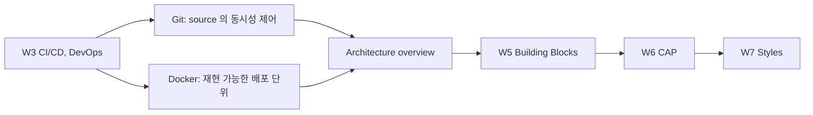
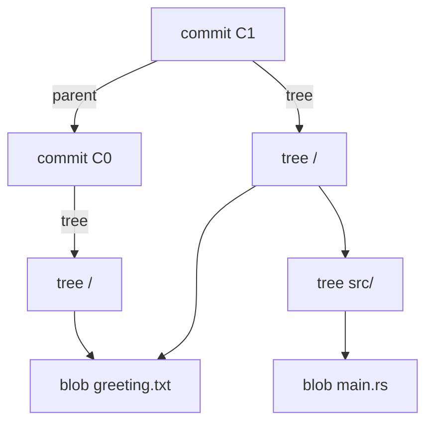
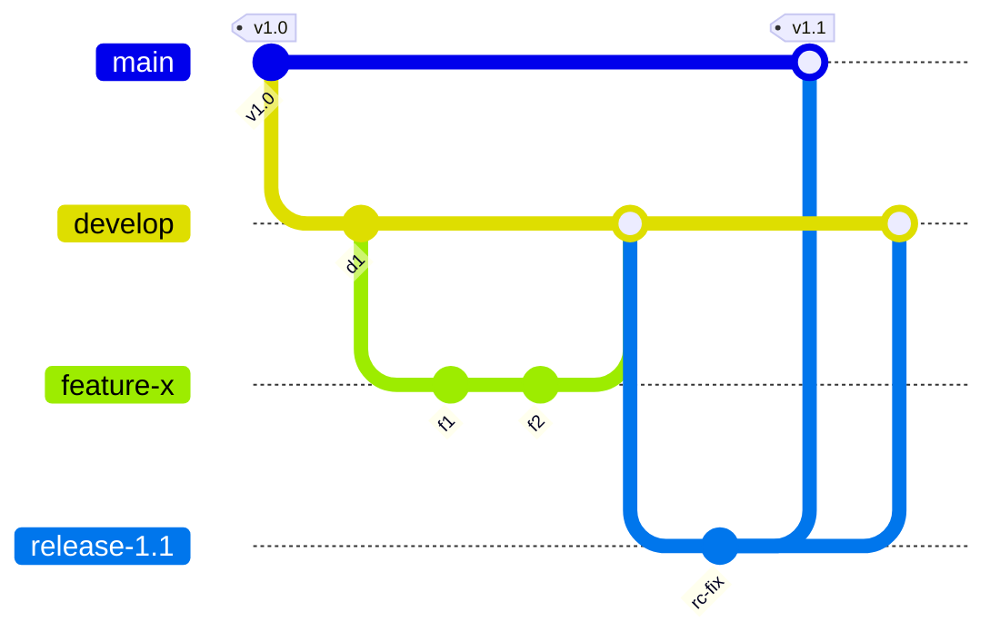
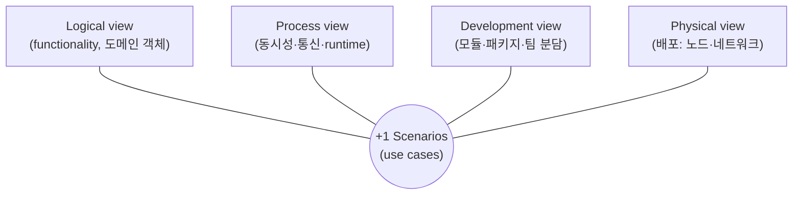

# Week 4 — Version Control: Git/GitHub, Containers & Docker + Architecture Design Overview

> Git internals (object model, DAG, merge) · Branching & collaboration models · Containers (namespaces, cgroups, OverlayFS) · Why architecture is decided early — 4+1 views, quality attributes

## Learning goals

이 챕터를 마치면 다음을 할 수 있어야 한다 (모두 시험 가능한 형태):

- Git 의 4가지 object type (blob/tree/commit/annotated tag) 의 내용과 참조 관계를 그리고, **blob 의 object id 를 header 규칙으로 손으로 계산**할 수 있다.
- Git 히스토리가 **Merkle DAG** 인 이유와 그로부터 따라오는 무결성 속성, 그리고 SHA-1 → SHA-256 전환이 왜 필요하고 왜 어려운지 설명할 수 있다.
- ref / HEAD / index 의 **파일 수준 실체**를 서술하고, branch 생성이 왜 O(1)·41바이트인지, detached HEAD 가 무엇인지, reflog 로 "지워진" commit 을 복구하는 절차를 쓸 수 있다.
- **three-way merge 알고리즘**을 base/ours/theirs 로 종이 위에서 실행하고, conflict 의 형식적 정의를 쓰고, merge base 가 DAG 의 common ancestor 인 이유와 criss-cross 상황에서 recursive/ort 전략이 하는 일을 설명할 수 있다.
- merge vs rebase 를 **히스토리 토폴로지 관점**에서 비교하고, "공유 브랜치 rebase 금지" 를 content addressing 메커니즘으로부터 유도할 수 있다.
- git-flow / GitHub flow / trunk-based development 를 **릴리스 모델·팀 규모·배포 주기** 기준으로 선택하고, protected branch 가 강제하는 불변식들을 나열할 수 있다.
- container 와 VM 의 차이를 **guest kernel 유무**로 설명하고, namespace 종류별로 무엇을 격리하는지, cgroups 가 무엇을 제한하는지, OverlayFS 의 lowerdir/upperdir/copy-up/whiteout 동작을 서술할 수 있다.
- Dockerfile 의 **layer cache 무효화 규칙**으로 어떤 명령 순서가 빌드를 빠르게 하는지 예측하고, multi-stage build 의 효과를 설명할 수 있다.
- software architecture 를 정의하고, 아키텍처 결정이 **왜 조기·고비용·비가역적**인지, 4+1 view 각각이 누구를 위해 무엇을 답하는지, quality attribute 간 구조적 트레이드오프를 예시로 설명할 수 있다.

## Why this matters

W2 에서 implementation 단계의 configuration management 를, W3 에서 CI/CD 파이프라인과 DORA 지표를 봤다. 이 주차의 전반부는 그 프로세스들을 **물리적으로 가능하게 만드는 두 도구**다: Git 은 "여러 사람이 같은 소스를 동시에 고친다"는 동시성 문제를 DAG 와 3-way merge 로 푸는 시스템이고, container 는 "빌드된 것이 어디서나 같게 돈다"는 재현성 문제를 커널 격리 기능으로 푸는 배포 단위다. 도구의 사용법이 아니라 **내부 모델**을 배우는 이유: merge conflict, force-push 사고, 캐시 안 먹는 Dockerfile, 컨테이너 OOM kill 은 전부 내부 모델을 모르면 미신적으로만 대응하게 되는 현상들이다.

후반부는 과목의 방향 전환점이다. 도구에서 **설계**로: 아키텍처가 무엇이고 왜 가장 이른 시점의 결정이 가장 비싼지를 잡아두면, [W5 building blocks](../05-system-design-building-blocks/README.md) 는 그 결정의 재료, W6 (CAP/consistency) 는 그 결정의 형식적 한계, W7 (architecture styles) 은 그 결정의 카탈로그가 된다.



---

## 1. Git internals — VCS 인터페이스를 씌운 content-addressable filesystem

Pro Git ch10 의 프레임: Git 의 코어는 버전 관리 도구가 아니라 **content-addressable filesystem** — "내용을 주면 key 를 돌려주는" key-value object store — 이고, `commit`/`merge` 같은 porcelain 명령은 그 위의 UI 다. 이 절은 lab 의 plumbing 명령 (`hash-object`, `cat-file`, `ls-tree`, `ls-files`, `merge-base`) 으로 전부 재현·검증된다.

### 1.1 Object store: 타입 4개, 주소 규칙 1개

모든 object 의 id 는 내용에서 결정된다:

$$\text{oid} = \mathrm{SHA\text{-}1}\big(\ \texttt{"<type> <size>\textbackslash0"} \ \Vert\ \text{content}\ \big)$$

object 는 이 (header ‖ content) 를 zlib 으로 압축해 `.git/objects/<oid 앞 2자>/<나머지 38자>` 에 저장된다.

**Worked example 1 — blob id 를 손으로 계산한다.** 내용이 `"hello, git\n"` (11 bytes) 인 파일:

```bash
$ echo 'hello, git' | git hash-object --stdin
94bab17c85ac96c4dd0cfcb7a16f22f6862733eb
$ printf 'blob 11\0hello, git\n' | shasum      # header + content 를 직접 해싱
94bab17c85ac96c4dd0cfcb7a16f22f6862733eb      # 동일
```

두 값이 같다 (lab A1 에서 assert). 저장 후에는 `.git/objects/94/bab17c...` 에 27바이트 (zlib 압축) 로 존재하고, `git cat-file -t/-s/-p` 로 타입·크기·내용을 되읽을 수 있다. 파일명·경로·시각은 **blob 에 없다** — blob 은 순수하게 내용이다.

| Object type | 내용 | 가리키는 것 |
|---|---|---|
| **blob** | 파일 내용 (이름·모드 없음) | — |
| **tree** | 디렉토리 1개: (mode, type, oid, name) 엔트리 목록 | blob 들과 하위 tree 들 |
| **commit** | root tree oid + parent oid(들) + author/committer(이름·이메일·타임스탬프) + 메시지 | tree 1개, parent commit 0~n개 |
| **annotated tag** | 대상 oid + 타입 + tag 이름 + tagger + 메시지 (서명 가능) | 보통 commit |

주소가 내용의 해시이므로 object 는 **불변**이다: "commit 을 수정한다"는 연산은 존재하지 않고, 새 object 를 추가할 수 있을 뿐이다 (§1.6 rebase 이해의 열쇠). 같은 내용은 어디에 몇 번 나오든 blob 하나로 **자동 중복 제거**된다 (lab A5: 두 경로가 같은 oid 를 가리킴).

### 1.2 Snapshot 에서 Merkle DAG 로

commit 하나를 열어보면 (lab A4 실측):

```
$ git cat-file -p HEAD
tree bfad95809b422753b86e3395dab2e2d1526714e8
author Lab Student <lab@example.invalid> 1785112741 +0900
committer Lab Student <lab@example.invalid> 1785112741 +0900

C0: initial

$ git cat-file -p HEAD^{tree}
100644 blob 94bab17c85ac96c4dd0cfcb7a16f22f6862733eb    greeting.txt
040000 tree 5d90422423db5ef6b431e8b9e60e0baf04b8742a    src
```



commit 은 그 시점의 **전체 스냅샷** (root tree) 을 가리키고 — diff 를 저장하는 게 아니다 (§1.7) — parent 로 이전 commit 을 가리킨다. tree 의 id 는 자식들의 id 를 포함해 계산되고, commit 의 id 는 tree id 와 parent id 를 포함해 계산되므로, **commit id 하나가 도달 가능한 전체 히스토리의 해시를 재귀적으로 요약한다**. 이런 구조를 Merkle DAG 라 한다. 따라오는 속성:

- **무결성/변조 증거**: 과거의 어떤 바이트든 바뀌면 그 위의 모든 tree/commit id 가 연쇄적으로 바뀐다. 두 레포의 tip id 가 같으면 히스토리 전체가 같다 — 이것이 분산 협업에서 "동기화됐는가"를 O(1) 로 판정하게 해 준다.
- **비교의 국소성**: 두 tree 의 id 가 같으면 하위 전체를 건너뛴다. `git status`/`diff` 가 큰 레포에서도 빠른 이유.

히스토리 전체는 commit 을 노드, parent 를 간선으로 하는 **DAG** 다 (cycle 이 있으면 자기 id 를 포함해 자기 id 를 계산해야 하므로 불가능). merge commit 은 parent 가 2개 이상인 노드일 뿐이다.

### 1.3 SHA-1 → SHA-256 전환

2017년 SHAttered 공격 (Stevens et al.) 이 서로 다른 두 PDF 가 같은 SHA-1 해시를 갖는 실제 collision 을 약 $2^{63}$ 연산으로 만들어냈다. Git 의 무결성 논증은 "id 가 같으면 내용이 같다"에 서 있으므로, 의도적 collision 은 서명된 commit 아래의 blob 을 몰래 바꿔치기하는 공격 시나리오를 연다. Git 의 대응은 2단계다:

1. **Hardened SHA-1 (sha1dc)** — Git 2.13 부터 기본 SHA-1 구현을 collision 공격의 특징적 패턴을 탐지하는 sha1collisiondetection 으로 교체. 알려진 공격 계열의 입력을 만나면 해싱을 거부한다. 임시 방어다.
2. **SHA-256 object format** — `git init --object-format=sha256`. 2.29 (2020) 에 실험적으로 들어와 2.42 (2023) 에 experimental 딱지를 뗐다.

전환이 느린 이유가 시험 포인트다: content addressing 에서는 **해시 함수가 곧 모든 object 의 이름**이므로, 함수를 바꾸면 레포의 모든 oid 가 바뀐다. hash-function-transition 설계 문서는 SHA-1 이름 ↔ SHA-256 이름의 양방향 변환 테이블로 점진 전환을 설계했지만, 두 형식 레포 간 push/fetch 상호운용과 호스팅·도구 생태계 지원이 병목으로 남아 있다. "해시는 구현 세부"가 아니라 프로토콜과 저장 포맷 전체에 스며든 공개 인터페이스였던 것.

### 1.4 refs, HEAD, index — 실체는 전부 파일이다

- **ref** = `.git/refs/heads/<name>` 에 든 **41바이트 텍스트 파일** (40-hex oid + 개행; lab A6 에서 `wc -c` 로 확인). branch 생성 = 이 파일 하나 쓰기 — 이것이 "Git 은 branch 가 싸다"의 전부다. Pro Git ch3 의 표현: 다른 VCS 들처럼 소스 트리를 복사하는 게 아니라 41바이트를 쓴다. 오래된 ref 들은 `.git/packed-refs` 한 파일로 접힌다.
- **HEAD** = `.git/HEAD`. 보통은 **symbolic ref**: 내용이 `ref: refs/heads/main`. "현재 branch" 의 실체다. commit 을 만들면 HEAD 가 가리키는 branch 파일이 새 oid 로 갱신된다.
- **detached HEAD** = HEAD 파일에 branch 이름 대신 **commit oid 가 직접** 들어있는 상태 (lab A8). `git checkout <commit|tag>` 가 만든다. 이 상태에서 만든 commit 은 어떤 branch 도 가리키지 않으므로, 다른 곳으로 checkout 하는 순간 reflog 를 빼면 도달 불가능해진다 (§1.7 에서 복구).
- **index** (staging area) = `.git/index` 바이너리 파일. "다음 commit 이 될 tree 의 평면 목록" — 경로마다 (mode, blob oid, stage 번호) 와 stat 정보 (mtime, size, inode …; 재해싱을 피하는 캐시) 를 담는다. `git ls-files --stage` 로 열람. 중요한 사실: **`git add` 시점에 blob 이 object DB 에 즉시 기록된다** (lab A3: commit 이 하나도 없어도 object DB 에 blob 존재). commit 은 index 를 tree 로 굳히고 commit object 를 만들어 ref 를 옮기는 것뿐이다.

이 셋이 Git 의 "three trees" 모델이다: **HEAD** (마지막 commit) / **index** (다음 commit) / **working tree** (지금 파일들). `git reset --soft/--mixed/--hard` 는 각각 HEAD 까지만 / index 까지 / working tree 까지 되돌리는 연산으로 정확히 대응된다 (Pro Git ch7.7).

### 1.5 Three-way merge — 알고리즘과 conflict 의 정의

**왜 two-way 로는 안 되는가.** ours 와 theirs 만 비교하면 "ours 에는 있는데 theirs 에 없는 줄"이 (a) theirs 가 지운 것인지 (b) ours 가 추가한 것인지 구분할 수 없다 — (a) 면 지워야 하고 (b) 면 남겨야 한다. 판정에는 **공통 조상 (base)** 이 필요하다. 그래서 three-way: base 대비 누가 무엇을 바꿨는지가 결정 근거다.

**Base 찾기**: base 는 DAG 에서 두 tip 의 common ancestor 중 가장 좋은 것 (`git merge-base A B`; lab B1 에서 fork 지점 commit 과 일치함을 assert). criss-cross merge 히스토리에서는 best common ancestor 가 **여러 개**일 수 있는데, 이때 recursive/ort 전략은 그 조상들끼리 먼저 merge 한 **virtual base** 를 만들어 쓴다 (재귀의 이유). ort 는 recursive 의 재작성으로 Git 2.34 부터 기본 전략이다 (`git merge --help`).

**병합 규칙**: 파일의 각 영역 (hunk) 에 대해 base/ours/theirs 3자를 비교한다.

| base 대비 ours | base 대비 theirs | 결과 |
|---|---|---|
| 무변경 | 무변경 | base 그대로 |
| 변경 | 무변경 | ours 채택 |
| 무변경 | 변경 | theirs 채택 |
| 변경 | 동일한 변경 | 그 변경 채택 |
| 변경 | 다른 변경 | **conflict** |

즉 conflict 의 정의는: 같은 영역에 대해 $\ \text{ours} \ne \text{base}\ \wedge\ \text{theirs} \ne \text{base}\ \wedge\ \text{ours} \ne \text{theirs}$. Git 은 이때 자동 결정을 **거부**하고 사람에게 넘긴다 — conflict 는 오류가 아니라 "텍스트 수준 정보로는 의도를 결정할 수 없다"는 정직한 선언이다.

**"다른 영역"의 정확한 조건 (시험 함정)**: 두 변경이 별개 영역으로 취급되려면 사이에 **무변경 base 줄이 최소 한 줄** 있어야 한다. Git 의 xdiff 기반 merge 는 맞닿은 (인접한) 변경 영역들을 하나의 겹치는 영역으로 합치므로, 두 사람이 서로 "다른 줄"을 고쳤어도 그 줄들이 인접하면 conflict 가 난다 — 예: ours 가 line 5 를 지우고 theirs 가 line 4 를 고치면 한 영역으로 합쳐져 content conflict (git 2.39, ort 실측). 아래 예시들이 자동 병합되는 것은 변경 줄들이 충분히 떨어져 있기 때문이다.

**Worked example 2 — 종이 위의 merge (lab B1/B2 와 동일).** 9줄짜리 파일에서 fork 후, left 가 line 1 을, right 가 line 9 를 고쳤다: 서로 다른 영역이므로 표의 2·3행 → 두 변경이 모두 든 결과로 **자동 병합**되고, merge commit 은 parent 2개를 가진다. 반면 양쪽이 line 5 를 서로 다르게 고치면 표의 5행 → conflict. 이때 Git 의 상태가 시험 포인트다: index 가 그 경로에 대해 **stage 1 = base, stage 2 = ours, stage 3 = theirs** 세 버전을 동시에 든다 (lab B2 실측 `git ls-files -u`; `git cat-file -p :1:poem.txt` 로 각 버전 열람). working tree 에는 `<<<<<<< / ======= / >>>>>>>` 마커가 쓰이고, 사람이 고친 뒤 `git add` 하면 stage 0 하나로 접히며 resolution 이 기록된다. merge 도구들이 3-pane 을 보여줄 수 있는 건 이 세 stage 가 실재하기 때문이다.

**Fast-forward**: theirs 가 ours 의 자손이면 (merge-base = ours) 병합할 것이 없다 — ref 만 앞으로 옮긴다 (lab B3: 새 commit 0개). merge commit 을 남겨 "이 기능은 이 묶음"을 보존하고 싶으면 `--no-ff`.

**주의 — 병합 성공 ≠ 의미 보존.** 한쪽이 함수 이름을 바꾸고 다른 쪽이 옛 이름으로 호출을 추가하면, 두 변경은 다른 영역이라 **깨끗하게 자동 병합되고 빌드가 깨진다** (semantic conflict). 텍스트 merge 는 구문도 의미도 모른다 — merge 후 CI (W3) 가 필수인 이유.

### 1.6 Rebase vs merge — 히스토리 관점의 트레이드오프

`git rebase upstream` 의 메커니즘: 내 branch 에만 있는 commit 각각에 대해 (parent 와의 diff 를 patch 로 떠서) upstream tip 위에 차례로 재적용하고, **새 commit object 들을 만든다**. §1.1 의 불변성 때문에 이는 필연이다 — parent 가 바뀌면 commit 내용이 바뀌므로 oid 가 바뀐다. 원본 commit 들은 지워지는 게 아니라 ref 를 잃을 뿐이며 reflog 로 당분간 도달 가능하다 (§1.7).

| | **merge** | **rebase** |
|---|---|---|
| 히스토리 | 실제 있었던 병렬 작업 토폴로지 보존 | 선형으로 재작성 — "처음부터 최신 위에서 작업한 것처럼" |
| 읽기/도구 | merge commit 다수 → `log` 가 얽힘 | `log`·`bisect` 가 단순해짐 |
| 진실성 | commit 들은 실제 만들어진 문맥 그대로 | 중간 commit 들은 **그 조합으로 테스트된 적 없는 상태**가 됨 (재적용 문맥이 다르므로) |
| 원격 반영 | 일반 push | 공유된 branch 면 **force-push 필요** — 위험 신호 |

**공유 브랜치 rebase 금지의 유도**: 이미 push 된 commit `C` 를 rebase 하면 나는 `C'` 를 갖고 동료는 `C` 를 갖는다. oid 가 다르므로 Git 에게 둘은 무관한 commit 이고, 동료가 pull/merge 하는 순간 같은 변경이 두 벌 (`C` 와 `C'`) 인 히스토리가 만들어지며, 이후 모든 병합이 꼬인다. 규칙은 취향이 아니라 content addressing 의 귀결이다: **rebase 는 아직 나만 아는 commit 에만**. 자기 PR branch 를 정리하는 rebase + `--force-with-lease` (원격이 내가 아는 상태일 때만 덮어씀 — blind `--force` 와 달리 동료의 새 push 를 지우지 않음) 는 통상 허용된다.

### 1.7 Reflog — 안전망, 그리고 packfile

**reflog** 는 각 ref (와 HEAD) 가 **이 로컬 레포에서** 가리켜 온 값들의 append-only 저널이다 (`.git/logs/`). `git reflog` 로 열람하며, `reset --hard`, rebase, detached HEAD 이탈로 "잃은" commit 도 reflog 엔트리로는 도달 가능하다.

**Worked example 3 — 복구 (lab B4 실측).** commit 직후 실수로 `git reset --hard HEAD~1`:

```
$ git reflog -3
e09d87d HEAD@{0}: reset: moving to HEAD~1
44a6a1a HEAD@{1}: commit: P: precious commit   ← 여기로 돌아가면 된다
$ git reset --hard 'HEAD@{1}'                  # 파일까지 원상 복구 (assert 통과)
```

한계 두 가지: (1) reflog 는 **로컬 전용** — push 되지 않고, clone 에는 없다. (2) 기본 만료: 도달 가능한 엔트리 90일, 도달 불가능한 엔트리 30일 (`gc.reflogExpire`, `gc.reflogExpireUnreachable`) 후 `git gc` 가 object 를 실제로 지울 수 있다. 그 전까지는 `git fsck --lost-found` 로도 dangling commit 을 찾을 수 있다.

**Packfile 과 delta compression**: 개념 모델은 "commit = 전체 스냅샷"이지만 (§1.2), 저장·전송 계층은 다르다. loose object 로 두면 대형 파일의 버전마다 전체 사본이라 비효율적이므로, `git gc` 와 push/fetch 시 Git 은 object 들을 **packfile** 하나로 묶으면서 비슷한 object (이름·크기 휴리스틱으로 후보 선정) 를 골라 **delta** (기준 object + 차분) 로 저장한다. 즉 "Git 은 diff 를 저장하나 스냅샷을 저장하나"의 정답은 **논리적으로 스냅샷, 물리적으로 (pack 안에서) 스냅샷+delta** 다.

---

## 2. 협업 모델 — branching 전략은 릴리스 모델의 함수다

branch 는 공짜지만 (§1.4) **branch 간 divergence 는 공짜가 아니다** — 오래 갈라져 있을수록 merge 는 커지고 semantic conflict (§1.5) 확률은 복리로 는다. 전략들은 전부 "격리의 이득 vs 통합 지연의 비용"을 어디서 끊을지의 선택이다.

### 2.1 git-flow (Driessen 2010)



영구 branch 2개 — `main` (릴리스된 상태만, tag 로 버전 표시) 과 `develop` (통합) — 에 3종의 보조 branch: **feature** (develop 에서 나와 develop 으로), **release** (develop 에서 나와 안정화·버그픽스만 하고 main 과 develop **양쪽에** merge), **hotfix** (main 에서 나와 양쪽에 merge). 릴리스 준비와 다음 버전 개발을 병행할 수 있는 것이 설계 목적이다.

- **맞는 곳**: **버전이 박제되는 소프트웨어** — 설치형/온프레미스, 앱 심사 주기가 있는 모바일, 여러 버전을 동시 지원해야 하는 제품. release branch = 안정화 기간, hotfix = 구버전 패치 경로가 그대로 필요하다.
- **비용**: branch 수명이 길어 통합이 늦다 (merge hell); 항상 두 갈래(main/develop)를 유지하는 운영 부담; **continuous deployment 와 구조적으로 안 맞는다**. Driessen 본인이 2020년에 원문 상단에 반성 노트를 달았다: 지속 배포하는 웹 앱이라면 git-flow 대신 GitHub flow 같은 단순한 흐름을 쓰라고.

### 2.2 GitHub flow

규칙이 하나뿐이다: **`main` 은 항상 배포 가능하다.** 작업은 main 에서 딴 짧은 feature branch 에서 하고 → **PR** 을 열어 리뷰와 CI 를 통과시키고 → merge 하면 (또는 merge 직전 branch 에서) 배포한다. 버전·release branch·develop 이 없다 — 배포가 릴리스이므로. 웹 서비스처럼 **단일 버전만 운영에 존재**하고 하루에도 여러 번 배포하는 제품의 기본값이다. 전제: 자동화된 배포 파이프라인과 main 을 지킬 만큼의 테스트 (W3).

### 2.3 Trunk-based development

정의 (trunkbaseddevelopment.com): 모든 개발자가 **trunk (main) 하나에 최소 하루 한 번 통합**한다. 소규모 팀은 trunk 직접 commit, 규모가 있으면 **수명 하루 이내**의 짧은 branch + PR (이 형태면 GitHub flow 와 사실상 수렴한다 — GitHub flow 는 branch 를 짧게 유지할 때 trunk-based 의 한 구현이 된다). 릴리스가 필요하면 trunk 에서 release branch 를 **늦게 따고**, 수정은 trunk 에 먼저 넣고 release 로 cherry-pick 한다 (fix-forward).

미완성 기능이 trunk 에 매일 들어가려면 기법이 필요하다: **feature flag** (코드는 배포되되 실행 경로는 꺼둠 — 배포와 릴리스의 분리), branch by abstraction (추상 계층을 먼저 넣고 그 뒤에서 구현을 점진 교체 — 장수 브랜치 없이 trunk 위에서 큰 변경을 하는 기법), 그리고 회귀를 즉시 잡는 CI. 즉 trunk-based 는 공짜가 아니라 **엔지니어링 성숙도를 선불**하는 전략이다.

근거 데이터: DORA/Accelerate (Forsgren et al. 2018, ch4) 의 분석에서 **활성 branch 3개 이하, branch 수명 하루 미만, 매일 trunk 통합**이 높은 소프트웨어 전달 성능 (W3 의 DORA 4 지표) 과 상관을 보였다. 통계적 상관이지 만능 처방은 아니지만, "오래 격리할수록 안전하다"는 직관과 반대 방향의 증거라는 점이 요지다.

### 2.4 선택 기준 정리

| | **git-flow** | **GitHub flow** | **trunk-based** |
|---|---|---|---|
| branch 수명 | 주 단위 가능 | 며칠 | 하루 이내 (또는 0) |
| 통합 빈도 | release 주기 | PR merge 마다 | 최소 매일 |
| 릴리스 모델 | 버전드 릴리스, 다중 버전 지원 | continuous deployment | continuous + 필요시 release branch |
| 팀/제품 | 설치형·모바일·규제 심사 | 웹 서비스, 중소 팀 | 성숙한 CI 조직 (규모 무관, Google 급까지) |
| 선불 비용 | branch 운영 규율 | 배포 자동화·테스트 | + feature flag, 높은 CI 신뢰도 |

### 2.5 PR 리뷰와 protected branch

**PR** 은 세 가지를 한 지점에 묶는 장치다: (1) diff 단위의 **코드 리뷰** (리뷰 원칙 자체는 W12 — Google 기준 small CL, "code health 개선이면 approve"), (2) **CI 게이트** (W3 파이프라인이 PR 마다 실행), (3) 왜 이 변경인가의 **기록** (리뷰 코멘트가 설계 문서가 된다).

이 프로세스를 사람의 선의가 아니라 서버가 강제하게 만드는 것이 **protected branch** (GitHub 기준) 다. main 에 대해 걸 수 있는 불변식들:

- PR 없이는 push 불가 + **approving review N개** 요구, 새 push 시 기존 approval 무효화 (dismiss stale), **CODEOWNERS** 가 지정 경로의 리뷰어 강제.
- **required status checks**: 지정한 CI 체크가 green 이어야 merge 가능 (+ branch 가 최신 main 기준일 것 요구 가능).
- force-push·삭제 금지, (선택) linear history 요구 — merge 방식을 squash/rebase 로 제한.

merge 방식 3종은 §1.6 의 직접 응용이다: **merge commit** (토폴로지 보존), **squash** (PR 전체를 commit 1개로 — main 은 깔끔해지지만 PR 내부 히스토리 소실), **rebase merge** (선형, commit 단위 보존 — 단 oid 재작성 발생). 팀의 "히스토리 읽기 습관"에 맞춰 하나로 통일하는 것이 요점이다.

---

## 3. Containers & Docker

### 3.1 Container vs VM — 없는 것은 guest kernel 이다

배포의 오랜 문제: 코드는 같아도 OS 패키지·라이브러리·설정이 달라 "works on my machine" 이 된다. VM 은 OS 전체를 (guest kernel 포함) 하이퍼바이저 위에 통째로 실어 이를 풀지만, GB 단위 이미지와 분 단위 부팅·낮은 밀도를 지불한다. Container 의 답: **kernel 은 host 것을 공유하고, userland (파일시스템·프로세스 트리·네트워크 스택의 "보이는 모습") 만 격리해 싣는다.**

| | **VM** | **Container** |
|---|---|---|
| kernel | guest kernel 별도 (hypervisor 가 가상 하드웨어 제공) | **host kernel 공유** |
| 격리 수준 | 하드웨어 경계 — 강함 | syscall 경계 — kernel 취약점이 공유 리스크 |
| 시작 시간 / 밀도 | 초~분 / 낮음 | ms~초 / 높음 (한 호스트에 수백 개) |
| 이미지 | OS 전체 (GB) | userland diff (MB, §3.4 layer 공유) |
| 이종 OS | 가능 (Linux host 에 Windows guest) | 불가 — Linux container 는 Linux kernel 필요 |

핵심 명제: **container 는 특별한 실행 단위가 아니라, 제한된 시야 (namespaces) 와 제한된 예산 (cgroups) 을 가진 보통의 Linux 프로세스들이다.** 증거: host 에서 `ps aux` 하면 container 안의 프로세스가 (host 쪽 PID 로) 그대로 보인다. macOS/Windows 의 Docker Desktop 이 실제로는 Linux VM 하나를 띄우고 그 안에서 container 를 돌리는 이유도 이 명제에서 나온다 — Linux kernel 없이는 container 도 없다.

### 3.2 Namespaces — "무엇이 보이는가"의 격리

namespace 는 커널의 전역 자원을 프로세스 그룹별 사본처럼 보이게 하는 기능이다 (namespaces(7); 프로세스가 속한 namespace 묶음은 `task_struct->nsproxy` — [system-programming W2](../../../system-programming/weeks/02-linux-process-programming-1/README.md) 의 구조와 연결된다). 고전적 6종에 이후 2종이 더해져 현재 8종:

| Namespace | 격리 대상 | container 에서의 의미 |
|---|---|---|
| **mnt** (2.4.19, 최초) | mount point 테이블 | container 가 자기만의 `/` (image 파일시스템) 를 본다 |
| **uts** | hostname, domain name | container 별 hostname |
| **ipc** | System V IPC, POSIX mqueue | shm 등이 container 밖과 안 섞임 |
| **pid** (2.6.24) | PID 번호 공간 | container 의 첫 프로세스가 **PID 1** — 안에서는 자기들만 보임. 같은 task 가 host 에선 다른 PID (다단계 upid 매핑) |
| **net** | 네트워크 스택 전체 (device, IP, port, 라우팅) | container 마다 독립된 port 공간 — 둘 다 :8080 을 listen 가능; veth pair 로 host bridge 에 연결 |
| **user** (3.8) | UID/GID 매핑 | container 의 uid 0 ↔ host 의 비특권 uid 매핑 가능 |
| cgroup (4.6) | cgroup 계층의 root | 자기 cgroup 서브트리만 보임 |
| time (5.6) | boot/monotonic clock | (Docker 기본 미사용) |

주의할 실무 사실: **Docker 는 기본 설정에서 user namespace 를 쓰지 않는다** (`userns-remap`/rootless 는 opt-in). 즉 container 의 root 는 기본적으로 host 의 uid 0 이고, 격리는 capability (root 의 특권을 쪼갠 단위 권한 — Docker 는 대부분을 drop) 축소 + seccomp (프로세스가 호출할 수 있는 syscall 을 제한하는 커널 필터) 프로파일이 보완한다 — "container 안이니까 root 여도 안전"은 성립하지 않는 명제다.

### 3.3 cgroups — "얼마나 쓸 수 있는가"의 제한

namespace 가 **가시성**을 격리한다면 cgroups (control groups; cgroups(7)) 는 프로세스 그룹의 **자원 사용량을 계량·제한·우선순위화**한다. 현대 시스템은 단일 계층의 v2 (unified hierarchy) 를 쓴다. 주요 controller 와 Docker 플래그 대응:

| Controller | 제한 (v2 인터페이스) | docker run | 초과 시 동작 |
|---|---|---|---|
| memory | `memory.max` | `--memory=512m` | cgroup 내 **OOM kill** (exit 137) — host 전체가 아니라 그 그룹만 |
| cpu | `cpu.max` = quota/period | `--cpus=1.5` | kill 이 아니라 **throttling**: quota 소진 시 period 끝까지 실행 정지 → p99 latency spike 로 관측됨 |
| pids | `pids.max` | `--pids-limit` | fork 실패 (fork bomb 방어) |
| io | `io.max` | `--device-write-bps` 등 | 대역폭 제한 |

두 실패 모드의 비대칭을 기억하라: memory 초과는 **죽고**, cpu 초과는 **느려진다**. "container 가 이유 없이 137로 죽는다" = OOM, "CPU 는 남는데 가끔 수백 ms 멈춘다" = throttling — 운영 진단의 단골이다.

### 3.4 Image layer 와 OverlayFS

Docker image = **읽기 전용 layer 들의 순서 있는 스택 + 설정 JSON**. layer 는 파일시스템 diff 의 tar 이고 **sha256 digest 로 content-addressed** 된다 — Git 과 같은 원리로, 같은 base layer 는 registry 와 host 디스크에서 이미지들끼리 공유·중복 제거된다.

실행 시 이 스택을 하나의 파일시스템으로 보이게 하는 것이 union filesystem, Linux 에서는 **OverlayFS** 다 (kernel overlayfs 문서; Docker 의 overlay2 드라이버):

```
merged   (container 가 보는 통합 뷰)
  ↑
upperdir (container writable layer — 쓰기는 전부 여기)
lowerdir (image layers, 읽기 전용, 여러 개 스택)
workdir  (atomic 연산용 내부 작업 공간)
```

- **읽기**: 같은 경로가 여러 layer 에 있으면 **가장 위가 이긴다**.
- **쓰기 = copy-up**: lower 의 파일을 수정하면 **파일 전체**가 upper 로 복사된 뒤 수정된다 (파일 단위 CoW — 1GB 파일의 1바이트를 고쳐도 1GB copy-up. 첫 쓰기만 비싸고 이후는 upper 에서 직접).
- **삭제 = whiteout**: lower 의 파일은 지울 수 없으므로, upper 에 같은 이름의 **whiteout** (device number 0/0 인 character device) 을 만들어 merged 뷰에서 가린다. 디렉토리는 `trusted.overlay.opaque` xattr 로 통째로 가린다.

세 가지 귀결 (전부 시험/실무 포인트):

1. **뒤 layer 의 `rm` 은 image 를 줄이지 못한다.** 앞 layer 의 바이트는 그대로 있고 가려질 뿐이다 — `COPY secret.pem` 후 다음 RUN 에서 지워도 **layer 에 남아 `docker history`/`save` 로 추출 가능**하다. 크기는 multi-stage (§3.5) 로, secret 은 build secret 기능으로 풀어야 한다.
2. **container layer (upperdir) 는 container 와 함께 사라진다.** 영속 데이터는 volume (overlay 를 우회하는 bind/managed mount) 에 둔다.
3. 같은 image 의 container 100개 = lower layer 디스크·page cache 공유 → container 밀도의 실체.

### 3.5 Dockerfile 최적화 — layer cache 와 multi-stage build

Dockerfile 의 각 명령은 layer (또는 메타데이터) 를 만들고, `docker build` 는 **cache** 로 재빌드를 건너뛴다. 무효화 규칙 (Docker build cache 문서):

- 각 step 의 cache key = **부모 layer + 명령**. `RUN` 은 **명령 문자열 자체**만 본다 (실행 결과가 바뀌어도 문자열이 같으면 cache hit — `RUN apt-get update` 단독 layer 가 영원히 낡은 인덱스를 재사용하는 함정; 그래서 `update && install` 을 **한 RUN** 에 쓴다). `COPY`/`ADD` 는 복사되는 **파일 내용의 checksum** 을 본다.
- **한 step 이 miss 나면 그 이후 전부 재실행** (cascade) — 부모 layer 가 바뀌었으므로.

따라서 최적화 원칙은 하나다: **변동성이 낮은 것부터 위에 쓴다.** base image → 시스템 패키지 → 의존성 manifest 복사 + 설치 → 소스 복사 → 빌드. 소스는 매 commit 바뀌지만 의존성은 가끔 바뀌므로, 이 순서면 일상 빌드에서 설치 step 이 항상 cache hit 이다.

**Worked example 4 — 순서만 바꾼 두 Dockerfile (lab 2 실측).** 동일한 "설치 3초" step 을 두고, `COPY . .` 를 설치 앞에 둔 bad 와 `COPY deps.txt` 만 앞에 둔 good 을 소스 1줄 수정 후 재빌드:

| rebuild after source-only change | install step | wall time |
|---|---|---|
| Dockerfile.bad (`COPY . .` 먼저) | 재실행 | **3791 ms** |
| Dockerfile.good (`COPY deps.txt` 먼저) | **CACHED** | **649 ms** |

같은 실험에서 `deps.txt` 를 바꾸면 good 도 설치부터 전부 재실행된다 (3817 ms) — cascade 의 확인. 실제 프로젝트에서 "설치" 가 `npm ci`/`pip install`/`gradle build` 수 분짜리면 이 순서 하나가 CI 왕복 시간을 지배한다 (W3 의 lead time 과 직결).

**Multi-stage build**: 빌드 도구는 실행에 필요 없다. stage 를 나눠 마지막 stage 에 산출물만 복사한다:

```dockerfile
FROM gradle:8-jdk21 AS builder          # 빌드 전용 stage
COPY --chown=gradle . /app
RUN cd /app && gradle bootJar

FROM eclipse-temurin:21-jre-alpine      # 최종 image 는 여기부터만
COPY --from=builder /app/build/libs/app.jar /app.jar
ENTRYPOINT ["java", "-jar", "/app.jar"]
```

최종 image 에는 JDK·gradle·소스·중간 산출물 layer 가 **아예 없다** — 크기 (수백 MB → 수십 MB), 공격 표면 (shell·컴파일러 부재), §3.4-1 의 secret 잔존 문제 (builder stage 의 layer 는 최종 image 에 포함되지 않음) 를 한 번에 다룬다. `--target builder` 로 중간 stage 만 빌드해 테스트용으로 쓰는 패턴도 표준이다.

### 3.6 Registry 와 Compose 개요

- **Registry** (Docker Hub, ECR, GHCR): image 의 push/pull 저장소. **tag 는 mutable** (`myapp:latest` 는 옮겨 다니는 포인터), **digest 는 immutable** (`myapp@sha256:...` 는 content address). 재현 가능한 배포·보안 감사는 digest 고정이 정석이고, `:latest` 배포는 "어제의 latest 와 오늘의 latest 가 다른" 사고의 표준 경로다 — §1 의 교훈 (mutable ref vs immutable object) 이 그대로 재현된다.
- **Docker Compose**: 한 호스트에서 다중 container 앱 (app + DB + cache + MQ …) 을 YAML 로 선언하고 `docker compose up` 으로 일괄 기동한다 — services (container 정의), networks (서비스명이 DNS 가 됨), volumes. 함정 하나: `depends_on` 은 **시작 순서**만 보장하고 준비 완료 (DB 가 접속을 받는 상태) 를 기다리지 않는다 — `healthcheck` + `condition: service_healthy` 를 써야 한다. compose 는 개발·테스트 환경의 표준이고 (W5 의 LB·cache·MQ 조합을 로컬에서 재현하는 도구), 다중 호스트 오케스트레이션 (Kubernetes) 은 이 과목 범위 밖이다.

---

## 4. Architecture Design Overview — 도구에서 설계로

### 4.1 아키텍처란 무엇이고, 왜 초기 결정이 비싼가

Sommerville ch6 의 정의: **architectural design** 은 시스템을 구성하는 컴포넌트들과 그들 사이의 관계·상호작용을 식별하는 설계 과정이고, 그 산출물이 **software architecture** 다. 요구사항과 설계 사이의 첫 다리이며, W2 의 설계 산출물 분류에서 가장 앞에 오는 것이 architectural design 이었던 이유다.

왜 이 결정이 비싼가 — 세 논거:

1. **Quality attribute 는 창발적이다.** performance, availability, security, maintainability 같은 non-functional 속성 (W2 의 NFR) 은 개별 컴포넌트의 코드 품질이 아니라 **컴포넌트들의 배치와 상호작용 구조**에서 나온다. 아무리 코드를 리팩토링해도 "모든 요청이 동기적으로 5개 서비스를 경유하는 구조"의 tail latency (W5 §1.2 의 $1-(1-p)^n$) 는 구조를 바꾸기 전엔 안 고쳐진다.
2. **변경이 국소화되지 않는다.** 컴포넌트 내부 변경은 그 컴포넌트에 갇히지만, 컴포넌트 **경계·계약** 의 변경은 인접한 모든 컴포넌트로 파급된다. 아키텍처는 정의상 경계들의 집합이므로, 아키텍처 변경 = 광역 재작업이다. 나쁜 소식은 이 결정을 **정보가 가장 적은 프로젝트 초기에** 내려야 한다는 것 — 그래서 아키텍처 결정은 "가장 적은 정보로 내리는 가장 비싼 베팅"이다.
3. **구조가 조직과 계약에 얼어붙는다.** 컴포넌트 경계는 팀 경계·API 계약·배포 단위가 된다 (Conway 1968 의 관찰: 시스템 구조는 조직의 커뮤니케이션 구조를 닮는다). 구조를 바꾸는 일은 코드가 아니라 조직과 인터페이스 계약을 바꾸는 일이 된다.

같은 이유로 아키텍처 문서화가 중요해진다: 되돌리기 비싼 결정일수록, 무엇을 왜 선택했고 무엇을 포기했는지가 기록되어야 한다 (실무의 ADR — architecture decision record — 관행이 이 원리의 구현이다).

### 4.2 4+1 view model (Kruchten 1995)

단일 다이어그램 하나로 아키텍처를 그리려는 시도는 실패한다 — 이해관계자마다 묻는 질문이 다르기 때문이다. Kruchten 의 답은 **관심사별로 분리된 4개의 view + 이를 관통하는 시나리오**다:



| View | 답하는 질문 | 주 이해관계자 | 전형적 표기 (→ W6 UML) |
|---|---|---|---|
| **Logical** | 기능이 어떤 객체/추상으로 분해되는가 | end-user, 도메인 분석가 | class diagram |
| **Process** | 런타임에 무엇이 동시에 돌고 어떻게 통신하는가; performance·availability 는 여기서 분석 | 통합자, 성능 엔지니어 | sequence/activity diagram |
| **Development** | 코드가 어떤 모듈·계층으로 조직되고 누가 소유하는가 | 개발자, 관리자 | package/component diagram |
| **Physical** | 소프트웨어가 어떤 하드웨어/노드에 어떻게 배치되는가 | 시스템/인프라 엔지니어 | deployment diagram |
| **+1 Scenarios** | 핵심 use case 가 위 4개 view 를 실제로 관통하는가 | 전원 | use case + 궤적 |

Scenarios 가 "+1" 인 이유: 새 정보를 담는 view 가 아니라 (Kruchten 자신의 표현으로 다른 view 들과 **redundant**), 4개 view 의 요소들이 실제 시나리오 하나를 함께 수행할 수 있는지 **검증하고 잇는** 역할이다. 시험 포인트: 어떤 결정이 어느 view 소속인지 분류하기 — "Kafka partition 수" 는 process view, "모듈을 Gradle 서브프로젝트로 나누는 방식" 은 development view, "AZ 2개에 어떻게 배치" 는 physical view.

### 4.3 Quality attributes 와 구조적 트레이드오프

Sommerville ch6 은 quality attribute 별로 아키텍처가 취해야 할 구조적 방향을 제시하는데, 나란히 놓으면 **서로 충돌한다**는 것이 요점이다:

| 요구가 critical 할 때 | 구조적 처방 (Sommerville ch6) |
|---|---|
| **Performance** | critical 연산을 **소수의 큰 컴포넌트에 국소화** — 컴포넌트 간 통신을 줄인다 |
| **Security** | **layered 구조**, 핵심 자산을 가장 안쪽 layer 에, 그 layer 에 검증 집중 |
| **Safety** | 안전 관련 기능을 **한곳에 모은다** — 검증 범위 축소, 보호 시스템 분리 가능 |
| **Availability** | **redundant 컴포넌트** 와 교체 가능 구조 (W5 의 LB+replica 가 구현) |
| **Maintainability** | **fine-grain, 교체 가능한 컴포넌트**, 데이터 생산자·소비자 분리, 공유 데이터 구조 회피 |

충돌의 예: performance 는 큰 컴포넌트 (호출 경계 최소화) 를, maintainability 는 작은 컴포넌트 (교체 국소화) 를 요구한다 — 하나의 구조로 둘 다 최대화할 수 없고, **어느 쪽을 얼마나 양보할지가 아키텍처 결정**이다. security 의 중앙 검문은 performance 의 hop 추가이자 availability 의 SPOF 후보다. availability 의 중복은 비용과 (W6 에서 형식화되듯) consistency 문제를 산다.

이것이 W5–W7 로 가는 다리다: 이 트레이드오프를 **정량화하는 도구** (percentile, Little's law, USL) 와 트레이드오프의 **재료가 되는 부품들**이 [W5](../05-system-design-building-blocks/README.md), 분산에서 그 트레이드오프가 부딪히는 **형식적 한계** (CAP/PACELC) 가 W6, 반복 검증된 **구조의 카탈로그** (layered, microservices, event-driven) 가 W7 이다. W4 까지의 도구 관점에서 한 문장으로 잇자면: Git 과 Docker 가 "변경을 싸게" 만들었지만, 아키텍처는 여전히 "변경이 비싼 것들의 목록"이고, 그래서 처음에 생각해야 한다.

---

## Common misconceptions

1. **"Git 은 diff (변경분) 를 저장한다."** — 논리 모델은 commit 마다 **전체 스냅샷** (root tree) 이다. delta 는 packfile 이라는 저장·전송 계층 최적화에만 존재한다 (§1.7). 이 구분을 못 하면 "branch 를 오가면 diff 를 재생하느라 느릴 것" 같은 잘못된 성능 직관이 생긴다.
2. **"Branch 는 commit 들을 담는 컨테이너다."** — branch 는 **41바이트 포인터 파일**이고 (lab A6), commit 이 "branch 에 속한다"는 것은 그 포인터에서 **도달 가능**하다는 뜻일 뿐이다. 같은 commit 이 동시에 여러 branch 에 "속할" 수 있는 이유.
3. **"Conflict 는 두 사람이 같은 파일을 고치면 난다."** — 아니다. **같은 영역을 base 대비 서로 다르게** 고쳐야 난다 (§1.5 의 정의). 같은 파일의 다른 영역은 자동 병합된다 — 단 "다른 영역" 판정에는 두 변경 사이에 **무변경 줄이 최소 한 줄** 필요하다: 인접한 줄들의 변경은 한 영역으로 합쳐져 conflict 가 된다 (§1.5). 그리고 역으로, **자동 병합 성공이 의미적 정합성을 보장하지도 않는다** (semantic conflict).
4. **"Rebase 는 위험하니 항상 금지 / merge 보다 우월하니 항상 rebase."** — 둘 다 틀렸다. 위험한 것은 **이미 공유된 commit 의 재작성**뿐이며 (oid 분기 → 중복 commit), 로컬 branch 정리용 rebase 는 표준 관행이다. 반대로 rebase 의 선형 히스토리는 "그 조합으로 테스트된 적 없는 중간 commit" 이라는 비용을 지불한다 (§1.6).
5. **"reset --hard 로 날린 commit 은 사라졌다."** — commit object 는 남아 있고 ref 만 잃었다. reflog (로컬, 기본 30~90일) 로 복구된다 (lab B4). 단 reflog 는 **push 되지 않으므로** 다른 사람의 clone 에는 이 안전망이 없다.
6. **"Container 는 가벼운 VM 이다."** — container 에는 **guest kernel 이 없다**. 격리는 하드웨어 경계가 아니라 host kernel 의 namespace/cgroup 기능이고, 따라서 kernel 취약점은 모든 container 가 공유하는 리스크다. 게다가 Docker 기본 설정은 user namespace 를 쓰지 않아 container 의 root = host 의 uid 0 이다 (§3.2).
7. **"Dockerfile 뒤쪽에서 `rm` 하면 image 가 작아진다 / 지운 secret 은 안전하다."** — layer 는 append-only 다. 삭제는 whiteout 으로 **가려질 뿐**이고, 앞 layer 의 바이트는 `docker save` 로 그대로 추출된다 (§3.4). 크기는 multi-stage 로, secret 은 build secret 으로.
8. **"아키텍처는 나중에 리팩토링하면 된다."** — 컴포넌트 **내부**는 그렇다. 그러나 quality attribute 는 컴포넌트 경계 구조에서 창발하고, 경계 변경은 전 시스템·조직으로 파급된다 (§4.1). "나중에"의 비용이 선형이 아니라는 것이 아키텍처라는 활동의 존재 이유다.

## Glossary

- **Content-addressable storage**: a store where an object's key is a hash of its content, making objects immutable and self-verifying.
- **Blob / tree / commit / annotated tag**: Git's four object types — file content / directory listing / snapshot-plus-parents-plus-metadata / named, signed pointer to an object.
- **Merkle DAG**: a directed acyclic graph whose node ids are hashes covering their children, so one root id summarizes the integrity of the whole reachable graph.
- **Ref**: a named pointer to a commit, stored as a small file (or packed-refs entry) such as `refs/heads/main`.
- **HEAD**: the ref (usually symbolic, e.g. `ref: refs/heads/main`) marking the current checkout; detached HEAD holds a raw commit id instead.
- **Index (staging area)**: the binary file listing the exact tree that the next commit will record, one entry per path.
- **Merge base**: the best common ancestor of two commits in the DAG, used as the reference version in a three-way merge.
- **Three-way merge**: merging ours and theirs by comparing each region against the merge base; a conflict is a region both sides changed differently.
- **Fast-forward**: moving a ref to a descendant commit without creating a merge commit.
- **Rebase**: replaying commits onto a new base, creating new commit objects with new ids; rewriting published history breaks collaborators.
- **Reflog**: a local, per-ref journal of previous values, enabling recovery of otherwise unreachable commits until it expires.
- **Packfile**: Git's packed storage/transfer format holding many objects, delta-compressing similar ones.
- **Trunk-based development**: a workflow where all developers integrate into one trunk at least daily, using short-lived branches and feature flags.
- **Protected branch**: a server-enforced policy set (required reviews, status checks, no force-push) guarding a branch such as `main`.
- **Namespace (Linux)**: a kernel facility giving a process group its own instance of a global resource (PIDs, mounts, network stack, ...), isolating visibility.
- **cgroup**: a kernel facility metering and limiting resource usage (CPU, memory, IO, pids) of a process group.
- **OverlayFS**: a union filesystem presenting stacked read-only lowerdirs and one writable upperdir as a single merged view.
- **Copy-up**: OverlayFS copying a whole file from lowerdir to upperdir on first write — file-granularity copy-on-write.
- **Whiteout**: a marker (0/0 character device) in the upper layer hiding a lower-layer file, implementing deletion without modifying lower layers.
- **Layer cache**: Docker's build cache keyed on parent layer plus instruction (command string for RUN, content checksum for COPY/ADD); a miss invalidates all later steps.
- **Multi-stage build**: a Dockerfile with multiple FROM stages, copying only final artifacts into the last stage to drop build-time tools and layers.
- **Image digest**: the immutable sha256 content address of an image, as opposed to a mutable tag.
- **Software architecture**: the fundamental organization of a system as components, their relationships, and the principles governing them.
- **4+1 view model**: Kruchten's separation of architecture description into logical, process, development, and physical views, tied together by scenarios.
- **Quality attribute**: a non-functional property (performance, availability, security, maintainability, safety) that emerges from architectural structure.

## References

1. Chacon & Straub, *Pro Git*, 2nd ed. — ch3 (branching), ch7.7 (reset demystified), ch10 (Git internals: objects, refs, packfiles). https://git-scm.com/book/en/v2
2. Git manual pages — `git-merge(1)` (ort/recursive strategies), `git-config(1)` (`gc.reflogExpire*`), `git-init(1)` (`--object-format`), `gitrevisions(7)` (`:1:path` stages). https://git-scm.com/docs
3. Git hash-function-transition design document. https://git-scm.com/docs/hash-function-transition
4. Stevens, Bursztein, Karpman, Albertini & Markov, "The First Collision for Full SHA-1", *CRYPTO 2017*. https://doi.org/10.1007/978-3-319-63688-7_19 · https://shattered.io/
5. Driessen, "A successful Git branching model" (2010; 2020 reflection note). https://nvie.com/posts/a-successful-git-branching-model/
6. GitHub Docs, "GitHub flow". https://docs.github.com/en/get-started/using-github/github-flow
7. Hammant, "Trunk Based Development". https://trunkbaseddevelopment.com/
8. Forsgren, Humble & Kim, *Accelerate*, IT Revolution, 2018 — ch4 (trunk-based development findings); DORA capability: trunk-based development. https://dora.dev/capabilities/trunk-based-development/
9. GitHub Docs, "About protected branches". https://docs.github.com/en/repositories/configuring-branches-and-merges-in-your-repository/managing-protected-branches/about-protected-branches
10. `namespaces(7)`, Linux man-pages. https://man7.org/linux/man-pages/man7/namespaces.7.html
11. `cgroups(7)`, Linux man-pages; kernel docs, "Control Group v2". https://man7.org/linux/man-pages/man7/cgroups.7.html · https://docs.kernel.org/admin-guide/cgroup-v2.html
12. Linux kernel documentation, "Overlay Filesystem". https://docs.kernel.org/filesystems/overlayfs.html
13. Docker Docs — "OverlayFS storage driver", "Docker build cache", "Multi-stage builds", "Isolate containers with a user namespace". https://docs.docker.com/engine/storage/drivers/overlayfs-driver/ · https://docs.docker.com/build/cache/ · https://docs.docker.com/build/building/multi-stage/ · https://docs.docker.com/engine/security/userns-remap/
14. Docker Docs, Compose — services, `depends_on` and `healthcheck` conditions. https://docs.docker.com/compose/
15. Sommerville, *Software Engineering*, 10th ed., Pearson, 2015 — ch6.1–6.2 (architectural design decisions, architectural views, quality-attribute guidance).
16. Kruchten, "The 4+1 View Model of Architecture", *IEEE Software* 12(6), 1995. https://doi.org/10.1109/52.469759
17. Conway, "How Do Committees Invent?", *Datamation* 14(4), 1968. https://www.melconway.com/Home/Committees_Paper.html
18. Lab measurements in this chapter (blob hashes, merge stages, cache timings) — reproduce with `lab/git-plumbing.sh` and `lab/docker-layer-cache/run-experiment.sh`.
