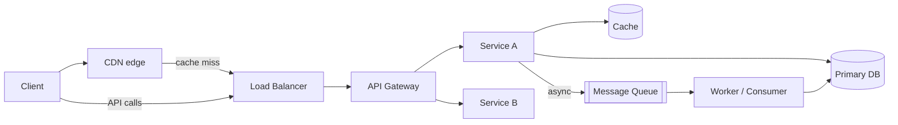
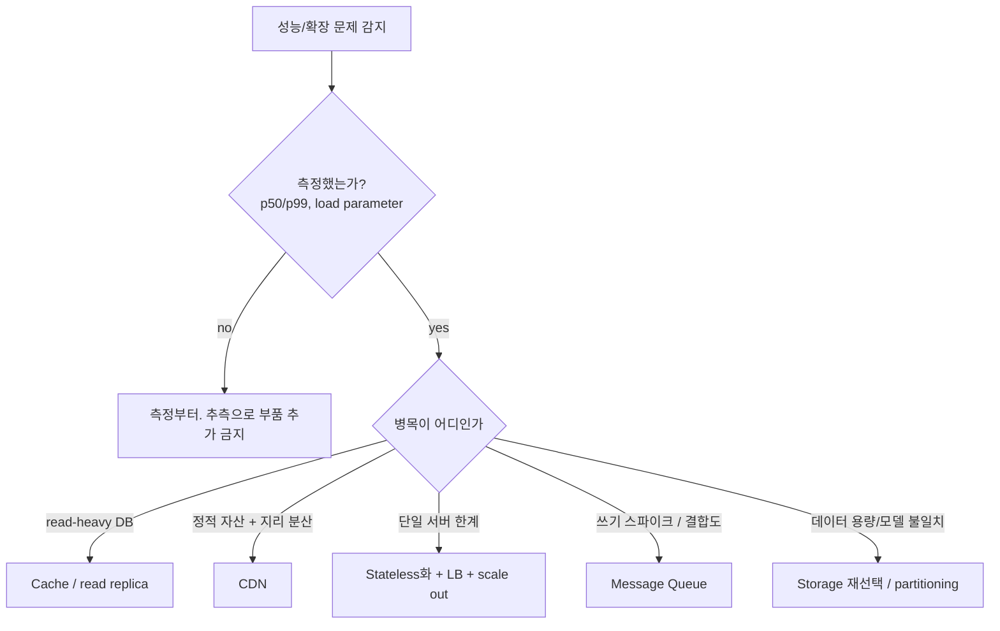

# Week 5 — System Design Building Blocks

> Load Balancer · Cache · CDN · API Gateway · Storage · Message Queue · Performance & Scalability

## Learning goals

이 챕터를 마치면 다음을 할 수 있어야 한다 (모두 시험 가능한 형태):

- latency 를 percentile (p50/p95/p99) 로 기술하고, fan-out 구조에서 **tail latency amplification** 을 계산할 수 있다.
- **Little's law** ($L = \lambda W$) 로 시스템의 동시성·처리량·체류시간 관계를 계산하고, Amdahl's law 와 **Universal Scalability Law** 로 horizontal scaling 의 한계를 설명할 수 있다.
- L4 vs L7 load balancing 을 동작 계층·가시 정보·비용 관점에서 비교하고, RR / least-connections / EWMA 알고리즘의 선택 기준을 서비스 시간 분포와 연결해 설명할 수 있다.
- naive mod-N 해싱의 remap 문제로부터 **consistent hashing** 을 유도하고, virtual node 가 필요한 이유(load variance)를 정량적으로 설명할 수 있다.
- cache-aside / read-through / write-through / write-back / write-around 의 staleness·유실 리스크를 비교하고, **cache stampede** 의 발생 조건과 방어 기법(locking/lease, probabilistic early expiration)을 설명할 수 있다.
- token bucket 과 sliding window rate limiting 의 파라미터가 admit 하는 트래픽 상한을 계산할 수 있다.
- RDB / KV / document / wide-column / graph 저장소를 데이터 모델·쿼리 패턴 기준으로 선택하고, B-tree vs LSM-tree 의 read/write amplification 트레이드오프를 설명할 수 있다.
- at-most-once / at-least-once / exactly-once delivery 를 정의하고, at-least-once + **idempotency** 조합이 실무 기본값인 이유와 Kafka 의 log 모델이 broker queue 모델과 다른 점을 설명할 수 있다.
- 각 빌딩 블록에 대해 "언제 넣고 언제 빼는가"의 판단 기준을 제시할 수 있다.

## Why this matters

W4 에서 아키텍처 결정이 왜 조기·비가역적인지 봤다. 이 주차는 그 결정의 **재료**다: 대규모 시스템은 결국 유한한 종류의 부품(LB, cache, CDN, gateway, storage, MQ)을 조합해 만들어지고, 각 부품은 명확한 문제 하나를 풀면서 새로운 실패 모드를 들여온다. 부품의 스펙 나열이 아니라 "이 부품이 어떤 물리적 한계를 우회하는가, 그 대가로 무엇이 깨질 수 있는가"를 아는 것이 아키텍처 설계 능력이다.

W6 (consistency, CAP, replication) 은 이 주차의 직접 연장이다: 여기서 데이터를 복제·분산하기 시작하는 순간 (cache 는 DB 의 복제본, 샤드는 데이터의 분할) consistency 문제가 생기고, 그 형식적 분석이 W6 다. W7 의 microservices 트레이드오프 논의도 이 주차의 분산 비용 감각을 전제한다.

전형적인 배치를 먼저 그려두자. 이후 각 섹션은 이 그림의 부품 하나씩이다.

---

## 1. Performance & Scalability — 측정 없이는 설계 없다

### 1.1 Load parameter, throughput, latency

"확장 가능하다/아니다"는 이진 속성이 아니다. DDIA ch1 의 프레임: **scalability 는 "load 가 특정 방식으로 증가할 때 성능을 유지하기 위한 시스템의 대응 능력"** 이고, 논의는 항상 **load parameter** 의 선택에서 시작한다 — requests/sec, 동시 접속 수, read/write 비율, fan-out (요청 하나가 유발하는 내부 호출 수) 등. Twitter 의 home timeline 이 유명한 예다: 트윗 쓰기 자체는 초당 수천 건이지만, 각 쓰기가 팔로워 수만큼의 timeline 삽입으로 **fan-out** 되면서 실질 부하가 수십 배가 된다 — 이 시스템의 진짜 load parameter 는 "초당 트윗 수"가 아니라 "사용자당 팔로워 분포"다.

- **Throughput**: 단위 시간당 처리 건수 (batch 시스템의 주 지표).
- **Response time**: 클라이언트가 관측하는 요청→응답 시간. 서비스 시간 + 네트워크 + **queueing delay**. (latency 는 엄밀히는 "요청이 처리를 기다리며 대기하는 시간"이지만, 관용적으로 response time 과 혼용된다 — DDIA ch1.)

### 1.2 Percentile latency 와 tail latency

평균(mean)은 사용자 경험을 기술하지 못한다. 응답시간 분포는 거의 항상 right-skewed 라 (GC pause, page fault, TCP retransmit, 대형 요청) 평균은 소수의 outlier 에 끌려간다. 그래서 **percentile** 로 말한다:

- $p50$ (median): 사용자 절반의 경험.
- $p99$: 100 요청 중 1건이 이보다 느림. "tail latency". Amazon 은 내부 서비스 요구사항을 $p999$ 로 기술한다 — 가장 느린 0.1% 의 고객이 대개 데이터가 가장 많은(= 가장 가치 있는) 고객이기 때문 (DDIA ch1).

**Tail latency amplification** (DDIA ch1; Dean & Barroso 2013): 요청 하나가 $n$ 개 backend 를 병렬 호출하고 전부 기다려야 한다면, 사용자 응답시간은 **가장 느린 호출**이 결정한다. 각 backend 가 독립적으로 확률 $p$ 로 "느림"일 때:

$$P(\text{user request slow}) = 1 - (1-p)^n$$

**Worked example 1 — fan-out 이 tail 을 증폭한다.** 각 backend 의 $p99 = 100\text{ms}$ (즉 1% 확률로 100ms 초과), 요청 하나가 100개 backend 를 병렬 호출한다면:

$$1 - 0.99^{100} \approx 1 - 0.366 = 63.4\%$$

**사용자 요청의 63% 가 최소 한 개의 100ms+ 호출을 포함한다.** backend 하나 기준으로는 "1% 문제"였던 것이 전체 시스템에서는 "다수 사용자의 문제"가 된다. Dean & Barroso 는 이래서 tail-tolerant 기법 (hedged request: p95 를 넘긴 요청을 다른 replica 로 복제 발사, 첫 응답 사용) 이 필요하다고 논증했다. Lab 3 에서 least-connections 가 개선하는 것도 정확히 이 tail 이다.

**SLO/SLA**: SLO (objective) 는 내부 목표 — "GET /home 의 p99 < 200ms, 월간 99.9% 달성". SLA (agreement) 는 그 목표에 페널티 조항을 붙인 고객 계약. Google SRE book ch4 의 프레임: SLI (실측 지표) → SLO (목표) → SLA (계약). NFR 을 측정 가능하게 쓰라던 W2 의 요구가 여기서 percentile 로 구체화된다.

### 1.3 Little's law — 용량 계산의 기본 도구

정상 상태(stationary)의 어떤 시스템이든, 분포 가정 없이:

$$L = \lambda W$$

$L$ = 시스템 안의 평균 요청 수 (동시성), $\lambda$ = 평균 도착률 (throughput), $W$ = 평균 체류 시간 (Little 1961). 큐잉 이론에서 가장 일반적인 항등식이며, 어떤 스케줄링·분포에서도 성립한다.

**Worked example 2 — 스레드 풀 크기 산정.** 서비스가 $\lambda = 1{,}000$ req/s 를 받고, 요청당 평균 체류 시간이 $W = 200\text{ms}$ (DB 대기 포함) 라면 시스템 안에는 평균 $L = 1000 \times 0.2 = 200$ 개의 요청이 존재한다. thread-per-request 모델이면 최소 200 스레드가 필요하고, 스레드 풀이 100이면 요청은 큐에 쌓여 $W$ 가 늘고, 늘어난 $W$ 는 다시 $L$ 을 키운다 — 과부하의 양성 피드백. 역방향 계산도 유용하다: 커넥션 풀 50개로 $\lambda = 1000$ req/s 를 버티려면 쿼리당 체류 시간이 $W = L/\lambda = 50\text{ms}$ 이하여야 한다.

### 1.4 Scaling 의 한계: Amdahl 과 USL

**Amdahl's law** (1967): 작업의 비율 $s$ 가 직렬(병렬화 불가)이면, $N$ 배 자원의 speedup 은

$$S(N) = \frac{1}{s + \frac{1-s}{N}} \xrightarrow{N \to \infty} \frac{1}{s}$$

직렬 비율 5% 면 무한 자원으로도 20배가 상한이다.

**Universal Scalability Law** (Gunther): Amdahl 에 coherency 비용 항을 추가한 실무 모델.

$$C(N) = \frac{N}{1 + \sigma (N-1) + \kappa N(N-1)}$$

$\sigma$ = contention (직렬화·잠금 경쟁, Amdahl 의 $s$ 에 대응), $\kappa$ = crosstalk/coherency (노드 간 상태 동기화 — cache invalidation, consensus 라운드). $\kappa > 0$ 이면 어느 지점 이후 **노드를 추가할수록 throughput 이 감소한다** (retrograde scaling). "서버를 더 넣으면 된다"가 거짓이 되는 지점을 수식으로 보여준다 — 노드 간 조율(coherency)이 필요한 상태를 없애는 것이 스케일링 설계의 본질인 이유.

### 1.5 Vertical vs horizontal, 그리고 stateless

- **Vertical (scale up)**: 더 큰 머신. 코드 변경 없음, 단순. 한계: 가격 초선형 증가, 물리적 상한, 그 머신이 SPOF.
- **Horizontal (scale out)**: 머신 추가. 상한이 훨씬 높지만 위 USL 의 $\sigma, \kappa$ 비용과 분산 실패 모드(W6)를 지불한다.

Horizontal scaling 의 전제조건이 **stateless service** 다: 요청 처리에 필요한 상태를 서버 로컬(메모리 세션, 로컬 디스크)에 두지 않고 외부 저장소(DB, cache, MQ)로 밀어내면, 어떤 요청이든 어떤 서버로 보내도 되고 (LB 자유도), 서버 증설·교체·장애가 무상태 복제로 해결된다. 12-factor app 의 "processes are stateless and share-nothing" 원칙 (W3 참조). 상태는 사라지는 게 아니라 **상태 관리를 전문 부품(이 챕터의 나머지)에 위임**되는 것이다.

---

## 2. Load Balancer

### 2.1 L4 vs L7

| | **L4 (transport-level)** | **L7 (application-level)** |
|---|---|---|
| 동작 정보 | IP + TCP/UDP 포트. payload 안 봄 | HTTP 전체: URL, header, cookie, body |
| 단위 | connection (TCP 흐름 단위로 배정) | request (한 커넥션 안의 요청 개별 라우팅) |
| 기능 | NAT/passthrough 수준 포워딩 | path 기반 라우팅, TLS termination, 압축, retry |
| 비용 | 매우 낮음 (커널/하드웨어 수준 가능) | 파싱·프록시 비용, TLS 부하 |
| 한계 | content 기반 결정 불가; 한 커넥션 뒤 요청들이 같은 서버에 고정 | 처리량 한계가 더 낮음; LB 자체가 복잡한 소프트웨어 |

실무 배치는 흔히 2단: 전단에 L4 (또는 anycast) 로 대량 트래픽을 분산하고, 후단 L7 (NGINX, Envoy) 이 content-aware 라우팅을 한다. HTTP/2 처럼 한 커넥션에 요청이 다중화되는 프로토콜에서는 L4 로는 요청 단위 분산이 불가능하다는 점이 L7 의 결정적 존재 이유다.

### 2.2 알고리즘 — 서비스 시간 분포가 선택을 결정한다

NGINX 가 제공하는 기본 메뉴 (NGINX docs) 기준:

- **Round-robin** (기본값): 순서대로. 상태 조회 없음. 서버가 동질적이고 요청 비용이 비슷할 때 충분.
- **Weighted RR**: 서버 성능 이질성 반영 (`weight=3`).
- **Random**: 조율 없이 분산 LB 인스턴스 여러 대가 독립적으로 결정할 때 유용. 단일 LB 라면 RR 보다 분산이 나쁘다 (같은 서버에 연속 배정 가능).
- **Least-connections**: 현재 active connection 이 가장 적은 서버로. 요청 비용의 분산이 클 때 (heavy tail) RR 을 압도한다 — 느린 요청에 막힌 서버를 자동 우회하기 때문.
- **EWMA (peak exponentially-weighted moving average)**: 서버별 최근 latency 의 지수가중이동평균이 낮은 쪽으로. connection 수는 같아도 실제로 느려진 서버 (GC 중, 과열 노드) 를 피한다. Linkerd 의 기본 알고리즘.
- **Hash / consistent hash**: 특정 key (client IP, URL) 가 항상 같은 서버로 — session affinity 나 cache locality 가 필요할 때 (§2.4).

**Lab 3 의 실측**: 10대 서버, $\rho=0.8$, Pareto(2.5) 서비스 시간에서 p99 대기시간이 random 1514ms / RR 988ms / least-conn **139ms**. 서비스 시간이 exponential 이면 격차가 크게 줄어든다. 결론: **알고리즘 선택의 가치는 요청 비용의 분산에 비례한다.** 요청이 균질하면 RR 로 충분하고, heavy tail 이면 부하 인지형(least-conn/EWMA)이 tail 을 한 자릿수 배로 줄인다.

### 2.3 Health check 와 LB 자신의 가용성

- **Passive check**: 실제 트래픽의 실패 (connection refused, timeout) 를 관찰해 서버를 일시 제외 (NGINX OSS 의 `max_fails`/`fail_timeout`).
- **Active check**: 별도 probe 요청 (`/healthz`) 을 주기 발사. 트래픽 없이도 감지하지만, "probe 는 성공하는데 실제 요청은 실패"하는 shallow check 함정이 있다 — health endpoint 가 DB 연결까지 검사하는지(deep check)가 설계 포인트. 단, deep check 는 의존성 장애 시 전 서버가 동시에 unhealthy 로 빠져 장애를 증폭시킬 수 있다 (실패 모드의 이동).

LB 자체가 SPOF 가 되는 문제:
- **Active-passive 쌍 + VRRP** (RFC 5798): virtual IP 를 두 LB 가 공유, primary 장애 시 backup 이 초 단위로 IP 인수.
- **DNS round-robin**: 여러 LB IP 를 DNS 로 분산. TTL 때문에 failover 가 느리고 클라이언트 캐싱에 좌우됨.
- **Anycast**: 같은 IP 를 여러 PoP 에서 광고, BGP 라우팅이 가장 가까운 곳으로 — CDN/대형 서비스의 전단 (Cloudflare).

### 2.4 Consistent hashing — 유도

**문제 설정**: 캐시 서버 $N$ 대에 key 를 분배한다. `server = hash(key) mod N`.

이 방식은 $N$ 이 변하는 순간 무너진다. $N \to N+1$ 이면 key 가 유지되는 조건은 $h \bmod N = h \bmod (N+1)$ 인데, 이는 $h \bmod N(N+1)$ 이 $[0, N)$ 에 있을 때뿐 — 확률 $\frac{N}{N(N+1)} = \frac{1}{N+1}$. 즉 **key 의 $\frac{N}{N+1}$ (10대→11대면 90.9%) 가 재배치**된다. 캐시라면 사실상 전체 miss (→ §3.4 stampede 가 DB 를 때린다), 샤딩된 스토리지라면 대규모 데이터 이동이다.

**요구사항 재정의**: 노드 1대 추가/제거 시 이동하는 key 를 최소 (이론상 $K/N$) 로 하면서, 각 노드가 $\approx K/N$ 개를 담당할 것.

**Consistent hashing** (Karger et al. 1997): key 와 노드를 **같은 해시 공간** ($[0, 2^{64})$ 을 원으로 이은 ring) 에 매핑하고, key 의 소유자를 "ring 에서 시계방향으로 처음 만나는 노드"로 정의한다.

- 노드 추가: 새 노드는 시계방향 이웃(successor)이 갖고 있던 구간의 일부만 가져간다 — **다른 노드 간 이동은 0**. 기대 이동량 $K/(N+1)$.
- 노드 제거: 그 노드의 구간이 successor 로 통째 이전 — 이동량 $K/N$.

**Worked example 3 — remap 비율.** 100,000 keys, 10 nodes → 11 nodes: mod-N 은 $1 - \frac{1}{11} = 90.9\%$ 이동, consistent hashing 은 $\frac{1}{11} = 9.1\%$ 이동. Lab 1 실측: 90.9% vs 9.3% — **10배 차이**, 이론값과 일치.

**Virtual nodes**: 노드당 ring 포인트가 1개면 구간(arc) 길이의 분산이 크다 — Lab 1 실측으로 10대 중 최대 부하 노드가 평균의 **3.6배**. 각 물리 노드를 $V$ 개 포인트로 (`node-3#vn17` 처럼) 등록하면 노드 부하가 $V$ 개 독립 arc 의 합이 되어 상대 표준편차가 $\sim 1/\sqrt{V}$ 로 감소한다 (Lab 1: $V=1000$ 에서 max/mean = 1.04). 부수 효과: (1) 노드 제거 시 부하가 successor 한 대가 아니라 여러 노드로 분산 흡수되고, (2) 성능 좋은 머신에 vnode 를 더 줘서 이질성 반영 가능 — Dynamo (DeCandia et al. 2007) 가 이 목적으로 채택했다. 비용: ring 메타데이터와 조회 구조가 $NV$ 로 커진다.

적용처: 분산 캐시 (memcached client-side sharding), Dynamo 계열 KV, Cassandra 의 token ring, L7 LB 의 `hash ... consistent` (ketama).

### 2.5 언제 넣고 언제 빼는가

- **넣는다**: 서버가 2대 이상이 되는 순간 (무중단 배포·장애 격리를 위해서라도). stateless 서비스의 전제 부품.
- **빼거나 단순화한다**: 단일 서버로 충분한 트래픽에 L7 프록시 체인을 여러 겹 쌓는 것은 latency·운영비만 추가한다. 내부 service-to-service 는 중앙 LB 대신 client-side LB (라이브러리/서비스 메시) 로 hop 을 제거하는 선택지도 있다.

---

## 3. Cache

### 3.1 왜 동작하는가

캐시는 **접근 분포의 skew** 에 베팅하는 부품이다. 실제 워크로드는 Zipf 형태 (rank $r$ 의 인기 $\propto 1/r^s$) 가 많아, 전체의 5~10% 를 담는 캐시로 60~75% 의 요청을 흡수할 수 있다 (Lab 2 실측: 10% 용량으로 hit rate 67~73%). 평균 응답시간은

$$T_{avg} = h \cdot T_{cache} + (1-h) \cdot (T_{cache} + T_{origin})$$

hit rate $h$ 가 지표의 전부가 아니다 — **miss 의 비용**과 tail 이 중요하다. $h = 99\%$ 여도 miss 가 3초짜리 쿼리면 p99 는 3초다.

### 3.2 읽기/쓰기 정책 — staleness 와 유실의 거래

| 정책 | 동작 | 리스크 |
|---|---|---|
| **Cache-aside (lazy)** | 앱이 직접: miss 시 DB 읽고 캐시에 채움; 쓰기는 DB 후 캐시 **invalidate** | 앱 코드에 로직 산재; read-modify-write race 로 stale 데이터 set 가능 |
| **Read-through** | 캐시 라이브러리/서버가 miss 시 origin 을 대신 읽음 | cache-aside 와 동형, 위치만 이동. cold start 동일 |
| **Write-through** | 쓰기가 캐시를 **경유** — 캐시와 DB 동기 기록 | 쓰기 latency 증가 (2회 기록); 캐시가 쓰기 경로의 가용성 의존점이 됨 |
| **Write-back (write-behind)** | 캐시에만 쓰고 DB 반영은 비동기 배치 | **캐시 노드 장애 = 데이터 유실**. 쓰기 성능 최고. durable 저장 전 ack 하는 유일한 정책 |
| **Write-around** | 쓰기는 DB 직행, 캐시는 안 건드림 (읽힐 때 lazy 로 채움) | 쓴 직후 읽으면 miss + 옛 값이 캐시에 남았으면 stale — invalidation 과 조합 필요 |

핵심 축은 두 개다: (1) **쓰기 ack 시점에 durable 한가** (write-back 만 아니오), (2) **캐시와 DB 의 불일치 창이 언제 생기는가**. cache-aside 의 고전적 race: A 가 miss → DB 에서 v1 읽음 → B 가 v2 로 쓰고 invalidate → A 가 뒤늦게 v1 을 캐시에 set → 이후 TTL 까지 stale. Facebook 의 memcache 는 이 "stale set" 을 **lease** (miss 시 캐시가 토큰을 발급, set 은 유효한 토큰만 수용) 로 막았다 (Nishtala et al. 2013).

### 3.3 Eviction: LRU, LFU, TinyLFU, TTL

용량이 차면 무엇을 버릴 것인가 = 무엇이 다시 안 읽힐지 예측하는 문제.

- **LRU**: recency 가 예측자. 구현 O(1) (hashmap + doubly-linked list). 약점: 일회성 대량 순회(scan) 가 hot set 을 전부 밀어낸다 (scan pollution).
- **LFU**: frequency 가 예측자. 안정적으로 skew 된 분포에서는 LRU 보다 우수 (Lab 2: Zipf 정상 상태에서 LFU 66% > LRU 58% > FIFO 54%). 약점 두 가지: (1) 카운트 자료구조 비용, (2) **aging 문제** — 과거의 hot 이 카운트를 깔고 앉아 새 hot 의 진입을 막는다. Lab 2 실측: popularity 를 회전시키자 LFU hit rate 가 65.6% → 26.3% 로 붕괴, 100k 요청 후에도 회복 못 함.
- **TinyLFU** (Einziger et al. 2017): LFU 를 실용화한 **admission policy**. 전체 key 의 빈도를 Count-Min Sketch 류의 근사 카운터로 유지하고 주기적으로 반감(halving)해 aging 을 해결, "새로 들어오려는 key 의 추정 빈도 > 쫓겨날 victim 의 추정 빈도"일 때만 admit 한다. W-TinyLFU (작은 LRU window + TinyLFU 필터 메인 캐시) 가 Java 의 Caffeine 라이브러리 기본 정책.
- **TTL**: eviction 이 아니라 **staleness 상한**이다. "이 데이터는 최대 60초 옛것일 수 있다"는 명시적 계약. capacity 관리(LRU 등)와 직교하며 병용한다.

### 3.4 Cache stampede (thundering herd) 와 방어

**발생 조건**: hot key 의 TTL 만료 (또는 캐시 노드 재시작) 순간, 그 key 를 읽던 다수의 요청이 **동시에 miss** → 전부 origin(DB) 로 직행 → DB 가 밀리면 응답이 느려져 더 많은 요청이 쌓이는 양성 피드백. 캐시로 평소 부하의 1% 만 받던 DB 는 100배 스파이크를 버틸 수 없다 — **캐시는 origin 의 용량 산정 자체를 바꿔놓기 때문에, 캐시의 실패는 origin 의 즉사**다.

방어 3종:

1. **Locking / lease**: miss 시 첫 요청만 lock (또는 memcache lease 토큰) 을 잡고 재계산, 나머지는 대기하거나 stale 값을 임시 사용 (stale-while-revalidate). 재계산 1회로 수렴. 비용: lock 관리, lock 홀더가 죽는 경우의 timeout 설계.
2. **Probabilistic early expiration** (Vattani et al. 2015, "XFetch"): 각 요청이 만료 **전에** 확률적으로 미리 재계산한다. 재계산 비용이 $\Delta$ 일 때

   $$\text{now} - \Delta \cdot \beta \cdot \ln(\text{rand}()) \ \geq\ \text{expiry} \implies \text{지금 재계산}$$

   ($\text{rand} \in (0,1)$ 이므로 $-\ln(\text{rand}) > 0$; $\beta > 1$ 이면 더 공격적.) 만료가 가까울수록·재계산이 느릴수록 선제 재계산 확률이 지수적으로 커져, 만료 시점에 여러 프로세스가 동시에 몰릴 확률이 사라진다. 조율(lock) 없이 로컬 난수만으로 동작하는 것이 장점.
3. **만료 시각 jitter**: 대량 key 를 같은 TTL 로 넣지 않는다 (`TTL + rand(0, 10%)`). 배포 직후 일괄 캐싱된 key 들이 동시에 만료되는 synchronized expiry 방지.

### 3.5 Invalidation — 어려운 이유

캐시 무효화가 어려운 본질: **캐시는 원본 변경을 모르는 비동기 복제본**이고, 무효화 메시지는 원본 쓰기와 별개 채널로 전달되므로 (1) 유실될 수 있고 (2) 순서가 뒤집힐 수 있다 (§3.2 의 stale set race). 선택지는 셋뿐이다 — (a) TTL 로 staleness 를 시간 상한으로 억제 (가장 단순, 대부분의 정답), (b) 쓰기 경로에서 명시적 invalidate/update (race 를 lease 등으로 방어해야 함), (c) DB 의 변경 스트림 (CDC) 을 구독해 무효화 (순서 보장을 스트림에 위임 — W6/DDIA ch11 방향). "그냥 update 로 덮으면 되지 않나"는 두 쓰기가 캐시와 DB 에 도달하는 순서가 교차하는 순간 깨진다.

### 3.6 언제 넣고 언제 빼는가

- **넣는다**: 읽기 ≫ 쓰기이고 (read-heavy), 접근이 skew 되어 있고, 일정 staleness 가 계약 가능할 때. 비싼 계산 결과의 재사용 (렌더링, 집계).
- **뺀다**: (1) hit rate 가 낮으면 (분포가 uniform 이거나 write-heavy) 캐시는 latency 와 불일치 리스크만 추가하는 부품이다. (2) 강한 일관성이 필요한 데이터 (잔액, 재고 확정) 는 캐시 계층을 우회시켜라. (3) "캐시로 덮은 성능 문제"는 debt 이다 — 인덱스 하나로 풀릴 쿼리를 캐시로 가리면 invalidation 복잡도를 영구 부담한다.

---

## 4. CDN

**구조**: origin (원본 서버) 의 콘텐츠를 지리적으로 분산된 **edge** PoP 에 캐싱하고, 사용자를 (DNS 또는 anycast 로) 가장 가까운 edge 로 보낸다. 물리 법칙(RTT ∝ 거리)을 우회하는 유일한 방법은 데이터를 사용자 옆으로 옮기는 것뿐이다 — CDN 은 §3 캐시의 지리 분산 특수형이다 (Cloudflare Learning).

- **Pull (origin pull)**: edge 가 miss 시 origin 에서 가져와 캐싱. 운영 단순, 첫 요청은 느림 (cold). 사실상 기본값.
- **Push**: 배포 시점에 콘텐츠를 edge 로 선적재. cold miss 없음. 대신 배포 파이프라인이 CDN 을 알아야 하고, 저장 비용을 항상 지불. 대형 파일 출시 (게임 패치, 동영상 프리미어) 처럼 **첫 요청 폭주가 예정된** 경우에 정당화된다.
- **Invalidation vs versioned URL**: purge API 는 전 edge 전파가 느리고 비용이 있다. 실무 표준은 **immutable + versioned URL** (`app.3f9a2c.js`): 내용이 바뀌면 URL 이 바뀌므로 무효화가 필요 없고 TTL 을 사실상 무한대로 잡는다. §3.5 의 invalidation 문제를 **문제 자체를 소거**하는 방식으로 푸는 사례 — 캐시 key 에 버전을 넣으면 stale 은 정의상 불가능하다.
- 동적 콘텐츠에도 유효: TLS termination 을 edge 에서 하면 handshake RTT 가 단축되고, edge–origin 간은 keep-alive 된 백본 연결을 재사용한다.

**언제**: 정적 자산 + 지리적으로 분산된 사용자 = 거의 무조건. **뺄 때**: 사용자가 단일 지역에 몰려 있고 자산이 작으면 CDN 계층은 캐시 무효화 실수 (배포했는데 옛 JS 서빙) 라는 새 실패 모드만 들여올 수 있다 — versioned URL 없이 CDN 을 쓰는 것이 전형적 사고 패턴.

---

## 5. API Gateway

### 5.1 Reverse proxy, LB 와의 구분

셋 다 "클라이언트와 서버 사이의 중개"지만 층위가 다르다: reverse proxy 는 포워딩 일반 기능 (TLS, 압축, 캐싱), LB 는 그중 **분산**에 특화, API gateway 는 **API 관리 정책** (인증, rate limit, 라우팅, 버저닝, 관측) 에 특화된 L7 부품이다. 구현체는 겹친다 (NGINX 는 셋 다 가능) — 구분은 소프트웨어가 아니라 **역할**이다.

microservices 에서의 정당화: cross-cutting concern (authn, rate limit, TLS) 을 각 서비스마다 구현하지 않고 단일 진입점에 모은다. 대가: 모든 트래픽의 경유지 = 장애·성능·조직 병목이 될 수 있는 지점 하나 추가.

### 5.2 Rate limiting 알고리즘

- **Token bucket**: 용량 $b$ 의 버킷에 초당 $r$ 개 토큰 충전, 요청은 토큰 1개 소비, 없으면 거부. **장기 평균 $r$ req/s 를 보장하면서 순간 burst $b$ 를 허용** — 시간 $t$ 동안 admit 상한은 $b + rt$. burst 허용이 특징이자 설계 파라미터.

  **Worked example 4.** $r = 10$/s, $b = 20$, 버킷 가득: 0초에 요청 25개 도착 → 20 admit, 5 reject. 이후 1초간 15개 도착 → 그 1초 동안 충전된 10개만 admit. 임의 구간 $[0, t]$ 의 총 admit ≤ $20 + 10t$.
- **Fixed window counter**: "분당 100건" — 창 경계 문제: 0:59 에 100건 + 1:01 에 100건 = 2초간 200건 admit.
- **Sliding window log**: 요청 타임스탬프를 전부 저장해 정확히 계산. 정확하지만 메모리 O(rate).
- **Sliding window counter** (Cloudflare 방식): 이전 창 카운트를 겹침 비율로 가중해 근사 — $\text{rate} \approx c_{prev} \cdot \frac{\text{overlap}}{\text{window}} + c_{curr}$. 카운터 2개로 경계 문제를 제거한 실무 절충 (Cloudflare 2017).

분산 gateway 에서는 카운터/버킷 상태를 어디 두는지가 또 하나의 설계 문제다 (Redis 중앙화 = 일관되지만 hop 추가, 노드 로컬 = 빠르지만 $N$ 배 초과 허용 가능).

한 가지 더: rate limit 응답은 관례상 HTTP `429 Too Many Requests` + `Retry-After` — 클라이언트 backoff 와 계약을 이룬다.

### 5.3 AuthN offload 와 BFF

- **AuthN offload**: gateway 가 토큰 (JWT 서명, API key) 을 검증하고 내부로는 검증된 identity 만 전달. 내부 서비스는 인증 코드 없이 신뢰 경계 안에서 동작. 실패 모드: gateway 만 통과하면 내부가 전부 열리는 "hard shell, soft interior" — 내부 트래픽 인증 (mTLS 등) 은 별도 논의다.
- **BFF (Backends for Frontends)** (Newman 2015): 범용 gateway API 하나로 모바일·웹·서드파티를 다 서빙하면 각 클라이언트에 과잉/과소 데이터 (over/under-fetching) 가 생긴다. 클라이언트 종류별 전용 backend (mobile-BFF, web-BFF) 를 두어 각 프론트엔드 팀이 자기 aggregation 계층을 소유하는 패턴. 대가: 클라이언트 종류 수만큼 서버 코드 중복 가능성.

**언제**: 외부 공개 API + 다수 서비스 = 필요. **뺄 때**: 서비스 1~2개인 시스템에 gateway 를 두는 것은 hop 과 운영 부담만 추가 — LB 겸 reverse proxy 하나로 충분하다.

---

## 6. Storage 선택

### 6.1 데이터 모델 분류 (DDIA ch2)

| 모델 | 대표 | 강점 | 약점 / 선택 기준 |
|---|---|---|---|
| **Relational** | PostgreSQL, MySQL | ad-hoc 쿼리 (SQL), join, 트랜잭션, 스키마로 무결성 강제 | 기본 선택지. 수평 확장은 후천적 (sharding 수동) |
| **Key-value** | Redis, DynamoDB | PK 단건 조회 O(1), 극단적 단순성 → 수평 확장 쉬움 (§2.4 consistent hashing) | key 로만 접근. 쿼리·join 없음. 세션, 캐시, 장바구니 |
| **Document** | MongoDB | aggregate 단위 (주문+항목들) 를 한 문서로 — **locality**, 스키마 유연 (schema-on-read) | 문서 간 join 약함. many-to-many 가 늘면 관계형이 낫다 |
| **Wide-column** | Cassandra, HBase (Bigtable 계열) | partition key + clustering column 으로 시계열·대량 쓰기에 최적 (LSM 기반) | 쿼리 패턴을 **미리** 테이블 설계에 박아야 함. ad-hoc 불가 |
| **Graph** | Neo4j | 관계 자체가 데이터일 때 — 가변 깊이 순회 (친구의 친구, 경로) 를 인접 노드 hop 으로 | 순회가 아닌 대량 스캔·집계엔 부적합 |

선택 원칙: **쿼리 패턴이 스키마를 결정한다.** "어떤 DB 가 좋은가"가 아니라 "이 접근 패턴 (단건 key 조회? 다중 엔티티 join? 가변 깊이 순회? append-heavy 시계열?) 에 어떤 모델이 맞는가". 그리고 하나로 다 풀리지 않으면 용도별 병용 (polyglot persistence) 하되, 저장소 수만큼 W6 의 일관성 문제 (동기화, 이중 쓰기) 를 지불한다.

### 6.2 B-tree vs LSM-tree (DDIA ch3)

같은 KV 인터페이스라도 저장 엔진이 성능 특성을 결정한다.

- **B-tree** (PostgreSQL, MySQL/InnoDB): 고정 크기 page 를 **in-place 수정**. 읽기: $O(\log_B n)$ page 접근, key 가 정확히 한 곳에 → 읽기 예측 가능, 강한 트랜잭션 구현에 유리. 쓰기: page 수정 + WAL 기록.
- **LSM-tree** (RocksDB, Cassandra): 쓰기를 메모리 (memtable) 에 모았다가 **정렬된 immutable 파일 (SSTable) 로 순차 flush**, 백그라운드 **compaction** 이 파일들을 병합·정리. 쓰기: 순차 I/O 만 → write throughput 우수. 읽기: 여러 SSTable 을 최신부터 뒤져야 함 (Bloom filter 로 없는 key 를 빠르게 배제).

**Amplification 으로 비교**: write amplification (앱이 1B 쓸 때 디스크에 실제 쓰이는 배수 — B-tree 는 1B 위해 page 통째, LSM 은 compaction 반복 재기록), read amplification (1건 읽기에 조회하는 위치 수 — LSM 이 큼). LSM 의 숨은 실패 모드: **compaction 이 쓰기 유입을 못 따라가면** 디스크의 SSTable 이 누적되어 읽기가 점점 느려지고 디스크가 차오른다 — 유입 제한(backpressure, §7.5)이 없으면 방치됨.

**요약**: write-heavy·append 성 워크로드 = LSM 계열이 구조적으로 유리, read latency 예측성·트랜잭션 중심 = B-tree. Wide-column 스토어가 대량 쓰기에 강한 이유가 바로 LSM 기반이라는 것.

### 6.3 Partitioning 기초 (→ W6)

단일 노드 용량을 넘으면 데이터를 쪼갠다 (sharding).

- **Hash partitioning**: key 해시로 분배 — 부하 균등, 대신 range scan 불가. 재배치 문제는 §2.4 consistent hashing 이 그대로 적용된다.
- **Range partitioning**: key 순서 구간으로 분배 — range scan 가능, 대신 **hot spot** (시계열 key 면 최신 파티션에 쓰기 집중) 위험.
- 어떤 방식이든 celebrity key (skewed workload) 는 파티셔닝으로 안 풀린다 — key 에 salt 를 붙여 강제 분산하는 등 앱 레벨 대응 필요.

파티셔닝은 여기까지만: rebalancing 전략, secondary index 분산, replication 과의 결합과 그때 생기는 일관성 문제가 **W6 의 본론**이다.

---

## 7. Message Queue

### 7.1 왜 넣는가

동기 호출 (A → B 직접 RPC) 을 비동기 (A → MQ → B) 로 바꾸면:

1. **Temporal decoupling**: B 가 죽어 있어도 A 는 진행. 직렬 동기 호출에서는 경로 가용성이 곱 $A_A \cdot A_B$ 로 떨어지지만, MQ 를 사이에 두면 A 의 접수 경로에서 $A_B$ 항이 사라진다 — A 는 MQ 만 살아 있으면 진행하므로 $\approx A_A \cdot A_{MQ}$ 이고, MQ 는 단순한 부품이라 일반 서비스 B 보다 훨씬 높은 가용성으로 운영하기 쉽다.
2. **Burst absorption**: 트래픽 스파이크가 큐 길이로 흡수되고, B 는 자기 속도로 소비. 단, Little's law 로 상한 계산 필수 — 유입 $\lambda$ 가 소비 능력을 지속 초과하면 큐 지연 $W = L/\lambda$ 가 무한히 자란다. **큐는 스파이크용이지 정상 상태 용량 부족의 해결책이 아니다.**
3. **Fan-out**: 한 이벤트를 여러 독립 consumer 가 구독 (주문 이벤트 → 재고, 알림, 분석).

대가: 응답이 "처리됨"이 아니라 "접수됨"이 된다 — 결과 확인이 비동기가 되고, end-to-end 일관성은 eventual (W6/W7 연결). 그리고 아래 delivery semantics 문제를 떠안는다.

### 7.2 Broker queue 모델 vs log 모델 (DDIA ch11)

| | **Broker queue** (RabbitMQ, SQS) | **Log** (Kafka) |
|---|---|---|
| 메시지 수명 | consumer 가 **ack 하면 삭제** | append-only log 에 유지, **retention** (시간/크기) 만료 시 삭제 — 소비와 무관 |
| 소비 상태 | broker 가 미ack 메시지 추적 | consumer 가 **offset** (log 내 위치) 하나만 유지 |
| 분배 | 메시지 단위로 경쟁 consumer 에 분배 (한 큐를 여럿이 나눠 소비) | **partition 단위**: consumer group 내에서 각 partition 은 정확히 한 consumer 에 배정 |
| 순서 | 재전송·경쟁 소비로 순서 깨질 수 있음 | partition 내 전순서 보장 (partition 간은 무보장) |
| 재소비 | 삭제됐으면 불가 | offset 되감기로 **replay 가능** — 새 consumer 가 과거 전체를 다시 읽을 수 있음 |
| 맞는 자리 | task queue: 건별 완료가 중요, 느린 작업, 건 단위 병렬화 | event stream: 순서·재처리·다수 구독자, 높은 throughput |

Kafka 모델의 함의 두 가지: (1) 같은 topic 을 서로 다른 consumer group (재고 서비스, 분석 파이프라인) 이 **독립 offset 으로** 소비 — 구독자 추가가 기존 소비에 영향 없음. (2) 한 partition 은 group 내 한 consumer 만 읽으므로 **병렬성의 상한 = partition 수** — 건별로 오래 걸리는 작업엔 head-of-line blocking 이 생겨 broker queue 가 낫다.

### 7.3 Delivery semantics

네트워크에서 ack 가 유실될 수 있다는 사실 하나에서 전부 유도된다. producer→broker, broker→consumer 각 구간에서 "전송 후 ack 미수신" 시 재시도하면 중복, 안 하면 유실:

- **At-most-once**: 재시도 안 함 — 유실 가능, 중복 없음. (fire-and-forget 메트릭 정도에만.)
- **At-least-once**: ack 받을 때까지 재시도 — 유실 없음, **중복 가능**. 실무 기본값.
- **Exactly-once**: 일반 분산 환경에서 "정확히 한 번 **전달**"은 불가능에 가깝고, 실제로 구현되는 것은 "정확히 한 번 **처리된 것과 동일한 효과**" 다. 두 경로: (a) **idempotent 처리** + at-least-once, (b) 처리와 offset 커밋을 하나의 트랜잭션으로 묶기. Kafka 의 exactly-once semantics 는 idempotent producer (producer id + sequence number 로 broker 가 중복 append 제거) + transactions (여러 partition 쓰기와 offset 커밋의 원자화, consumer 는 `read_committed`) 로 구성된다 (Kafka docs §4.6).

**Idempotency 설계**: consumer 를 "같은 메시지를 두 번 처리해도 결과 동일"하게 만든다 — 자연 idempotent 연산 (`x = 5` 는 되지만 `x += 5` 는 안 됨), 또는 메시지에 고유 key 를 실어 처리 여부를 기록 (dedup 테이블, upsert). **at-least-once + idempotent consumer 가 실무의 exactly-once** 다. 중복은 정상 동작임을 전제하고 설계하라.

### 7.4 순서와 poison message

- 순서가 필요한 메시지 (같은 주문의 이벤트들) 는 같은 partition key 로 보낸다 — key 단위 순서만 보장하면 대부분 충분하다. 전역 순서 요구는 partition 1개 = 병렬성 포기를 뜻한다.
- **Poison message**: 처리가 항상 실패하는 메시지가 at-least-once 재시도와 만나면 무한 루프 + (queue 모델에서) 뒤 메시지 blocking. 재시도 상한 + **dead letter queue** (DLQ) 로 격리하는 것이 표준 대응.

### 7.5 Backpressure

생산 속도 > 소비 속도가 지속될 때 시스템이 취할 수 있는 선택은 근본적으로 셋뿐이다 (DDIA ch11 의 프레임): **(1) 생산자를 늦추거나 (backpressure/flow control), (2) 버리거나 (drop, load shedding), (3) 버퍼링** — 그리고 버퍼는 유한하므로 (3) 은 결국 (1) 이나 (2) 로 귀결된다. TCP flow control 이 (1) 의 전송 계층 구현이고, Kafka 는 consumer 가 **pull** 하는 모델이라 소비 측이 자기 속도를 스스로 통제한다 — 밀리면 lag (produce offset − consume offset) 으로 관측되고, retention 안에서만 안전하다. lag 모니터링이 Kafka 운영의 제 1 지표인 이유. 무한 버퍼는 해결책이 아니라 실패의 지연 + 지연시간 폭증 (Little's law) 이다.

### 7.6 언제 넣고 언제 빼는가

- **넣는다**: 응답에 결과가 필요 없는 작업 (메일, 썸네일), 스파이크 흡수, 다수 구독자 fan-out, 시스템 간 결합도 절단.
- **뺀다**: 호출자가 결과를 즉시 필요로 하면 MQ 를 끼워도 대기만 비동기화될 뿐 이득이 없다 (동기 RPC 가 정직하다). 서비스 2개 사이의 단순 호출에 Kafka 클러스터를 놓는 것은 운영 비용 (broker, ZK/KRaft, 모니터링) 이 이득을 압도한다. **MQ 는 아키텍처에서 가장 "일단 넣으면 못 빼는" 부품** 중 하나다 — 계약(topic schema)이 조직 간 인터페이스가 되기 때문.

---

## 8. 종합: 판단 프레임

모든 부품의 공통 원리:

1. **부품 추가 = 실패 모드 추가.** 캐시는 staleness 와 stampede 를, MQ 는 중복과 lag 을, LB 는 health check 오판을, 샤딩은 hot spot 을 들여온다. "넣어서 얻는 것"과 "넣어서 새로 생기는 장애"를 같은 표에 적어야 설계다.
2. **상태를 옮기는 것이지 없애는 것이 아니다.** stateless 서비스는 상태를 cache/DB/MQ 로 밀어낸 것이고, 그 부품들의 일관성·가용성이 새 문제가 된다 → W6.
3. **분포를 보라.** 평균이 아니라 percentile (§1.2), uniform 이 아니라 Zipf (§3.1), light tail 이 아니라 heavy tail (§2.2) — 이 챕터의 모든 정량 결론은 분포의 꼬리에서 나왔다.

---

## Common misconceptions

1. **"평균 latency 가 좋으면 성능이 좋다."** — 응답시간 분포는 right-skewed 라 평균은 tail 을 숨긴다. fan-out $n=100$, backend p99=100ms 면 사용자의 63% 가 tail 을 경험한다 ($1-0.99^{100}$). 성능 목표는 percentile 로 쓴다.
2. **"Exactly-once delivery 를 브로커 설정으로 켜면 된다."** — 일반 분산 시스템에서 보장되는 것은 "exactly-once **processing effect**" 이고, 그것도 idempotent 처리 또는 트랜잭션 (Kafka: idempotent producer + transactions + read_committed) 의 조합이다. consumer 가 외부 시스템 (메일 발송 등) 에 side effect 를 내면 그 구간은 여전히 at-least-once 다.
3. **"LRU 가 항상 최선의 eviction 이다."** — 안정적 Zipf 워크로드에서는 LFU 가 낫고 (Lab 2: 66% vs 58%), 반대로 popularity 가 이동하면 classic LFU 는 붕괴한다 (65.6%→26.3%). 워크로드 특성 없이 정책 우열은 성립하지 않는다 — TinyLFU 는 이 양쪽을 절충하려는 설계다.
4. **"Consistent hashing 은 부하를 균등하게 만든다."** — 1차 목표는 균등이 아니라 **remap 최소화**다. vnode 없는 ring 은 오히려 매우 불균등하다 (Lab 1: max/mean 3.6). 균등은 vnode ($CV \sim 1/\sqrt{V}$) 로 따로 사야 하는 속성이다.
5. **"큐를 넣으면 용량 문제가 해결된다."** — 큐는 **일시적** 스파이크를 흡수할 뿐, 정상 상태에서 $\lambda > \mu$ 면 Little's law 에 따라 대기시간이 무한히 자란다. 용량 부족은 consumer 증설이나 부하 절감으로만 풀린다. 큐는 실패를 지연시켜 관측을 늦출 수도 있다.
6. **"Cache hit rate 만 높으면 캐시가 잘 동작하는 것이다."** — hit rate 99% 여도 (1) miss 비용이 크면 p99 는 나쁘고, (2) hot key 하나의 동시 만료가 origin 을 죽일 수 있다 (stampede). 캐시 설계는 hit rate + miss 경로의 안전성 두 축이다.
7. **"L7 LB 가 L4 보다 상위 기술이므로 항상 낫다."** — L7 은 content-aware 라우팅을 주는 대신 파싱·프록시 비용과 낮은 처리량 상한을 지불한다. 대규모 전단은 L4(또는 anycast)로 받고 뒤에서 L7 을 쓰는 계층 구성이 표준이지, 대체 관계가 아니다.

## Glossary

- **Load parameter**: the specific quantity whose growth defines "load" for a system (e.g., requests/sec, fan-out, read/write ratio).
- **Tail latency**: response time at high percentiles (p99, p999), experienced by the slowest fraction of requests.
- **Tail latency amplification**: when one user request fans out to many backends, the probability of hitting at least one slow backend grows as $1-(1-p)^n$.
- **Little's law**: $L = \lambda W$ — mean number in system equals arrival rate times mean residence time, independent of distributions.
- **Universal Scalability Law**: throughput model $C(N)=N/(1+\sigma(N-1)+\kappa N(N-1))$ adding coherency cost $\kappa$ to Amdahl-style contention $\sigma$.
- **L4 / L7 load balancing**: balancing on transport-level info (IP/port, per connection) vs application-level content (HTTP, per request).
- **Consistent hashing**: placement scheme mapping keys and nodes onto a hash ring so a node change remaps only ~$K/N$ keys.
- **Virtual node (vnode)**: one of many ring points per physical node, reducing load variance roughly as $1/\sqrt{V}$.
- **Cache-aside**: application-managed caching — read from cache, on miss load from DB and populate; writes invalidate.
- **Write-back cache**: writes are acknowledged after reaching the cache only; risk of data loss on cache failure.
- **Cache stampede**: many concurrent misses on the same expired hot key overwhelm the origin.
- **Probabilistic early expiration**: each request recomputes before expiry with probability increasing as expiry nears, avoiding synchronized recomputation without locks.
- **TinyLFU**: an admission policy using an aged approximate frequency sketch to decide whether a new entry should replace a victim.
- **Token bucket**: rate limiter allowing sustained rate $r$ with bursts up to bucket capacity $b$; admits at most $b+rt$ in time $t$.
- **BFF (Backends for Frontends)**: one aggregation backend per client type, owned by the frontend team.
- **LSM-tree**: storage engine buffering writes in memory and flushing sorted immutable SSTables, merged by background compaction.
- **Write amplification**: ratio of bytes physically written to storage per logical byte written by the application.
- **Consumer group**: a set of Kafka consumers among which each partition is assigned to exactly one member.
- **Offset**: a consumer's position in a partition's log; committing it records progress, rewinding it replays history.
- **At-least-once delivery**: retry until acknowledged — no loss, but duplicates possible; paired with idempotent processing in practice.
- **Idempotency**: property that processing the same message multiple times yields the same effect as processing it once.
- **Backpressure**: propagating "slow down" signals from an overwhelmed consumer back to producers instead of buffering unboundedly.
- **Dead letter queue**: a queue that isolates messages that repeatedly fail processing, preventing retry loops from blocking progress.

## References

1. Kleppmann, *Designing Data-Intensive Applications*, O'Reilly, 2017 — ch1 (percentiles, tail latency amplification, load parameters, scaling), ch2 (data models), ch3 (B-tree vs LSM), ch11 (message brokers vs logs, backpressure). https://dataintensive.net/
2. Dean & Barroso, "The Tail at Scale", *CACM* 56(2), 2013. https://doi.org/10.1145/2408776.2408794
3. Little, J. D. C., "A Proof for the Queuing Formula: $L = \lambda W$", *Operations Research* 9(3), 1961. https://doi.org/10.1287/opre.9.3.383
4. Amdahl, "Validity of the Single Processor Approach to Achieving Large Scale Computing Capabilities", *AFIPS* 1967. https://doi.org/10.1145/1465482.1465560
5. Gunther, *Guerrilla Capacity Planning*, Springer, 2007 (Universal Scalability Law).
6. Karger et al., "Consistent Hashing and Random Trees: Distributed Caching Protocols for Relieving Hot Spots on the World Wide Web", *STOC* 1997. https://doi.org/10.1145/258533.258660
7. DeCandia et al., "Dynamo: Amazon's Highly Available Key-value Store", *SOSP* 2007 (virtual nodes). https://doi.org/10.1145/1294261.1294281
8. NGINX docs, "HTTP Load Balancing". https://docs.nginx.com/nginx/admin-guide/load-balancer/http-load-balancer/
9. Linkerd docs, "Load balancing" (EWMA). https://linkerd.io/2/features/load-balancing/
10. Nishtala et al., "Scaling Memcache at Facebook", *NSDI* 2013 (leases: stale set & thundering herd). https://www.usenix.org/conference/nsdi13/technical-sessions/presentation/nishtala
11. Vattani, Chierichetti & Lowenstein, "Optimal Probabilistic Cache Stampede Prevention", *PVLDB* 8(8), 2015. https://doi.org/10.14778/2757807.2757813
12. Einziger, Friedman & Manes, "TinyLFU: A Highly Efficient Cache Admission Policy", *ACM Transactions on Storage* 13(4), 2017. https://doi.org/10.1145/3149371
13. Cloudflare Learning Center, "What is a CDN?". https://www.cloudflare.com/learning/cdn/what-is-a-cdn/
14. Cloudflare blog, "How we built rate limiting capable of scaling to millions of domains", 2017 (sliding window counter). https://blog.cloudflare.com/counting-things-a-lot-of-different-things/
15. Newman, "Pattern: Backends For Frontends", 2015. https://samnewman.io/patterns/architectural/bff/
16. Apache Kafka documentation — §4.6 message delivery semantics, consumer groups, log retention. https://kafka.apache.org/documentation/
17. Beyer et al. (eds.), *Site Reliability Engineering*, O'Reilly, 2016 — ch4 (SLI/SLO/SLA). https://sre.google/sre-book/service-level-objectives/
18. RFC 5798, "Virtual Router Redundancy Protocol (VRRP) Version 3". https://datatracker.ietf.org/doc/html/rfc5798
19. The Twelve-Factor App — VI. Processes (stateless, share-nothing). https://12factor.net/processes
