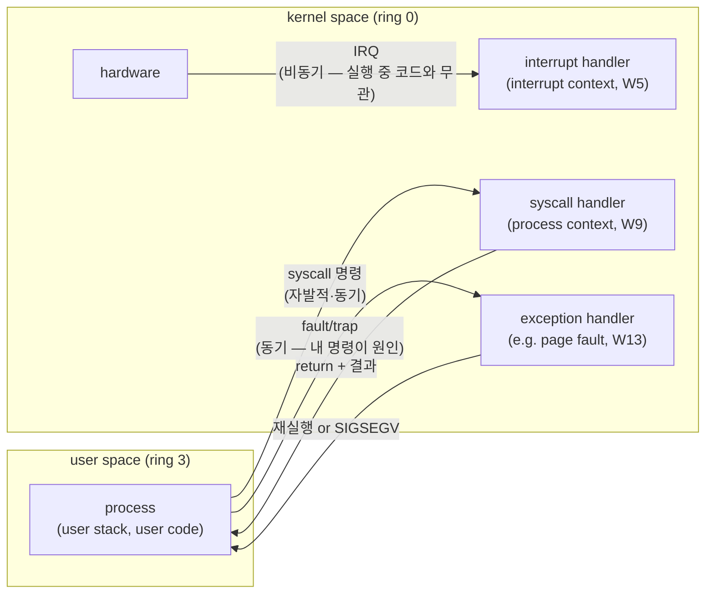
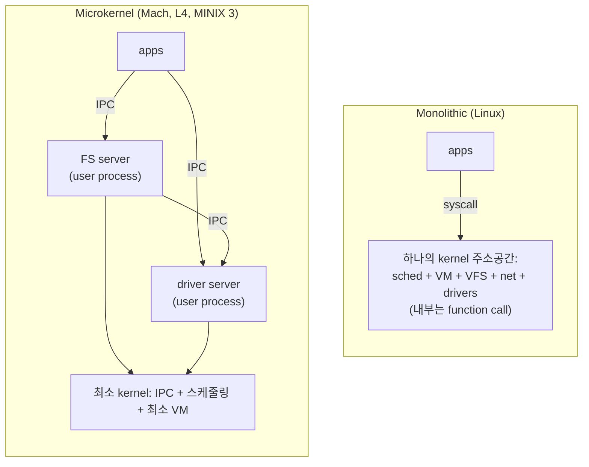
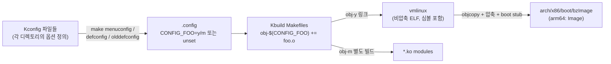
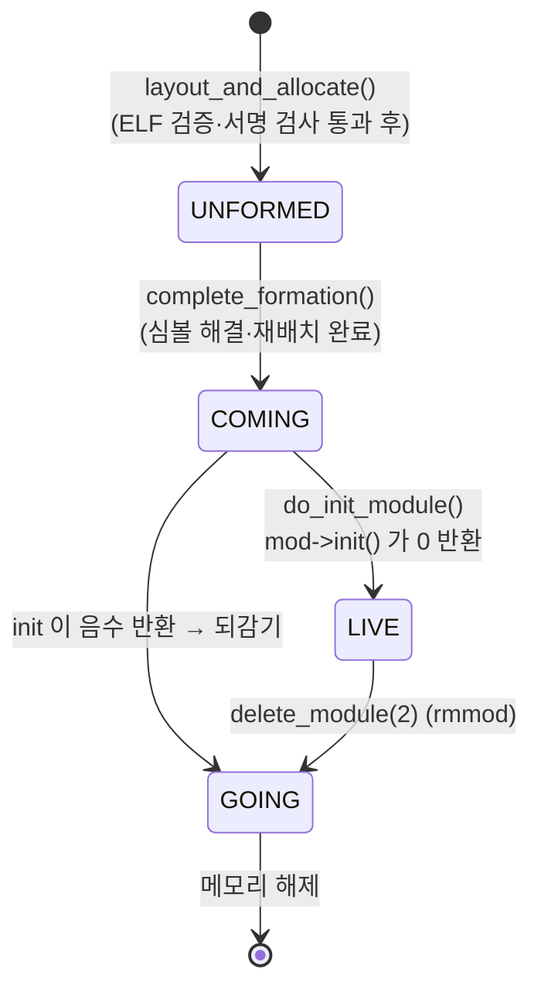
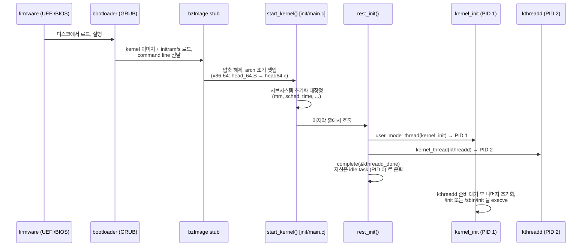

# Week 01 — Introduction to Linux

이 과목의 실체는 Linux kernel programming 이다. 첫 주는 그 전장(戰場)의 지도를 그린다: **kernel 과 userspace 를 가르는 경계가 하드웨어적으로 무엇인지**, 그 경계 위에서 벌어진 가장 유명한 설계 논쟁(monolithic vs microkernel)에서 Linux 가 어느 편에 서서 왜 이겼는지, 그리고 그 결과물인 소스 트리를 어떻게 빌드하고(`Kconfig`/`Kbuild`), 어떻게 일부만 갈아 끼우고(loadable module), 어떻게 읽는지(elixir, coding style)를 다룬다.

> 소스 인용은 전부 v6.12 LTS 기준 (`elixir.bootlin.com/linux/v6.12/source/<path>`). 교재(LKD 3e)는 kernel 2.6.34 기준이라 달라진 부분은 **Modern kernel note** 로 명시한다. 실습 환경 셋업은 [Week 00 — Lab Setup](../00-lab-setup/README.md) 이 전제다.

## Learning goals

이 장을 마치면 다음을 할 수 있어야 한다:

- kernel mode 와 user mode 의 차이를 하드웨어 레벨(x86 privilege level, 페이지 테이블의 U/S 비트)에서 정의하고, **mode switch** 와 **context switch** 를 혼동 없이 구분할 수 있다.
- userspace 코드가 커널로 진입하는 세 가지 경로(system call, interrupt, exception)를 나열하고, 각 진입의 트리거가 누구인지(자발적/비동기/동기) 설명할 수 있다.
- monolithic kernel 과 microkernel 의 구조 차이를 그림으로 그리고, 성능(IPC 비용) vs isolation 트레이드오프를 Liedtke 의 측정치를 근거로 정량적으로 논증할 수 있다.
- Linux(monolithic + modules), Mach, macOS/XNU(hybrid) 를 이 스펙트럼 위에 정확히 배치할 수 있다.
- v6.12 소스 트리의 top-level 디렉토리 각각의 역할을 말하고, 주어진 기능(예: scheduler, ext4)이 어느 디렉토리에 있는지 짚을 수 있다.
- `Kconfig`(무엇을 넣을지 결정) 와 `Kbuild`(어떻게 컴파일할지 결정) 의 역할 분담, `.config` 의 `y/m/n` 3값 의미, `vmlinux` 와 `bzImage` 의 차이를 설명할 수 있다.
- module 의 라이프사이클(`insmod` → `finit_module(2)` → `load_module()` → `MODULE_STATE_LIVE` → `rmmod`)을 단계별로 서술하고, 각 단계에서 로드가 거부되는 조건(서명, vermagic, 심볼, license)을 댈 수 있다.
- `EXPORT_SYMBOL` vs `EXPORT_SYMBOL_GPL` 의 차이와 license taint 의 전파 규칙(`inherit_taint`)을 v6.12 코드 기준으로 설명할 수 있다.
- 부팅 흐름(bootloader → `start_kernel()` → `rest_init()` → PID 1/PID 2)을 순서대로 서술하고, "왜 kernel_init 을 kthreadd 보다 먼저 만드는가" 같은 순서 제약의 이유를 댈 수 있다.
- 커널 코드를 읽는 실전 기법(elixir identifier 검색, 로그 문자열 `git grep`, goto error handling 관용구)을 사용할 수 있고, mainline/stable/LTS 릴리스 모델을 설명할 수 있다.

## Why this matters

1. **경계가 모든 것의 전제다.** 이후 모든 주차는 "경계의 어느 쪽에서 실행 중인가"를 끊임없이 묻는다. syscall(W9)은 경계를 건너는 공식 통로이고, interrupt(W5–6)는 경계를 무시하고 뛰어드는 비동기 진입이며, `copy_from_user`(W9)·kernel stack 16 KiB 제약(W2)·GFP_KERNEL vs GFP_ATOMIC(W11) 전부가 이 경계의 파생물이다.
2. **module 은 이 과목의 실습 수단 그 자체다.** 우리는 매주 커널을 재빌드하는 대신 module 을 짜서 커널 안으로 코드를 들여보낸다. module 이 어떻게 로드되고 언제 거부되는지 모르면 lab 이 막힐 때 디버깅을 못 한다.
3. **설계 논쟁은 죽지 않았다.** monolithic vs microkernel 은 1992년 flame war 가 아니라 현재진행형 트레이드오프다 — 당장 이 강의를 읽는 macOS 는 Mach 의 후손(XNU)이고, Android 스마트폰의 baseband 나 보안 엔클레이브에는 L4 계열이 돈다. "왜 Linux 는 이렇게 생겼나"에 답할 수 있어야 이후 주차에서 "왜 이 코드가 이렇게 짜였나"에 답할 수 있다.

---

## 1. The boundary: kernel space vs user space

**Kernel** 은 하드웨어 자원(CPU 시간, 메모리, 디바이스)을 관리하고 프로세스에게 추상화된 인터페이스를 제공하는, 항상 메모리에 상주하는 특권 소프트웨어다 (LKD ch1). "특권"은 은유가 아니라 하드웨어 기능이다:

- **CPU privilege level.** x86 은 ring 0–3 네 단계를 제공하지만 Linux 는 두 개만 쓴다: **ring 0 = kernel mode, ring 3 = user mode** (ULK ch1). 특권 명령(`cli` 로 인터럽트 끄기, CR3 페이지 테이블 교체, I/O 포트 접근 등)은 ring 0 에서만 실행된다. user 코드가 시도하면 CPU 가 예외(#GP)를 일으킨다.
- **주소공간 보호.** 페이지 테이블 엔트리의 **U/S(User/Supervisor) 비트**가 페이지 단위로 접근 등급을 정한다. 커널 영역 페이지는 supervisor 전용으로 매핑되어, user mode 에서 커널 주소를 읽기만 해도 page fault 다. 반대로 커널은 (원칙적으로) 모든 것을 할 수 있다 — 그래서 커널 버그는 프로세스 crash 가 아니라 시스템 전체의 oops/panic 이 된다.

같은 프로세스가 두 세계를 오간다는 점이 중요하다. `read()` 를 호출한 프로세스는 user mode 에서 실행되다가, syscall 로 **같은 프로세스인 채로** kernel mode 에 들어가 커널 코드(자기 kernel stack 위에서)를 실행하고 돌아온다. 이를 "커널이 process context 에서 실행된다"고 부른다 (LKD ch1). 이와 달리 interrupt 는 어느 프로세스의 요청도 아니므로 interrupt context 라는 별도 문맥에서 처리된다 (W5).

### Mode switch ≠ context switch

혼동 금지. 이 구분은 시험 단골이다:

| | mode switch | context switch |
|---|---|---|
| 무엇이 바뀌나 | 같은 task 의 privilege level (ring 3 ↔ 0) | CPU 를 점유한 task 자체 |
| 트리거 | syscall / interrupt / exception | scheduler 의 결정 (`__schedule`, W4) |
| 주소공간 | 그대로 (커널 영역이 보이게 될 뿐) | 다른 task 면 페이지 테이블 교체(CR3) |
| 빈도 | syscall 마다 전환 2회 (왕복 1회) | 수 ms granularity (보통) |

mode switch 의 비용: 직접 비용은 CPU 가 특권 전환·스택 전환·레지스터 저장을 하는 수백 cycle 수준이고, 그보다 **간접 비용 — 커널 코드/데이터가 cache·TLB·branch predictor 를 오염시켜 복귀 후 user 코드가 느려지는 것 — 이 더 클 수 있다** (Soares & Stumm, FlexSC, OSDI'10). Meltdown 대응 KPTI(4.15+) 이후 경계 넘기가 더 비싸졌다는 보정은 W9 에서.

### 커널로 들어가는 세 개의 문



1. **System call** — 프로세스가 자발적으로 요청. x86-64 는 `syscall` 명령 하나로 진입한다. 경로 상세(`entry_SYSCALL_64`, `sys_call_table`)는 W9 에서 해부한다.
2. **Interrupt** — 디바이스가 비동기로 CPU 를 붙잡는다. 지금 실행 중인 코드와 아무 관련이 없다 (W5–6).
3. **Exception** — 실행 중인 명령 자체가 일으키는 동기 이벤트. page fault 가 대표 (W13).

userspace 에서 커널 기능을 쓰는 다른 길은 **없다**. `printf` 도 결국 `write(2)` 로, `malloc` 도 결국 `brk`/`mmap(2)` 로 수렴한다 — libc 는 syscall 의 편의 포장일 뿐이다.

## 2. Monolithic vs microkernel: the war Linux won (and didn't)

운영체제 서비스(scheduler, VM, FS, driver, network stack)를 어디에 둘 것인가:



- **Monolithic**: 모든 서비스가 하나의 커널 주소공간, 하나의 특권 레벨에서 돈다. 서브시스템 간 호출은 **함수 호출** — 경계 넘기가 없다. 대가: 어느 한 드라이버의 버그가 전체 커널을 죽일 수 있고(공유 주소공간), 코드베이스가 거대해진다.
- **Microkernel**: 커널에는 최소 기능(IPC, 스케줄링, 최소한의 메모리 관리)만 남기고 FS·driver 등은 **user mode 의 서버 프로세스**로 쫓아낸다. 서버 간 통신은 **message passing(IPC)** — 서버 하나가 죽어도 재시작하면 되고(isolation), 각 서버는 최소 권한만 갖는다. 대가: monolithic 에서 함수 호출 한 번이던 것이 IPC 왕복 + mode switch + (주소공간이 다르면) context switch 가 된다 (LKD ch1).

### Worked example 1 — IPC 비용으로 논쟁을 정량화하기

"파일 한 블록 읽기"가 FS 서버와 disk driver 서버를 거친다고 하자. monolithic 은 경계 넘기가 syscall 왕복 1회뿐이다:

$$T_{\text{mono}} = 2\,t_{\text{mode}} + \sum t_{\text{func}} \approx 2\,t_{\text{mode}}$$

microkernel 은 app→FS, FS→driver 각각이 IPC 왕복이다. 서비스 체인 길이를 $k$ (여기선 2), IPC 편도 비용을 $t_{\text{IPC}}$ 라 하면:

$$T_{\text{micro}} \approx 2k \cdot t_{\text{IPC}}, \qquad t_{\text{IPC}} = t_{\text{mode switch}} + t_{\text{addr-space switch}} + t_{\text{msg copy}} + t_{\text{sched}}$$

숫자를 넣어보자. Liedtke 의 측정(SOSP'93, i486-DX50 50 MHz): **Mach 의 8-byte 메시지 IPC 편도(one-way) = 115 µs, 자신의 L3 커널 = 5.2 µs — 22배 차이** (논문의 방법론: ping-pong 을 10,000회 실행하고 총 소요 시간을 20,000 으로 나눈다 — 즉 이 수치들은 편도 IPC 비용이다). 같은 하드웨어에서 함수 호출은 sub-µs 이므로, 위 식의 $2k = 4$ 를 곱하면 Mach 시대의 microkernel 은 서비스 체인 하나에 수백 µs ($4 \times 115 = 460\ \mu s$)를 물었다. 1990년대 초 microkernel 성능 악명의 근원이 이 숫자다.

Liedtke 의 논지가 흥미로운 이유는 방향이다: "microkernel 이 원리적으로 느린 게 아니라 **Mach 의 구현이 느린 것**" — IPC 를 커널 설계의 제1원칙으로 삼으면 20배를 회수할 수 있음을 보였고, 이것이 L4 계열(오늘날 seL4 — 최초의 formally verified 범용 커널, Klein et al. SOSP'09)로 이어졌다. 그러나 Linux 가 태어난 1991–92년 시점의 실증 데이터는 microkernel 에 불리했다.

### Tanenbaum–Torvalds (1992) 와 그 이후

1992년 1월 comp.os.minix 에서 Tanenbaum(MINIX 저자)이 "**LINUX is obsolete**" 라는 제목으로 포문을 열었다: monolithic 설계는 1970년대로의 퇴보이고, 이식성도 없다(386 종속). Torvalds 의 응수는 실용주의였다: microkernel 이 "학문적으로 우월"해도 실제로 뜬 성능 좋은 microkernel OS 는 없으며, Linux 는 지금 동작하고 빠르다 (DiBona et al., *Open Sources*, Appendix A 에 전문 수록). 30년 뒤 스코어보드:

- **Linux (monolithic)**: 서버·모바일(Android)·임베디드 지배. 단, 아래 완화책들을 전부 흡수했다.
- **Mach**: 순수 microkernel 로는 실패했지만 **macOS/iOS 의 조상**으로 산다. Apple 의 XNU 는 CMU Mach 를 기반으로 BSD 계층과 C++ driver 프레임워크 IOKit 을 얹은 **hybrid kernel** 이다 (Apple XNU 공식 리포 README). 핵심: Mach 의 task/thread/port 추상화는 유지하되, **BSD 서버를 user process 로 내리지 않고 커널 주소공간 안에 함께 두어** IPC 비용을 회피했다. 즉 macOS 는 "microkernel 의 구조를 가진 monolithic 배치"다. (최근의 DriverKit 은 driver 를 다시 userspace 로 빼는 방향 — 진자는 계속 움직인다.)
- **L4 계열**: 스마트폰 baseband, 보안 격리 실행 환경 등 isolation 이 성능보다 비싼 틈새를 차지했다.

### Loadable module — monolithic 의 최대 약점 두 개를 완화하다

Tanenbaum 비판의 실체는 두 가지였다: ① 거대 단일 이미지(모든 드라이버를 컴파일 타임에 결정해야 함), ② no isolation. Linux 의 **loadable kernel module**(LKM) 은 ①을 정면으로 해결한다 — 오브젝트 코드를 **실행 중에** 커널 주소공간에 링크해 넣고(`insmod`) 뺄 수 있다(`rmmod`). 재부팅도 재빌드도 없이 드라이버를 추가하고, 배포판 커널은 수천 드라이버를 전부 module 로 빌드해두고 감지된 하드웨어 것만 로드한다. 그래서 LKD ch1 은 Linux 를 "modular monolithic" 으로 특징짓는다.

단 ②는 해결하지 **않는다**: 로드된 module 은 커널과 같은 주소공간, 같은 ring 0 에서 돈다. module 의 NULL 역참조는 여전히 커널 전체를 죽인다. isolation 은 microkernel 의 진짜 차별점으로 남아 있다 — Lima VM 에서 lab 을 하는 이유이기도 하다.

## 3. Kernel source tree tour (v6.12)

v6.12 트리의 top-level (전체 목록 — GitHub `torvalds/linux` v6.12 태그에서 확인):

| 디렉토리 | 역할 | 이 과목과의 연결 |
|---|---|---|
| `kernel/` | 코어: scheduler(`kernel/sched/`), fork, signal, time, locking, module loader(`kernel/module/`) | W2–4, 7, 9–10 의 주 무대 |
| `mm/` | 메모리 관리: buddy(`page_alloc.c`), SLUB, vmalloc, page cache(`filemap.c`) | W11–13 |
| `fs/` | VFS 코어(`namei.c`, `dcache.c`)와 구체 fs 들(`fs/ext4/` 등) | W14–15 |
| `arch/` | 아키텍처 종속 코드. `arch/x86/`, `arch/arm64/` 등 — 부팅 asm, entry 코드, 페이지 테이블 조작 | W9 syscall entry |
| `drivers/` | 디바이스 드라이버. **코드량 기준 압도적 최대 디렉토리** | lab module 작성 관례의 출처 |
| `include/` | 공용 헤더. `include/linux/sched.h`(task_struct), `include/uapi/` 는 userspace 에 노출되는 ABI 헤더 | 매주 |
| `init/` | 아키텍처 독립 부팅: `main.c` 의 `start_kernel()`, `init_task.c` | §7 |
| `ipc/` | System V/POSIX IPC (msgqueue, sem, shm) | — |
| `net/` | 네트워크 스택 | — |
| `block/` | block I/O 계층 (blk-mq) | W15 |
| `security/` | LSM 프레임워크 (SELinux, AppArmor) | — |
| `lib/` | 커널판 유틸리티 라이브러리 (문자열, maple tree 등) | W13 |
| `virt/` | KVM 의 아키텍처 독립부 | — |
| `sound/`, `crypto/`, `certs/`, `io_uring/`, `usr/`, `samples/`, `tools/` | 각각 ALSA, 암호화, 서명 키, io_uring, initramfs 생성, 예제, userspace 도구(perf 등) | — |
| `rust/` | Rust 지원 인프라 | Modern note 참조 |
| `Documentation/` | 공식 문서 (docs.kernel.org 의 소스) | 항상 1차 참조 |
| `scripts/` | 빌드·검사 도구 (`checkpatch.pl`, Kconfig 처리기) | §8 |

top-level 파일: `Makefile`(최상위 빌드 진입점 — 버전 번호도 여기 있다), `Kbuild`, `Kconfig`(메뉴 루트), `MAINTAINERS`(서브시스템별 관리자 명부 — 패치를 누구에게 보낼지), `COPYING`(GPLv2).

**Modern kernel note:** LKD 시절 단일 파일이던 것들이 디렉토리로 분해된 것이 눈에 띈다 — `kernel/sched.c` → `kernel/sched/`, `kernel/module.c` → `kernel/module/`(main.c 외 서명·kallsyms 등 분리). 그리고 6.1 부터 **Rust 지원이 머지**되어 in-tree 언어가 C 단일이 아니다 (`rust/`, 일부 드라이버). 이 과목은 C 만 다룬다.

방향 감각을 위한 경험칙: **"정책·자료구조는 `kernel/`·`mm/`·`fs/`, 하드웨어 접촉면은 `arch/`·`drivers/`, 둘의 계약은 `include/`"**. 어떤 함수가 arch 디렉토리와 공용 디렉토리에 같은 이름으로 보이면(예: `copy_thread`), 공용 코드가 arch hook 을 호출하는 구조다.

## 4. Building the kernel: Kconfig and Kbuild

커널 빌드는 두 단계 질문에 답하는 것이다: **무엇을 넣을가**(Kconfig), **어떻게 컴파일·링크할까**(Kbuild). (참고: <https://docs.kernel.org/kbuild/>)



### Kconfig — 옵션의 언어

각 디렉토리의 `Kconfig` 파일이 옵션을 선언한다. 핵심 타입이 **tristate** 다:

```
config EXT4_FS
        tristate "The Extended 4 (ext4) filesystem"
        select JBD2 ...
```

- `y` — 커널 이미지에 **built-in**
- `m` — **module** 로 빌드 (`.ko`)
- `n`(unset) — 아예 빌드 안 함

`depends on` 은 "이 옵션이 보이려면/켜지려면 선행 조건", `select` 는 "이걸 켜면 저것도 강제로 켠다". 결과는 트리 루트의 **`.config`** 파일 한 장으로 저장된다 (`CONFIG_EXT4_FS=m` 또는 `# CONFIG_EXT4_FS is not set`). 배포판 커널의 `.config` 스냅샷이 `/boot/config-$(uname -r)` 로 설치된다 — lab B 에서 직접 읽는다.

`.config` 를 만드는 대표 인터페이스:

| 명령 | 하는 일 |
|---|---|
| `make menuconfig` | ncurses 메뉴에서 대화식 편집 |
| `make defconfig` | 해당 arch 의 기본 config (`arch/<arch>/configs/*_defconfig`) 생성 |
| `make olddefconfig` | 기존 `.config` 유지 + 새로 생긴 옵션은 기본값 — **커널 버전 올릴 때의 표준 수순** |
| `make localmodconfig` | 현재 로드된 module 만 `m` 으로 남겨 배포판 config 를 대폭 축소 — 빌드 시간 단축의 정석 |

### Kbuild — 한 줄의 마법

각 디렉토리의 Makefile 은 거의 이 한 줄 패턴이다:

```make
obj-$(CONFIG_EXT4_FS) += ext4/
obj-$(CONFIG_HELLO)   += hello.o
```

`CONFIG_FOO` 가 `y` 면 `obj-y`(vmlinux 에 링크), `m` 이면 `obj-m`(module 로), unset 이면 어느 목록에도 안 들어간다. **같은 소스가 세 운명을 모두 소화한다** — §5 의 `module_init` 이중 정의가 이를 코드 레벨에서 받쳐준다. 우리 lab 의 Makefile 이 쓰는 `make -C $(KDIR) M=$(CURDIR) modules` 는 "커널 빌드 시스템을 빌려 와서(external build) 내 디렉토리를 `obj-m` 으로 취급해 달라"는 관용구다.

### vmlinux vs bzImage

- **`vmlinux`** — 트리 루트에 생기는 **비압축 ELF 실행 파일**. 심볼이 살아 있어 디버깅·`objdump` 의 대상. 그러나 bootloader 가 직접 로드하는 물건이 아니다.
- **`bzImage`** (`arch/x86/boot/bzImage`) — vmlinux 를 objcopy 로 벗기고 압축한 뒤 실모드 setup 코드와 self-extracting stub 을 붙인 **부팅용 이미지**. 이름은 bzip2 가 아니라 "**b**ig **z**Image" — 메모리 상위에 로드되어 구식 zImage 의 512 KiB 급 제한을 벗어났다는 역사적 명명이다 (`Documentation/arch/x86/boot.rst`). arm64 는 압축 stub 없이 `arch/arm64/boot/Image`(.gz) 를 쓴다 — Lima VM(aarch64)의 `/boot/vmlinuz-*` 는 이것의 압축본이다.

전형적 빌드 시퀀스: `make olddefconfig && make -j$(nproc) && sudo make modules_install && sudo make install`. modules_install 은 `.ko` 들을 `/lib/modules/<version>/` 아래에 설치하고 `depmod` 로 의존성 DB(`modules.dep`)를 만든다.

## 5. Loadable modules: lifecycle, symbols, taint

### 라이프사이클 개관

module 소스의 최소 골격은 lab 의 `hello_param.c` 다: `module_init(fn)` / `module_exit(fn)` 으로 진입·퇴장 함수를 등록하고 `MODULE_LICENSE()` 를 선언한다. `module_init` 의 정의는 빌드 모드에 따라 갈린다 (v6.12 `include/linux/module.h`):

```c
#ifndef MODULE  /* built-in (obj-y) 일 때 */
#define module_init(x)  __initcall(x);       /* 부팅 중 do_initcalls() 가 호출 */
#else           /* module (obj-m) 일 때 */
#define module_init(initfn)                                     \
        int init_module(void) __copy(initfn)                    \
                __attribute__((alias(#initfn)));                /* 표준 이름의 alias */
#endif
```

built-in 이면 init 함수는 부팅 initcall 로 흡수되고 `module_exit` 는 **아무 효과가 없다**(빠질 수 없으므로). module 이면 `init_module`/`cleanup_module` 이라는 표준 심볼이 되어 로더가 찾는다. `__init` 마킹된 코드는 한 번 쓰고 버려진다 — built-in 은 부팅 완료 시(`Freeing unused kernel image memory`), module 은 init 성공 직후(`do_init_module()` 이 `MOD_INIT_TEXT` 등을 해제) 메모리에서 사라진다.

로드 도구는 둘이다: **`insmod`** 는 지정한 `.ko` 파일 하나를 그대로 커널에 넘긴다. **`modprobe`** 는 `modules.dep` 을 참고해 **의존 module 을 먼저 로드**하고 이름만으로 `/lib/modules/$(uname -r)/` 에서 찾아준다 — 실무 표준은 modprobe, lab 처럼 방금 빌드한 파일을 꽂을 땐 insmod.

### `load_module()` — 커널 쪽에서 벌어지는 일

`insmod` 는 `finit_module(2)` syscall 로 fd 를 넘긴다. 이후 v6.12 `kernel/module/main.c` 의 `load_module()` 이 아래 상태 기계를 민다:



단계별 (함수 이름은 전부 v6.12 실제 코드):

1. **`module_sig_check()`** — 서명 검사. `CONFIG_MODULE_SIG_FORCE` 면 서명 불량 시 즉시 거부, 아니면 로드는 하되 taint (`TAINT_UNSIGNED_MODULE`, 'E').
2. **`elf_validity_cache_copy()`** — `.ko` 는 재배치 가능한 ELF 오브젝트다. 헤더·섹션 무결성 검증. 바로 다음 단계인 **`check_modinfo()`**(`early_mod_check()` 경유)가 `.modinfo` 섹션의 **vermagic** 문자열(빌드 대상 커널 버전 + SMP/preempt 여부 등, lab 의 `modinfo` 출력 참조)을 실행 중 커널과 비교해, 다르면 `-ENOEXEC` 로 거부 — "커널 6.8 헤더로 빌드한 .ko 를 6.10 커널에 꽂을 수 없다"의 구현이 이것이다.
3. **`layout_and_allocate()`** — 최종 메모리 레이아웃 결정·할당, `MODULE_STATE_UNFORMED` 로 module 목록에 등록. 이어 **`module_augment_kernel_taints()`**: in-tree 빌드가 아니면 `loading out-of-tree module taints kernel.` 경고와 함께 `TAINT_OOT_MODULE`('O'), license 검사(아래).
4. **심볼 해결·재배치** — module 이 참조하는 미해결 심볼(`printk` 등)을 커널과 기 로드 module 들의 export 테이블에서 찾아(`resolve_symbol()`) 주소를 박아 넣는다. 하나라도 못 찾으면 `Unknown symbol` 로 거부.
5. **`parse_args()`** — `insmod foo.ko howmany=3` 의 파라미터를 `module_param` 선언에 따라 파싱해 변수에 대입. **init 실행 전**이다 — init 함수가 파라미터 값을 볼 수 있는 이유.
6. **`do_init_module()`** — `do_one_initcall(mod->init)`. **0 반환 = 성공** → `MODULE_STATE_LIVE`, init 섹션 해제. 음수 반환 → GOING 으로 되감아 로드 자체가 실패한다 (lab A-2 에서 재현).

퇴장: `rmmod` → `delete_module(2)`. refcount(`/sys/module/<name>/refcnt`)가 0 이 아니면 — 누가 쓰고 있으면 — 거부된다. 성공하면 `MODULE_STATE_GOING` 으로 바꾸고 `mod->exit()` 호출 후 해제.

### Worked example 2 — `sudo insmod hello_param.ko howmany=3` 의 전체 여정

1. `insmod` 가 `.ko` 를 열어 `finit_module(fd, "howmany=3", 0)` 호출. **여기까지가 userspace.**
2. 서명 검사: 우리 module 은 미서명 — Lima VM 커널은 SIG_FORCE 가 아니므로 통과하되 'E' taint 후보.
3. ELF 검증 + vermagic: VM 안에서 VM 커널 헤더로 빌드했으므로 일치. (Docker 로 빌드한 .ko 를 VM 에 꽂으면 여기서 죽는다 — lab README 참조.)
4. `layout_and_allocate` → UNFORMED. 이어 `module_augment_kernel_taints()`: out-of-tree 이므로 dmesg 에 taint 경고 1회, 그리고 Ubuntu 커널은 `CONFIG_MODULE_SIG=y` 라 미서명 .ko 에 'E' 도 실제로 붙는다 (`cat /proc/sys/kernel/tainted` → 12288 = 'O'(bit 12, 4096) + 'E'(bit 13, 8192)).
5. license = "GPL" → GPL-compatible → proprietary taint 없음. `pr_info`/`pr_err` 등이 참조하는 커널 심볼 해결·재배치 → COMING.
6. `parse_args` 가 `howmany=3` 을 int 로 파싱해 static 변수에 대입. sysfs 노드 `/sys/module/hello_param/parameters/howmany` 생성 (perm 0644).
7. `do_one_initcall(hello_param_init)` — 범위 검사 통과, `pr_info` 3회. 0 반환 → **LIVE**. `__init` 텍스트 해제.
8. `insmod` 에 0 반환. `lsmod | head` 에 등장. 이후 `rmmod` 시 `hello_param_exit` 가 GOING 상태에서 실행된다.

만약 `howmany=99` 였다면 7 에서 `-EINVAL` → 커널이 module 을 되감고 syscall 이 실패 — **init 의 반환값이 로드 성공 여부를 최종 결정한다.**

### EXPORT_SYMBOL, license, and taint

커널의 모든 심볼이 module 에 보이는 게 아니다. **명시적으로 export 된 심볼만** 링크 대상이다 (v6.12 `include/linux/export.h`):

```c
#define EXPORT_SYMBOL(sym)      _EXPORT_SYMBOL(sym, "")      /* 누구나 */
#define EXPORT_SYMBOL_GPL(sym)  _EXPORT_SYMBOL(sym, "GPL")   /* GPL-compatible 만 */
```

집행 지점은 `resolve_symbol()` 이다: 요청자 module 이 proprietary taint 를 가지면 `gplok = false` 로 심볼을 찾고, GPL-only 심볼은 그 요청에 대해 숨겨진다. license 판정은 `MODULE_LICENSE()` 문자열로 한다 — GPL-compatible 목록은 `include/linux/license.h` 에 하드코딩되어 있다 ("GPL", "GPL v2", "GPL and additional rights", "Dual BSD/GPL", "Dual MIT/GPL", "Dual MPL/GPL"). 그 외(또는 **선언 누락 — "unspecified" 취급**)는:

```c
/* kernel/module/main.c, module_license_taint_check() (v6.12) */
if (!license_is_gpl_compatible(license)) {
        if (!test_taint(TAINT_PROPRIETARY_MODULE))
                pr_warn("%s: module license '%s' taints kernel.\n", mod->name, license);
        add_taint_module(mod, TAINT_PROPRIETARY_MODULE, LOCKDEP_NOW_UNRELIABLE);
}
```

**taint** 는 "이 커널의 상태를 upstream 이 보증할 수 없다"는 비트 집합이다 (`/proc/sys/kernel/tainted`; 문서: `Documentation/admin-guide/tainted-kernels.rst`). oops 리포트에 taint 플래그가 찍히고, taint 된 리포트는 커널 개발자들이 대개 무시한다 — proprietary 코드가 커널 메모리를 밟았을 가능성을 배제할 수 없기 때문. 주요 비트: 'P'(proprietary), 'O'(out-of-tree — **우리 lab module 도 이건 항상 받는다**), 'E'(unsigned), 'C'(staging). 전염 규칙도 있다: proprietary module 이 export 한 심볼을 쓰는 module 은 taint 를 **상속**한다 (`inherit_taint()`).

이 메커니즘의 본질은 기술이 아니라 **법·정치의 코드화**다: GPL 인 커널에 non-GPL 코드가 얼마나 깊이 결합할 수 있는가의 경계선을, 커뮤니티는 EXPORT_SYMBOL_GPL 이라는 API 표면으로 긋기로 한 것이다.

## 6. Kernel programming is different: the ground rules

module 코드는 C 지만, userspace C 와 규칙이 다르다 (LKD ch1·ch17, LKMPG):

1. **No libc.** `printf`/`malloc`/`abort` 가 없다. 대응물은 `printk`/`kmalloc`(W11)/`BUG()`. 헤더도 `<stdio.h>` 가 아니라 `<linux/...>` 만.
2. **작은 고정 kernel stack.** x86-64 기준 task 당 16 KiB (`THREAD_SIZE`, W2 에서 상세). 자동 확장 없음 — 큰 지역 배열·깊은 재귀 금지. `struct foo big[1024]` 같은 선언이 코드 리뷰에서 잘리는 이유.
3. **No FPU (기본).** 커널은 진입 시 FPU/SIMD 레지스터를 저장하지 않는다 — user 의 것을 밟지 않기 위해. 부동소수점·SSE 를 쓰려면 `kernel_fpu_begin()/end()` 로 명시 구간을 만들어야 하며, 일반 커널 코드는 정수 연산만 쓴다.
4. **자기 보호 없음.** 잘못된 포인터 역참조는 SIGSEGV 로 회수되는 게 아니라 oops(운 좋으면) 또는 panic 이다. 커널 위에는 커널을 지켜줄 소프트웨어가 없다.
5. **동시성이 기본값.** SMP + preemption + interrupt 아래에서 모든 코드가 동시에 밟힐 수 있다 (W10 에서 본격).
6. **이식성·엄격 GNU C.** arch 가 20개 이상이다. 고정 크기 타입(`u32`), endian 헬퍼, `container_of` 같은 GNU 확장 관용구가 표준 어휘다.

### printk and log levels

`printk` 는 커널의 printf 다 — 단, **로그 레벨**이 붙고, 출력이 콘솔이 아니라 커널 링 버퍼로 간다 (`dmesg` 로 조회). 레벨은 0–7, 숫자가 작을수록 급하다: `KERN_EMERG`(0) `KERN_ALERT`(1) `KERN_CRIT`(2) `KERN_ERR`(3) `KERN_WARNING`(4) `KERN_NOTICE`(5) `KERN_INFO`(6) `KERN_DEBUG`(7). 현대 코드는 `printk(KERN_INFO "...")` 대신 축약형 `pr_info()`, `pr_err()` 를 쓰고, 디바이스 드라이버는 `dev_info()` 계열을 쓴다. 콘솔 출력 여부는 `/proc/sys/kernel/printk` 의 첫 값(console_loglevel)과의 비교로 정해진다 — **메시지 레벨 < console_loglevel 이면 콘솔로도 나간다** (lab A-3, B-⑥에서 확인).

## 7. Boot flow: from bootloader to PID 1



단계별 (v6.12 기준):

1. **Firmware → bootloader.** UEFI/BIOS 가 bootloader(GRUB 등)를 올리고, bootloader 가 kernel 이미지와 initramfs 를 메모리에 적재한 뒤 **kernel command line** 을 넘긴다. `root=`, `console=`, `init=` 같은 파라미터가 여기서 온다 — 부팅 후 `/proc/cmdline` 으로 그대로 볼 수 있다 (lab B-②).
2. **Arch 초기화 → `start_kernel()`.** 압축 해제와 최소 CPU/페이지 테이블 셋업(x86-64: `arch/x86/kernel/head_64.S` → `head64.c` 의 `x86_64_start_kernel` → `x86_64_start_reservations`)이 끝나면 아키텍처 독립 세계의 진입점 **`start_kernel()`** (`init/main.c`, `__init __noreturn`) 로 점프한다. 여기서 수백 개의 초기화 호출이 이어진다 — memory allocator, scheduler, timer, console… 이 함수가 이 과목 전체의 목차이기도 하다.
3. **`rest_init()` — 두 갈래 탄생.** `start_kernel()` 의 마지막이 `rest_init()` 이다. 순서가 계약이다: 먼저 `user_mode_thread(kernel_init, ...)` 로 **PID 1** 을, 다음 `kernel_thread(kthreadd, ...)` 로 **PID 2** 를 만든다. 소스 주석이 이유를 박아뒀다 — *"We need to spawn init first so that it obtains pid 1, however the init task will end up wanting to create kthreads, which, if we schedule it before we create kthreadd, will OOPS."* 그래서 `kernel_init` 은 시작하자마자 `kthreadd_done` completion 을 기다리며, `rest_init` 이 kthreadd 생성 후 `complete()` 로 풀어준다. 부팅하던 문맥 자신은 **PID 0 (swapper) — boot CPU 의 idle task** 로 은퇴한다.
4. **PID 1: kernel → user 로의 도약.** `kernel_init()` 은 남은 초기화를 마친 뒤 최초의 user process 로 변신한다. 시도 순서 (v6.12 `init/main.c`): ① initramfs 의 `/init`(`ramdisk_execute_command`) ② command line 의 `init=` 지정값 ③ `/sbin/init` ④ `/etc/init` ⑤ `/bin/init` ⑥ `/bin/sh` — 전부 실패하면 `panic("No working init found. ...")`. 단 예외 둘: `init=` 로 **명시한** 프로그램의 exec 이 실패하면 다음 후보로 넘어가지 않고 즉시 `panic("Requested init %s failed (error %d).")` 하고, `CONFIG_DEFAULT_INIT` 이 설정된 커널은 ②와 ③ 사이에 그 값도 시도한다 (위 fall-through 는 각 후보가 없거나 미지정일 때의 기본 경로다). 성공하면 그 프로그램(현대 배포판은 systemd)이 **모든 user process 의 조상**이 된다. W2 에서 다룰 두 뿌리 — user 세계는 PID 1, kernel thread 세계는 PID 2 — 가 바로 여기서 갈라진 것이다.

**Modern kernel note:** LKD 의 부팅 서술에는 initramfs 가 희미하지만 현대 부팅의 필수 단계다 — root fs 드라이버가 module 인 경우(배포판 표준) 그 module 을 담은 임시 rootfs(initramfs)에서 `/init` 스크립트가 드라이버를 로드하고 진짜 root 로 피벗한다. module 시스템(§5)과 부팅이 맞물리는 지점이다.

## 8. How to read kernel code

이 과목의 절반은 "커널 코드를 두려움 없이 여는 능력"이다. 도구와 문법 관습 양쪽을 갖춘다.

### 도구

- **elixir.bootlin.com** — 브라우저 cross-referencer. identifier(함수/매크로/구조체) 클릭 한 번으로 정의·참조를 오간다. 버전 선택이 되므로 **항상 v6.12 로 고정**해 읽을 것 (교재와 최신 코드의 차이를 스스로 확인하는 습관). 약점: 문자열 검색 불가.
- **`git grep`** — 로컬 트리에서의 만능 검색. 핵심 전략 세 개(lab C 에서 훈련): ① dmesg 로그 문자열로 역추적 (포맷 지정자 앞에서 끊어 검색), ② syscall 은 `SYSCALL_DEFINEn(name` 으로, ③ Kconfig 심볼은 `CONFIG_` 접두사를 떼고 `config NAME` 으로.
- **`MAINTAINERS` + `scripts/get_maintainer.pl`** — 이 파일이 누구 관할인지.

### Coding style 이 알려주는 것 (`Documentation/process/coding-style.rst`)

스타일 문서는 미학이 아니라 **코드를 읽을 때의 기대치**를 정한다:

- **들여쓰기는 탭, 탭은 8칸.** 깊은 중첩이 물리적으로 고통스럽게 만들어 "3단 이상 중첩하지 말라"를 강제하는 장치. 한 줄은 80 컬럼 권장.
- **`goto` 는 error handling 의 표준 관용구다** (문서 §7 "Centralized exiting of functions"). 함수가 자원을 A→B→C 순으로 잡다가 중간에 실패하면, 역순 해제를 label 사다리로 중앙화한다:

```c
	err = alloc_a();
	if (err)
		goto out;
	err = alloc_b();
	if (err)
		goto out_free_a;      /* label 이름은 "무엇을 하는지" — err1: 금지 */
	...
out_free_a:
	free_a();
out:
	return err;
```

C 에 예외·소멸자가 없는 이상 이것이 자원 누수 없는 다중 탈출의 최선이며, `copy_process()` 의 `bad_fork_cleanup_*` 사다리(W2)도, `load_module()` 의 `free_copy:` 계열도 전부 이 패턴이다. "goto 는 악"이라는 교양 수업 격언은 커널 문 앞에서 반납한다.

- **typedef 로 구조체를 감추지 않는다** — `struct task_struct *p` 처럼 실체를 드러낸다. CamelCase 금지.
- **`container_of` 티저**: 커널 자료구조의 만능 관용구. 큰 구조체 안에 박힌 멤버의 포인터에서 구조체 전체를 역산한다(`include/linux/container_of.h`). "왜 그런 게 필요한가"는 W2 의 `list_head` 에서 몸으로 이해하게 된다 — 지금은 lab C-N5 로 정의만 찾아둘 것.

## 9. Kernel development culture and the release model

- **LKML(Linux Kernel Mailing List)** 과 서브시스템 리스트가 개발의 현장이다. 코드는 patch(diff) 를 메일로 보내 리뷰받고, 서브시스템 maintainer 트리를 거쳐 Linus 의 mainline 으로 흘러간다.
- **LWN.net** 은 커널 변화의 사실상 공식 해설지다. 이 과목에서도 "교재 이후 바뀐 것"의 근거를 LWN 기사로 잡는다.
- **릴리스 모델** (`Documentation/process/2.Process.rst`, kernel.org):
  - **mainline**: 2–3개월 주기. 새 버전이 나오면 **2주 merge window** 에 신기능이 쏟아져 들어오고, 닫힌 뒤엔 **-rc1, -rc2, …** 주 단위 안정화만 — 보통 rc6–rc9 에서 정식 릴리스. 버전 번호(6.11 → 6.12 → 6.13)에 기능적 의미는 없다 — 시간이 흐른다는 뜻뿐이다.
  - **stable** (6.12.1, 6.12.2, …): 릴리스 후 stable 팀(Greg KH)이 mainline 의 버그픽스만 backport. 일반 버전은 다음 mainline 릴리스 무렵까지만 유지된다.
  - **LTS(longterm)**: 매년 하나쯤 지정되어 수년간 유지. 2026년 7월 현재 kernel.org 기준 longterm 시리즈는 5.10, 5.15, 6.1, 6.6, **6.12**(2024-11 릴리스, EOL 2028-12 예정), 6.18. **이 과목이 v6.12 를 기준 트리로 쓰는 이유다** — 학기 내내 코드 경로가 안 흔들리고, 실제 배포판(Ubuntu 26.04 계열 포함)이 오래 쓸 커널이다.

과제·실습과의 연결: 우리가 lab 에서 만드는 module 은 전부 "out-of-tree" 다 — mainline 에 없는 코드라는 뜻이고, 그래서 로드하는 순간 'O' taint 가 붙는다(§5). in-tree 로 들어가려면 위 문화의 관문(스타일 검사 `scripts/checkpatch.pl`, 리뷰, maintainer 승인)을 통과해야 한다.

---

## Common misconceptions

1. **"mode switch 가 곧 context switch 다."** 아니다. syscall 진입은 같은 task 가 ring 3→0 으로 바뀌는 mode switch 일 뿐, task 는 그대로다. context switch 는 scheduler 가 다른 task 로 CPU 를 넘기는 것 (W4). syscall 한 번에 context switch 는 0회일 수 있고, mode switch 는 정확히 왕복 1회다.
2. **"커널은 항상 도는 별도의 프로세스다."** 커널은 프로세스가 아니다. syscall/exception 은 **호출한 프로세스의 문맥에서**(process context, 그 task 의 kernel stack 위에서) 실행되고, interrupt 는 어떤 task 의 것도 아닌 interrupt context 에서 실행된다. "커널 프로세스가 응답한다"는 그림은 microkernel 서버 모델에 가깝다.
3. **"Linux 는 module 을 지원하니 microkernel 적 설계다."** module 은 **로드 시점**의 유연성이지 **isolation** 이 아니다. 로드된 module 은 커널과 같은 주소공간·같은 ring 0 에서 돌며, module 버그는 커널 전체를 죽인다. microkernel 의 본질(서비스별 주소공간 격리 + IPC)과 무관하다.
4. **"macOS 는 microkernel 이라 느리고 Linux 는 monolithic 이라 빠르다."** XNU 는 Mach 기반이지만 BSD 계층을 **커널 주소공간 안에** 두어 IPC 비용을 회피한 hybrid 다. macOS 의 syscall 은 microkernel 식 message passing 이 아니다.
5. **"`make menuconfig` 에서 y 와 m 은 취향 차이다."** built-in(y)은 부팅 시점부터 존재해야 하는 것(root fs 드라이버가 initramfs 없이 필요할 때 등)에 강제되고, module(m)은 로드/언로드 유연성·이미지 크기·개발 iteration 속도에서 이긴다. 그리고 built-in 이면 `module_exit` 코드는 실행될 일이 없다.
6. **"`MODULE_LICENSE` 는 형식적 메타데이터다."** 실행 의미론이 있다: GPL-incompatible(또는 누락) 선언은 kernel taint 를 일으키고 `EXPORT_SYMBOL_GPL` 심볼 접근을 **막는다** (`resolve_symbol()` 의 `gplok`). 링크 가능한 API 표면 자체가 license 문자열로 달라진다.
7. **"module init 함수가 실패해도 module 은 로드돼 있다."** init 이 음수를 반환하면 커널이 COMING→GOING 으로 되감아 **로드 자체가 실패한다** (`do_init_module()` 의 fail 경로). `lsmod` 에 남지 않는다.
8. **"PID 1 은 커널이 특별 취급으로 만든 userspace 프로그램이다."** 절반만 맞다. PID 1 은 **커널 스레드로 태어나서**(`user_mode_thread(kernel_init, ...)`) 커널 초기화의 마지막 단계를 수행한 뒤 `/sbin/init` 등을 execve 하며 user process 로 **변신**한다. "커널 → user 로의 도약"이 execve 한 번에 담겨 있다.
9. **"goto 를 쓰는 커널 코드는 낡은 저품질 코드다."** 반대다 — 공식 coding style §7 이 **권장하는** 중앙화된 에러 탈출 관용구이며, 자원 역순 해제를 컴파일러 지원 없이 안전하게 표현하는 표준 수단이다.

## Glossary

- **kernel mode / user mode** — CPU privilege states (x86 ring 0 / ring 3); privileged instructions and supervisor-mapped pages are accessible only in kernel mode.
- **mode switch** — a privilege-level transition (user↔kernel) of the *same* task, triggered by syscall, interrupt, or exception.
- **context switch** — the scheduler replacing the running task on a CPU (W4).
- **process context** — kernel code executing on behalf of a specific task (e.g., during a syscall), on that task's kernel stack.
- **monolithic kernel** — all OS services in one kernel address space; internal calls are function calls (Linux).
- **microkernel** — minimal kernel (IPC, scheduling); services run as user-space servers communicating via message passing (Mach, L4).
- **hybrid kernel** — microkernel-derived structure with services co-located in the kernel address space to avoid IPC cost (XNU/macOS).
- **IPC (inter-process communication)** — message passing between address spaces; the dominant cost term of microkernel designs.
- **loadable kernel module (LKM)** — object code (`.ko`, relocatable ELF) linked into the running kernel at runtime via `insmod`/`modprobe`.
- **Kconfig** — the configuration language/system defining build options; produces `.config`.
- **tristate** — Kconfig option type with values y (built-in), m (module), n (excluded).
- **Kbuild** — the kernel's make infrastructure; `obj-$(CONFIG_FOO) += foo.o` routes objects to vmlinux or module builds.
- **vmlinux** — the uncompressed ELF kernel image with symbols, at the build-tree root; used for debugging, not booting.
- **bzImage** — x86 bootable image: setup stub + self-extracting compressed kernel ("big zImage"; arm64 uses `Image`).
- **module_init / module_exit** — macros registering a module's entry/exit functions; expand to an initcall when built-in, to `init_module`/`cleanup_module` aliases when modular.
- **__init** — section annotation for one-shot initialization code, freed after boot (built-in) or after successful module init.
- **vermagic** — version-magic string embedded in a `.ko`; must match the running kernel or loading fails.
- **EXPORT_SYMBOL / EXPORT_SYMBOL_GPL** — macros making a kernel symbol linkable by modules; the `_GPL` variant is hidden from GPL-incompatible modules.
- **taint** — kernel state flags (`/proc/sys/kernel/tainted`) recording conditions (proprietary/out-of-tree/unsigned module, …) that make bug reports unsupportable upstream.
- **modprobe** — module loader resolving dependencies via `modules.dep`; `insmod` loads exactly one given file.
- **initramfs** — temporary early-boot root filesystem (loaded by the bootloader) whose `/init` loads modules needed to mount the real root.
- **start_kernel()** — architecture-independent kernel entry point (`init/main.c`) performing subsystem initialization; ends in `rest_init()`.
- **rest_init()** — creates kernel_init (PID 1) then kthreadd (PID 2); the boot context retires as the idle task (PID 0, swapper).
- **PID 1 (init)** — first user process; ancestor of all user processes; the kernel panics if no init can be executed.
- **printk / log level** — kernel logging into the ring buffer with priorities 0 (KERN_EMERG) to 7 (KERN_DEBUG); console output depends on console_loglevel.
- **mainline / stable / LTS** — Linus's development tree (2–3 month cycle: 2-week merge window + rc series); bugfix-only backport series; long-maintained series (e.g., v6.12, EOL Dec 2028).
- **LKML** — the Linux kernel mailing list, where patches are posted and reviewed.
- **elixir** — web cross-referencer (elixir.bootlin.com) for identifier definitions/references across kernel versions.

## References

- Robert Love, *Linux Kernel Development*, 3rd ed., ch. 1–2 (kernel/user 구분, monolithic vs microkernel, 소스 트리, 빌드), ch. 17 "Devices and Modules" (module 라이프사이클 — `kernel/module.c` 시절 서술은 본문에서 v6.12 로 보정).
- Bovet & Cesati, *Understanding the Linux Kernel*, 3rd ed., ch. 1 (privilege level, process/kernel mode).
- The Linux Kernel Module Programming Guide (LKMPG) — <https://sysprog21.github.io/lkmpg/> (hello module, module_param, printk — lab A 의 원형).
- Linux v6.12 source (본문에서 직접 인용·검증):
  - `kernel/module/main.c` (`load_module`, `module_license_taint_check`, `module_augment_kernel_taints`, `resolve_symbol`/`gplok`, `inherit_taint`, `do_init_module`, MODULE_STATE_*) — <https://elixir.bootlin.com/linux/v6.12/source/kernel/module/main.c>
  - `include/linux/module.h` (`module_init` 이중 정의), `include/linux/export.h` (`EXPORT_SYMBOL`/`_GPL`), `include/linux/license.h` (`license_is_gpl_compatible`)
  - `init/main.c` (`start_kernel`, `rest_init`, `kernel_init` 의 init 시도 순서와 panic) — <https://elixir.bootlin.com/linux/v6.12/source/init/main.c>
  - top-level 디렉토리 구성 — <https://github.com/torvalds/linux/tree/v6.12>
- kernel.org Documentation: kbuild — <https://docs.kernel.org/kbuild/>; 개발 프로세스·릴리스 사이클 — <https://docs.kernel.org/process/2.Process.html>; coding style — <https://docs.kernel.org/process/coding-style.html>; tainted kernels — <https://docs.kernel.org/admin-guide/tainted-kernels.html>; x86 boot — <https://docs.kernel.org/arch/x86/boot.html>
- kernel.org releases (mainline/stable/longterm 정의, LTS 표) — <https://www.kernel.org/category/releases.html>
- J. Liedtke, "Improving IPC by Kernel Design", SOSP'93 — L3 5.2 µs vs Mach 115 µs (8-byte msg, one-way, i486-DX50) — <https://dl.acm.org/doi/10.1145/168619.168633> (PDF: <https://cgi.cse.unsw.edu.au/~cs9242/18/papers/Liedtke_93.pdf>)
- Soares & Stumm, "FlexSC: Flexible System Call Scheduling with Exception-Less System Calls", OSDI'10 (syscall 의 직접/간접 비용 구분).
- G. Klein et al., "seL4: Formal Verification of an OS Kernel", SOSP'09 (L4 계열의 현재).
- Tanenbaum–Torvalds debate (1992, comp.os.minix) — DiBona, Ockman, Stone (eds.), *Open Sources: Voices from the Open Source Revolution*, O'Reilly 1999, Appendix A — <https://www.oreilly.com/openbook/opensources/book/appa.html>
- Apple, XNU kernel README (Mach + BSD + IOKit hybrid 구성) — <https://github.com/apple-oss-distributions/xnu>
