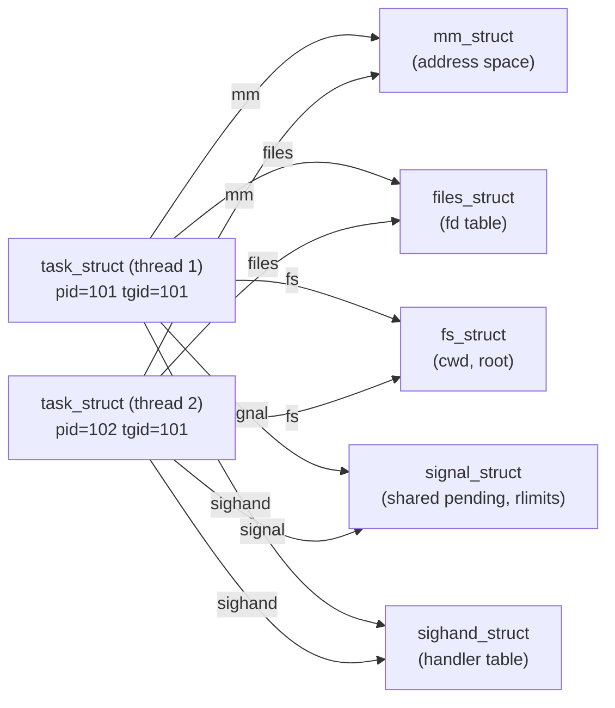
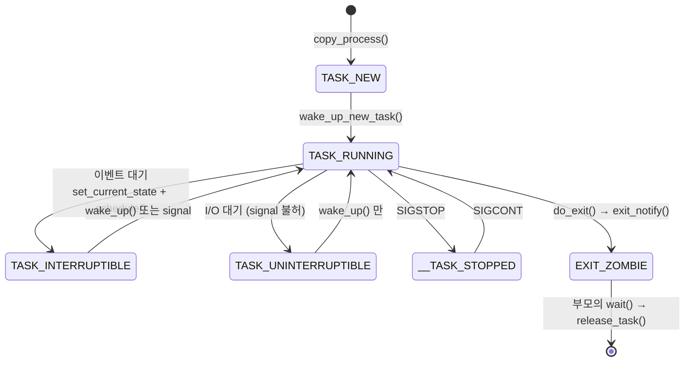
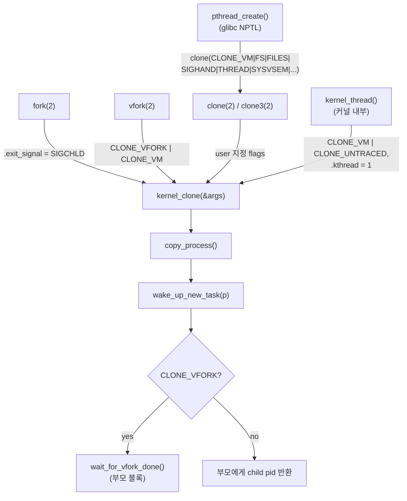

# Week 02 — Linux Process Programming (1)

커널이 process 를 어떻게 표현하고(`task_struct`), 어떻게 낳고(`kernel_clone()`/`copy_process()`), 어떻게 죽이는지(exit/zombie/wait)를 v6.12 소스 기준으로 따라간다. 이 장의 결론을 한 문장으로 먼저 말하면: **Linux 커널에는 "thread" 라는 별도 개체가 없다. 모든 실행 단위는 `task_struct` 하나이고, process 와 thread 의 차이는 오직 clone 시 어떤 자원을 공유했는가(CLONE_* flags)뿐이다.**

> 소스 인용은 전부 v6.12 LTS 기준 (`elixir.bootlin.com/linux/v6.12/source/<path>`). 교재(LKD 3e)는 kernel 2.6.34 기준이라 달라진 부분은 본문 중 **Modern kernel note** 로 명시한다.

## Learning goals

이 장을 마치면 다음을 할 수 있어야 한다:

- `task_struct` 의 주요 필드(`__state`, `pid`/`tgid`, `real_parent`, `mm`, `files`, `signal`, `sighand`, `thread`)가 각각 무엇을 소유/참조하는지 설명하고, 어떤 필드가 포인터(공유 가능)이고 어떤 필드가 내장(per-task)인지 구분할 수 있다.
- `thread_info` 의 위치가 "kernel stack 하단"에서 "`task_struct` 내장"으로 바뀐 이유(`CONFIG_THREAD_INFO_IN_TASK`)와, 현대 x86 에서 `current` 가 per-CPU 변수로 구해지는 메커니즘을 설명할 수 있다.
- process state 전이도를 그리고, `TASK_INTERRUPTIBLE` vs `TASK_UNINTERRUPTIBLE` vs `TASK_KILLABLE` 의 차이와 각각을 선택하는 기준을 서술할 수 있다.
- `fork()`/`vfork()`/`clone()`/`pthread_create()` 가 전부 `kernel_clone()` 으로 수렴함을 보이고, 각 호출이 넘기는 CLONE_* flags 를 표로 재구성할 수 있다.
- `copy_process()` 의 단계(flag 검증 → `dup_task_struct` → `copy_*` 계열 → `alloc_pid` → 계보 연결)를 순서대로 나열하고, 각 `copy_*` 함수가 flag 에 따라 "공유(refcount++) vs 복제(alloc+copy)"를 어떻게 결정하는지 설명할 수 있다.
- copy-on-write 의 정확한 메커니즘(fork 시 PTE write-protect → write fault → `do_wp_page` → 복사)을 페이지 테이블 레벨에서 설명하고, eager copy 대비 비용을 정량적으로 추정할 수 있다.
- `execve()` 가 주소공간을 교체하는 경로(`linux_binprm` → `begin_new_exec`/`de_thread` → ELF loader)와 "point of no return" 의 의미를 설명할 수 있다.
- kernel thread 가 왜 `kthreadd`(PID 2)에게서만 태어나는지, 왜 `mm == NULL` 인지 설명할 수 있다.
- zombie 가 왜 필요한 설계인지(자원 leak 이 아님을 포함), orphan reparenting 이 subreaper/pid-namespace init 로 가는 규칙을 서술할 수 있다.

## Why this matters

W1 에서 kernel/user space 경계와 module 빌드를 다뤘다. 이번 주부터는 커널의 첫 번째 본질적 자료구조인 `task_struct` 로 들어간다. 이것이 중요한 이유:

1. **모든 후속 주차의 전제다.** scheduler(W4)는 `task_struct` 를 runqueue 에 넣고 빼는 코드이고, signal(W9)은 `task_struct->signal/sighand` 를 조작하는 코드이며, address space(W13)는 `task_struct->mm` 의 내부다. 이 장에서 구조를 못 잡으면 뒤가 전부 흔들린다.
2. **"process vs thread" 라는 교과서적 이분법이 실제 커널에서 어떻게 해체되는지** 보여주는 가장 좋은 사례다. Linux 의 답("전부 task, 차이는 공유")은 설계 철학 문제이며 시험 서술형의 단골이다.
3. **fork 의 COW 는 lazy evaluation 이라는 시스템 설계 원칙의 대표 사례다.** "복사를 미루고, 실제로 필요해질 때(write fault) 지불한다"는 패턴은 demand paging(W13), page cache(W15)에서 반복된다.

계획서상 W2 는 process 표현, W3 는 생성/소멸로 이어지지만, 이 챕터는 표현(task_struct/state/stack)을 뼈대로 생성·소멸 경로까지 한 번에 관통한다. W3 챕터는 이 위에서 pid namespace, `clone3()`/pidfd, exec 심화를 다룬다.

---

## 1. The kernel's view of a process: `task_struct`

커널은 실행 단위 하나당 `struct task_struct` 하나를 유지한다 (`include/linux/sched.h`, v6.12 기준 약 700줄짜리 구조체). 이것이 OS 교과서의 PCB(process control block)에 해당한다. 크기는 config 에 따라 다르지만 대략 수 KiB — 그래서 전용 slab cache(`task_struct_cachep`, `kernel/fork.c` 의 `fork_init()`)에서 할당한다.

핵심 필드를 역할별로 묶으면:

| 그룹 | 필드 (v6.12 `include/linux/sched.h`) | 의미 |
|---|---|---|
| Identity | `pid_t pid; pid_t tgid;` | pid = task(=thread) 고유 번호, tgid = thread group id (§4) |
| State | `unsigned int __state;` `int exit_state;` | 실행 가능 여부 상태 / 종료 단계 상태 (§3) |
| Scheduling | `int prio, static_prio, normal_prio;` `struct sched_entity se;` `unsigned int policy;` | W4 에서 상세 |
| Genealogy | `struct task_struct __rcu *real_parent, *parent;` `struct list_head children, sibling;` `struct list_head tasks;` | 부모/자식/형제 연결, `tasks` 는 전체 task 리스트 노드 |
| Address space | `struct mm_struct *mm, *active_mm;` | 사용자 주소공간. kernel thread 는 `mm == NULL` (§9) |
| Filesystem | `struct fs_struct *fs;` `struct files_struct *files;` | cwd/root ↔ open fd table (별개 구조인 이유: CLONE_FS 와 CLONE_FILES 로 따로 공유 가능) |
| Signals | `struct signal_struct *signal;` `struct sighand_struct __rcu *sighand;` | thread group 공유 시그널 상태 ↔ handler 테이블 |
| Namespaces | `struct nsproxy *nsproxy;` | pid/net/mnt/uts… namespace 묶음 |
| Stack | `void *stack;` | kernel stack 베이스 포인터 (§2) |
| Name | `char comm[TASK_COMM_LEN];` | 실행 파일명 (16 bytes, 잘림) |
| Arch state | `struct thread_struct thread;` | context switch 시 저장되는 레지스터류. **구조체 맨 끝**에 있음 (가변 크기 FPU 상태 때문) |

설계 포인트: **자원이 전부 포인터다.** `mm`, `files`, `fs`, `signal`, `sighand` 가 `task_struct` 에 내장되지 않고 별도 구조체를 가리키는 이유는, 여러 task 가 같은 구조체를 refcount 로 공유할 수 있게 하기 위해서다. 이 한 가지 결정이 "thread = 자원을 공유하는 task" 라는 Linux 의 통일 모델을 가능하게 한다 (§11).



같은 process 의 두 thread 는 위처럼 5개 자원 구조체를 전부 공유한다. `fork()` 로 만든 자식은 이 중 아무것도 공유하지 않고 전부 자기 사본을 가진다(단, `mm` 은 COW 로 lazy 복사 — §7).

## 2. `thread_info` and the kernel stack

각 task 는 **자기만의 kernel stack** 을 가진다. syscall/interrupt 로 커널에 진입하면 이 스택 위에서 실행된다. x86-64 에서 크기는:

```c
/* arch/x86/include/asm/page_64_types.h (v6.12) */
#define THREAD_SIZE_ORDER  (2 + KASAN_STACK_ORDER)   /* KASAN off 이면 2 */
#define THREAD_SIZE  (PAGE_SIZE << THREAD_SIZE_ORDER) /* = 16 KiB */
```

16 KiB 고정이고 자동으로 늘어나지 않는다 — W1 에서 말한 "커널 코드에서 큰 지역 배열 금지"의 근거가 이것이다. 참고로 interrupt 는 별도의 per-CPU IRQ stack(`IRQ_STACK_SIZE`, 역시 16 KiB)에서 처리한다.

### LKD 시절 배치 vs 현대 배치

LKD(2.6.x)가 그리는 그림: kernel stack 페이지의 **밑바닥에 작은 `struct thread_info` 를 두고**, 그 안에 `task_struct *task` 포인터를 저장한다. `current` 는 "stack pointer 를 `THREAD_SIZE` 로 마스킹 → `thread_info` → `->task`" 로 계산했다. 스택 포인터만 있으면 현재 task 를 찾을 수 있는 영리한 트릭이지만, 두 가지 약점이 있다:

1. **보안/신뢰성**: stack overflow 가 나면 가장 먼저 깨지는 것이 `thread_info` 다. 커널의 자기 정체성 데이터가 오염된다.
2. stack 을 vmalloc 영역으로 옮기는 것(`CONFIG_VMAP_STACK`, 4.9+)과 궁합이 나쁘다.

**Modern kernel note (x86, 4.9+):** `CONFIG_THREAD_INFO_IN_TASK` 로 `thread_info` 는 `task_struct` 의 **첫 번째 멤버**가 됐고, 내용물도 대폭 축소됐다:

```c
/* arch/x86/include/asm/thread_info.h (v6.12) */
struct thread_info {
    unsigned long   flags;         /* TIF_* low level flags */
    unsigned long   syscall_work;  /* SYSCALL_WORK_ flags */
    u32             status;
#ifdef CONFIG_SMP
    u32             cpu;
#endif
};
```

`flags` 에는 `TIF_NEED_RESCHED`, `TIF_SIGPENDING` 같은 "커널→유저 복귀 직전에 반드시 확인해야 하는 비트"가 들어있다 — 어셈블리 진입 코드가 접근해야 하므로 구조체 맨 앞 고정 오프셋에 있어야 한다. kernel stack 은 `CONFIG_VMAP_STACK` 으로 vmalloc 영역에 guard page 와 함께 할당되어(`kernel/fork.c` 의 `alloc_thread_stack_node()`, `__vmalloc_node_range(THREAD_SIZE, ...)`), overflow 시 조용한 오염 대신 즉시 fault 가 난다. 해제된 스택은 per-CPU 캐시(`NR_CACHED_STACKS = 2`)에 보관해 재할당 비용을 줄인다.

### `current`: per-CPU 변수

`thread_info` 가 스택에서 빠졌으니 `current` 도 다른 방법이 필요하다. 현대 x86 은 context switch 때마다 갱신되는 **per-CPU 변수**를 읽는다:

```c
/* arch/x86/include/asm/current.h (v6.12) */
struct pcpu_hot {
    union {
        struct {
            struct task_struct *current_task;
            int                 preempt_count;
            int                 cpu_number;
            /* ... top_of_stack, softirq_pending ... */
        };
        u8 pad[64];    /* 정확히 한 cache line */
    };
};
static_assert(sizeof(struct pcpu_hot) == 64);

static __always_inline struct task_struct *get_current(void)
{
    return this_cpu_read_stable(pcpu_hot.current_task);
}
#define current get_current()
```

설계 포인트: 가장 뜨거운 per-CPU 데이터(`current`, `preempt_count`, …)를 **한 cache line(64 B)에 몰아넣었다**(`pcpu_hot`, 6.2+). `current` 는 결국 세그먼트 기반(`%gs`) 메모리 읽기 한 번이다. LKD 의 "스택 마스킹으로 current 계산" 서술은 x86 에서 구식이다.

## 3. Process states

`__state` 필드는 비트 플래그다 (v6.12 `include/linux/sched.h`):

| 값 | 매크로 | ps 문자 | 의미 |
|---|---|---|---|
| `0x0000` | `TASK_RUNNING` | R | 실행 중 **또는 runqueue 에서 대기 중** (ready 와 running 을 구분하지 않는다) |
| `0x0001` | `TASK_INTERRUPTIBLE` | S | 이벤트 대기, signal 로 깨어날 수 있음 |
| `0x0002` | `TASK_UNINTERRUPTIBLE` | D | 이벤트 대기, signal 무시 (보통 짧은 I/O 대기) |
| `0x0004` | `__TASK_STOPPED` | T | SIGSTOP/SIGTSTP 로 정지 |
| `0x0008` | `__TASK_TRACED` | t | debugger(ptrace)에 의해 정지 |
| `0x0100\|0x0002` | `TASK_KILLABLE` | D | UNINTERRUPTIBLE 이지만 fatal signal(SIGKILL)에는 깨어남 (`TASK_WAKEKILL \| TASK_UNINTERRUPTIBLE`) |
| `0x0400\|0x0002` | `TASK_IDLE` | I | UNINTERRUPTIBLE 인데 load average 에 안 잡히는 idle kernel thread (`TASK_NOLOAD` 조합) |
| `0x0800` | `TASK_NEW` | — | `copy_process()` 중인 태아 상태. 아직 절대 실행되지 않음 |

종료 관련 상태는 별도 필드 `exit_state` 에 들어간다: `EXIT_ZOMBIE (0x20)` — 종료했지만 부모가 아직 `wait()` 안 함, `EXIT_DEAD (0x10)` — reaping 진행 중인 최종 상태.

**Modern kernel note:** 이 필드는 5.14 에서 `state` → `__state` 로 개명됐다. 밑줄 접두사는 "직접 읽고 쓰지 말라"는 신호다 — 커널 코드는 `set_current_state()`, `task_state_to_char()`(모듈에서도 쓸 수 있는 static inline, lab 에서 사용) 같은 헬퍼를 쓴다.



sleep 의 관용구는 반드시 "상태 먼저, 조건 확인, 그 다음 schedule" 순서다:

```c
set_current_state(TASK_INTERRUPTIBLE);
while (!condition) {
    schedule();
    set_current_state(TASK_INTERRUPTIBLE);
}
__set_current_state(TASK_RUNNING);
```

순서를 바꿔 조건 확인 후에 상태를 바꾸면, 그 사이에 다른 CPU 가 조건을 만족시키고 `wake_up()` 을 호출해버려 영원히 잠드는 **lost wakeup** race 가 생긴다. (이 race 의 일반 해법은 W10 synchronization 에서.)

`TASK_UNINTERRUPTIBLE` 의 트레이드오프: 디바이스 I/O 도중 signal 로 깨어나면 half-done I/O 상태를 정리하기 어렵기 때문에 존재하지만, 드라이버가 버그로 안 깨워주면 `kill -9` 도 안 듣는 D-state 프로세스가 된다. 그래서 2.6.25 에서 `TASK_KILLABLE` 이 추가됐다 — "정상 signal 은 무시하되 fatal signal 은 허용" 이라는 절충.

## 4. Genealogy and PIDs

모든 task 는 `tasks` 리스트로 한 줄에 꿰어져 있고, 그 머리는 정적으로 정의된 **`init_task`** (PID 0, comm `"swapper"`, `init/init_task.c` — `EXPORT_SYMBOL(init_task)` 라 모듈에서도 접근 가능)다. 부팅 후 `init_task` 는 boot CPU(CPU0)의 idle task 가 되고, 나머지 CPU 의 idle task(`swapper/1..N`)는 `fork_idle()`(`kernel/fork.c`)로 별도 생성되는 다른 task_struct 다 — 이들도 pid 0 이라 tasklist 에는 연결되지 않는다 (lab 의 `for_each_process` 출력에 swapper 가 안 보이는 이유). lab 의 `for_each_process()` 매크로가 바로 이 리스트를 도는 것이다:

```c
/* include/linux/sched/signal.h (v6.12) */
#define for_each_process(p) \
    for (p = &init_task ; (p = next_task(p)) != &init_task ; )
```

계보는 `real_parent`(낳아준 부모) / `parent`(wait 통지를 받을 부모 — ptrace 중이면 debugger) / `children` / `sibling` 으로 연결된다. PID 1(init/systemd)과 PID 2(`kthreadd`)는 부팅 시 `rest_init()` 이 만드는 두 뿌리다: **모든 user process 는 PID 1 의 자손, 모든 kernel thread 는 PID 2 의 자손이다.**

### pid vs tgid — `getpid()` 가 거짓말하는 이유

POSIX 관점에서 "process ID" 는 thread group 전체의 ID 다. 커널 관점의 task 별 고유 번호와 충돌하므로 필드가 둘이다:

- `pid` — task(=thread) 하나마다 고유. POSIX 용어로는 사실 thread ID.
- `tgid` — thread group leader 의 pid. POSIX 의 process ID.

```c
/* kernel/sys.c (v6.12) */
SYSCALL_DEFINE0(getpid)  { return task_tgid_vnr(current); }  /* tgid! */
SYSCALL_DEFINE0(gettid)  { return task_pid_vnr(current); }   /* 진짜 pid */
```

single-thread process 는 `pid == tgid`. `copy_process()` 는 `CLONE_THREAD` 면 `p->tgid = current->tgid`, 아니면 `p->tgid = p->pid` 로 설정한다 (`kernel/fork.c`). `/proc` 에서 최상위 디렉토리는 tgid 단위이고 개별 thread 는 `/proc/<tgid>/task/<pid>/` 에 숨어 있다.

숫자 pid 는 커널 내부에서 직접 쓰이지 않고 `struct pid` 로 감싸진다 (`include/linux/pid.h`):

```c
struct pid {
    refcount_t count;
    unsigned int level;              /* namespace 중첩 깊이 */
    struct hlist_head tasks[PIDTYPE_MAX];
    /* ... */
    struct upid numbers[];           /* level 별 (번호, namespace) 쌍 */
};
```

같은 task 가 pid namespace 마다 다른 번호를 가질 수 있게 하는 다단계 매핑(`upid`)인데, 상세는 W3 에서 다룬다. 여기서는 "`task_pid_vnr()` 의 `vnr` = virtual number, 즉 호출자 namespace 기준 번호" 라는 것만 기억하자.

## 5. `fork()`, `vfork()`, `clone()` — all roads lead to `kernel_clone()`

**Modern kernel note:** LKD 의 `do_fork()` 는 이후 `_do_fork`(4.2)를 거쳐 5.10 에서 `kernel_clone()` 으로 개명됐고, 인자 뭉치는 `struct kernel_clone_args` 로 구조화됐다. 5.3+ 에는 이 구조체를 그대로 노출하는 `clone3()` syscall 도 있다.



v6.12 `kernel/fork.c` 에서 세 syscall 이 실제로 넘기는 것:

```c
SYSCALL_DEFINE0(fork)  { struct kernel_clone_args args = { .exit_signal = SIGCHLD }; return kernel_clone(&args); }
SYSCALL_DEFINE0(vfork) { struct kernel_clone_args args = { .flags = CLONE_VFORK | CLONE_VM,
                                                           .exit_signal = SIGCHLD }; return kernel_clone(&args); }
/* clone 은 user 가 준 flags/stack/tls 를 그대로 kernel_clone_args 에 채운다 */
```

즉 **fork 는 "flags 가 0 인 clone"** 일 뿐이다. `kernel_clone()` 자체는 짧다: `copy_process()` 호출 → `pid_vnr()` 로 부모에게 돌려줄 번호 계산 → `wake_up_new_task()` 로 자식을 runqueue 에 투입 → `CLONE_VFORK` 면 자식이 exec/exit 할 때까지 completion 에서 대기.

주요 CLONE flags 와 호출자별 조합:

| flag | 의미 (set = 공유) | fork | vfork | pthread_create | kernel_thread |
|---|---|---|---|---|---|
| `CLONE_VM` | `mm_struct` 공유 | — | ✓ | ✓ | ✓ |
| `CLONE_FS` | cwd/root 공유 | — | — | ✓ | — |
| `CLONE_FILES` | fd table 공유 | — | — | ✓ | — |
| `CLONE_SIGHAND` | handler table 공유 | — | — | ✓ | — |
| `CLONE_THREAD` | 같은 thread group 편입 (tgid 유지) | — | — | ✓ | — |
| `CLONE_SYSVSEM` | SysV semaphore undo 공유 | — | — | ✓ | — |
| `CLONE_VFORK` | 자식이 exec/exit 할 때까지 부모 블록 | — | ✓ | — | — |
| `CLONE_UNTRACED` | ptrace 가 강제 추적 못 함 | — | — | — | ✓ |

(pthread_create 의 정확한 조합은 glibc NPTL 기준 `CLONE_VM | CLONE_FS | CLONE_FILES | CLONE_SIGHAND | CLONE_THREAD | CLONE_SYSVSEM | CLONE_SETTLS | CLONE_PARENT_SETTID | CLONE_CHILD_CLEARTID` — clone(2) man page 에도 문서화되어 있다.)

### vfork 의 존재 이유와 소멸 중인 이유

원래 fork 는 주소공간 전체를 eager copy 했다. "fork 직후 exec 할 건데 왜 복사하나" 라는 문제의 1970년대식 해법이 vfork: 복사를 아예 생략하고(`CLONE_VM`) 부모를 정지시켜 자식이 부모 주소공간을 잠깐 빌려 쓰게 한다. 그러나 COW(§7)가 도입되어 fork 의 복사 비용이 "페이지 테이블만" 으로 줄자 vfork 의 이득은 미미해졌고, 대신 위험(자식이 부모 스택/데이터를 오염 가능, exec/`_exit` 외에는 아무것도 하면 안 되는 취약한 계약)만 남았다. 현대에는 `posix_spawn()` 구현 내부 최적화 정도로만 살아 있다.

## 6. `copy_process()` step by step

fork 의 실제 노동은 전부 `copy_process()` (v6.12 `kernel/fork.c:2110` 부근, 약 500줄)에 있다. 단계별로:

**(0) Flag 검증 — 불가능한 조합을 먼저 거른다.** 이 검증 목록 자체가 설계 문서다:

```c
/* kernel/fork.c, copy_process() 서두 (v6.12) — 발췌 */
if ((clone_flags & CLONE_THREAD) && !(clone_flags & CLONE_SIGHAND))
    return ERR_PTR(-EINVAL);   /* thread group 은 signal 공유가 정의의 일부 */
if ((clone_flags & CLONE_SIGHAND) && !(clone_flags & CLONE_VM))
    return ERR_PTR(-EINVAL);   /* handler 는 주소공간 안의 함수 포인터 — VM 없이 공유 불가 */
if ((clone_flags & (CLONE_NEWNS|CLONE_FS)) == (CLONE_NEWNS|CLONE_FS))
    return ERR_PTR(-EINVAL);   /* 다른 mount ns 와 root 디렉토리 공유 금지 */
```

즉 **CLONE_THREAD ⇒ CLONE_SIGHAND ⇒ CLONE_VM** 라는 함의 사슬이 강제된다. signal handler 는 유저 주소공간의 함수 포인터이므로 주소공간이 다르면 무의미하고, POSIX thread 의미론상 signal disposition 은 process 전역이므로 thread group 은 반드시 handler 를 공유해야 한다.

**(1) `dup_task_struct(current, node)`** — 새 `task_struct` 를 slab 에서 할당하고 부모 것을 **통째로 memcpy** (`arch_dup_task_struct`). 이 시점에 자식은 부모의 완전한 클론이다. 이어서 새 kernel stack 을 할당(`alloc_thread_stack_node`, VMAP_STACK 이면 vmalloc)하고, 자식에게만 달라야 할 것들을 리셋한다 (`clear_tsk_need_resched`, stack end magic 설치 등).

**(2) `copy_creds()`, resource limit 검사** — RLIMIT_NPROC 초과면 여기서 `-EAGAIN`.

**(3) `sched_fork()`** — 자식 상태를 `p->__state = TASK_NEW` 로 설정 (`kernel/sched/core.c:4674`). 스케줄러 파라미터 초기화. 부모가 일시적으로 priority boost 를 받은 상태여도 자식은 `normal_prio` 로 정규화 — 우선순위 상속 상태가 fork 로 새어나가지 않게.

**(4) `copy_*` 함수 열전** — 여기가 "공유 vs 복제" 분기점. v6.12 의 실제 호출 순서:

```
copy_semundo → copy_files → copy_fs → copy_sighand → copy_signal
→ copy_mm → copy_namespaces → copy_io → copy_thread
```

모든 함수가 같은 패턴이다. `copy_sighand()` 가 전형적:

```c
/* kernel/fork.c (v6.12) */
static int copy_sighand(unsigned long clone_flags, struct task_struct *tsk)
{
    struct sighand_struct *sig;
    if (clone_flags & CLONE_SIGHAND) {
        refcount_inc(&current->sighand->count);   /* 공유: refcount 만 증가 */
        return 0;
    }
    sig = kmem_cache_alloc(sighand_cachep, GFP_KERNEL);  /* 복제: 새로 할당 후 복사 */
    /* ... memcpy(sig->action, current->sighand->action, ...) */
}
```

| 함수 | 공유 조건 | 복제 시 하는 일 |
|---|---|---|
| `copy_files` | `CLONE_FILES` | fd table(`files_struct`) 복사 — fd 배열 복사, 각 `struct file` refcount++ |
| `copy_fs` | `CLONE_FS` | cwd/root 복사 |
| `copy_sighand` | `CLONE_SIGHAND` | handler 64개 복사 |
| `copy_signal` | `CLONE_THREAD` | 새 `signal_struct` (shared pending, rlimit 등) |
| `copy_mm` | `CLONE_VM` → `mmget(oldmm)` | `dup_mm()` → `dup_mmap()`: VMA 트리 복사 + 페이지 테이블 COW 복사 (§7) |

**(5) `copy_thread(p, args)`** — arch 별 (x86: `arch/x86/kernel/process.c`). 자식의 kernel stack 위에 최초 실행 프레임을 조립한다. 여기에 fork 의 유명한 마술의 정체가 있다:

```c
/* arch/x86/kernel/process.c (v6.12) */
frame->bx = 0;
*childregs = *current_pt_regs();   /* 부모의 user 레지스터 상태 복사 */
childregs->ax = 0;                 /* ← 자식의 syscall 반환값 = 0 */
```

**fork 가 자식에게 0 을 반환하는 이유는 마법이 아니라, 자식의 저장된 `%rax` 에 0 을 써 놓기 때문이다.** 부모는 `kernel_clone()` 의 정상 반환값으로 자식 pid 를 받는다. kernel thread 라면(`args->fn` 존재) user 레지스터 대신 "함수 `fn` 을 호출하는 프레임"(`kthread_frame_init`)을 설치한다.

**(6) `alloc_pid()`** — 새 `struct pid` 할당 (`kernel/pid.c`, IDR 기반). 여기까지 실패할 수 있는 마지막 지점들이며, 실패 시 지금까지 만든 것을 역순으로 해제하는 goto 사다리(`bad_fork_cleanup_*`)로 떨어진다.

**(7) 정체성과 계보 확정** — `CLONE_THREAD` 면 `p->tgid = current->tgid; p->group_leader = current->group_leader;`, 아니면 `p->tgid = p->pid; p->group_leader = p;`. `CLONE_PARENT|CLONE_THREAD` 면 부모의 부모를, 아니면 `current` 를 `real_parent` 로. 마지막으로 `tasklist_lock` 을 잡고 전역 task 리스트/부모의 `children` 리스트에 연결.

**(8) 복귀** — `copy_process()` 는 자식 포인터를 반환하고, `kernel_clone()` 이 `wake_up_new_task(p)` 로 `TASK_NEW → TASK_RUNNING` 전이시켜 runqueue 에 넣는다.

### Worked example 1 — `fork()` 한 번의 해부

PID 1000, 2-thread process 의 main thread 가 `fork()` 를 호출했다고 하자.

1. syscall 진입 → `SYSCALL_DEFINE0(fork)` → `kernel_clone({.exit_signal=SIGCHLD})`. `clone_flags = 0`.
2. flag 검증 통과 (0 이니 자명). `dup_task_struct`: 새 task_struct + 새 16 KiB kernel stack.
3. `copy_files`: CLONE_FILES 없음 → fd table **복제**. 주의 — fd 배열은 복제되지만 각 배열 원소가 가리키는 **open file description(`struct file`)은 공유**된다. 그래서 fork 후 부모/자식이 같은 fd 로 read 하면 offset 을 공유한다.
4. `copy_signal`: CLONE_THREAD 없음 → 새 `signal_struct`. **자식은 새로운 thread group 이 된다** — 부모가 2-thread 였어도 자식은 fork 를 호출한 그 thread 하나만 가진 1-thread process 다 (POSIX 명세이기도 하다).
5. `copy_mm`: CLONE_VM 없음 → `dup_mm()`. VMA 들과 페이지 테이블을 복사하되 데이터 페이지는 복사하지 않고 양쪽 PTE 를 write-protect (§7).
6. `copy_thread`: 자식 `childregs->ax = 0`.
7. `alloc_pid` → 예: pid 1234. CLONE_THREAD 없으므로 tgid = 1234 (새 process).
8. `wake_up_new_task`. 이후 어느 CPU 에서 자식이 스케줄되면, 자식은 `fork()` 호출 지점에서 반환값 0 으로 "깨어난다". 부모는 1234 를 받는다.

## 7. Copy-on-write

### 메커니즘

`dup_mmap()` (v6.12 `kernel/fork.c:628`) 은 부모의 VMA 트리를 복사하면서 각 VMA 에 대해 `copy_page_range()` (`mm/memory.c`) 를 부른다. 핵심 동작은 PTE 레벨에 있다:

```c
/* mm/memory.c, __copy_present_ptes() (v6.12) — 개념 발췌 */
if (is_cow_mapping(vm_flags) && pte_write(pte)) {
    ptep_set_wrprotect(src_mm, addr, src_pte);  /* 부모 PTE 도 write-protect */
    pte = pte_wrprotect(pte);                   /* 자식 PTE 도 write-protect */
}
```

즉 **부모와 자식 양쪽의 PTE 에서 write 권한을 제거**하고 같은 물리 페이지를 가리키게 한 뒤 페이지 refcount 를 올린다. 이후 어느 쪽이든 그 페이지에 write 하면:

1. CPU 가 write-protected 페이지 write → **page fault**.
2. fault handler 가 "VMA 권한상 write 는 허용인데 PTE 는 금지" 임을 확인 → COW fault 로 판정 → `do_wp_page()` (`mm/memory.c:3655`).
3. 페이지를 나 혼자 쓰고 있으면(reuse 가능) 그냥 PTE 에 write 권한 복원. 공유 중이면 `wp_page_copy()`: 새 페이지 할당 → 내용 복사 → 내 PTE 를 새 페이지로 교체(write 허용) → 원본 refcount 감소.
4. faulting 명령 재실행. 이 모든 게 user 에게는 보이지 않는다 (minor fault 횟수로만 관측 가능 — lab A 에서 직접 측정한다).

최적화 하나 더: `copy_page_range()` 는 `vma_needs_copy()` 로 **페이지 테이블 복사 자체도 생략**할 수 있다 — anonymous 페이지가 하나도 없는 file-backed VMA(예: 실행 파일의 text 매핑)는 어차피 fault 시 page cache 에서 다시 채울 수 있으므로 fork 시 아무것도 안 한다.

### 비용 모델 · Worked example 2

부모의 RSS 가 512 MiB (4 KiB 페이지 $N = 131{,}072$ 개)라 하자.

**Eager copy (COW 이전):** 페이지당 4 KiB memcpy. 메모리 대역폭 20 GB/s 가정 시

$$T_{\text{eager}} \approx \frac{512\ \text{MiB}}{20\ \text{GB/s}} \approx 27\ \text{ms}, \qquad \text{추가 메모리 } 512\ \text{MiB}$$

**COW fork:** 복사하는 것은 PTE(8 B)와 상위 레벨 테이블뿐.

$$\text{PTE 데이터량} = N \times 8\,\text{B} = 1\ \text{MiB}, \qquad \text{페이지 테이블 페이지 수} \approx \lceil N/512 \rceil = 256 \text{개} (+\ \text{PMD 이상 소수})$$

$$T_{\text{COW fork}} \approx \frac{1\ \text{MiB}}{20\ \text{GB/s}} + 256 \times t_{\text{alloc}} \ll 1\ \text{ms}$$

fork 자체는 주소공간 크기에 대해 **~500:1 로 싸졌지만**, 비용이 사라진 게 아니라 **이연된 것**이다. 자식이 이후 $W$ 개 페이지에 write 하면 페이지당 fault 비용($t_f \approx 1\,\mu s$ 수준의 trap + 핸들러)과 4 KiB 복사를 지불한다:

$$T_{\text{deferred}} = W \cdot (t_f + t_{\text{copy(4KiB)}})$$

- 자식이 곧바로 `exec()` 하는 전형적 shell 패턴: $W \approx 0$ → COW 완승. 이것이 vfork 를 사실상 은퇴시킨 계산이다.
- 자식이 전체를 write 하는 최악 패턴: eager copy 와 같은 복사량 + fault 오버헤드 $N \cdot t_f \approx 131{,}072 \times 1\,\mu s \approx 131$ ms — **eager 보다 오히려 손해**. COW 는 "대부분의 자식은 부모 메모리 대부분을 건드리지 않는다" 는 workload 가정에 베팅한 설계다.
- 숨은 비용: fork 순간 부모의 writable 페이지들도 write-protect 되므로, **부모도** fork 후 첫 write 마다 fault 를 맞는다. write 가 활발한 대형 프로세스(예: 대용량 heap 의 JVM, Redis 의 BGSAVE)에서 fork 가 지연 스파이크를 만드는 이유다.

## 8. `exec` and ELF loading (개요)

fork 가 "복제" 라면 exec 는 "환생" 이다 — task 정체성(pid, 부모, fd)은 유지한 채 주소공간과 프로그램만 갈아 끼운다. v6.12 `fs/exec.c` 경로:

```
SYSCALL_DEFINE3(execve) → do_execveat_common() 
  → struct linux_binprm 구성 (argv/envp 를 새 mm 의 스택 페이지에 미리 복사)
  → bprm_execve() → exec_binprm() → search_binary_handler()
      → 등록된 binfmt 들에게 차례로 "이 파일 네 것이냐" 질의
      → ELF 매직(\x7fELF)이면 load_elf_binary() (fs/binfmt_elf.c)
```

`load_elf_binary()` 의 뼈대: ELF header/program header 검증 → **`begin_new_exec()` 호출 — 여기가 point of no return** (`fs/exec.c:1217` 주석 그대로 "Calling this is the point of no return") → `PT_LOAD` 세그먼트들을 mmap → `PT_INTERP` 가 있으면 dynamic linker(ld-linux)를 추가 로드하고 진입점을 그쪽으로 → 스택에 argc/argv/envp/auxv(AT_PHDR, AT_ENTRY, AT_RANDOM…) 배치 → `start_thread()` 로 user 레지스터(rip/rsp)를 새 프로그램에 맞춤.

`begin_new_exec()` 이 하는 파괴적 작업 두 가지가 시험 포인트다:

- **`de_thread()`**: thread group 의 **다른 thread 를 전부 죽이고** 호출자를 (필요하면 leader 지위를 승계해) 유일한 thread 로 만든다. POSIX 가 "exec 는 단일 thread 의 새 이미지" 를 요구하기 때문.
- **`exec_mmap()`**: 낡은 `mm_struct` 를 새것으로 교체(`activate_mm`). 이 지점을 지나면 옛 주소공간은 소멸했으므로 실패해도 원래 프로그램으로 돌아갈 수 없다 — 이후의 실패는 `SIGSEGV` 로 죽는 것뿐이다. 이것이 "point of no return" 의 실체다.

exec 를 살아남는 것 / 못 살아남는 것: pid·tgid·부모·cwd·umask·(CLOEXEC 아닌) fd 에 더해 `alarm(2)`/`setitimer(2)` interval timer 도 유지된다 (POSIX exec 명세의 상속 목록에 명시). 주소공간·signal handler(SIG_DFL 로 리셋, ignore 는 유지)는 교체되고, timer 중에는 `timer_create(2)` POSIX timer 만 삭제된다 (execve(2): "POSIX timers are not preserved").

## 9. Kernel threads

kernel thread 는 "user 주소공간이 없는 task" 다. 구분자는 두 가지: `p->flags & PF_KTHREAD`, 그리고 **`p->mm == NULL`**. 실행 중에는 직전 task 의 mm 을 `active_mm` 으로 빌려 쓴다(lazy TLB — 어차피 kernel 주소 영역은 모든 페이지 테이블에 동일하게 매핑되어 있으므로 page table 전환을 아낄 수 있다). 상세한 mm/active_mm 구분은 W13 에서.

생성 API 는 `kthread_create()`(정지 상태로 생성) / `kthread_run()`(생성+즉시 wake) 인데, 내부 구조가 재미있다 (v6.12 `kernel/kthread.c`):

1. `kthread_create()` 는 직접 fork 하지 않는다. 요청서(`kthread_create_info`)를 `kthread_create_list` 에 걸고 `wake_up_process(kthreadd_task)` 로 **PID 2 `kthreadd` 를 깨운다**.
2. `kthreadd()` 는 리스트에서 요청을 꺼내 `create_kthread()` → `kernel_thread(kthread, create, ...)` 로 실제 clone 을 수행한다.
3. 새 thread 는 공통 진입점 `kthread()` 에서 `TASK_UNINTERRUPTIBLE` 로 자기를 재운다. 생성자가 `wake_up_process()` 를 불러야 비로소 사용자가 준 threadfn 이 돈다 — 그 사이에 `kthread_bind()` 로 CPU 고정 같은 설정을 할 수 있게 하기 위한 2단 프로토콜이다.

**왜 전부 kthreadd 의 자식인가?** 임의 프로세스 문맥에서 kernel thread 를 직접 clone 하면 그 프로세스의 속성(namespace, cgroup, 신호 상태, 자원 한도 …)을 상속해버린다. 모든 kernel thread 를 "깨끗한 조상" kthreadd 한 명에게서만 낳게 하면 상속 상태가 항상 균일하고, user process 의 죽음/설정이 kernel thread 에 새지 않는다. `ps -ef` 에서 PPID 2 인 `[kworker/...]`, `[ksoftirqd/N]` 대괄호 이름들이 전부 이들이다.

## 10. Exit, zombies, orphans, `wait()`

종료 경로 (v6.12 `kernel/exit.c`): `exit()` syscall → `do_exit()` — 자원을 하나씩 내려놓는다 (`exit_mm`, `exit_files`, `exit_fs`, …). 이 시점에 메모리·fd 는 이미 반납됐다. 마지막으로:

1. **`exit_notify()`**: 내 자식들을 재입양시키고(아래), `tsk->exit_state = EXIT_ZOMBIE` 설정 후 부모에게 `do_notify_parent()` 로 SIGCHLD 를 보낸다.
   - 예외(**autoreap**): 부모가 SIGCHLD 를 `SIG_IGN` 했거나 `SA_NOCLDWAIT` 이면 zombie 를 만들지 않고 즉시 `release_task()` — `exit_state = EXIT_DEAD`.
2. `do_task_dead()`: `__state = TASK_DEAD` 로 마지막 `__schedule()`. 이 task 는 다시는 선택되지 않는다.

**zombie 는 버그가 아니라 계약이다.** 죽은 자식의 exit code·자원 사용 통계를 부모가 `wait()` 로 수거할 때까지 **누군가는 보관**해야 한다. 보관 장소가 바로 반쯤 해체된 `task_struct` (+ `struct pid`)다. mm/files 는 이미 반납됐으므로 zombie 하나의 잔존 비용은 task_struct 등 수 KiB 와 pid 번호 하나뿐 — 진짜 해악은 메모리가 아니라 **pid 고갈**(대량 방치 시)이다.

수거 측: `wait4()` → `kernel_wait4()` → `do_wait()` → 자식 리스트에서 `EXIT_ZOMBIE` 를 찾아 `wait_task_zombie()` → exit code 를 user 에 복사하고 **`release_task()`**: pid 해제, 계보/리스트에서 unhash, 마지막 참조가 끝나면 (RCU grace period 후) task_struct 를 slab 에 반납. 이때 비로소 process 가 완전히 소멸한다. kernel stack 은 zombie 기간까지 남지 않는다 — `TASK_DEAD` 로 마지막 `__schedule()` 된 직후 다음 task 쪽 `finish_task_switch()` 가 `put_task_stack()` 으로 이미 해제했다 (v6.12 `kernel/sched/core.c`; `CONFIG_THREAD_INFO_IN_TASK` 에서 stack 은 자체 refcount 로 task_struct 와 별도 관리).

**Orphan reparenting**: 부모가 자식보다 먼저 죽으면 `forget_original_parent()` → `find_new_reaper()` 가 새 부모를 찾는다 (v6.12 `kernel/exit.c:625`). 우선순위: ① 같은 thread group 의 살아있는 다른 thread → ② 조상 중 `PR_SET_CHILD_SUBREAPER` 를 선언한 가장 가까운 프로세스(container/session manager 가 쓰는 메커니즘) → ③ 그 pid namespace 의 init(`child_reaper`). **Modern kernel note:** LKD 의 "고아는 init(PID 1)에게 간다" 는 subreaper(3.4+)와 pid namespace 를 반영해 위처럼 일반화해야 정확하다.

## 11. Threads and processes, unified

이 장의 처음 문장으로 돌아가자. 다음 표 하나로 W2 전체가 요약된다:

| 만드는 것 | 커널이 하는 일 | 공유되는 것 |
|---|---|---|
| process (`fork`) | `kernel_clone(flags≈0)` — 새 task, 모든 자원 복제(mm 은 COW) | 없음 (file description offset 정도) |
| thread (`pthread_create`) | `kernel_clone(CLONE_VM\|FS\|FILES\|SIGHAND\|THREAD\|…)` — 새 task, 모든 자원 refcount 공유 | mm, files, fs, sighand, signal, tgid |
| kernel thread (`kthread_create`) | `kernel_clone(CLONE_VM\|CLONE_UNTRACED, kthread=1)` — mm 없는 task | (mm 자체가 없음) |

커널 입장에서 셋은 **같은 함수의 같은 경로**를 지나는, flags 만 다른 호출이다. 스케줄러도 셋을 구분하지 않고 `task_struct` 단위로만 스케줄한다 — "thread 가 스케줄링의 단위" 라는 교과서 문장은 Linux 에선 "task 가 단위인데, POSIX thread 는 task 로 구현된다" 로 정정된다.

### Worked example 3 — 두 thread 의 관측값 예측

process A(pid 500, single thread)가 `pthread_create` 로 thread 하나를 만들었고, 새 task 는 pid 501 을 받았다.

- thread 1 에서 `getpid()` = **500**, `gettid()` = 500. thread 2 에서 `getpid()` = **500** (tgid), `gettid()` = 501.
- thread 2 가 `open()` 으로 fd 7 을 얻으면 thread 1 도 fd 7 을 즉시 쓸 수 있다 (CLONE_FILES — 같은 `files_struct`).
- thread 2 가 `chdir("/tmp")` 하면 thread 1 의 cwd 도 바뀐다 (CLONE_FS).
- thread 2 가 SIGTERM handler 를 등록하면 thread 1 에도 적용된다 (CLONE_SIGHAND — 같은 `sighand_struct`).
- 외부에서 `kill -TERM 500` 하면 signal 은 **thread group 의 shared pending** 에 걸리고 둘 중 blocked 하지 않은 아무 thread 가 처리한다 (`signal_struct` 공유; 상세는 W9).
- `/proc/500/task/` 아래에 500, 501 두 디렉토리가 보인다. `ps -eLf` 로도 LWP 501 이 보인다.
- 반면 `fork()` 로 만들었다면: 새 tgid, fd 7 은 자식에게만, chdir 도 자식에게만, 메모리 write 는 COW 로 격리.

---

## Common misconceptions

1. **"`getpid()` 는 그 task 의 pid 를 반환한다."** 아니다 — `tgid` 를 반환한다 (`kernel/sys.c`). task 고유 번호는 `gettid()`. multi-thread 에서 두 값이 갈라진다.
2. **"fork 는 부모의 메모리를 복사한다."** 데이터 페이지는 복사하지 않는다. VMA 메타데이터와 페이지 테이블만 복사하고 양쪽을 write-protect 한다. 복사는 write fault 시점으로 이연되며(§7), anonymous 페이지 없는 file-backed VMA 는 페이지 테이블 복사조차 생략된다 (`vma_needs_copy`).
3. **"TASK_RUNNING 은 CPU 에서 실행 중이라는 뜻이다."** runqueue 에서 대기 중(ready)이어도 TASK_RUNNING 이다. Linux 는 ready/running 을 `__state` 로 구분하지 않는다 (구분은 `on_cpu`/`on_rq` 같은 별도 필드).
4. **"`current` 는 kernel stack 밑의 thread_info 에서 읽는다."** LKD 시절 이야기. 현대 x86 은 `CONFIG_THREAD_INFO_IN_TASK` 로 thread_info 가 task_struct 안에 있고, `current` 는 per-CPU `pcpu_hot.current_task` 읽기다.
5. **"zombie 는 메모리 누수이므로 커널이 알아서 치워야 한다."** zombie 는 부모의 `wait()` 계약을 위한 의도적 보관 상태다. mm/files 는 이미 반납됐고, 부모가 SIGCHLD 를 SIG_IGN 하면 커널이 실제로 autoreap 한다. "커널이 못 치우는" 게 아니라 "부모가 수거권을 행사할 때까지 안 치우는" 것.
6. **"TASK_UNINTERRUPTIBLE 인 프로세스는 `kill -9` 로 죽일 수 있다."** 없다 — D state 는 fatal signal 도 무시한다. 그래서 `TASK_KILLABLE`(SIGKILL 만 허용) 이 추가된 것이다. D state 가 안 풀리면 보통 커널/드라이버 쪽 문제다.
7. **"vfork 가 fork 보다 빠르니 성능이 중요하면 vfork 를 쓴다."** COW 이후 fork 비용은 페이지 테이블 복사 수준으로 떨어졌고, vfork 의 이득은 그 페이지 테이블 복사 생략뿐이다. 부모 블로킹·주소공간 오염 위험을 감수할 가치가 거의 없다.
8. **"kernel thread 도 자기 주소공간이 있다."** `mm == NULL` 이다. kernel 영역은 모든 프로세스의 페이지 테이블에 공통 매핑이므로 전용 mm 이 필요 없고, 직전 task 의 mm 을 `active_mm` 으로 빌린다 (lazy TLB).
9. **"pthread_create 는 fork 와 다른 특별한 커널 기능을 쓴다."** 같은 `kernel_clone()` 이다. 차이는 CLONE flags 조합뿐이며, 커널에는 thread 라는 별도 타입이 없다.

## Glossary

- **task_struct** — the kernel's per-task descriptor (process control block); one exists per thread of execution (`include/linux/sched.h`).
- **thread group** — a set of tasks sharing the same `tgid` and `signal_struct`; what POSIX calls a process.
- **tgid** — thread group ID; the group leader's pid; the value returned by `getpid()`.
- **thread_info** — small arch-level struct holding low-level flags (e.g., `TIF_NEED_RESCHED`); embedded as the first member of `task_struct` on modern x86 (`CONFIG_THREAD_INFO_IN_TASK`).
- **kernel stack** — per-task 16 KiB (x86-64) stack used while the task runs in kernel mode; vmalloc-backed with guard pages under `CONFIG_VMAP_STACK`.
- **current** — macro yielding the running task's `task_struct *`; implemented on x86 as a per-CPU variable read (`pcpu_hot.current_task`).
- **TASK_RUNNING** — state meaning runnable: either executing or waiting on a runqueue.
- **TASK_INTERRUPTIBLE / TASK_UNINTERRUPTIBLE** — sleeping states; the former is woken by signals, the latter is not.
- **TASK_KILLABLE** — uninterruptible sleep that fatal signals (SIGKILL) can still interrupt.
- **EXIT_ZOMBIE** — exit_state of a terminated task whose parent has not yet collected its status via wait().
- **kernel_clone()** — the single kernel entry point implementing fork/vfork/clone/clone3 and kernel_thread (`kernel/fork.c`; formerly `_do_fork`).
- **copy_process()** — the worker of kernel_clone(): validates flags, duplicates task_struct, shares or copies each resource per CLONE_* flags, allocates the pid.
- **CLONE_VM / CLONE_FILES / CLONE_FS / CLONE_SIGHAND / CLONE_THREAD** — clone flags selecting which resources (address space, fd table, cwd/root, signal handlers, thread group membership) the child shares with the caller.
- **copy-on-write (COW)** — deferring page copies at fork by write-protecting PTEs on both sides; a later write faults into `do_wp_page()`, which copies the page privately.
- **vfork** — historical fork variant (`CLONE_VFORK|CLONE_VM`) that shares the address space and blocks the parent until the child execs or exits.
- **linux_binprm** — the binary-program handling context built by execve, passed to binary format loaders (`fs/exec.c`).
- **point of no return** — the stage in exec (`begin_new_exec`) after which the old program image is destroyed and failures can only kill the task.
- **de_thread()** — exec-time step that kills all other threads in the group, satisfying POSIX's single-threaded-after-exec rule.
- **kthreadd** — kernel thread daemon (PID 2); the parent from which all kernel threads are cloned to guarantee a clean inherited context.
- **PF_KTHREAD** — task flag marking kernel threads (which also have `mm == NULL`).
- **zombie** — a dead task kept as a stub (task_struct + pid) holding exit status until reaped by wait().
- **subreaper** — a process marked with `PR_SET_CHILD_SUBREAPER` that adopts orphaned descendants instead of init.
- **release_task()** — final teardown after reaping: unhashes the pid and frees the remaining task_struct (the kernel stack was already freed at the final context switch via `put_task_stack()`).
- **wait4 / waitpid** — syscalls by which a parent blocks for and collects a child's exit status.

## References

- Robert Love, *Linux Kernel Development*, 3rd ed., ch. 3 "Process Management" (kernel 2.6.34 기준 — 본문에서 `thread_info`/`current`/`do_fork` 서술은 Modern kernel note 로 보정).
- Bovet & Cesati, *Understanding the Linux Kernel*, 3rd ed., ch. 3 "Processes", ch. 20 "Program Execution".
- Linux v6.12 source (모두 본문에서 직접 인용·검증): 
  - `include/linux/sched.h` (task_struct, `__state` 비트, `task_state_to_char`) — <https://elixir.bootlin.com/linux/v6.12/source/include/linux/sched.h>
  - `kernel/fork.c` (`kernel_clone`, `copy_process`, `dup_task_struct`, `copy_sighand`, `dup_mmap`, syscall 정의) — <https://elixir.bootlin.com/linux/v6.12/source/kernel/fork.c>
  - `arch/x86/include/asm/current.h` (`pcpu_hot`, `get_current`) — <https://elixir.bootlin.com/linux/v6.12/source/arch/x86/include/asm/current.h>
  - `arch/x86/include/asm/thread_info.h`, `arch/x86/include/asm/page_64_types.h` (THREAD_SIZE)
  - `arch/x86/kernel/process.c` (`copy_thread`, `childregs->ax = 0`)
  - `mm/memory.c` (`copy_page_range`, `vma_needs_copy`, `do_wp_page`, `wp_page_copy`)
  - `fs/exec.c` (`do_execveat_common`, `begin_new_exec`, `de_thread`), `fs/binfmt_elf.c`
  - `kernel/kthread.c` (`kthreadd`, `create_kthread`), `kernel/exit.c` (`exit_notify`, `find_new_reaper`, `release_task`, `kernel_wait4`)
  - `kernel/sys.c` (`getpid`/`gettid`), `include/linux/pid.h` (struct pid/upid), `init/init_task.c`
- `clone(2)`, `fork(2)`, `wait(2)`, `proc(5)` — Linux man-pages (pthread_create 의 clone flags 조합, statm 필드).
- kernel.org Documentation — <https://docs.kernel.org/> (보정 근거 일반).
